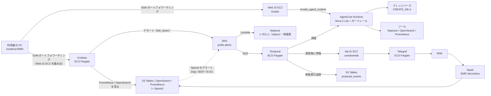

# nwc-poc — NetOps PoC（Terraform）

ブラウザのチャットから AgentCore Runtime のエージェントに聞くと、Amazon Nova 2 Lite がトポロジのツール（と任意の手順書の検索）を使って答える。
lab（containerlab の Nokia SR Linux で組んだ Spine-Leaf）の機器の SNMP・gNMI・ログを Kafka → Spark で格納先に流し、Grafana と Splunk のアラートで異常を見つけ、SNS → SQS で Temporal のワークフローを起こして原因を調べて修復案を出し、人が承認したら直す、までを試せる。
全部を**プライベートサブネット**に作り、**AWS の API へは VPC エンドポイントだけを通す閉域**にする。この VPC のエンドポイントを通らない呼び出しは、IAM とリソースポリシーの Deny（`aws:SourceVpc`）で拒む（鍵が漏れても VPC の外からは使えない）。
VPC にインターネットへの経路は無い（NAT Gateway も IGW も作らない。Splunk も VPC の中の ECS に立てる）。PC からは SSM のポートフォワーディングで入り、インターネットからの受信ルールは無い。



## 作るもの

できる限り AWS のマネージドサービスで作っている。最終的には、これとは別にマネージドの部分を OSS にした版も作り、できること・費用・メンテナンス性を比べる（[oss-variant.md](docs/oss-variant.md)）。

`deploy.env` で要る機能だけ `1` にする。何も書かなければ土台と AGENT を作る。

| 機能 | できること | 待機の時間課金（東京） |
|---|---|---|
| 土台（必ず） | VPC、SSM のエンドポイント 2 本、Web の EC2、S3、ECR | 約 $0.05/h |
| `AGENT=1`（既定） | チャット（Runtime + ガードレール）。`CREATE_KB=1` で手順書の検索も | 約 $0.07/h（エンドポイント 5 本。ほかは質問ごとのモデル料金だけ。KB は +$0.37/h） |
| `PIPELINE=1` | lab → Telegraf（ECS）→ MSK → Spark → S3 Tables / OpenSearch / Prometheus（`SINK_SPLUNK=1` で Splunk にも）、Grafana（`GRAFANA=1`。既定）と Splunk のアラート → SNS、Neptune のトポロジ（アラートで status が変わる）、Nautobot（機器の一覧とケーブルの正。いつも立つ） | 約 $2.37/h（うち Neptune Analytics が $0.58/h、Nautobot が $0.14/h。Splunk は +$0.33/h（ECS の Splunk $0.12 と Spark のジョブ $0.21）） |
| `WORKFLOW=1` | アラート（SNS → SQS）で Temporal を起こし、調査 → 承認 → 修復。AGENT と PIPELINE と、アラートの送り手（Grafana か Splunk）が要る | 約 $0.09/h |

インターフェース型エンドポイントは 1 本 $0.014/h（1 AZ。`ENDPOINTS_MULTI_AZ=1` で 2 AZ にすると倍）で、作る機能が呼ぶ API の分だけ `ops/up.sh` が選ぶ（上の金額に入れてある。同じサービスは機能をまたいで 1 本）。
OpenSearch Serverless のコレクション（KB と logs）も公開せず、VPC エンドポイント 1 本（$0.03/h。両方作っても 1 本）からだけ届く。

全部で約 $2.49/h（KB・Splunk を除く）。**1 か月置くと約 $1,790（約 27 万円）になるので、使い終わったら当日中に消す。**

デバッグ用の EC2（lab + Telegraf を 1 台。Telegraf の出力は標準出力。MSK / ECS を作らずに機器と Telegraf の設定を確かめる）は `deploy.env` の機能ではなく、`ops/lab-debug.sh up` / `down` だけで作る・消す CloudFormation のスタック。自分の VPC・エンドポイント 4 本・バケット・ECR を持ち、`ops/up.sh` / `ops/down.sh` とは別（`ops/down.sh` では消えない）。待機は約 $0.23/h（[pipeline.md](docs/pipeline.md)）。

## 手順

コマンドは bash 用で、Mac と WSL2 で同じ。**展開したフォルダの直下で打つ。**

1. 道具を入れる: AWS CLI v2、Terraform 1.11 以上、Docker buildx（arm64）、Session Manager plugin、python3 か uv、curl（[setup.md](docs/setup.md)）。
2. AWS に入る: `aws login --profile <プロファイル>`、`aws configure sso`、長期キーのどれか。`sts get-session-token` の一時セッションでは止まる。
3. GitHub の「Download ZIP」で取った zip を Linux 側のホームに展開して入る（WSL2 は `/mnt/c` を使わない）。`git clone https://github.com/eddie-eights/nwc-poc.git` なら `~/nwc-poc` に入る。

```bash
unzip ~/nwc-poc-main.zip -d ~ && cd ~/nwc-poc-main
```

4. 設定を写し、空の `OWNER=` に自分の名前を書き、要る機能を `1` にする。

```bash
cp deploy.env.example deploy.env
```

   手で書くファイルはこの `deploy.env` だけ。`terraform/<ルート>/terraform.tfvars.example` と `.env.example` は写さなくてよい（terraform を手で打つとき、Web を手元で動かすときにだけ使う。[docs/development.md](docs/development.md)）。

5. 作る。終わると `http://localhost:8080` へのポートフォワーディングが開く。

```bash
ops/up.sh
```

6. 使い終わったら消す。

```bash
ops/down.sh
```

- 所要時間は AGENT だけで 10〜15 分、PIPELINE で 40〜60 分（MSK だけで 20〜30 分）。
- `ops/up.sh` はできているものを飛ばすので、途中で落ちたら打ち直せばよい。
- リージョンは東京（`ap-northeast-1`）で固定。

## GUI の一覧

`<prefix>` は `<OWNER>-nwc-poc`。リージョンは東京（`ap-northeast-1`）。

### 自分で立てている GUI（PC の localhost で開く）

VPC の中にあるので、どれも SSM のポートフォワードを打ってから開く（Web の EC2 が踏み台）。コマンドは `ops/up.sh` の最後に出る。あとから出すなら下の「開くコマンド」。

| GUI | URL | 要る機能 | ログイン | 開くコマンド（打ったままにする） |
|---|---|---|---|---|
| Web（チャット / トポロジ / 承認） | http://localhost:8080/ | 土台（必ず） | 無し | `terraform -chdir=terraform/base/core output -raw start_session_command` |
| Nautobot（機器とケーブルの台帳、Job の結果） | http://localhost:8081/ | `PIPELINE=1` | `admin` / SSM のパスワード | `terraform -chdir=terraform/pipeline/nautobot output -raw port_forward_command` |
| Grafana（ダッシュボード、アラート） | http://localhost:3000/ | `PIPELINE=1`（`GRAFANA=1`。既定） | `admin` / SSM のパスワード | `terraform -chdir=terraform/pipeline/analytics output -raw grafana_port_forward_command` |
| Splunk（ログの検索、アラート） | http://localhost:8000/ | `PIPELINE=1` で Splunk を ECS に立てたとき | `admin` / SSM のパスワード | `terraform -chdir=terraform/pipeline/analytics output -raw splunk_port_forward_command` |
| Temporal UI（ワークフローの実行の履歴） | http://localhost:8233/ | `WORKFLOW=1` | 無し | `ops/up.sh` の手順 8-5 が出す（タスクの IP が要る。[workflow.md](docs/workflow.md)） |

- `terraform ... output -raw ...` は「打つコマンド」を表示するだけなので、出てきた `aws ssm start-session ...` をそのまま打つ。
- パスワードを出すコマンドは、同じルートの出力 `password_command`（Nautobot）/ `grafana_password_command` / `splunk_password_command`。
- Nautobot でよく見る場所: Devices → Devices（機器）、Devices → Cables（ケーブル）、Jobs → Job Results（Neptune / Telegraf への同期の結果）。使い方は [nautobot.md](docs/nautobot.md)。

### AWS のマネージドサービス（AWS マネジメントコンソールで見る）

専用の画面は無く、コンソールの各サービスのページで見る。コンソールの右上のリージョンを東京にする。

| 見たいもの | サービス | コンソールでの行き方 |
|---|---|---|
| エージェント | Bedrock AgentCore | Amazon Bedrock AgentCore → Agent Runtime / Gateways |
| ガードレール、手順書の検索 | Bedrock | Amazon Bedrock → ガードレール / ナレッジベース |
| Kafka | MSK | Amazon MSK → クラスター → `<prefix>-stream`（トピックの中身は見られない。モニタリングと設定だけ） |
| Spark のジョブ | EMR Serverless | Amazon EMR → EMR Serverless → EMR Studio を開く → アプリケーション → `<prefix>-spark` → ジョブ実行 → 「Spark UI」 |
| 生データの表 | S3 Tables | Amazon S3 → テーブルバケット → `<prefix>-tables`（中身を引くのは Athena。カタログ `s3tablescatalog`） |
| ログの検索先 | OpenSearch Serverless | Amazon OpenSearch Service → サーバーレス → コレクション。**OpenSearch Dashboards は開けない**（コレクションは VPC エンドポイントからだけ届く）。中身は Grafana で見る |
| メトリクス | Managed Service for Prometheus | Amazon Prometheus → ワークスペース。グラフの画面は無いので Grafana で見る |
| トポロジのグラフ | Neptune Analytics | Amazon Neptune → Analytics → グラフ。グラフを見る画面は無いので、Web の「トポロジ」タブで見る |
| Nautobot の DB | RDS | Amazon RDS → データベース |
| コンテナ | ECS | Amazon ECS → クラスター → サービス → タスク → 「ログ」 |
| アラートの流れ | SNS / SQS / Lambda | Amazon SNS → トピック、Amazon SQS → キュー、AWS Lambda → 関数 → 「モニタリング」 |
| ログ | CloudWatch Logs | CloudWatch → ロググループ → `<prefix>` で絞る |
| EC2（Web、lab） | EC2 / Systems Manager | EC2 → インスタンス。中に入るのは Systems Manager → セッションマネージャー（画面は無い。シェルだけ） |

## よく使うキー

| キー | 何 |
|---|---|
| `OWNER` | **必須。**自分の名前（英小文字で始まる 14 文字まで）。リソース名と `Project` タグが `<owner>-nwc-poc` になる。作ったあとで変えない |
| `AGENT` / `PIPELINE` / `WORKFLOW` / `CREATE_KB` | 作る機能 |
| `SKIP_LAB` / `SKIP_STREAM` / `SKIP_ANALYTICS` / `SKIP_GRAPH` | PIPELINE の一部を外す |
| `IMAGE_TAG` | `agent/` や `workflow/` を変えたら `v2` などに上げる |
| `HTTP_SEND` | Spark が HTTP の格納先（OpenSearch / Prometheus / Splunk）へ送る所。既定 `driver`。量が増えたら `executor`（費用は変わらない） |
| `MAX_OFFSETS_PER_TRIGGER` | Spark の 1 つのクエリが Kafka の 1 回のトリガー（60 秒）に読む件数の上限（全パーティションの合計）。既定 `10000`、`0` で上限なし。格納先ごとに `MAX_OFFSETS_PER_TRIGGER_ICEBERG` / `_SPLUNK` / `_OPENSEARCH` / `_PROMETHEUS` で上書きできる（既定は空 = 共通の値） |
| `SYSLOG_STANDARD` | stream の Telegraf が受ける syslog の形式。既定 `RFC3164`（本番の Cisco IOS）。lab の SR Linux のログまで見るなら `RFC5424` |
| `KEEP_ECR` | `1` で `ops/down.sh` が ECR を残す |

ほかのキーと、`ops/up.sh` / `ops/down.sh` が何をするかは [deploy.md](docs/deploy.md)。その回だけ変えるなら `PIPELINE=1 ops/up.sh` のように環境変数で渡す。

## 注意

- `terraform/<ルート>/terraform.tfstate` を消さない。消すと `ops/down.sh` が消せず、課金が残る。
- up と down は同じ PC で打つ。
- 機能を `0` に戻して打っても、前に作ったものは消えない。消すのは `ops/down.sh` だけ。
- デバッグ用の EC2 を作ったなら `ops/lab-debug.sh down` も打つ（`ops/down.sh` は消さない）。

## ドキュメント

| ファイル | 中身 |
|---|---|
| [architecture/](docs/architecture/README.md) | 構成図（スライドは [architecture.pptx](docs/architecture.pptx)）、どのファイルがどこで動くか、名前とタグ、ログ。中身は [core](docs/architecture/core.md)（閉域・SG）/ [agent](docs/architecture/agent.md) / [pipeline](docs/architecture/pipeline.md) / [workflow](docs/architecture/workflow.md) に分けてある |
| [setup.md](docs/setup.md) | 前提（AWS の権限、ネットワーク、Mac / WSL2、社内 PC の CA） |
| [deploy.md](docs/deploy.md) | `deploy.env` の全キー、`ops/up.sh` / `ops/down.sh` の中身、利用者に渡す権限、試す質問 |
| [collection.md](docs/collection.md) | 機器から集めるデータ: 欲しいもの（syslog・trap・telemetry・性能メトリクス）といまの状態、telemetry と性能メトリクスは Cisco MDT の dial-out で受ける方針、未決定事項 |
| [pipeline.md](docs/pipeline.md) | lab、Telegraf、デバッグ用の EC2（`ops/lab-debug.sh`）、Spark、Grafana と Splunk のアラート、Neptune のトポロジの使い方 |
| [nautobot.md](docs/nautobot.md) | Nautobot: コンテナと部品の構成、起動から同期まで、使い方、Neptune と組み合わせた使いどころ |
| [workflow.md](docs/workflow.md) | 承認の流れと Temporal UI |
| [troubleshooting.md](docs/troubleshooting.md) | うまくいかないとき |
| [oss-variant.md](docs/oss-variant.md) | 方針: いまはできる限り AWS マネージドで作り、最終的にはマネージドの部分を OSS にした版も別に作る。その目的（マネージドでできて OSS でできないこと、費用、メンテナンス性の比較）と、いまマネージドにしている部分の一覧 |
| [development.md](docs/development.md) | 手元のテスト、変更するときの決まり、Web を手元で動かす |
| [faq-fukuda-nwc-poc.md](docs/faq-fukuda-nwc-poc.md) | 学習 FAQ: 作業中に質問したことと答え（syslog の基本、lab を `local7` にした理由、デバッグ用の EC2、本番の Cisco から送るとき、Nautobot） |
| [data-stores.md](docs/data-stores.md) | 勉強会メモ: データの置き場（Neptune にトポロジと修復案の「いま」、S3 Tables に証跡。障害の履歴の置き場は未定）と DynamoDB をやめた理由、コンテナイメージの役目と arm64 に揃える理由（Splunk だけ x86）、Neptune Analytics の基礎（Neptune Database との違い、AZ 冗長、トポロジをグラフにする意味）、MSK のブートストラップサーバーと、Telegraf・Spark がそれをどう受け取るか（`msk-bootstrap` を残す理由） |
