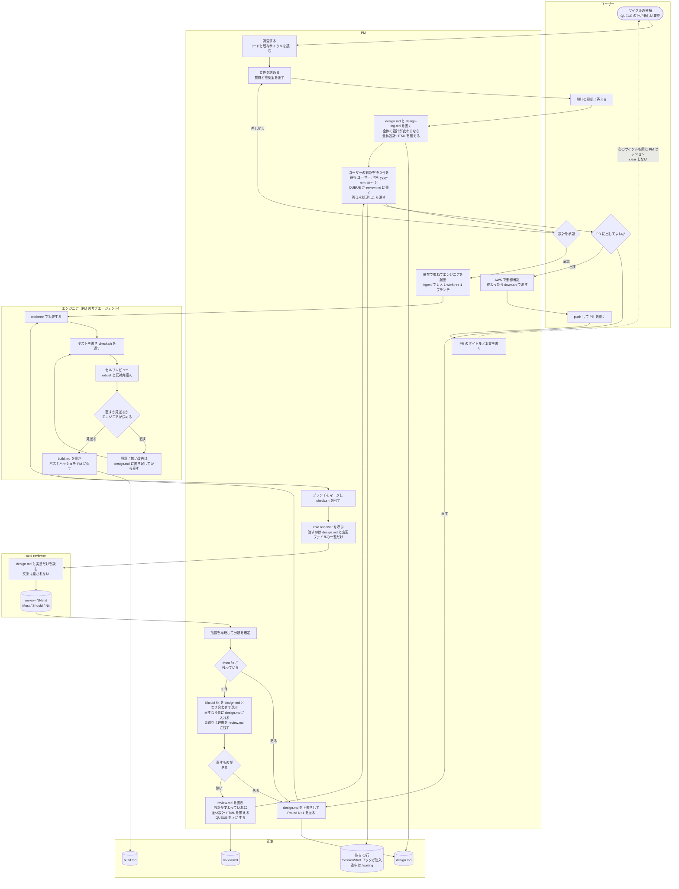

# AI 開発フロー

このリポジトリは、AI エージェント（Claude Code）の PM 1 セッションが、エンジニア（PM のサブエージェント）と cold reviewer を呼び分けて、**サイクル**（`docs/cycles/<NNN>-<slug>/`。設計 → 実装 → レビューの 1 周）の単位で開発している。その流れを役割ごとの列で 1 枚に描いたもの。正本は claude-settings（`eddie-eights/claude-settings`）の `cycle-design` / `cycle-build` / `cycle-review` の 3 スキルで、この図はその `cycle-design/flow.md` の写し。3 スキルの手順が変わったらここも合わせる。

## 準備（PC ごと）

[claude-settings](https://github.com/eddie-eights/claude-settings) を clone して `bin/install-skills` を実行する。`/cycle-design` / `/cycle-build` / `/cycle-review` / `/waiting` と、現在地を注入する SessionStart フック `cycle-context.py` が `~/.claude/` にリンクされる。スキルやフックが更新されたら、各 PC で実行し直す（新しく足されたコマンド・フックのリンクは実行しないと作られない）。フックの登録自体はこのリポジトリの `.claude/settings.json` にあり、スクリプトが無い PC では何もしない。

## 運用の 2 種類

AI 開発フローには運用が 2 種類あり、違いは **GitHub のリモートを誰が操作するか** の 1 点。サイクルの中身は同じ。**このリポジトリは HITL 開発**で、下の図もその形で描いてある。

| | HITL 開発（ユーザーの介入あり） | フル AI 開発 |
|---|---|---|
| 採用先 | 仕事・共同のリポジトリ。**このリポジトリ** | 個人の GitHub リポジトリ |
| GitHub のリモート（push / PR 作成 / PR マージ） | ユーザーだけが操作する。PR を出すにはユーザーの許可が要る | AI のセッションにも許可する。エンジニアが push して PR を出し、PM が GitHub 上でマージしてよい |
| ユーザーの判断点 | 設計の承認、PR に出してよいか、push | 設計の承認 |

## 役割

| 役割 | 誰 | すること |
|---|---|---|
| ユーザー | 人 | サイクルの依頼、設計の質問への回答と承認、PR に出すかの最終判断、push と PR の作成（HITL 開発） |
| PM | Claude のセッション 1 体（設計とレビューは実装と同等か上位のモデル。**サイクルをまたいで同じセッションを使い、clear しない**（coordinator。2026-10-10）。サイクル開発で人が起動するセッションはこれだけで、ユーザーの窓口も兼ねる（秘書は置かない）。役は起動したフォルダ（cwd）の `CLAUDE.md` に書いてあり、題名や会話の記憶で決めない） | 調査と設計、`design.md` の正本管理、エンジニアの起動（`Agent`）と割り振り、マージ、cold review の実行と指摘の判断、HTML と QUEUE の更新、AWS での動作確認 |
| エンジニア | **PM のサブエージェント**（`Agent`、opus 5.5 以下、effort `high`。1 人 1 worktree 1 ブランチ。既定の体制、2026-10-10 のユーザー指示）。**別セッションは例外**: ユーザーが画面を見ながら介入したいとき、herdr のワークスペースで並列に走らせるとき（そのときはサイクルごとに新しいセッション） | 実装とテスト、セルフレビュー（`/robust` と反対弁護人）とその指摘の判断、`build.md` と PM への報告（パスとハッシュ）。`/cycle-review` は呼ばない |
| cold reviewer | PM が呼ぶサブエージェント（opus 以上） | 文脈を渡されずに `design.md` と実装だけを読み、Must / Should / Nit を書く |

## セッションの寿命とやりとり

複数のセッションを会話させながら回すと、**文脈が膨らんで遅くなる・圧縮を繰り返して前提を失う・相手が起動していないように見える**、の 3 つが起きる。原因を実測したところ（2026-10-10）、サイクルをまたいで何日も生かしたセッションが数百回の圧縮を重ねており、膨らませていたのは Bash / Read / スクリーンショットの巨大な結果で、セッション間メッセージ自体は小さかった（平均 757 文字）。そこで次を決めた（2026-10-10 のユーザー指示）。

- **PM は coordinator。サイクルをまたいで同じセッションを使い、clear しない**（2026-10-10 のユーザー指示。Claude Code Projects の coordinator に倣う。同日に一度決めた「1 サイクル 1 セッション + PM 自身が clear」を置き換えた。経緯は Vault の `decisions/agent-session-hygiene`）。PM が自分の文脈に持つのは、直近の会話・サブエージェントが返した結論（パスとハッシュ）・QUEUE と各サイクルの記録だけで、実装・ログ・全文は持たない（下の「長い全文はサブエージェントが読み」）。だから圧縮が重なっても壊れない ── 過去に壊れたのは巨大なツール結果を親に入れていたからで、clear は対症療法だった。**圧縮を恐れない。落ちてはいけないものは QUEUE / `review.md` / プロジェクト別メモリに書く。** 現在地は SessionStart フックが startup / resume / compact のたびに注入する（下の「役と現在地」）。引き継ぎメモは作らない ── 次に回すものは QUEUE に `- [ ]` で足し、判断は `review.md` に書く。`mcp__ccd_session_mgmt__clear_session` は呼ばず、ユーザーに `/clear` も頼まない。ユーザーがセッションを変えたときも、cwd の `CLAUDE.md` とフックで同じ場所から始まる。**ユーザーが重いと感じて手で `/clear` するのは問題ない**（2026-10-10 に確認）。役・現在地・待ちはファイルとフックから戻るので、失うのは会話にしか無いもの（未記録の判断、`Agent` / `Monitor` の背景タスク）。PM は、判断は `review.md` / QUEUE に書き終えてから「clear してよい」と答え、背景タスクが走っている間は「終わるまで待って」と答える
- **PM がユーザーの窓口。秘書は置かない**（同日のユーザー指示。repo 内 `secretary/` → repo 外 `<repo>-secretary/` → 廃止）。エンジニアは背景のサブエージェントなので、実装が走っている間も PM はユーザーの質問に答える。答えの根拠は会話の記憶ではなくファイル（QUEUE、各サイクルの `design.md` / `build.md` / `review.md`、`git log`）から取る
- **人間の待ちは機械的に出す**（Projects の「Waiting on you」の手元版）。ユーザーの判断・確認・外部の返事を待つ件は、QUEUE の行か最新サイクルの `review.md` / `build.md` / `design.md` に **`待ち(ユーザー): <何を>（yyyy-mm-dd〜）`** と書く（例: `review.md` の末尾に `待ち(ユーザー): PR 可否（2026-10-10〜）`）。`cycle-context.py` が起動のたびに「## 待ち」として注入し、途中は **`/waiting`** で同じ一覧を出す。解けたらその文言を消す。待ちの一覧を会話の記憶で持たない
- **エンジニアは PM のサブエージェント（既定）。別セッションは例外**（2026-10-10 のユーザー指示）。エンジニアが別セッションだと権限モード揃えと承認待ちが毎回要り、PM が待ちの相手を数える必要も出る。サブエージェントなら PM は `Agent` の結果を待つだけで（背景で走らせ、その間もユーザーと会話できる）、人が起動するセッションも PM の 1 つで済む。エンジニアは `cycle-build` を手順6 まで実行し、`/cycle-review` を呼ばずにパスとハッシュを返す（細則は `cycle-build` の「誰が実装するか」）。例外は、ユーザーが画面を見ながら介入したいとき、herdr のワークスペースで並列に走らせるとき。下の `SendMessage` と権限モードの項目は、この例外のときだけ効く
- **役と現在地は、会話の記憶ではなく、新しい文脈が機械的に目にする場所に置く**（2026-10-10 のユーザー指示。経緯は Vault の `decisions/agent-session-hygiene` の「踏んだ罠」: clear 後の PM が「自分は秘書」「今日はまだ何もしていない」と答えた）。新しい文脈（新しいセッション、圧縮直後）が確実に目にするのは、cwd の `CLAUDE.md`（毎ターン）、プロジェクト別メモリの索引（毎セッション）、SessionStart フックの出力（startup / resume / compact で発火する）の 3 つだけで、スキルの手順は呼ばれるまで読まれない
  - **役は cwd の `CLAUDE.md` に書く**（「このリポジトリで人が起動するセッションは PM 1 つ」）。**1 役 1 cwd** ── プロジェクト別メモリ（`~/.claude/projects/<cwd>/memory/`）は cwd 単位で全セッションが共有するので、秘書など別の役のセッションを同じフォルダで起動しない。**別の役（秘書など）は置かない**（上の「PM がユーザーの窓口」。もし置くなら repo の外のフォルダで起動し、`cycle-context.py` に対象リポジトリの絶対パスを引数で渡す ── repo に痕跡を残さない）。repo 側の `.claude/settings.json` のフック登録は、スクリプトを持たない他の開発者の環境でエラーを出さないよう「無ければ何もしない」形にする。**プロジェクト別メモリに「このセッション」「セッション ID」を主語にした役のメモを書かない**（clear 後の別セッションが自分のことと読む）
  - **現在地は SessionStart フック `cycle-context.py` が注入する**（QUEUE の着手行と直近の完了、ユーザーの判断待ち、最新サイクルのファイルと `review.md` の末尾、直近の commit。cwd に `docs/cycles/` が無ければ何も出さない）。正本は claude-settings の `.claude/hooks/`、`bin/install-skills` が `~/.claude/hooks/` にリンクする。**登録は対象プロジェクトの `.claude/settings.json`**（グローバルの `~/.claude/settings.json` には入れない ── 他のプロジェクトに影響させない）。無ければ `cycle-design` 手順冒頭で足す
- **長い全文はサブエージェントが読み、親は結論と根拠（`ファイルパス:行`）だけ受け取る。** ログ、大量のテスト出力、既存コードの広い読み込み、スクリーンショットのように結果が大きくなるものは `Explore` / `general-purpose` に出し、親は全文を自分の文脈に入れない。途中で切って読むのではなく全文を向こうに読ませるので、必要な文脈は落ちない。設計と判断は委譲しない。実装はエンジニア（サブエージェント）の仕事で、その中でさらに委譲しない（各スキルの既定どおり）
- **（例外の別セッションのときだけ）セッション間のメッセージ（`SendMessage`）はパスとハッシュで渡す。** `design.md` のパス、`build.md` のパス、commit ハッシュ（commit しない規約なら変更ファイルのパス一覧）、worktree のパス。本文・diff・ログを貼らない。読むのは受け取った側の仕事
- **（例外の別セッションのときだけ）並行して動かすセッションは権限モードを揃えて起動する。** モードが違うとセッション間のメッセージが承認待ちに回って届かず、相手が「起動していない」ように見える。作業中の相手に送ったメッセージは手が空くまで待たされるので、返事が無いことを落ちた証拠にしない
- **サイクル開発で使わない claude.ai コネクタは切っておく。** セッションは何もしなくても約 65〜87K トークンから始まり（2026-10-10 実測）、その大きな部分がコネクタの MCP ツール定義（Notion 49 / Figma 41 / Gmail 30 / Google Calendar 9 / Spotify 5 の 134 本）だった。PM は、デスクトップアプリのセッションでは起動時に `mcp__ccd_connectors__session_connectors_status` で確かめ、残っていれば `mcp__ccd_connectors__set_session_connector_enabled`（`enabled: false`）で切る。切ると新規セッションの既定もオフになる。具体的な手順は `cycle-design` の「手順」冒頭

## 流れ

## 読み方

- **正本は `design.md` だけ。** `build.md` と `review.md` は経緯の記録で、レビュー結果は正本にならない。レビューの指摘を直すときは、必ず `design.md` に根拠がある状態にしてから直す。実装が設計からずれていればそのまま直す。設計が事実と違うと分かれば `design.md` を上書きしてから直す。設計に無い改善をレビューが勧めたら、直す価値があると判断したものだけ先に `design.md` に書き足してから直す（書き足さずに直さない）。採らないなら理由を残す。
- **直すか決める人は列で分かれる。** セルフレビューの指摘（E4）は実装したエンジニア。cold review の指摘（P8 / P10）は PM。設計の承認（U3）と PR に出すか（U4）はユーザー。
- **完了条件は Must fix 0 だけ。** Should fix は 0 でなくてよく、PM が `design.md` と突き合わせて直すものを選ぶ。見送ったものは理由を `review.md` と最終報告に残す。
- **cold reviewer は 1 サイクルに最大 2 回。** 1 回目は初回ビルドの直後。2 回目は、1 回目のあとに実装ファイルが変わったときだけ（P11 → P9 → E1 の経路に入ったとき）。変わらなければ 1 回で完了。
- **Must fix が残る限り同じサイクル番号で Round が増える。** 3 ラウンド回しても消えなければ止めて報告する（設計の前提自体が誤っている）。
- **AWS での動作確認は最後に 1 回。** 確認が終わったらすぐ `ops/down.sh` で消し、消えたことを確かめてから報告する。push はユーザーが行う（HITL 開発。フル AI 開発では `~/.claude/rules/branch-worktree.md` の例外に従い、エンジニアが push して PR を出す）。
- **QUEUE（`docs/cycles/QUEUE.md`。次にやるサイクルの待ち行列。2026-10-10 に `BACKLOG.md` から改名 ── ヌーラボの Backlog と混同するため）は PM だけが書く。** サイクルをまたぐ候補を 1 行 1 件で持ち、着手で `→ <NNN>-<slug>`、完了で `[x]` にする（消さない）。

## 成果物の置き場

| 成果物 | 場所 | 書く人 |
|---|---|---|
| 設計（正本） | `docs/cycles/<NNN>-<slug>/design.md` | PM（Round N+1 で上書き） |
| 設計の経緯（質問と回答、却下した案、ラウンドごとの変更） | `docs/cycles/<NNN>-<slug>/design-log.md` | PM（エンジニアは自分が足した検証項目などの 1 行だけ） |
| 実装の記録とセルフレビュー | `docs/cycles/<NNN>-<slug>/build.md` | エンジニア |
| cold review の結果と PM の判断 | `docs/cycles/<NNN>-<slug>/review.md` | PM |
| リポジトリ全体の設計の読み物（全体設計 HTML。プロジェクトに 1 本。サイクルごとの HTML は作らない、2026-10-10） | My Repo `artifacts/projects/nwc-poc-architecture.html`（日付なし。上書きし続ける。まだ無く、全体の設計が変わる最初のサイクルで作る） | PM（承認前と完了時。全体の設計が変わるサイクルだけ） |
| サイクルをまたぐ候補 | `docs/cycles/QUEUE.md` | PM |
