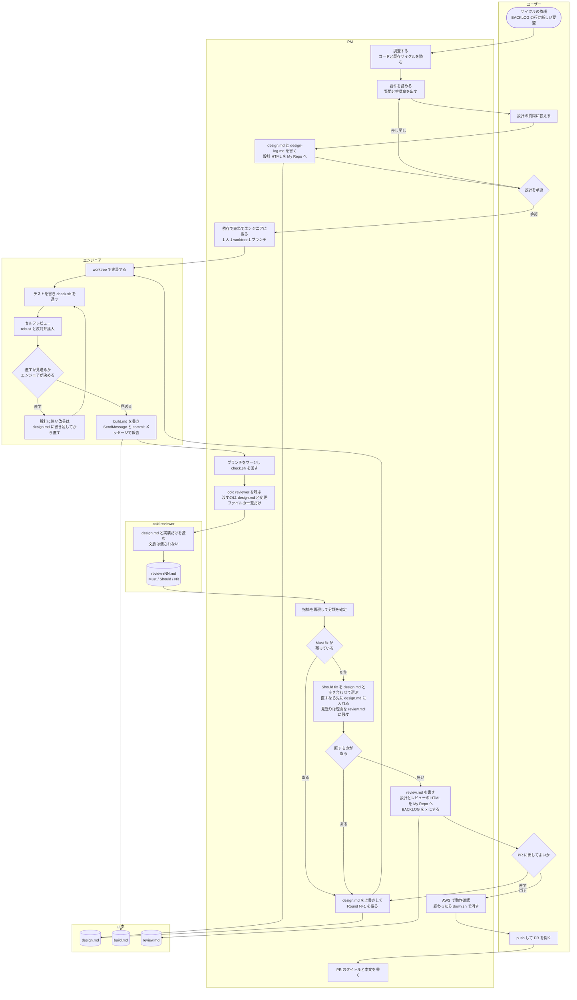

# AI 開発フロー

このリポジトリは、AI エージェント（Claude Code）のセッションを PM 1 体とエンジニア数体に分け、**サイクル**（`docs/cycles/<NNN>-<slug>/`。設計 → 実装 → レビューの 1 周）の単位で開発している。1 サイクルの流れを、役割ごとの列で描いたのが下の図。正本はスキル本文（`cycle-design` / `cycle-build` / `cycle-review`）で、この図はそれを 1 枚に写したもの。

## 役割

| 役割 | 誰 | すること |
|---|---|---|
| ユーザー | 人 | サイクルの依頼、設計の質問への回答と承認、PR に出すかの最終判断、push と PR の作成 |
| PM | Claude のセッション 1 体（設計とレビューは実装と同等か上位のモデル） | 調査と設計、`design.md` の正本管理、エンジニアへの割り振り、マージ、cold review の実行と指摘の判断、HTML と BACKLOG の更新、AWS での動作確認 |
| エンジニア | Claude のセッション数体（1 人 1 worktree 1 ブランチ） | 実装とテスト、セルフレビュー（`/robust` と反対弁護人）とその指摘の判断、`build.md` と報告 |
| cold reviewer | PM が呼ぶサブエージェント（opus 以上） | 文脈を渡されずに `design.md` と実装だけを読み、Must / Should / Nit を書く |

## 流れ

## 読み方

- **正本は `design.md` だけ。** `build.md` と `review.md` は経緯の記録で、レビュー結果は正本にならない。レビューの指摘を直すときは、必ず `design.md` に根拠がある状態にしてから直す。実装が設計からずれていればそのまま直す。設計が事実と違うと分かれば `design.md` を上書きしてから直す。設計に無い改善をレビューが勧めたら、直す価値があると判断したものだけ先に `design.md` に書き足してから直す（書き足さずに直さない）。採らないなら理由を残す。
- **直すか決める人は列で分かれる。** セルフレビューの指摘（E4）は実装したエンジニア。cold review の指摘（P8 / P10）は PM。設計の承認（U3）と PR に出すか（U4）はユーザー。
- **完了条件は Must fix 0 だけ。** Should fix は 0 でなくてよく、PM が `design.md` と突き合わせて直すものを選ぶ。見送ったものは理由を `review.md` と最終報告に残す。
- **cold reviewer は 1 サイクルに最大 2 回。** 1 回目は初回ビルドの直後。2 回目は、1 回目のあとに実装ファイルが変わったときだけ（P11 → P9 → E1 の経路に入ったとき）。変わらなければ 1 回で完了。
- **Must fix が残る限り同じサイクル番号で Round が増える。** 3 ラウンド回しても消えなければ止めて報告する（設計の前提自体が誤っている）。
- **AWS での動作確認は最後に 1 回。** 確認が終わったらすぐ `ops/down.sh` で消し、消えたことを確かめてから報告する。push はユーザーが行う（AI のセッションからは push しない）。
- **BACKLOG（`docs/cycles/BACKLOG.md`）は PM だけが書く。** サイクルをまたぐ候補を 1 行 1 件で持ち、着手で `→ <NNN>-<slug>`、完了で `[x]` にする（消さない）。

## 成果物の置き場

| 成果物 | 場所 | 書く人 |
|---|---|---|
| 設計（正本） | `docs/cycles/<NNN>-<slug>/design.md` | PM（Round N+1 で上書き） |
| 設計の経緯（質問と回答、却下した案、ラウンドごとの変更） | `docs/cycles/<NNN>-<slug>/design-log.md` | PM（エンジニアは自分が足した検証項目などの 1 行だけ） |
| 実装の記録とセルフレビュー | `docs/cycles/<NNN>-<slug>/build.md` | エンジニア |
| cold review の結果と PM の判断 | `docs/cycles/<NNN>-<slug>/review.md` | PM |
| 読むための写し（設計とレビューの HTML） | My Repo `artifacts/nwc-poc/{yyyymmdd}-cycle-<NNN>-<slug>-{design,review}.html` | PM（サイクル完了時に 1 回） |
| サイクルをまたぐ候補 | `docs/cycles/BACKLOG.md` | PM |
