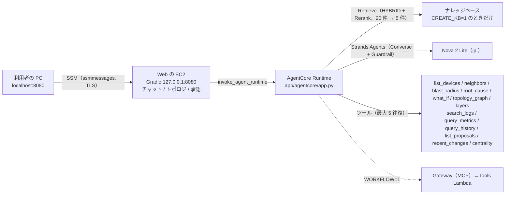

# 構成: エージェント（agent）

← [構成](README.md)

`IaC/terraform/aws-managed/agent`（`AGENT=1`。既定は `0`）。AgentCore Runtime、ガードレール、KB（`CREATE_KB=1` のときだけ）。

## チャットの経路

- Web の EC2 は土台（[core.md](core.md)）。EC2 にパブリック IP も受信ルールも無い。SSM Agent が内側から ssmmessages へつなぐ。
- Runtime を呼ぶのは EC2 のインスタンスロール。ブラウザに AWS の認証情報は置かない。
- ツールは Neptune（Neptune Analytics。トポロジ 3 層と、中心性の `centrality`、Nautobot の変更履歴の写し（頂点 `change`）を読む `recent_changes`。無ければトポロジは `app/agentcore/data/` の静的な 8 台と層）、OpenSearch Serverless、Prometheus と、S3 Tables の 2 つの表を Athena で読む（アラートの通知の履歴 `alert_events` は `query_history`、修復案 `proposal_events` は `list_proposals`）。異常の一覧を返すツールは無い（2026-10-02 にやめた。いまのアラートは Grafana と Splunk の画面で見る）。
- Gateway（MCP）と tools Lambda は WORKFLOW で作る（[workflow.md](workflow.md)）。
- エージェントのループ（モデルを呼ぶ → ツールを実行する → 結果を返して呼び直す）は Strands Agents（`strands.Agent` + `BedrockModel`）が回す。`app/agentcore/app.py` が自分で持つのは、KB の Retrieve、ツールの束ね（Gateway か、コンテナ内の関数か）、会話履歴（質問と回答の本文だけ。`MAX_TURNS` 往復）、回答の末尾の参照資料。
- ツールの回数の上限（`MAX_TOOL_ROUNDS`、5 本）は `app/agentcore/app.py` の `ToolLimit`（Strands のフック）が守る。5 本目の結果に「もうツールは使えない」という指示を添えてモデルをもう 1 回だけ呼び、それでもツールを頼んできたら動かさずに打ち切る。回答には断りを付け、そこまでに分かったことを返す（ガードレールが介入した回答には付けない）。ツールは 1 本ずつ順に動かし、Strands 側の再試行は切ってある（スロットリングは boto3 の再試行だけ）。
- Strands は渡したメッセージのリストに往復を書き足し、各メッセージにも `tracking_id` を書き込む。会話履歴を書き換えられないよう、`ask()` は履歴を深く複製してから渡す。
- `app/agentcore/app.py` は Runtime のコンテナで動き、EC2 には置かない（[README.md](README.md) の「どのファイルがどこで動くか」）。
