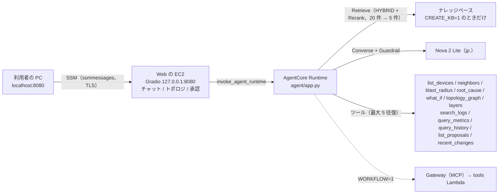

# 構成: エージェント（agent）

← [構成](README.md)

`terraform/agent`（`AGENT=1`。既定）。AgentCore Runtime、ガードレール、KB（`CREATE_KB=1` のときだけ）。

## チャットの経路

- Web の EC2 は土台（[core.md](core.md)）。EC2 にパブリック IP も受信ルールも無い。SSM Agent が内側から ssmmessages へつなぐ。
- Runtime を呼ぶのは EC2 のインスタンスロール。ブラウザに AWS の認証情報は置かない。
- ツールは Neptune（トポロジ 3 層と修復案。無ければトポロジは `agent/data/` の静的な 8 台と層）、OpenSearch Serverless、Prometheus と、アラートの通知の履歴（S3 Tables の `alert_events` を Athena で。`query_history`）を読む。異常の一覧を返すツールは無い（2026-10-02 にやめた。いまのアラートは Grafana と Splunk の画面で見る）。
- Gateway（MCP）と tools Lambda は WORKFLOW で作る（[workflow.md](workflow.md)）。
- `agent/app.py` は Runtime のコンテナで動き、EC2 には置かない（[README.md](README.md) の「どのファイルがどこで動くか」）。
