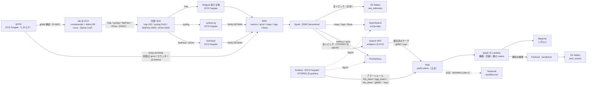

# 構成: パイプライン（pipeline）

← [構成](README.md)

`IaC/terraform/aws-managed/pipeline`（`PIPELINE=1`）。次の 5 ルート。

- lab（`app/containerlab/`）
- stream（MSK と Telegraf と gnmic と syslog-ng と GoFlow2 と、Web の EC2 で動く Kafbat UI の接続先）
- analytics（Spark・格納先・Grafana・Splunk・アラートの通知の履歴の Firehose）
- graph（Neptune Analytics のグラフと status の Lambda）
- nautobot（Nautobot と RDS の PostgreSQL）

使い方は [pipeline.md](../pipeline.md)、機器から集めるデータと集め方の方針は [collection.md](../collection.md)。

- Telegraf は stream の ECS（Fargate ARM64）の `<prefix>-telegraf-dialout` で、内部 NLB の後ろにいる。
  - trap（162/udp）をタスクの 1162 で受けて `traps` へ書く（非 root なので 1024 未満で受けない）。増やしても重複しない。
  - SNMP は trap だけ受ける。
- gnmic（`<prefix>-gnmic`）は同じクラスター `<prefix>-telegraf` の 1 タスク固定で NLB を持たない。
  - 定義は `IaC/terraform/aws-managed/pipeline/stream/gnmic.tf`。上流の gnmic のイメージに `app/gnmic/` の設定を足したもの。
  - タスクから機器の gNMI（57400/tcp）へ直接行く（増やすと同じ機器を 2 重に購読する）。
  - 購読は 5 つ。状態（IF・BGP・IS-IS）は on-change でトピック `gnmi`、カウンター（IF の統計・CPU・メモリ）は 60 秒ごとに `metrics` へ書く。
  - MSK へは syslog-ng・GoFlow2 と同じ SASL/SCRAM（9096）。`gnmi` / `metrics` の ACL は Spark が起動時に入れる。
  - 2026-10-09 の AWS では ACL の前も `metrics` に書けた。`gnmi` のトピックはできず、原因は確かめていない。
  - ACL のあとは未確認。根拠は `docs/verification/20261009-aws-managed.md` の「A.」「B.」。
  - 購読先の一覧と機器の認証情報は SSM のパラメータを ECS の secrets で受ける（[pipeline.md](../pipeline.md) の「gnmic と Telegraf に入る」）。
- 機器の syslog と NetFlow / sFlow は、Telegraf ではなく別のサービスで受ける（`IaC/terraform/aws-managed/pipeline/stream/collectors.tf`）。
  - 同じクラスター `<prefix>-telegraf` と同じ NLB の後ろにいる。どちらも 1 タスク。
  - syslog（5140/udp）は syslog-ng（`<prefix>-syslog-ng`。AxoSyslog に `app/syslog-ng/` の設定を足したイメージ）がTelegraf と同じ `device_log` の形にして `logs` へ書く。
  - NetFlow（2055/udp）と sFlow（6343/udp）は GoFlow2（`<prefix>-goflow2`。上流のイメージをそのまま）が `flows` へ書く（Spark が共通の形に読み替える）。
  - MSK へは IAM 認証ではなく SASL/SCRAM（9096）。
  - 資格情報は `ops/up.sh` が作る Secrets Manager の `AmazonMSK_<prefix>-collectors`（顧客管理の KMS の鍵 `alias/<prefix>-msk-scram` で暗号化）。
    ECS の secrets でタスクの環境変数に入れる。
- lab の SR Linux は MDT を送れないので gNMI で取る。
  gnmic が gNMI の event の形のまま Kafka へ書き、Spark が Telegraf のころと同じ系列（`snmp_interface_*` など）に読み替える（[collection.md](../collection.md) の「gnmic の event と読み替え」）。
- Grafana と ECS の Splunk は analytics の ECS クラスタ `<prefix>-analytics` のタスク。
  Cloud Map の `grafana.<prefix>.internal:3000` / `splunk.<prefix>.internal` で引く。
  - Splunk は `SPLUNK_AZ_NUM` が 2 か 3 のとき indexer のクラスターになる（[resources/splunk.md](resources/splunk.md)）。
    cluster manager（`splunk-cm`）、AZ ごとの indexer（`splunk-idx`。HEC の宛先）、search head（`splunk`）のタスクに分かれる。
  - LB は無く、PC からは Web の EC2 を踏み台にした SSM のポートフォワード（`AWS-StartPortForwardingSessionToRemoteHost`）で開く。
- 異常を見つけるのは Grafana と Splunk（Spark は格納先へ流すだけ）。
  - 既定（`STORES=s3,grafana,splunk`）では両方を作り、同じ 4 種類（`link_down` / `bgp_down` / `isis_down` / `trap`）を出す。
  - どちらも同じ形の JSON を SNS のトピック `<prefix>-alerts`（土台）へ publish する。
    トピックが graph の Lambda（Neptune の `status`）と workflow の SQS（ワークフローの起動と解消）へ配る。
  - アラートを 1 か所に集めるのは、同じ障害を別の送り手が知らせても 1 つの異常にまとめる（相関）ため。
    分担と遅れは [pipeline.md](../pipeline.md) の「アラート」。
- Neptune は Neptune Analytics。問い合わせは openCypher、口は VPC エンドポイント `neptune-graph-data`（2026-10-05 に AWS で確かめた）。
  - 置くのはトポロジ（と、その動的な `status`）と、Nautobot の変更履歴の写し（頂点 `change`。エージェントの `recent_changes` が読む）だけ。
  - 修復案は S3 Tables の `proposal_events` だけに置く（[workflow.md](workflow.md)）。
  - 障害の履歴は、Lambda `graph-status` が Firehose で S3 Tables の `alert_events` に追記する（[data-stores.md](../data-stores.md)）。
- Kafbat UI は MSK の中（トピック・メッセージ・consumer group）を見る画面。
  Web の EC2 の Docker で動く（systemd のユニット `<prefix>-kafka-ui`。Kafbat UI を Web の EC2 に同居させる（010））。
  - MSK へは Web の EC2 のインスタンスロールで IAM 認証の 9098 につなぐ。接続先は stream が SSM の `/<prefix>/kafka-ui/` に書く。
  - PC からは Web の EC2 の `127.0.0.1:8082` への SSM のポートフォワードで開く。
- Nautobot（`IaC/terraform/aws-managed/pipeline/nautobot`。ECS の `<prefix>-nautobot` と RDS の PostgreSQL）は機器とケーブルの正。
  - `PIPELINE=1` なら作る（`SKIP_STREAM` と `SKIP_GRAPH` を両方付けた回だけ作らない）。
  - Job が Nautobot の中身に合わせて、gnmic の購読先の一覧（SSM のパラメータ）と Neptune の物理層を書き直す（[nautobot.md](../nautobot.md)）。

## 経緯

- 2026-10-02: Spark の異常検知をやめた。
- 異常の頂点と S3 Tables の `anomaly_events` はやめた。
- 2026-10-04: Telegraf を受ける側と取りにいく側（`<prefix>-telegraf-dialin`）に分けた（[collection.md](../collection.md) の「Telegraf を受ける側と取りにいく側に分けた」）。
- 2026-10-04: telemetry と性能メトリクスは、本番の Cisco から MDT の dial-out で受ける方針だった。
- 2026-10-04: Neptune を Neptune Analytics にした。
- 2026-10-04: 障害の履歴を Lambda `graph-status` が Firehose で S3 Tables の `alert_events` に追記するようにした。
- 2026-10-05: 修復案を S3 Tables の `proposal_events` だけに置くようにした。
- 2026-10-08（012）: MDT の受け口（Telegraf の `inputs.cisco_telemetry_mdt`、NLB の 57000/tcp → `mdt` トピック）を外した（戻し方は [collection.md](../collection.md)）。
- 2026-10-09（013）: 取りにいく側を gnmic へ置き換え、SNMP のポーリングもやめた。gNMI を Telegraf の中で共通の形に変えるのもやめた。
