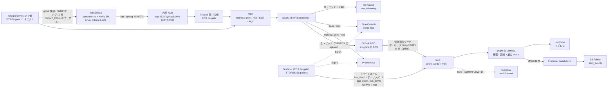

# 構成: パイプライン（pipeline）

← [構成](README.md)

`terraform/pipeline`（`PIPELINE=1`）。lab（`lab/`）、stream（MSK と Telegraf と Kafbat UI）、analytics（Spark・格納先・Grafana・Splunk・アラートの通知の履歴の Firehose）、graph（Neptune Analytics のグラフと status の Lambda）、nautobot（Nautobot と RDS の PostgreSQL）の 5 ルート。使い方は [pipeline.md](../pipeline.md)、機器から集めるデータと集め方の方針は [collection.md](../collection.md)。

- Telegraf は stream の ECS（Fargate ARM64）で、同じイメージを 2 つのサービスで動かす（2026-10-04 に分けた。[collection.md](../collection.md) の「Telegraf を受ける側と取りにいく側に分けた」）。受ける側（`<prefix>-telegraf-dialout`、`TELEGRAF_ROLE=dialout`）は内部 NLB の後ろにいて、trap（162/udp）はタスクの 1162 へ、syslog（5140/udp）は 5140 へ、MDT（57000/tcp）は 57000 へ渡す（非 root なので 1024 未満で受けない）。増やしても重複しない。取りにいく側（`<prefix>-telegraf-dialin`、`TELEGRAF_ROLE=dialin`）は 1 タスク固定で NLB を持たず、gNMI の購読と SNMP のポーリングでタスクから機器へ直接行く（増やすと同じデータが重複する）。2026-09-28 に lab の EC2 から移した。SNMP のポーリングは既定で動かし（`SNMP_POLL=1`）、`deploy.env` の `SNMP_POLL=0` で止める（SNMP は trap だけ受ける。[pipeline.md](../pipeline.md)）。
- telemetry と性能メトリクスは、本番の Cisco から MDT の dial-out で受ける方針。受け口は Telegraf の `inputs.cisco_telemetry_mdt`（NLB の 57000/tcp → `mdt` トピック、生のまま）で、送ってよい機器は `MDT_SOURCE_CIDRS`（既定は空）。lab の SR Linux は MDT を送れないので gNMI で取り、Telegraf の中で共通の形（`device_cpu` / `device_memory` / `if_stats` / `sessions` / `circuits`）に変えて `metrics` トピックへ出す（[collection.md](../collection.md)）。
- Grafana と ECS の Splunk は analytics の ECS クラスタ `<prefix>-analytics` のタスクで、Cloud Map の `grafana.<prefix>.internal:3000` / `splunk.<prefix>.internal` で引く。Splunk は `SPLUNK_AZ_NUM` が 2 か 3 のとき indexer のクラスターになり、cluster manager（`splunk-cm`）、AZ ごとの indexer（`splunk-idx`。HEC の宛先）、search head（`splunk`）のタスクに分かれる（[resources/splunk.md](resources/splunk.md)）。LB は無く、PC からは Web の EC2 を踏み台にした SSM のポートフォワード（`AWS-StartPortForwardingSessionToRemoteHost`）で開く。
- 異常を見つけるのは Grafana と Splunk（2026-10-02 に Spark の検知をやめた。Spark は格納先へ流すだけ）。既定（`STORES=s3,grafana,splunk`）では両方を作り、同じ 4 種類（`link_down` / `bgp_down` / `isis_down` / `trap`）を出す。どちらも同じ形の JSON を SNS のトピック `<prefix>-alerts`（土台）へ publish し、トピックが graph の Lambda（Neptune の `status`）と workflow の SQS（ワークフローの起動と解消）へ配る。アラートを 1 か所に集めるのは、同じ障害を別の送り手が知らせても 1 つの異常にまとめる（相関）ため。分担と遅れは [pipeline.md](../pipeline.md) の「アラート」。
- Neptune（2026-10-04 から Neptune Analytics。問い合わせは openCypher、口は VPC エンドポイント `neptune-graph-data`。2026-10-05 に AWS で確かめた）に置くのはトポロジ（と、その動的な `status`）と、Nautobot の変更履歴の写し（頂点 `change`。エージェントの `recent_changes` が読む）だけ。修復案は 2026-10-05 から S3 Tables の `proposal_events` だけに置く（[workflow.md](workflow.md)）。異常の頂点と S3 Tables の `anomaly_events` はやめた。障害の履歴は、Lambda `graph-status` が Firehose で S3 Tables の `alert_events` に追記する（2026-10-04。[data-stores.md](../data-stores.md)）。
- Kafbat UI（stream の ECS。`<prefix>-kafka-ui`、1 タスク）は MSK の中（トピック・メッセージ・consumer group）を見る画面。MSK へは IAM 認証の 9098 で、PC からは Grafana と同じく Web の EC2 を踏み台にしたポートフォワード（8080）で開く。
- Nautobot（`terraform/pipeline/nautobot`。ECS の `<prefix>-nautobot` と RDS の PostgreSQL）は機器とケーブルの正。`PIPELINE=1` ならいつも作る。Job が Nautobot の中身に合わせて、Telegraf の取りにいく側の宛先（SSM のパラメータ）と Neptune の物理層を書き直す（[nautobot.md](../nautobot.md)）。
