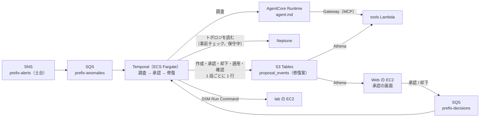

# 構成: ワークフロー（workflow）

← [構成](README.md)

`IaC/terraform/aws-managed/workflow`（`WORKFLOW=1`）。Temporal on ECS、SQS が 2 本（SNS を購読するアラートのキューと、Web の承認・却下を受ける決定のキュー）、Gateway（MCP）と tools Lambda。AGENT と PIPELINE と、アラートの送り手（Grafana か Splunk）が要る。承認の流れと Temporal UI は [workflow.md](../workflow.md)、データの置き場は [data-stores.md](../data-stores.md)。

- アラートは Grafana と Splunk が土台の SNS トピックへ publish し（[pipeline.md](pipeline.md)）、トピックがこの SQS へ配る。SQS のメッセージでワークフローを起こし、解消のアラートで閉じる。
- 修復案の置き場は S3 Tables の `proposal_events` だけ（作成・承認・却下・時間切れ・適用・確認のたびに 1 行。どの行にも原因・コマンド・理由・決めた人などの全項目）。書くのは worker だけ。「いま」は `proposal_id` ごとに `seq` が最大の行で、Web の承認の画面と tools Lambda（`list_proposals`）が Athena で読む。
- Web の承認・却下は決定のキュー `<prefix>-decisions` に送り、worker がワークフローにシグナル `decide` で渡す。このキューに送れるのは Web の EC2 のロールだけ。
- Neptune に修復案は置かない（2026-10-05 から）。worker は Neptune のトポロジを読むだけ（事前チェックと、保守中の機器の判定）。
- Temporal UI（8233）は Web の EC2 を踏み台にした SSM のポートフォワーディングで開く。gRPC の 7233 はタスクの外に出さない（ワーカーは同じタスクの `localhost`。SG は [core.md](core.md) の「SG」）。
