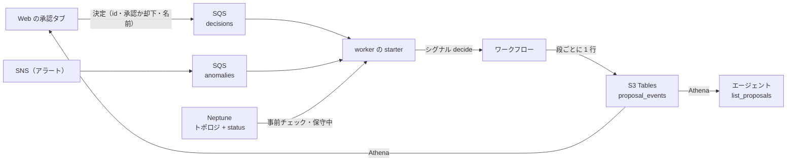

# 修復案を S3 Tables にまとめる（Cycle 003 proposals-in-s3tables）設計: 修復案を S3 Tables だけに置く（Neptune はトポロジと status だけ）

main(fable-5.1) / effort: high

## 結論

- 修復案は S3 Tables の `proposal_events` だけに置く。Neptune の頂点 `proposal` はやめる。
- 書くのは worker だけ。Web の承認・却下は SQS で worker に届け、worker がワークフローにシグナルで伝える。
- 読むのは Athena。修復案の「いま」は、修復案ごとの最新の 1 行。

| | いま | 変更後 |
|---|---|---|
| 修復案の「いま」 | Neptune の頂点 `proposal` | `proposal_events` の最新の 1 行 |
| 修復案の履歴 | `proposal_events`（項目は一部だけ） | `proposal_events`（どの行にも全項目） |
| 承認・却下 | Web が頂点の status を書き換え、worker が 30 秒ごとに見に行く | Web が決定専用の SQS に送り、worker がシグナルにする |
| 書く人 | worker と Web | worker だけ |
| Neptune に入るもの | トポロジ、status、修復案 | トポロジ、status |

## 理由

- 同じ内容を 2 か所に書いている。Neptune には最新だけ、S3 Tables には履歴。食い違う穴がある（承認は頂点にあるのに、証跡の行は worker が拾うまで入らない。docs/data-stores.md の「修復案」の流れの節）。
- Neptune の `proposal` は辺の無い頂点で、グラフとして使っていない（docs/data-stores.md の Neptune の頂点の表）。
- 正は S3 Tables に置く。グラフで分析したくなったら、S3 Tables から写しを頂点と辺として載せる（別のサイクル）。

## 背景

### 合意した決定（経緯は design-log.md の Round 0）

1. 書くのは worker だけ。Web は決定を worker に送る。
2. 承認タブの一覧に Athena の数秒がかかってよい。
3. Web の承認・却下は SQS に送る。Temporal の口は開けない。2 回目の承認はワークフローが無視する。
4. `proposal_events` に列を足し、どの行にも修復案の全項目を入れる。別のテーブルは作らない。
5. いまの `proposal_events` の行と、Neptune の `proposal` の頂点は消えてよい。
6. 承認を押したあと、タブは数秒〜20 秒「承認待ち」のまま。画面に「送った。反映まで少し待つ」と出す。
7. 正は S3 Tables。Neptune へ写しを載せるのは、必要になったとき（このサイクルではやらない）。
8. 実装は cycle 001 と 002 が main に入ってから、エンジニアセッションに頼む。docs は設計のセッションが書く。

### 実物で確認したこと（推測ではない）

- Temporal はタスクの中でしか待っていない（terraform/workflow/ecs.tf。worker は `localhost:7233` につなぐ）。Web から直接シグナルは送れない。
- worker の starter はもう SQS を拾っている（workflow/worker.py の `starter_queue`）。firing でワークフロー `investigate-<anomaly_id>` を起こし、resolved はシグナル `resolved` で伝える。
- キューは `<prefix>-anomalies`（terraform/workflow/events.tf）。可視性タイムアウト 120 秒、long polling 20 秒、5 回で DLQ。ポリシーは SNS の送信を許し、VPC の外を拒む。
- 読めないメッセージは消している（`handle_message`）:
  ```python
  alerts = rules.alerts_from_message(body, int(time.time()))
  if not alerts:
      log.warning("starter: 読めないメッセージ（消す）: %s", str(body)[:200])
      return
  ```
- ワークフロー ID は異常ごとで、発生ごとではない。同じ ID で別の発生の実行がありうる（`put_proposal` が `run_id` まで比べている）。
- いまのシグナルは決定だけを運び、あとから来たものが上書きする:
  ```python
  @workflow.signal
  def decide(self, decision: str) -> None:
      if decision in ("approved", "rejected"):
          self._decision = decision
  ```
- 頂点に書いている項目（`put_proposal` の `item`）: proposal_id、anomaly_id、device_id、kind、target、first_seen、status、cause、action、command、reason、agent_response、precheck、precheck_verdict、source、detail（アラートの detail）、workflow_id、run_id、created_at、updated_at。あとから decided_by、decided_at、apply_output、verify_note が足される。
- `proposal_events` の列（workflow/rules.py の `PROPOSAL_EVENT_COLUMNS`）は 12 個: event_id、proposal_id、anomaly_id、event、status、device_id、action、cause、command、decided_by、detail、event_time。`event_id` は `<proposal_id>#<event>`。`event_time` は秒。
- 承認タブ（web/incident_view.py）は、テーブルに無い kind、target、reason、precheck、apply_output、verify_note、created_at、updated_at を出している。
- starter は「同じ発生の修復案がもうあるか」を Neptune で見ている（`start_for` の `awsio.read_proposal`）。`rules.should_start(alert, existing)` は、`existing` が空でなければ起こさない。
- Neptune に書く `graph.update_record` を呼ぶのは `agent/proposals.py` の `decide` だけ。
- `agent/proposals.py` は Web と、tools の Lambda（terraform/workflow/gateway.tf）の両方に入っている。`decide` はツールに出していない（HITL）。
- `awsio.audit_rows` は、列の型が `timestamptz` 以外は全部文字列にする。

## メリットとデメリット

| | 中身 |
|---|---|
| メリット | 置き場が 1 つになり、「いま」と履歴が食い違わない |
| | Neptune が止まっても、承認から修復までが進む（事前チェックのトポロジ読みは残る） |
| | 二重の承認をワークフローが防ぐ（先に届いた 1 回だけ） |
| | 30 秒ごとに頂点を見に行く処理が無くなる |
| | Runtime から Neptune の書き込み権限を外せる。「チャットから承認できない」が IAM でも守られる（決定のキューに送れるのは Web のロールだけ）。Web の書き込みは残る（トポロジの投入と編集が Web の EC2 のロールで書くため） |
| デメリット | 承認タブの一覧と詳細に、Athena の数秒がかかる |
| | 承認を押してから反映まで数秒〜20 秒。押した直後は「承認待ち」のまま |
| | 列を足すのでテーブルを作り直す。いまの行は消える |
| | 1 つの修復案が 3〜4 行になり、どの行も全項目を持つ（PoC の量では問題にならない） |
| | worker が止まっているあいだの承認は、SQS に 1 日だけ残る。過ぎると消える |

## 設計方針

### 全体の流れ



### 1. テーブル `proposal_events`（列を足す。どの行も全項目）

- 列は 28 個。順番と型は `rules.PROPOSAL_EVENT_COLUMNS` と `terraform/pipeline/analytics/tables.tf` で同じにする。

  | 列 | 型 | 中身 |
  |---|---|---|
  | event_id | string | `<proposal_id>#<event>`（今のまま。再試行の重複を落とす鍵） |
  | proposal_id | string | `<anomaly_id>#<first_seen>` |
  | anomaly_id | string | |
  | seq | **int** | 修復案の中の順番。created が 1、以後 1 ずつ増える |
  | event | string | created / approved / rejected / expired / obsolete / applied / failed / verified |
  | status | string | この行の時点の状態（created は pending、ほかは event と同じ） |
  | device_id、kind、target | string | アラートの機器、種類、対象 |
  | first_seen | timestamptz | 異常の発生時刻 |
  | source | string | grafana / splunk |
  | alert_detail | string | アラートの detail（頂点の `detail` だったもの） |
  | cause、action、command、reason、agent_response | string | エージェントの答え |
  | precheck、precheck_verdict | string | 処置の前のチェック |
  | decided_by | string | 決めた人。決まる前は空 |
  | decided_at | timestamptz | 決めた時刻。決まる前は null |
  | apply_output、verify_note | string | 実行結果、確認結果。まだなら空 |
  | detail | string | この行の出来事の一言（今のまま） |
  | workflow_id、run_id | string | |
  | created_at | timestamptz | 修復案を作った時刻（どの行も同じ） |
  | event_time | timestamptz | この行を書いた時刻（「更新」に出す） |

- 「いま」は、`proposal_id` ごとに `seq` が最大の行。`event_time` は秒なので順番に使わない。
- `awsio.audit_rows` に `int` の変換を足す。

### 2. worker: 修復案の中身はワークフローが持つ

- `put_proposal` は、`created` の行（全項目）を足して、**修復案の辞書を返す**（いまは id だけ）。
- 以後の段は、アクティビティ `record_event(proposal, event, fields)` 1 つにまとめる。辞書に `fields` と `seq + 1` を重ねて 1 行足し、重ねた辞書を返す。ワークフローはそれを持ち回る。
- 消すもの: アクティビティ `get_decision` / `record_decision` / `set_status`、`awsio.read_proposal` / `write_proposal` / `update_proposal`、30 秒ごとの頂点の読み取り。
- 残すもの: `awsio.cypher` と `read_topology`（事前チェックと保守中の判定）。
- 承認待ちは、シグナル（`decide` か `resolved`）か時間切れまで待つだけにする。`wait_condition` の `TimeoutError` を握るのは今と同じ。
- 文字列は 1 項目 4000 字で切る（`agent_response` が長い。Temporal の受け渡しと行の大きさを抑える）。
- 同じ発生の二重作成を防ぐ手段:
  - 走っているあいだは、ワークフロー ID（異常ごとに 1 つ）が防ぐ。
  - 閉じたあとの通知の送り直しは、starter が `proposal_events` を見て防ぐ（3 番）。
  - `put_proposal` は書く前に同じ `proposal_id` の行を読み、別の実行（`workflow_id` か `run_id` が違う）の行があれば今と同じ再試行なしのエラーにする。自分の行があれば、それを使って進む。
  - この「読んでから書く」は原子的ではない（前は Neptune の MERGE が原子的だった）。同じワークフロー ID の実行は Temporal が 1 つに絞るので、起きうるのはアクティビティの再試行で同じ `seq` の行が重なることだけ。読む側の並べ方で吸収する（5 番）。
- **古い承認待ちを閉じる。**
  `put_proposal` は `created` を足す前に、同じ異常（`anomaly_id`）で `proposal_id` が違う修復案のうち、最新の行が pending のものに `expired` の行を足す（`verify_note` は「同じ異常の新しい修復案ができた」）。worker のタスクが入れ替わって Temporal の履歴が消えたあと、同じ異常がまた発火すると、古い修復案への決定は新しい実行が「自分のものでない」と無視する。閉じておかないと、古い承認待ちが永久に残る。

### 3. starter: 修復案があるかを `proposal_events` で見る

- `awsio.latest_proposal(proposal_id)` を足す。PyIceberg で `proposal_id` が一致する行を読み、`seq` が最大の行を返す。無ければ空の辞書。
- `start_for` は `read_proposal` の代わりにこれを呼ぶ。`rules.should_start` は変えない。

### 4. 承認: Web → SQS → starter → シグナル

- **決定専用のキュー `<prefix>-decisions` を作る。アラートのキュー `<prefix>-anomalies` は共用しない。**
  - 理由: `anomalies` は SNS のトピック `<prefix>-alerts` を `raw_message_delivery` で受けている。このトピックに publish できる Grafana と Splunk のタスクロールが `{"type":"decision",…}` を流すと、承認として通ってしまう（エンジニアの指摘。2026-10-04）。
  - `decisions` は SNS を購読しない。キューのポリシーは VPC の外を拒むだけで、SNS の送信は許さない。`sqs:SendMessage` は Web の EC2 のロール（`local.web_role_name`）にだけ付ける。`reader_role_names` には Runtime が入っているので、そこには足さない。
  - 設定は `anomalies` と同じ（可視性タイムアウト 120 秒、long polling 20 秒、保持 1 日、5 回で専用の DLQ）。VPC のエンドポイントと Deny は共用で足りる。
  - worker は待つループを 2 つ持つ（`starter_queue` と同じ作りをもう 1 つ）。`decisions` から来たものだけを決定として読み、`anomalies` に `type` が `decision` のものが来たら捨てる。
- メッセージ:
  ```json
  {"type": "decision", "proposal_id": "<anomaly_id>#<first_seen>", "decision": "approved", "decided_by": "<名前> (web)", "sent_at": 1790000000}
  ```
- 決定のループは `rules.decision_from_message` で読む（`type` が `decision`、`decision` が approved / rejected、`proposal_id` が空でない。読めなければ今と同じく消す）。
- ワークフロー ID は `proposal_id` から出す（`#` の右端を外した残りが `anomaly_id`）。
- シグナルは辞書 1 つにする: `decide({"proposal_id", "decision", "decided_by", "decided_at"})`。`decided_at` は `sent_at`。
- ワークフローは次のときシグナルを無視する:
  - `proposal_id` が自分のものと違う（同じ異常の、前の発生への決定）。自分の `proposal_id` は実行の最初に `rules.proposal_id` で出す。
  - もう決定を持っている（先に届いた 1 回だけが効く。SQS の重複配達も同じ扱い）。
- ワークフローが走っていないとき（`NOT_FOUND`）:
  - `latest_proposal` が pending なら、`expired` の行を starter が足す（`verify_note` は「決定が届いたが、ワークフローがもう無い」）。worker のタスクが入れ替わって Temporal の履歴が消えた修復案が、承認待ちのまま残らないようにする。
  - pending でなければ何もしない。
  - どちらもメッセージは消す。
- Temporal に届かないなどの失敗は、今と同じく消さずに配り直させる。

### 5. 読む側: `agent/proposals.py` を Athena に替える

- `list_proposals(status, limit, device_id)` と `get_proposal(proposal_id)` の引数と返す形は変えない。画面とツールの呼び方はそのまま。
- クエリ（値は Athena の実行パラメータで渡す。文字列に埋めない）:
  ```sql
  SELECT * FROM (
    SELECT *, row_number() OVER (PARTITION BY proposal_id ORDER BY seq DESC, event_time DESC) AS rn
    FROM "<namespace>"."proposal_events"
  ) WHERE rn = 1 AND status = ? AND device_id = ?
  ORDER BY event_time DESC LIMIT 100
  ```
- 返す辞書は今のキーに合わせる。`updated_at` は `event_time`、`detail` は `alert_detail`。時刻は epoch 秒に直してから `_decorate` に渡す（Athena は timestamptz を UTC の文字列で返す。`agent/evidence.py` の `_jst_of` と同じ読み方で直す）。
- テーブルは `"<catalog>"."<namespace>"."proposal_events"` の 3 部で書く（`query_history` と同じ）。
- `proposal_id`（`device#kind#target#epoch` の形）を実行パラメータで渡すときの検査は、`query_history` の `_DEVICE_RE`（`^[A-Za-z0-9._:/#?-]{1,128}$`）をそのまま使えるかを実装で確かめる。`target` の文字と長さで通らないなら、`proposal_id` 用の検査を別に書く。
- Athena の実行（開始 → 待つ → 止める → 結果）は、いま `agent/evidence.py` の `query_history` の中に直書きされている。これを共通の関数に切り出して、`query_history` と `proposals.py` の両方が使う（切り出しはこのサイクルでやる）。環境変数は同じ `ATHENA_WORKGROUP` / `ATHENA_CATALOG` / `HISTORY_NAMESPACE` に、`PROPOSAL_EVENTS_TABLE` を足す。
- Runtime のコンテナの中での代替実行（`agent/app.py` が Gateway に届かないとき `list_proposals` をコンテナ内で動かす）では、「修復案を読めない」というエラーが返る。設定は Web と同じ道（SSM のパラメータ）で渡すので、Runtime も設定は引けるが、Athena の権限が無いので AccessDenied になる。Runtime には Athena の権限を付けない（どちらにしても読めない。受け入れる）。Runtime の `ssm:GetParameter` を名前ごとに絞ることは、このサイクルではやらない。
- 設定（SSM のパラメータ）が無ければ、今と同じく「まだ配備されていない」を返す。
- `decide(proposal_id, decision, decided_by)`:
  1. 決定と id を確かめる（今と同じ）。
  2. `get_proposal` で pending かを見る。違えば今と同じ文言で返す（早く気づかせるため。最後に決めるのはワークフロー）。
  3. SQS に送る。返すのは `{"proposal_id", "status": "sent", …}`。
- `decide` は今までどおりツールに出さない。
- `agent/graph.py` の `get_record` と `update_record` は消す。`list_records` は残す（`agent/topology.py` が label `change` で使っている）。

### 6. 画面（web/incident_view.py）

- 承認・却下を押したら「承認を送った。反映まで少し待つ（数秒〜20 秒。更新を押す）」と出す。
- 表と詳細の項目は変えない。

### 7. Terraform と権限

| 場所 | 中身 |
|---|---|
| terraform/pipeline/analytics/tables.tf | `proposal_events` のスキーマを 28 列に（テーブルは作り直しになる） |
| terraform/workflow/events.tf | 決定のキュー `<prefix>-decisions` と DLQ を足す（SNS の購読なし） |
| terraform/workflow の IAM | Web の EC2 のロール（`local.web_role_name`）にだけ、`decisions` への `sqs:SendMessage`。worker のタスクロールに `decisions` の受信と削除 |
| | Web の EC2 と tools の Lambda に、Athena で `proposal_events` を読む権限。tools の Lambda は、gateway.tf の `HistoryTable` に `local.proposal_events_table_arn` を足す（いまは `alert_events` だけで、コメントに「proposal_events は読ませない」とあるので直す）。Web には同じ 4 文（HistoryQuery / HistoryCatalog / HistoryBucket / HistoryTable）を `local.web_role_name` で付ける |
| terraform/workflow/gateway.tf | tools の Lambda に `PROPOSAL_EVENTS_TABLE` |
| Web の設定 | キューの URL と Athena の設定を、ほかの設定と同じ道（SSM のパラメータ）で渡す |
| terraform/pipeline/graph/access.tf | Runtime の Neptune の書き込みを外し、読み取りだけにする。Web は書き込みを残す（`ops/up.sh` の 7-3b と `ops/sync-graph.sh` が Web の EC2 の上で `ops/seed_graph.py` を走らせ、トポロジタブの seed / add_link / remove_link も書く） |
| コメントと説明 | Neptune に修復案がある前提の文を直す（workflow/worker.py、workflow/awsio.py、agent/proposals.py、agent/app.py、tools/handler.py、web/incident_view.py、terraform/workflow の locals.tf と proposals.tf、analytics の tables.tf と history.tf のワークグループの説明） |
| terraform/workflow/proposals.tf | コメントを今の形に書き直す |

### やらないこと

- 履歴（`alert_events` / `proposal_events`）を Neptune に頂点と辺として載せること。グラフで分析したくなったときに別のサイクルでやる。
- 承認タブの見た目の変更。
- Web から Neptune の書き込み権限を外すこと（トポロジの投入と編集に要る）。

## 変更対象ファイル

- worker: `workflow/worker.py`、`workflow/awsio.py`、`workflow/rules.py`
- 読む側と承認: `agent/proposals.py`、`agent/graph.py`、`agent/evidence.py`（Athena の共通の関数）、`web/incident_view.py`、`web/config.py`
- Terraform: `terraform/pipeline/analytics/tables.tf`、`terraform/pipeline/graph/access.tf`、`terraform/workflow/events.tf`、`iam.tf`、`gateway.tf`、`proposals.tf`、`locals.tf`
- 配備: `ops/up.sh`（Web に渡す設定が増えるなら）
- テスト: `tests/test_workflow.py`、`tests/test_app.py`、`tests/test_graph.py`、`tests/test_analytics.py`
- docs（設計のセッションが書く）: `docs/data-stores.md`、`docs/workflow.md`、`docs/development.md`

## 再利用するもの

- `starter_queue` / `handle_message` と、解消をシグナルで伝える `resolve_for` の作り。
- `awsio.append_proposal_events`（ぶつかったら読み直して打ち直す）と `catalog_properties`。
- `rules.proposal_event` と `event_id` の決め方。
- cycle 001 の Athena のワークグループと、`query_history` の実行の作り。
- `proposals.py` の `_decorate` と、画面の表・詳細。

## 実装ステップ

1. `rules.py`: 列を 28 個に。`proposal_event` を全項目の行に。`decision_from_message` を足す。単体テスト。
2. `awsio.py`: `audit_rows` に int。`latest_proposal` を足す。Neptune の proposal の読み書きを消す。決定を送る関数は Web 側に置く。
3. `worker.py`: `put_proposal` が辞書を返す。`record_event` にまとめる。シグナル `decide` を辞書に。決定のキューを待つループと、走っていないときの `expired`。`put_proposal` が同じ異常の古い pending を `expired` にする。
4. `tables.tf`: スキーマ。`terraform plan` で作り直しになることを確かめる。
5. `agent/proposals.py`: Athena で読む。`decide` は SQS に送る。
6. `web/incident_view.py` の文言、Web の設定、IAM、gateway。
7. Runtime の Neptune の書き込み権限を外す。`graph.get_record` と `graph.update_record` を消す（テストも直す: test_graph.py、test_app.py、test_workflow.py の該当箇所）。
8. テストと `ops/check.sh`。

## 検証方法（期待出力つき）

- `python3 tests/test_workflow.py`:
  - `rules.proposal_event("created", item, now)` の行が 28 列を全部持ち、`seq` が 1、`status` が `pending`、`decided_at` が None。
  - 同じ辞書で `approved` の行を作ると `seq` が 2、`kind` / `target` / `reason` / `precheck` が created の行と同じ。
  - `rules.decision_from_message('{"type":"decision","proposal_id":"a#1","decision":"approved","decided_by":"x (web)","sent_at":5}')` が辞書を返す。`decision` が `maybe` のとき、`proposal_id` が空のときは None。
  - アラートの JSON を渡すと None。
  - アラートのキューから来た `{"type":"decision",…}` は、シグナルを送らずに捨てる。
  - 同じ `anomaly_id` で `proposal_id` の違う pending があるとき、`put_proposal` が `expired` の行を 1 つ足してから `created` を足す。
  - Terraform: `decisions` のキューに SNS の購読が無く、`sqs:SendMessage` が付くのは Web のロールだけ（Runtime のロールに無い）。
  - ワークフロー（テスト環境）: `proposal_id` の違うシグナルを送っても待ち続ける。合うシグナルを 2 回（approved、rejected の順）送ると、結果は approved で、行の `decided_by` は 1 回目の名前。
  - `audit_rows` が `seq` を int、`decided_at` の None を None にする。
- `python3 tests/test_app.py`:
  - Athena の結果を差し替えた `list_proposals(status="pending")` が、今と同じキー（`proposal_id`、`status`、`device_id`、`kind`、`target`、`cause`、`action`、`command`、`reason`、`created_at_jst`、`updated_at_jst`、`decided_by`、`apply_output`、`verify_note`）を返す。
  - 設定が無いとき `{"error": NOT_DEPLOYED, "proposals": []}`。
  - `decide` が SQS の送信を 1 回呼び、本文の `type` が `decision`。pending でない修復案では送らずにエラーを返す。
  - `TOOL_SPECS` に `decide` が無い（今のまま）。
- `grep -rn "n:proposal\|update_record" workflow agent web` が 0 件。
- AWS（ユーザーが up.sh を打つ）:
  1. `sudo lab fail-main` のあと、承認タブの「承認待ち」に 1 件出る。Athena で `proposal_events` に `created` の行があり、`kind` と `reason` が入っている。
  2. 承認を押すと「送った」の文言が出る。20 秒以内に更新すると「承認済み」か、その先に進んでいる。
  3. Athena で同じ `proposal_id` の行が created → approved → applied → verified の順に `seq` 1〜4 で並び、`decided_by` が入力した名前。
  4. 同じ修復案をもう一度（別の名前で却下）送っても、行が増えない。
  5. Neptune に `MATCH (n:proposal) RETURN count(n)` を打つと 0。
  6. エージェントに「修復履歴は」と聞くと、`list_proposals` が同じ修復案を返す。

## 未確定事項とリスク

1. **Web の EC2 から Athena と SQS に届くかは AWS で未確認。** コードを読んだ限りでは届く（WORKFLOW には analytics が必須なので Athena のエンドポイントは必ずあり、SG はワークロードの全 SG から endpoints の 443 へ通り、perimeter の Deny はエンドポイント経由なら外れる）。AWS で確かめる。
2. **スキーマを変えるとテーブルが作り直しになる、というのは `terraform plan` で確かめていない。** 作り直しにならず更新もできない場合は、`ops/up.sh` で消してから作る手順が要る。
3. **`strands-agent` のブランチ（main に未 merge）と `agent/app.py` が重なる。** 003 は docstring とシステムプロンプトの `list_proposals` の説明に触る。あとから入るほうで衝突を解く。
4. **worker が 1 日より長く止まると、送った決定が SQS から消える。** 修復案は承認待ちのまま時間切れになる。画面には「送った」としか出ていない。
5. **worker のタスクが入れ替わると、承認待ちの修復案が残る**（Temporal の履歴が消える。今もある穴）。決定が届くか、同じ異常がまた発火すれば `expired` にするが、どちらも無ければ「承認待ち」に残り続ける。起動のときに古い pending を `expired` にする掃除は、このサイクルでは入れない。
6. **デプロイする人（管理者）は決定のキューに送れる。** IAM で止めているのは Runtime と、Grafana・Splunk のタスクロール。
7. **PyIceberg の読み取りが遅いと、starter のアラートの処理が遅れる。** テーブルが小さいうちは問題にならない。行が増えたら `proposal_id` で区切る（パーティション）か、保持を決める。
8. **実装は cycle 001 と 002 のあと。** `workflow/`、`agent/evidence.py`、`terraform/workflow/`、`ops/up.sh`、`tests/` が重なる。
9. **配備の順番。** テーブルを作り直してから worker を入れ替えるまでのあいだ、古い worker は 12 列で書こうとして失敗する。up.sh の 1 回の中で両方が替わることを確かめる。

<!-- artifact: /Users/eight/Documents/repo/artifacts/nwc-poc/20261004-cycle-003-proposals-in-s3tables-design.html -->
