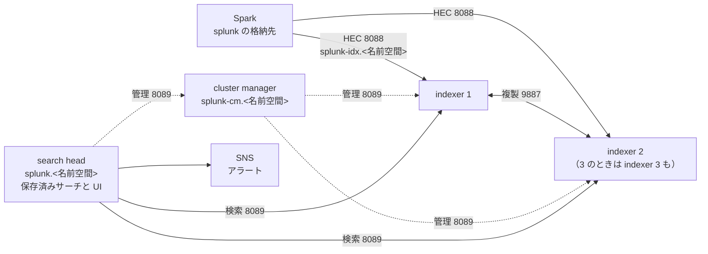

# Cycle 004 splunk-indexer-cluster 設計: Splunk をクラスターにする（格納したデータを AZ をまたいで複製する）

main(fable-5.1) / effort: high

## 背景

- 格納先のうち、Splunk だけが 1 台で動いている。ECS のタスクが 1 つ（`desired_count = 1`）で、index はそのタスクのエフェメラルストレージにある。タスクが落ちると、入れたデータは全部消える。
- ほかの格納先は AWS のマネージドサービスで、複製は AWS の側が持つ（S3 Tables、Amazon Managed Service for Prometheus、OpenSearch Serverless）。
- やりたいことは 1 つ。**Splunk に格納したデータが冗長化されていること。** 1 台が落ちても、入れたデータを検索できる。
- 検索の入口（search head）の冗長化と、タスクを全部落としたあとのデータの保持は、このサイクルの目的ではない。
- AZ をまたぐ配置は、あとから目的に足した（2026-10-04。リソースごとの `<リソース>_AZ_NUM` で冗長化の度合いを選ぶ、というユーザーの決定に合わせた）。indexer を AZ ごとに 1 台ずつ置く。
- 実装を始めるのは、次の 3 つが main に入ってから。
  - 「Splunk と Grafana のアラートを比べる（002）」。保存済みサーチと既定値を変えている。
  - `feat/splunk-boto3`。Splunk のアラートアクションを boto3 に替えている（イメージと入口が重なる）。
  - `feat/az-num`。2 つ目と 3 つ目の AZ のサブネットと、`*_AZ_NUM` の検査の形を入れる。
  - それまでは、手元のコンテナでの確認（実装ステップ 1）だけを進める。

## 設計方針

### 合意した決定（経緯は design-log.md の Round 0）

1. indexer クラスターだけを作る。cluster manager 1 + indexer 2 か 3 + search head 1。search head クラスターは作らない。
2. Spark から indexer への HEC の振り分けは、Cloud Map の DNS（A レコードが indexer の数だけ）でやる。NLB は置かない。
3. index はタスクのエフェメラルストレージのまま。EFS は使わない。1 台が落ちても、ほかの台に複製がある。
4. 環境変数 `SPLUNK_AZ_NUM`（1 / 2 / 3）で切り替える。既定は 1（いまの 1 台）。`SPLUNK_CLUSTER` というキーは作らない（2026-10-04 に変更。経緯は design-log.md）。
5. 複製の数と、検索できる複製の数は、どちらも indexer の数と同じにする。
6. クラスターのとき、index は `main` だけ。`SPLUNK_INDEX` が空でなければ `ops/up.sh` が止める。
7. 実装はエンジニアセッションに頼む。

### `SPLUNK_AZ_NUM` の値と構成

| `SPLUNK_AZ_NUM` | 構成 | タスク | 複製の数 | 守れる障害 |
|---|---|---|---|---|
| 1（既定） | 1 台（いまと同じ） | 1 | なし | なし（タスクが落ちるとデータは消える） |
| 2 | manager 1 + indexer 2 + search head 1 | 4 | 2 | indexer 1 台、または indexer のいる AZ 1 つ |
| 3 | manager 1 + indexer 3 + search head 1 | 5 | 3 | indexer 2 台、または indexer のいる AZ 2 つ |

- indexer は AZ ごとに 1 台ずつ置く（1 つ目、2 つ目、3 つ目の AZ のサブネット）。
- manager と search head は 1 つ目の AZ に置く。この AZ が落ちると検索とアラートは止まるが、データは残りの indexer にある。ECS が起こし直せば、また検索できる。
- 組み合わせの検査（`ops/up.sh`）:
  - `STORES` に `splunk` が無いのに `SPLUNK_AZ_NUM` が 2 か 3 → 止める。
  - `SKIP_ANALYTICS=1` のとき → `SPLUNK_AZ_NUM` は見ない（止めない）。
  - `SPLUNK_AZ_NUM` が 2 か 3 で `SPLUNK_INDEX` が空でない → 止める（「クラスターでは index は main だけ」）。

### 構成

| タスク | 数 | 役割 | Cloud Map の名前 | 持つもの |
|---|---|---|---|---|
| cluster manager | 1 | indexer の登録と、複製の指図 | `splunk-cm` | 複製の設定（複製の数と、検索できる複製の数。どちらも indexer の数） |
| indexer | 2 か 3 | HEC で受けて index に入れる。相手に複製を送る | `splunk-idx`（A レコードが indexer の数だけ） | index `main`（自分の分と、相手の分の複製） |
| search head | 1 | 検索、UI、保存済みサーチ、アラートアクション | `splunk`（いまと同じ名前） | app `netops_alerts`、SNS へ publish するタスクロール |

- **複製の数と、検索できる複製の数は、どちらも indexer の数。**
  どの indexer も全部のデータを検索できる形で持つ。1 台でも残っていれば、全部のデータを検索できる。
- **イメージは 1 つのまま。**
  同じイメージを、環境変数 `SPLUNK_ROLE` で 4 つの役割に使い分ける（上流の公式イメージの仕組み）。
- **どのタスクも同じ SG（いまの `splunk`）に置く。サブネットは indexer だけ AZ ごとに分ける。**
  2 つ目と 3 つ目の AZ のサブネットは `feat/az-num` が入れる。manager と search head は 1 つ目の AZ のサブネット（いまの `local.instance_subnet_id`）。
- **Cloud Map のヘルスチェック（`health_check_custom_config`）は `splunk-idx` にだけ付ける。**
  HEALTHY でない indexer を DNS から外すため。`splunk` と `splunk-cm` は 1 台なので、いまのまま。
- **UI の入口は search head の 1 つ。**
  検索もダッシュボードもここで見る。cluster manager の UI（クラスターの状態）は、確かめるときだけポートフォワードで開く。indexer の UI は使わない。
- **search head の名前は `splunk` のまま。**
  UI のポートフォワードのコマンド（output `splunk_port_forward_command`）と、docs の手順を変えずに済む。
- **1 台のとき（`SPLUNK_AZ_NUM=1`）は、構成を変えない。**
  Cloud Map の名前も HEC の URL も、いまのまま。ただしイメージ（入口）は変わるので、このサイクルを main に入れたあとの最初の `ops/up.sh` で、1 台の Splunk のタスクが 1 回入れ替わる。index はタスクの中にあるので、そのとき入っていたデータは消える。
- **1 台からクラスターへ切り替えると、空から始まる。**
  1 台のときの index は引き継がない（サービスが別で、タスクが作り直される）。逆も同じ。

### データが複製されるために要る 3 つのこと

1. **index `main` を複製の対象にする。**
   Splunk の index は、`indexes.conf` に `repFactor = auto` と書いたものだけが複製される。書かなければ、クラスターにしても複製されない。HEC の token の既定の index は `main` なので、`main` に付ける。`SPLUNK_INDEX` で別の index を使うときは、その index も同じ設定で作る。
   - 入れ方: cluster manager が indexer に配る設定（manager の `manager-apps/_cluster/local/indexes.conf`）に書く。indexer に同じ `indexes.conf` を配るのが、Splunk の決まった形。
2. **indexer 同士と、manager・search head との間のポートを開ける。**
   いまの SG は 8089 を開けていない（terraform/base/core の security_groups.tf の冒頭「開けていないもの: … Splunk の管理 API 8089（外から使わない）」）。`splunk` から `splunk` へ、8089（管理と検索）と 9887（複製）を足す。**いつも作る**（base/core は `SPLUNK_AZ_NUM` を知らない層なので、1 台のときも規則だけはある。同じ SG の中だけの通信で、1 台のときは相手がいない）。9997（forwarder の受け口）も足す。search head と manager は、自分の `_internal` と `_audit` を 9997 で indexer へ送っている（手元で確認）。docs にある `index=_internal` の調べ方は、この転送があるから動く。
3. **クラスターの合言葉（pass4SymmKey）を 4 つのタスクに同じ値で渡す。**
   `ops/up.sh` が SSM の SecureString `/<接頭辞>/splunk/idxc-secret` に乱数で作り、タスク定義の `secrets` で渡す。4 つは、3 のときは 5 つ。値は Terraform も state も持たない（管理者のパスワードと HEC の token と同じやり方）。

### アラートを二重に出さない

- 保存済みサーチ（app `netops_alerts`）は search head だけで動かす。indexer や manager で動くと、同じアラートが台の数だけ SNS に出る。
- イメージは共通なので、入口（`splunk/entrypoint.sh`）で分ける。`SPLUNK_ROLE` が `splunk_standalone`（未設定を含む）か `splunk_search_head` のときだけ app を残し、ほかの役割では起動の前に app のディレクトリを消す。
- SNS へ publish するタスクロールと `DEVICE_MAP` は、search head のタスク定義にだけ付ける。ほかの 3 つは publish の権限を持たない。

### Spark の側

- 変えるのは送り先の URL だけ。クラスターのとき `https://splunk-idx.<名前空間>:8088`、1 台のとき今の `https://splunk.<名前空間>:8088`（`locals.tf` の `splunk_hec_url`）。
- `spark/snmp_sinks.py` は変えない。HEC の token はどのタスクにも同じ SSM の値を渡すので、どの indexer も同じ token で受ける。
- Cloud Map は HEALTHY でないタスクを DNS から外す（TTL 10 秒）。外れるまでの間に落ちた側へ送った分は、いまの再試行に任せる。

### 実物で確認したこと（推測ではない）

- いまの Splunk のタスク（terraform/pipeline/analytics/splunk.tf）:
  - `desired_count = 1`、`deployment_minimum_healthy_percent = 0`、コメント「index はタスクの中にしか無いので 2 つ同時に立てない」。
  - ポートは 8000 / 8088 / 8089。ヘルスチェックは `/sbin/checkstate.sh`、`startPeriod = 300`。
  - `secrets` は `SPLUNK_PASSWORD` と `SPLUNK_HEC_TOKEN`。
  - Cloud Map のサービス `splunk` は `routing_policy = "MULTIVALUE"`、A レコード、TTL 10。
- タスクの大きさは 2 vCPU / 4 GB（`ops/up.sh` の「Fargate x86 2 vCPU / 4 GB で 12.3」）。変数 `splunk_task_cpu` は 2048 か 4096 しか受けない。
- SG の表（terraform/base/core/security_groups.tf）にあるのは `web → splunk 8000` と `spark → splunk 8088` の 2 行。
- イメージ（splunk/Dockerfile）は `splunk/splunk:10.4.3` に app と入口を足すだけ。app は `/opt/splunk-etc/apps/netops_alerts` に置き、上流の入口が起動のとき `/opt/splunk/etc` へ写す。
- 入口（splunk/entrypoint.sh）は環境変数をファイルに写してから `exec /sbin/entrypoint.sh "$@"` する。役割の分岐をここに足せる。
- `ops/up.sh` は手順 7-4b で、Splunk のサービスが HEALTHY になるのを最大 20 分待ってから Spark のジョブを起こす。

### 推測のまま残っていること（実装の最初に、手元のコンテナで確かめる）

上流の公式イメージ（docker-splunk と splunk-ansible）の環境変数は、記憶から書いている。実物の文書とイメージで確かめるまで、下は推測。

| 項目 | 推測 |
|---|---|
| 役割の名前 | `SPLUNK_ROLE` = `splunk_cluster_master` / `splunk_indexer` / `splunk_search_head` |
| manager の場所 | `SPLUNK_CLUSTER_MASTER_URL` に `splunk-cm.<名前空間>` |
| 複製の設定 | `SPLUNK_IDXC_SECRET`、`SPLUNK_IDXC_REPLICATION_FACTOR`、`SPLUNK_IDXC_SEARCH_FACTOR` |
| 複製のポート | 9887 |
| indexer の一覧 | manager と search head に `SPLUNK_INDEXER_URL` が要るかもしれない。A レコードが複数ある名前 1 つで足りるかは分からない |
| 1 台のときの `SPLUNK_INDEX` | 1 台でも効いていないかもしれない（index を作る処理が無く、HEC が 400 を返す、というエンジニアの見立て）。手元で確かめ、本当なら別の小さい修正にする（このサイクルには入れない） |

### 手元の確認で分かったこと（2026-10-04、エンジニアセッションが Docker の 4 台で確認）

期待どおりだったもの: 役の分け方（`SPLUNK_ROLE`）、複製（RF と SF を満たす）、1000 件の検索、indexer を 1 台止めても 1000 件、空の indexer を足すと 73 秒で複製が戻る、保存済みサーチは search head だけ、アラートは 1 通だけ、1 台構成の回帰（11 件）。

設計を変えるもの:

| 分かったこと | 設計への反映 |
|---|---|
| `main` の `repFactor = auto` は、manager の既定の設定に入っている | `indexes.conf` を自分で書かない |
| `SPLUNK_INDEXER_URL` に名前を 1 つ入れると、複製の数が 1 になる（上流の ansible が、名前の数と指定の小さいほうにする） | `SPLUNK_INDEXER_URL` は付けない |
| indexer が止まるまで 47 秒かかる。Fargate の既定は 30 秒で、途中で強制終了になる | indexer のタスク定義に `stopTimeout = 120` |
| search head と manager は 9997 で indexer へログを送る | SG に 9997 を足す（上の 2） |
| 起動に 6 分半かかる | healthCheck の猶予（600 秒）に収まる。変えない |
| 1 台からクラスターに切り替えると、空のクラスターから始まる | docs に書く |

### indexer が前と同じ IP で入れ替わったときの手当て

- **起きること。**
  indexer のタスクが入れ替わって前と同じ IP をもらうと、search head は古い indexer の GUID のままその IP を持ち続け、新しい indexer への検索が 401 になる。検索は成功を返し、警告も出ない。その indexer に入ったイベントは見えず、アラートは黙って落ちる（手元で 2 回再現）。
- **直り方。**
  search head を起こし直すと直る。ただし、落としたアラートはあとからは出ない（保存済みサーチは「索引に入った時刻」の 1 分の窓を 1 回しか読まない）。
- **手当て（こちらで決めた。A と B の両方）。**
  - A. search head のヘルスチェックに突き合わせを足す。manager が「Up」と言っている peer（GUID）が、search head の distributed peers で Down か、GUID が違うなら unhealthy にする。ECS が search head を入れ替える。
    - indexer が本当に落ちているだけのとき（manager も Down と言っている）は、unhealthy にしない。
    - 1 回の食い違いでは unhealthy にしない。続けて 3 回（healthCheck の `retries`）食い違ったときだけにする。indexer の起動の途中で search head が入れ替わるのを防ぐ。
    - manager に問い合わせられないときは、unhealthy にしない（manager が落ちただけで search head まで入れ替えない）。
  - B. `ops/up.sh` の全タスク待ちのあとに、同じ突き合わせを 1 回行う。食い違っていたら、止めて理由を出す。
- **やらない案。**
  indexer の GUID を台ごとに固定する（`instance.cfg` を書く）。同じ GUID の台が入れ替わったときの Splunk の動きが読めない。
- **残る弱さ。**
  A が効くまでの数分と、search head が入れ替わっている数分は、アラートが落ちる。あとから出し直す仕組みは、このサイクルでは作らない。

## 変更対象ファイル

| ファイル | 変更 |
|---|---|
| `splunk/entrypoint.sh` | 役割が standalone / search head でなければ、app `netops_alerts` を消してから上流の入口を起こす |
| `splunk/`（新しい設定） | manager が配る `indexes.conf`（`main` に `repFactor = auto`）。置き場所と入れ方は手元の確認で決める |
| `terraform/pipeline/analytics/splunk.tf` | 変数 `splunk_az_num` が 2 か 3 のとき、manager、indexer（AZ ごとに 1 台。数は `splunk_az_num`）、search head のタスク定義とサービス、Cloud Map の `splunk-cm` と `splunk-idx` を作る。1 のときは今のまま |
| `terraform/pipeline/analytics/variables.tf`、`locals.tf`、`outputs.tf` | 変数 `splunk_az_num`、HEC の URL の切り替え、サービス名の output（待つ対象が 3 つのサービスの全部のタスクになる）、cluster manager の UI へのポートフォワードのコマンドの output（クラスターのときだけ。`splunk_port_forward_command` と同じ形で、宛先が `splunk-cm`） |
| `terraform/base/core/security_groups.tf` | `splunk → splunk` の 8089 と 9887（いつも作る） |
| `ops/up.sh` | `SPLUNK_AZ_NUM`（1 / 2 / 3 の検査と、`STORES`・`SPLUNK_INDEX` との組み合わせの検査）、合言葉の SSM、3 つのサービスの全部のタスクが HEALTHY になるのを待つ、費用の表示 |
| `deploy.env.example`、deploy-env の許可リスト | `SPLUNK_AZ_NUM`（「冗長化用」のまとまりに置く） |
| `tests/test_analytics.py` ほか | 下の「検証方法」 |
| docs（こちらで書く） | `docs/pipeline.md`、`docs/deploy.md`、`docs/data-stores.md`、`docs/troubleshooting.md`、`README.md`、FAQ |

## 再利用するもの

- イメージ、app `netops_alerts`、アラートアクション、HEC の token と管理者のパスワードの SSM（`ensure_secret`）。
- Cloud Map の名前空間と ECS のクラスタ（ecs.tf）、ロググループ、実行ロール。
- `ops/up.sh` の「HEALTHY を待つ」処理（7-4b）。
- SG の表の書き方（security_groups.tf の `{ from, to, protocol, port, why }`）。

## 実装ステップ

1. **手元のコンテナで 4 台（と 5 台）を立てて確かめる（最初にやる。ここで駄目なら止めて報告する）。**
   いまのイメージを 4 つの役割で起こし、「推測のまま残っていること」の表を実物で埋める。試用ライセンスのままクラスターと分散検索が動くかも、ここで見る。
2. 入口の分岐と、`main` を複製の対象にする設定をイメージに入れる。手元で、下の合格条件 1〜4 を通す。
3. Terraform（タスク定義 3 種類、サービス、Cloud Map、SG、変数、output）。
4. `ops/up.sh`（切り替え、合言葉、待ち、費用）。
5. テストと `ops/check.sh`。
6. docs（こちらで書く）。

## 検証方法

### 手元のコンテナ（実装者が実行する）

manager 1、indexer 2、search head 1 を起こし、HEC でイベントを 1000 件入れる（2 台に分けて）。indexer 3 台でも同じことを 1 回通す（2 台止めても 1000）。

1. manager の `splunk show cluster-status` が、indexer 2 台を `Up`、`Replication factor met` と `Search factor met` を表示する。
2. search head で `index=main | stats count` が 1000 を返す。
3. **indexer を 1 台止めたあと、search head で同じ検索が 1000 を返す。**（このサイクルの目的そのもの。止める台を替えても 1000。）
4. 止めた indexer を新しいコンテナで起こし直すと、数分で `Replication factor met` に戻る。
5. search head の `| rest /servicesNS/-/-/saved/searches splunk_server=local | search eai:acl.app=netops_alerts | stats count` が、いまの保存済みサーチの本数（002 のあとの `savedsearches.conf` のスタンザの数）と一致する。indexer と manager のコンテナには `/opt/splunk/etc/apps/netops_alerts` が無い。
6. link down のイベントを 1 件入れると、偽の SNS に届く通知が 1 通だけ（台の数だけ届かない）。
7. `SPLUNK_ROLE` を付けずに 1 台で起こすと、いまと同じに動く（app があり、アラートが 1 通出る）。

4. **前と同じ IP で indexer を入れ替えたあと、search head が自分で入れ替わり、そのあとに入れた link down のアラートが 1 通出る。**（手当て A の確認。入れ替わる前に入れた分は出なくてよい。）

### テスト

- `splunk_az_num = 1` のとき、作るものが今と変わらない（サービス 1 つ、Cloud Map の `splunk`、HEC の URL）。
- `splunk_az_num = 2` と `3` のとき:
  - サービスが 3 つ（manager 1、indexer が `splunk_az_num` 台、search head 1）で、どれも同じイメージと同じ SG。
  - indexer のサブネットが AZ ごとに違い、manager と search head は 1 つ目の AZ。
  - 複製の数と、検索できる複製の数が、indexer の数と同じ。
  - `health_check_custom_config` が `splunk-idx` にだけある。
  - HEC の URL が `https://splunk-idx.<名前空間>:8088`。
  - SNS へ publish するタスクロールと `DEVICE_MAP` が search head にだけある。
  - 合言葉が `secrets`（SSM）で渡り、`environment` に値が無い。
- SG に `splunk → splunk` の 8089 と 9887 がある（`splunk_az_num` によらない）。
- `ops/up.sh` は、次のとき何も作らずに止まる。
  - `SPLUNK_AZ_NUM` が 1 / 2 / 3 以外。
  - `STORES` に `splunk` が無いのに `SPLUNK_AZ_NUM` が 2 か 3（`SKIP_ANALYTICS=1` のときは止めない）。
  - `SPLUNK_AZ_NUM` が 2 か 3 で `SPLUNK_INDEX` が空でない。
- `bash ops/check.sh` の最後の行が「すべて通過」。

### AWS（ユーザーが `ops/up.sh` で行う。このサイクルの完了の条件）

- `SPLUNK_AZ_NUM=2` で立て、上の 1〜3 を AWS で確かめる。3 は、ECS で indexer のタスクを 1 つ止めて行う。indexer の 2 つのタスクが別々の AZ にいることも見る。
- Grafana と Splunk のアラートが、1 台のときと同じ数だけ届く。

## 費用

| `SPLUNK_AZ_NUM` | 1（いま） | 2 | 3 |
|---|---|---|---|
| タスク（どれも 2 vCPU / 4 GB） | 1 | 4 | 5 |
| 1 時間 | 約 $0.12 | 約 $0.49（+$0.37） | 約 $0.61（+$0.49） |

AZ をまたぐ複製の通信料（1 GB あたり約 $0.01 ずつ）は入れていない。PoC の流量では小さい。

manager と search head を小さくできるかは、手元の確認のあとに決める（変数の下限が 2 vCPU のため、いまは 4 つとも同じ大きさ）。

## 未確定事項とリスク

0. **indexer が前と同じ IP で入れ替わると、アラートが黙って落ちる（手元で再現）。**
   手当ては上の「indexer が前と同じ IP で入れ替わったときの手当て」。Fargate で同じ IP がまた割り当てられるかは、AWS では未確認。手当てが効くことも未検証（実装で、手元の 4 台で再現させて確かめる）。

1. **上流のイメージの環境変数は推測。**
   「推測のまま残っていること」の表。実装ステップ 1 で確かめる。違っていたら設計のこの表とタスク定義を直す。
2. **試用ライセンスでクラスターが動くかは未確認。**
   タスクごとに別々の試用ライセンス（60 日、1 日 500 MB）を持つ形になる。この形で indexer クラスターと分散検索が動かない、または検索が止められるなら、止めてユーザーに報告する（代わりは、ユーザーが持つ開発用ライセンスを使う、など。ユーザーが決める）。
3. **`main` を複製の対象にする入れ方。**
   manager が配る形（`manager-apps`）を第一案にしている。上流のイメージがこのディレクトリをどう扱うか（起動のときに配るか、配る操作が要るか）は手元で確かめる。
4. **indexer を全部同時に入れ替えるとデータが消える。**
   イメージやタスク定義が変わると、ECS が indexer を入れ替える。1 台ずつ入れ替える設定（`deployment_minimum_healthy_percent = 50`、`deployment_maximum_percent = 100`）にするが、ECS が見るのはコンテナの HEALTHY で、複製が終わったかは見ない。1 台目の複製が終わる前に 2 台目が入れ替わると、その分は消える。PoC では受け入れ、docs に書く。
5. **全部のタスクを落とすと、いまと同じく全部消える。**
   `ops/down.sh` や analytics の作り直し。
6. **manager と search head は 1 つ目の AZ にしかいない。**
   この AZ が落ちている間は、検索もアラートも止まる（データは残りの indexer にある）。
   - 1 台からクラスターへ、またはその逆へ切り替えると、空から始まる。
   - このサイクルを main に入れたあとの最初の `ops/up.sh` で、1 台の Splunk のタスクが 1 回入れ替わり、index が消える。
7. **Cloud Map の DNS の振り分けは均等とは限らない。**
   片寄っても、複製があるのでデータの冗長化には影響しない。片寄りが問題になったら NLB に替える。
8. **search head は 1 台。**
   落ちている間は、Splunk のアラートが出ない。ECS が起こし直す。保存済みサーチは 11 分ぶんを読み直す（002）ので、短い停止なら取り戻す。
9. **起動が長くなる。**
   全部のタスクが manager → indexer → search head の順に揃うまで待つ。`ops/up.sh` の待ちを 20 分のままで足りるかは未確認。
10. **AWS では何も確かめていない。**

<!-- artifact: /Users/eight/Documents/repo/artifacts/nwc-poc/20261004-cycle-004-splunk-indexer-cluster-design.html -->
