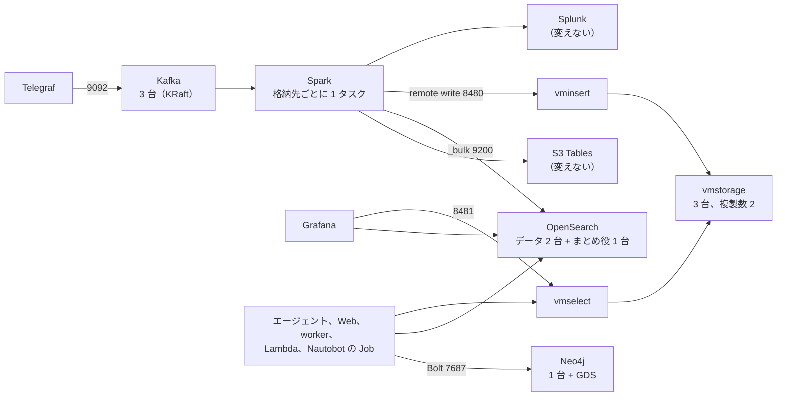

# Cycle 005 oss-on-ecs 設計: マネージドを OSS に置き換えた環境を作る

main(fable-5.1) / effort: high

## 背景

- いまの構成は、できる限り AWS のマネージドサービスで作っている。方針（[docs/oss-variant.md](../../oss-variant.md)）は「マネージドの部分を OSS に置き換えた版も、並べて持つ」。
- 目的は、同じ用途でマネージドと OSS を並べて、できること、費用、メンテナンスの手間を比べること。
- OSS にするのは次の 5 つだけ。ほか（AgentCore、Bedrock、S3 Tables、Firehose、Athena、RDS、SNS、SQS、Lambda、Splunk）は変えない。
- 5 つ以外の道具は、商用で使えるライセンスなら OSS でなくてよい（2026-10-04 のユーザーの決定）。
- 実装を始めるのは、「修復案を S3 Tables にまとめる（003）」と「Splunk をクラスターにする（004）」が main に入り、マネージド版の AWS での動作確認が終わってから。

## 設計方針

### 合意した決定（経緯は design-log.md の Round 0）

| いま（マネージド） | 置き換え先 | 構成 | データの置き場 | 認証 |
|---|---|---|---|---|
| MSK | Apache Kafka（KRaft） | 3 台。どの台も broker と controller を兼ねる | EFS | セキュリティグループだけ |
| EMR Serverless | Apache Spark | 1 コンテナ（ジョブごとに 1 タスク） | なし（checkpoint は S3） | タスクロール |
| OpenSearch Serverless | OpenSearch | データを持つ 2 台（レプリカ 1）と、まとめ役（cluster manager）だけの小さい 1 台 | データの 2 台は EFS。まとめ役はタスクの一時領域 | パスワード（SSM の SecureString） |
| Amazon Managed Service for Prometheus | VictoriaMetrics（クラスター） | vminsert 1、vmselect 1、vmstorage 3、複製数 2 | EFS | セキュリティグループだけ |
| Neptune Analytics | Neo4j Community Edition | 1 台 | タスクの一時領域 | パスワード（SSM の SecureString） |

1. 動かす場所は ECS の Fargate。
2. 置き方は、`oss/` に terraform と ops を持ち、アプリのコードは共用にして接続先を環境変数で切り替える。
3. マネージド版と同じアカウントに並べて立てられる。接頭辞は `<owner>-nwc-oss`（マネージド版は `<owner>-nwc-poc`）。
4. グラフのアルゴリズムは GDS（Neo4j のプラグイン）を第一の案にする。Neo4j Community Edition の上で動かなければ NetworkX にする。
5. VictoriaLogs は、ログの置き場の候補として残す。OpenSearch が Fargate で動かないと分かったら切り替える（下の「VictoriaLogs への切り替え」）。
6. ナレッジベース用の OpenSearch Serverless のコレクションは、Bedrock が使うので変えない。
7. 実装はエンジニアセッションに頼む。docs はこちらで書く。

### Neo4j のクラスターについての注意書き（docs にも同じ文を入れる）

- クラスターは Neo4j Enterprise Edition だけの機能で、Community Edition では組めない。
- だから OSS 版の中で、Neo4j だけは 1 台で動く。
- 止まっているあいだは、トポロジの表示、status の更新、エージェントのトポロジの検索ができない。
- データは Nautobot と lab の定義から同期し直せる（`ops/sync-graph.sh`）。タスクが入れ替わるとデータは消えるので、起こし直したあとに同期をかける。
- NFS（EFS）は Neo4j が非対応と明記しているので、データは EFS に置かない。

### 構成



| サービス | タスクの数 | image（ECR に写す） | ポート | Cloud Map の名前 |
|---|---|---|---|---|
| Kafka | 3（AZ ごとに 1） | `apache/kafka:4.3.1` | 9092（クライアント）、9093（controller） | `kafka-1`、`kafka-2`、`kafka-3` |
| Spark | 格納先の数（いまのジョブと同じ分け方） | `apache/spark:3.5.9` に jar とスクリプトを足して自前でビルド | なし | なし |
| OpenSearch | 3（AZ ごとに 1）。データ 2、まとめ役だけ 1 | `opensearchproject/opensearch:3.9.0` | 9200、9300（ノード間） | `opensearch-1`、`opensearch-2`（データ）、`opensearch-cm`（まとめ役）と、データの 2 台をまとめた `opensearch` |
| vminsert | 1 | `victoriametrics/vminsert:v1.153.0-cluster` | 8480 | `vminsert` |
| vmselect | 1 | `victoriametrics/vmselect:v1.153.0-cluster` | 8481 | `vmselect` |
| vmstorage | 3（AZ ごとに 1） | `victoriametrics/vmstorage:v1.153.0-cluster` | 8400、8401、8482 | `vmstorage-1`〜`3` |
| Neo4j | 1 | `neo4j:2026.09.0-community` に GDS の jar を足して自前でビルド | 7687（Bolt）、7474 | `neo4j` |

- **台ごとに ECS のサービスを分ける（Kafka、OpenSearch、vmstorage）。**
  どの台も「自分の番号」と「自分の EFS のアクセスポイント」を持つ。1 つのサービスで 3 タスクにすると、番号と置き場をタスクごとに固定できない。
- **OpenSearch は、データ 2 台とまとめ役 1 台に分ける（2026-10-04 のユーザーの決定）。**
  レプリカ 1 なら、データを持つ台は 2 台で足りる。まとめ役の選挙には過半数の票が要り、2 台では 1 台止まると選べない。3 台目は票のためだけに置くので、データを持たない小さいタスクにする（EFS も要らない）。データの台が 1 台止まっているあいだは、複製が無い。
- **3 台のものは AZ をまたいで置く。**
  2 つ目と 3 つ目の AZ のサブネットは `feat/az-num` が入れる。EFS のマウントターゲットも 3 つの AZ に作る。
- **Spark のバージョンは 3.5 系。**
  EMR 7.13.0 が Spark 3.5.6 で、S3 Tables のカタログの AWS 公式の例も Spark 3.5。Spark 4.2 用の Iceberg のランタイムは無い。
- **GDS の jar はイメージに焼き込む。**
  閉域なので、起動時のダウンロード（`NEO4J_PLUGINS`）は使えない。設定に `dbms.security.procedures.unrestricted=gds.*` を入れる。

### クラスターの設定（公式ドキュメントで確かめた形）

| 対象 | 設定 | 値 |
|---|---|---|
| Kafka | `process.roles` | `broker,controller` |
| Kafka | `node.id` | 1、2、3 |
| Kafka | `controller.quorum.bootstrap.servers` | 3 台の `kafka-N.<名前空間>:9093` |
| Kafka | トピックと内部トピックの複製数 | 3（`min.insync.replicas` は 2） |
| Kafka | `CLUSTER_ID` | 3 台で同じ値（`ops/up.sh` が 1 回だけ作って SSM に置く） |
| OpenSearch | `discovery.seed_hosts` | 3 台の名前 |
| OpenSearch | `cluster.initial_cluster_manager_nodes` | 3 台のノード名 |
| OpenSearch | `node.roles` | データの 2 台は既定（全部の役）。まとめ役の 1 台は `cluster_manager` だけ |
| OpenSearch | index のレプリカ | 1 |
| OpenSearch | `node.store.allow_mmap` | `false`（Fargate は `vm.max_map_count` を変えられないため。未確認） |
| vminsert | `-storageNode`、`-replicationFactor` | 3 台の `vmstorage-N:8400`、2 |
| vmselect | `-storageNode`、`-replicationFactor`、`-dedup.minScrapeInterval` | 3 台の `vmstorage-N:8401`、2、`1ms` |

### 置き方（`oss/`）

```
oss/
  terraform/      マネージド版と同じルートの並び。state は別
    base/ pipeline/lab pipeline/nautobot agent workflow   中身は terraform/ の同じファイルへのシンボリックリンク
    pipeline/stream      Telegraf は同じ。MSK を Kafka（ECS）に替える
    pipeline/analytics   EMR、OpenSearch Serverless、AMP を ECS のサービスに替える。EFS もここ
    pipeline/graph       Neptune Analytics を Neo4j（ECS）に替える
  ops/up.sh  ops/down.sh   OSS 版の作る・消す
```

- **変えないルートは、ファイルをシンボリックリンクにする。**
  ディレクトリは実体なので、state（`terraform.tfstate`）はマネージド版と別になる。中身は 1 つなので、片方だけ直し忘れることが無い。
- **接頭辞は変数で切り替える。**
  `locals.tf` の接頭辞の末尾（`nwc-poc`）を変数にし、OSS 版は `nwc-oss` を渡す。
- **変えないルートが Neptune、MSK、AMP などの output を読んでいる箇所は、同じ名前の output を OSS 版のルートが出す。**
  たとえば `pipeline/nautobot` は `graph` の `graph_id` を読む。OSS 版の `graph` は Neo4j の接続先を別の名前の output で出し、読む側は「あるほうを使う」。
- **`ops/` の共通の関数（`deploy-env.sh`、`lab-common.sh`、`ensure_secret` など）は、`oss/ops/` から読み込んで使う。**
  `up.sh` の本体は別に書く（EMR の API を呼ぶ箇所が 10 か所ほどあり、分岐で埋めると読めなくなる）。

### アプリのコードの切り替え

環境変数で接続先を選ぶ。環境変数が無ければ、いまのマネージドの動きのまま。

| 場所 | いま | OSS 版 | 切り替える環境変数 |
|---|---|---|---|
| `telegraf/telegraf.conf.in` の `outputs.kafka` 5 個 | TLS と `AWS-MSK-IAM` | TLS なし、SASL なし | テンプレートの置き換え（`telegraf.sh`） |
| `spark/snmp_sinks.py` の Kafka の読み取り | SASL_SSL と IAM | PLAINTEXT | `KAFKA_AUTH=none` |
| 同 OpenSearch への書き込み | SigV4（aoss）、`_id` なし | Basic 認証 | `OPENSEARCH_AUTH=basic` |
| 同 Prometheus への書き込み | SigV4（aps）の remote write | 署名なしで vminsert の `/insert/0/prometheus/api/v1/write` へ | `PROMETHEUS_AUTH=none` |
| 同 起動のしかた | EMR Serverless の STREAMING ジョブ | ECS のタスクで `spark-submit --master local[*]` | なし（起動する側が違う） |
| `agent/evidence.py` の `search_logs`、`query_metrics` | SigV4 | Basic 認証、署名なしで vmselect の `/select/0/prometheus/api/v1/query` へ | 上と同じ 2 つ |
| `agent/graph.py` の `query()` と、同じ呼び方の `workflow/awsio.py`、`graph/status_handler.py` | boto3 の `neptune-graph` | Neo4j の Python ドライバ（Bolt） | `GRAPH_BACKEND=neo4j`、`NEO4J_URI` |
| `agent/graph.py` の `centrality()` | `neptune.algo.*` | `gds.degree`、`gds.closeness`、`gds.wcc`（先にグラフをメモリに写す） | `GRAPH_BACKEND` |
| Grafana のデータソース | `serverless: true` と SigV4、AMP のプラグイン | Basic 認証の OpenSearch、標準の Prometheus（宛先は vmselect） | provisioning のファイルを OSS 版用に別に置く |

- **頂点の id の持ち方。**
  Neptune は `~id` に文字列の id を入れ、`id(n)` で読んでいる。Neo4j の `id()` は整数で、消すと再利用される。OSS 版では id をプロパティ `id` に入れ、一意制約を付ける。`graph.py` の中で「id を読む式」と「id で作る式」を 1 か所にまとめ、バックエンドで出し分ける。
- **Neo4j のドライバを Lambda に入れる。**
  tools Lambda と graph-status Lambda は依存を足していない素の Python。`neo4j` のドライバを Lambda のレイヤーか zip に入れる。
- **Spark のジョブが落ちたとき。**
  EMR の STREAMING モードは落ちたジョブを起こし直す。ECS ではサービス（`desired_count = 1`）にして、タスクが終わったら ECS が起こし直す。

### VictoriaLogs への切り替え（候補として残す）

| 項目 | 中身 |
|---|---|
| 切り替える条件 | OpenSearch が Fargate の上で起動しない、または 3 台のクラスターが安定しない |
| 構成 | vlinsert 1、vlselect 1、vlstorage 2 以上（実行ファイルは 1 つで、フラグで役が決まる。ポートは 9428） |
| 書き込み | vlinsert の `/insert/elasticsearch/_bulk` が OpenSearch と同じ形で受ける。Spark は宛先と、`_time_field` などのパラメーターを変えるだけ |
| 書き直すもの | `agent/evidence.py` の `search_logs`（LogsQL にする）、Grafana のデータソース（プラグイン `victoriametrics-logs-datasource`）とダッシュボード |
| 弱いところ | 複製が無い。vlstorage が 1 台止まると検索は 502 を返す |

### 実物で確認したこと（推測ではない。確認日は 2026-10-04）

- リポジトリの中の、マネージドに固有の書き方の場所（`spark/snmp_sinks.py`、`agent/evidence.py`、`agent/graph.py`、`telegraf/telegraf.conf.in`、Grafana の provisioning、terraform）。
- terraform のルートは、相対パスの `terraform_remote_state` でお互いの state を読んでいる（例: `terraform/pipeline/nautobot/locals.tf`）。
- KRaft: controller は 3 台か 5 台、過半数が要る。combined は重要な環境には勧めない（https://kafka.apache.org/41/operations/kraft/）。
- VictoriaMetrics: 複製数 N には vmstorage が 2N−1 台。vmselect に `-dedup.minScrapeInterval=1ms`。EFS に置けると明記（https://docs.victoriametrics.com/victoriametrics/cluster-victoriametrics/）。
- OpenSearch: `discovery.seed_hosts` と `cluster.initial_cluster_manager_nodes`。2.12 以降は `OPENSEARCH_INITIAL_ADMIN_PASSWORD` が必須。
- Neo4j: クラスターは Enterprise だけ。NFS は非対応。GDS は、ライセンスのファイルが無ければ Community Edition として動く（CPU 4 コアまで、モデル 3 つまで）。Neo4j 2026.09.0 には GDS 2026.09。
- Fargate: `systemControls` で `vm.*` は変えられない。EFS は platform version 1.4.0 以上。

### 推測のまま残っていること（実装の最初に、手元のコンテナで確かめる）

| 推測 | 確かめ方 |
|---|---|
| OpenSearch 3.9.0 が `node.store.allow_mmap=false` で、`vm.max_map_count` を上げずに 3 台のクラスターになる | 手元で `vm.max_map_count` を既定のままにして起こす |
| まとめ役だけの台（`node.roles: [cluster_manager]`）を足すと、どの 1 台を止めても選挙ができる | 手元で 3 台を 1 台ずつ止める |
| GDS のプラグインが Neo4j Community Edition の上で動き、`gds.degree`、`gds.closeness`、`gds.wcc` が呼べる | 手元で lab のトポロジを入れて呼ぶ |
| GDS の結果が、Neptune の `neptune.algo.*` の結果と同じ並びになる | 同じトポロジで比べる（数値は一致しなくてよい。順位と島の数を見る） |
| `apache/spark:3.5.9` に iceberg-spark-runtime と s3-tables-catalog を足せば、S3 Tables に書ける | 手元からは AWS の認証が要る。AWS での確認に回す |
| `apache/kafka` のイメージで、3 台の combined が環境変数だけで組める | 手元で 3 台を起こし、1 台を止めて読み書きする |
| VictoriaMetrics が、時刻が前後したサンプル（Spark は ts で並べ替えて送っている）を受ける | 手元で古い時刻のサンプルを送る |

## 変更対象ファイル

| ファイル | 変更 |
|---|---|
| `oss/terraform/pipeline/stream/` | Kafka の 3 サービス、タスク定義、Cloud Map、EFS のアクセスポイント。Telegraf はいまと同じ |
| `oss/terraform/pipeline/analytics/` | EFS（ファイルシステム、3 つの AZ のマウントターゲット）、OpenSearch の 3 サービス（データ 2、まとめ役 1）、VictoriaMetrics の 5 サービス、Spark のサービス、Grafana（データソースが違う）、Splunk（いまと同じ） |
| `oss/terraform/pipeline/graph/` | Neo4j のサービス。status の Lambda はいまと同じコードで、環境変数が違う |
| `oss/terraform/` のほかのルート | `terraform/` の同じファイルへのシンボリックリンク |
| `terraform/` の各ルートの `locals.tf`、`variables.tf` | 接頭辞の末尾を変数にする（既定は `nwc-poc`）。Neptune、MSK、AMP の output を読む箇所を「あるほうを使う」にする |
| `terraform/base/core/security_groups.tf` | Kafka、OpenSearch、VictoriaMetrics、Neo4j、EFS（2049）の SG と通信の表 |
| `terraform/base/ecr/` | 写す image と自前でビルドする image のリポジトリ |
| `oss/ops/up.sh`、`oss/ops/down.sh` | OSS 版の作る・消す。image を写す、`CLUSTER_ID` とパスワードの SSM、サービスが HEALTHY になるのを待つ、Neo4j への同期 |
| `spark/snmp_sinks.py`、`agent/evidence.py`、`agent/graph.py`、`workflow/awsio.py`、`graph/status_handler.py` | 上の「アプリのコードの切り替え」 |
| `spark/Dockerfile`（新しい）、`neo4j/Dockerfile`（新しい） | Spark に jar とスクリプト、Neo4j に GDS の jar |
| `telegraf/telegraf.conf.in`、`telegraf/telegraf.sh` | `outputs.kafka` の認証の行をテンプレートで出し分ける |
| `grafana/provisioning/` | OSS 版用のデータソース |
| `tests/` | 下の「検証方法」 |
| docs（こちらで書く） | `docs/oss-variant.md`、`docs/deploy.md`、`docs/data-stores.md`、`docs/pipeline.md`、`README.md`、FAQ |

## 再利用するもの

- ECS のタスク定義の型（`terraform/pipeline/analytics/grafana.tf`。ARM64、Cloud Map、SSM のシークレット、実行ロール、閉域の Deny）。
- SG の通信の表の書き方（`security_groups.tf` の `{ from, to, protocol, port, why }`）。
- `ops/up.sh` の `ensure_secret`、`mirror_image`、`ecr_has`、`endpoints_for`、HEALTHY を待つ処理。
- `ops/sync-graph.sh` と `ops/seed_graph.py`（Neo4j に同じトポロジを入れる）。
- lab、Telegraf、Nautobot、Web、エージェント、worker のコードと terraform。

## 実装ステップ

1. **手元のコンテナ（docker compose）で 5 つを立てて、「推測のまま残っていること」を埋める。**
   ここで OpenSearch が駄目なら VictoriaLogs に切り替え、GDS が駄目なら NetworkX に切り替える。結果を報告してから次へ進む。
2. アプリのコードの切り替え（Spark、evidence、graph）とテスト。手元の compose に向けて通す。
3. `oss/terraform/` の骨組み（シンボリックリンク、接頭辞の変数、SG、ECR、EFS）。
4. Kafka と Telegraf。
5. OpenSearch、VictoriaMetrics、Spark、Grafana。
6. Neo4j と、それを使う側（Lambda、worker、Web、Nautobot の Job、エージェント）。
7. `oss/ops/up.sh` と `down.sh`、`ops/check.sh`。
8. docs（こちらで書く）。

## 検証方法

### 手元のコンテナ（実装者が実行する）

1. Kafka 3 台: トピックを複製数 3 で作り、1 台を止めても、書いた 1000 件が全部読める。
2. OpenSearch 3 台: `_cluster/health` が `green`、ノード数 3。データの台を 1 台止めると `yellow` になり、入れた 1000 件が全部検索できる。まとめ役だけの台を止めても `green` のまま検索できる。
3. VictoriaMetrics: vmstorage を 1 台止めても、入れた系列が全部読め、結果に `"isPartial":false` が返る。
4. Neo4j: `seed_graph.py` と同じトポロジを入れ、`centrality` が degree、closeness、component を返す。島の数は 1。
5. Spark: compose の Kafka から読み、OpenSearch と vminsert に書ける。

### テスト

- `GRAPH_BACKEND=neo4j` のとき、`graph.py` が出す Cypher に `neptune.algo` と `~id` が含まれない。環境変数が無いとき、いまと同じ Cypher が出る。
- `KAFKA_AUTH`、`OPENSEARCH_AUTH`、`PROMETHEUS_AUTH` が無いとき、いまと同じ（SigV4 と IAM）になる。
- `oss/terraform/` の変えないルートのファイルが、全部シンボリックリンクである。
- `oss/terraform/` の 3 つのルートに `aws_msk`、`aws_emrserverless`、`aws_prometheus`、`aws_neptunegraph`、ログ用の `aws_opensearchserverless` のリソースが無い。
- `ops/check.sh` が通る（いまの項目が減らない）。

### AWS（`oss/ops/up.sh` で行う。このサイクルの完了の条件）

1. マネージド版を立てたまま、OSS 版が立つ（名前がぶつからない）。
2. lab のメトリクスが Grafana に出る。trap が OpenSearch に入る。S3 Tables に行が増える。
3. lab でリンクを落とすと、アラートが出て、Neo4j の status が変わり、Web のトポロジに出る。
4. エージェントのツール `centrality`、`search_logs`、`query_metrics` が答えを返す。
5. Kafka、OpenSearch、vmstorage のタスクを 1 つずつ止めても、2 と 3 が続く。
6. Neo4j のタスクを止めると 3 が止まり、起こし直して同期をかけると戻る（注意書きのとおりになること）。
7. `oss/ops/down.sh` のあと、接頭辞 `<owner>-nwc-oss` のリソースが残っていない。確認が終わったらすぐ消す。

## 費用

- Fargate のタスクが、置き換えの分だけで 13 個（Kafka 3、OpenSearch 3、VictoriaMetrics 5、Neo4j 1、Spark は格納先の数）増える。
- マネージド版と並べて立てると、VPC エンドポイント、lab、Nautobot、Web なども 2 つ分になる。
- EFS は Standard で $0.36 / GB 月。PoC のデータ量では小さい。
- 時間あたりの合計は、タスクの大きさ（vCPU とメモリ）を手元の確認で決めてから出す。マネージド版（MSK、EMR、AMP、OpenSearch Serverless、Neptune Analytics）の時間課金との比べは、このサイクルの成果物として `docs/oss-variant.md` に書く。

## 未確定事項とリスク

1. **OpenSearch が Fargate で動くか（いちばん大きい）。**
   `vm.max_map_count` を変えられない。`node.store.allow_mmap=false` で動くという公式の記述は無い。駄目なら VictoriaLogs に切り替える（読む側の書き直しが増える）。
2. **Kafka と OpenSearch を EFS に置いてよいか。**
   公式ドキュメントに記述が見つからない。遅さや、ロックの不具合が出るかもしれない。出たら、その 2 つだけタスクの一時領域に戻す（複製があるので、1 台が入れ替わっても残りから戻る）。
3. **GDS のライセンス。**
   Neo4j が配る jar の商用利用の条件は、本文をまだ読めていない。PoC では使い、本番の前に確かめる。OpenGDS（ソースからのビルド）は GPLv3。
4. **GDS が Community Edition で動くか。**
   Docker の手順からの推定。動かなければ NetworkX（エージェントの中で計算）にする。
5. **Spark が EMR なしで S3 Tables に書けるか。**
   EMR が暗黙に足している設定の全体は分かっていない。AWS での確認まで分からない。
6. **シンボリックリンクの terraform。**
   変えないルートが、変えるルートの output（`graph_id` など）や IAM（`neptune-graph` の許可）を参照している。「あるほうを使う」の分岐が多くなるなら、そのルートは複製に切り替える。
7. **Kafka の入れ替え。**
   3 台の combined を同時に入れ替えると過半数が無くなる。サービスを台ごとに分けるので、デプロイは 1 台ずつ待って進める。
8. **Lambda から Neo4j へ。**
   ドライバを入れる方法（レイヤーか zip）と、接続の張り直し（Lambda は実行のたびに使い回す）を実装で決める。
9. **AZ の数。**
   3 台のものは 3 つの AZ を前提にしている。`feat/az-num` が main に入っていることが要る。
10. **並べて立てたときの上限。**
    VPC、エンドポイント、Fargate の vCPU の上限に当たるかもしれない。AWS での確認の前に Service Quotas を見る。

<!-- artifact: /Users/eight/Documents/repo/artifacts/nwc-poc/20261004-cycle-005-oss-on-ecs-design.html -->
