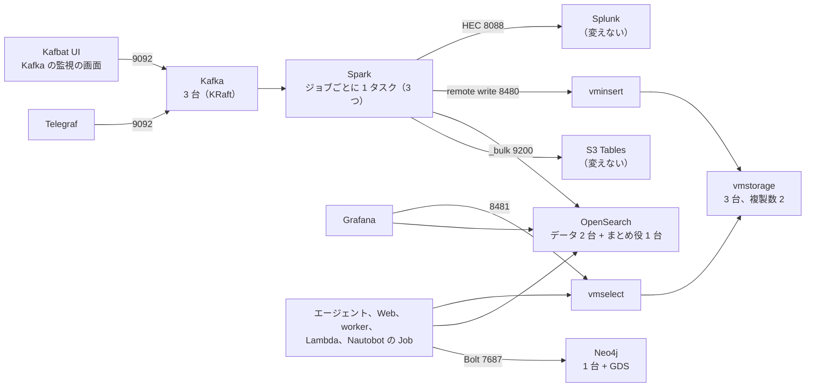

# Cycle 005 oss-on-ecs 設計: マネージドを OSS に置き換えた環境を作る

main(fable-5.1) / effort: high

この文書は現行の設計だけを書く。変えた経緯は [design-log.md](design-log.md)。

## 背景

- いまの構成は、できる限り AWS のマネージドサービスで作っている。方針（[docs/oss-variant.md](../../oss-variant.md)）は「マネージドの部分を OSS に置き換えた版も、並べて持つ」。
- 目的は、同じ用途でマネージドと OSS を並べて、できること、費用、メンテナンスの手間を比べること。
- OSS にするのは次の 5 つだけ。ほか（AgentCore、Bedrock、S3 Tables、Firehose、Athena、RDS、SNS、SQS、Lambda、Splunk）は変えない。
- 5 つ以外の道具は、商用で使えるライセンスなら OSS でなくてよい（2026-10-04 のユーザーの決定）。
- 手元のコンテナ（`oss/compose/`）での確認は済んだ。AWS では 2026-10-07 に 1 回立てて、下の「AWS」の検証を通した（結果は「AWS で確かめたこと」。立てたのは OSS 版だけで、マネージド版と並べてはいない）。

## 設計方針

### 合意した決定（経緯は design-log.md）

| いま（マネージド） | 置き換え先 | 構成 | データの置き場 | 認証 |
|---|---|---|---|---|
| MSK | Apache Kafka（KRaft） | 3 台。どの台も broker と controller を兼ねる | EFS | セキュリティグループだけ |
| EMR Serverless | Apache Spark | 1 コンテナ（ジョブごとに 1 タスク。ジョブは 3 つ） | なし（checkpoint は S3） | タスクロール |
| OpenSearch Serverless | OpenSearch | データを持つ 2 台（レプリカ 1）と、まとめ役（cluster manager）だけの小さい 1 台 | 3 台ともタスクの一時領域 | パスワード（SSM の SecureString） |
| Amazon Managed Service for Prometheus | VictoriaMetrics（クラスター） | vminsert 1、vmselect 1、vmstorage 3、複製数 2 | EFS | セキュリティグループだけ |
| Neptune Analytics | Neo4j Community Edition | 1 台 | タスクの一時領域 | パスワード（SSM の SecureString） |

1. 動かす場所は ECS の Fargate。
2. 置き方は、`oss/` に terraform と ops を持ち、アプリのコードは共用にして接続先を環境変数で切り替える。
3. マネージド版と同じアカウントに並べて立てられる。接頭辞は `<owner>-nwc-oss`（マネージド版は `<owner>-nwc-poc`）。
4. グラフのアルゴリズムは GDS（Neo4j のプラグイン）で計算する。Community Edition の上で動くことは手元で確かめた。
5. VictoriaLogs は、ログの置き場の候補として残す。OpenSearch が Fargate で動かないと分かったら切り替える（下の「VictoriaLogs への切り替え」）。
6. ナレッジベース用の OpenSearch Serverless のコレクションは、Bedrock が使うので変えない。
7. Splunk は OSS 版でも変えない。マネージド版と同じ Splunk を立て、Spark から同じ HEC に書く。
8. 実装はエンジニアセッションに頼む。docs はこちらで書く。

### データの置き場の決め方

| OSS | 置き場 | 理由 |
|---|---|---|
| Kafka | EFS | タスクが入れ替わってもログを残す。Kafka の公式の文書に NFS / EFS の記述は無い。AWS で 1 時間ほど流して、1 台止めて戻すまで遅さやロックの不具合は出なかった（長く流したときは未確認） |
| VictoriaMetrics（vmstorage） | EFS | 公式の文書が「Amazon EFS などの NFS に置ける」と書いている |
| OpenSearch | タスクの一時領域 | 公式の文書がネットワークファイルシステムを避けるよう書いている |
| Neo4j | タスクの一時領域 | 公式の文書が NFS を非対応と書いている |

- **OpenSearch は、データの 2 台が同時に落ちるとデータが消える。**
  1 台が入れ替わったときは、もう 1 台のレプリカから戻る。2 台が同時に落ちると戻す元が無い。ログの正本は S3 Tables にあるので、OpenSearch の分は検索用の写しとして扱う。
- **Neo4j は、タスクが入れ替わるとグラフが空に戻る。**
  Nautobot と lab の定義から同期し直す（`ops/sync-graph.sh --oss`）。

### Neo4j のクラスターについての注意書き（docs にも同じ文を入れる）

- クラスターは Neo4j Enterprise Edition だけの機能で、Community Edition では組めない。
- だから OSS 版の中で、Neo4j だけは 1 台で動く。
- 止まっているあいだは、トポロジの表示、status の更新、エージェントのトポロジの検索ができない。
- データは Nautobot と lab の定義から同期し直せる（`ops/sync-graph.sh --oss`。`--oss` が接頭辞 `<owner>-nwc-oss` と `oss/terraform/` の state を選ぶ）。タスクが入れ替わるとデータは消えるので、起こし直したあとに同期をかける。
- NFS（EFS）は Neo4j が非対応と明記しているので、データは EFS に置かない。

### GDS のライセンス（法的な助言ではない）

結論: PoC でも、自社の ECS で動かすだけなら使ってよい、と読んでいる。本番で使う前に、法務か契約の担当に確かめる。

- **Neo4j が配る GDS の jar は GPLv3。**
  jar の中の `NOTICE.txt` と `LICENSE.txt` で確かめた。https://neo4j.com/licensing/ も Community Edition を GPL v3 としている。
- **GPLv3 は、商用利用そのものを制限しない。**
  義務が生じるのは、イメージを第三者に配るとき。
- **自社の ECS と private の ECR で動かすだけなら、配布に当たらない、という読み。**
  イメージを社外に渡す形にするなら、読み直す。
- **Community 版の GDS の制限は、並列 4 コアまで、モデル 3 つまで。**
  出典は https://neo4j.com/docs/graph-data-science/current/introduction/ 。

### 構成



| サービス | タスクの数 | image（ECR に写す） | ポート | Cloud Map の名前 |
|---|---|---|---|---|
| Kafka | 3（AZ ごとに 1） | `apache/kafka:4.3.1` | 9092（クライアント）、9093（controller） | `kafka-1`、`kafka-2`、`kafka-3` |
| Kafbat UI | 1 | `ghcr.io/kafbat/kafka-ui:v1.5.0` | 8080 | `kafka-ui` |
| Spark | 3（ジョブごとに 1。下の「Spark のジョブ」） | `apache/spark:3.5.9` に jar と `snmp_sinks.py` を足して自前でビルド（`spark/Dockerfile`） | なし | なし |
| OpenSearch | 3（AZ ごとに 1）。データ 2、まとめ役だけ 1 | `opensearchproject/opensearch:3.9.0` | 9200、9300（ノード間） | `opensearch`（データの 2 台がどちらも入る）、`opensearch-cm`（まとめ役） |
| vminsert | 1 | `victoriametrics/vminsert:v1.153.0-cluster` | 8480 | `vminsert` |
| vmselect | 1 | `victoriametrics/vmselect:v1.153.0-cluster` | 8481 | `vmselect` |
| vmstorage | 3（AZ ごとに 1） | `victoriametrics/vmstorage:v1.153.0-cluster` | 8400、8401、8482 | `vmstorage-1`〜`3` |
| Neo4j | 1 | `neo4j:2026.09.0-community` の中の GDS の jar を `plugins/` に写して自前でビルド（`neo4j/Dockerfile`） | 7687（Bolt）、7474 | `neo4j` |

- **イメージの版は 1 か所に持つ。**
  `oss/ops/oss-images.sh` に書く。正は `oss/compose/`（手元で起こして確かめた版）で、`tests/test_oss_ops.py` が両方の一致を見る。
- **台ごとに ECS のサービスを分ける（Kafka、OpenSearch、vmstorage）。**
  どの台も「自分の番号か名前」を持つ。Kafka と vmstorage は「自分の EFS のアクセスポイント」も持つ。1 つのサービスで 3 タスクにすると、番号と置き場をタスクごとに固定できない。
- **OpenSearch のデータの台には、台ごとの Cloud Map の名前を作らない。**
  ECS のサービスは Cloud Map のサービスを 1 つしか持てない。データの 2 台は同じ名前 `opensearch` に入り、クライアントはここに 9200 で来る。
- **Kafka の監視の画面に Kafbat UI を置く（2026-10-05 のユーザーの決定）。**
  ブローカー、トピック、メッセージの中身、コンシューマーの遅れ（lag）を画面で見る。ライセンスは Apache 2.0（公式のリポジトリで確認）。MSK のコンソールと CloudWatch の代わりになる。
  - タスク定義はマネージド版と同じもの（`terraform/pipeline/stream/kafka_ui.tf` へのリンク）。違いは Kafka へのつなぎ方だけで、OSS 版は PLAINTEXT（`oss.auto.tfvars` の `kafka_ui_security_protocol`）。
  - 画面から変えられる（`KAFKA_CLUSTERS_0_READONLY` は既定の false のまま。2026-10-05 のユーザーの決定）。パイプラインが使う 5 つのトピックを画面で消したり変えたりすると、パイプラインが止まるか、次の up.sh とずれる（止める仕組みは入れない。ログインで守る）。
  - ログインを付ける。パスワードは `oss/ops/up.sh` が SSM の SecureString に作る。
  - 開き方は、Web の EC2 を踏み台にした SSM のポートフォワード。LB は置かない。
  - 時系列のグラフとアラートは持たない。それが要るなら、Kafka の JMX のメトリクスを VictoriaMetrics に入れて Grafana で見る（このサイクルではやらない）。
- **OpenSearch は、データ 2 台とまとめ役 1 台に分ける（2026-10-04 のユーザーの決定）。**
  レプリカ 1 なら、データを持つ台は 2 台で足りる。まとめ役の選挙には過半数の票が要り、2 台では 1 台止まると選べない。3 台目は票のためだけに置くので、データを持たない小さいタスクにする。データの台が 1 台止まっているあいだは、複製が無い。
- **OpenSearch の REST（9200）は TLS なしの HTTP、台どうし（9300）はデモの証明書の TLS。**
  Spark と Grafana のデータソースに、自己署名の証明書を飛ばす設定が無いため。Basic 認証（admin）は効く。届く相手は SG で絞る。
- **3 台のものは AZ をまたいで置く。**
  サブネット a / b / c に 1 台ずつ。EFS のマウントターゲットも 3 つの AZ に作る。
- **Spark のバージョンは 3.5 系。**
  EMR 7.13.0 が Spark 3.5.6 で、S3 Tables のカタログの AWS 公式の例も Spark 3.5。Spark 4.2 用の Iceberg のランタイムは無い。
- **jar はイメージに焼き込む（Spark、Neo4j）。**
  閉域なので、起動時のダウンロード（Spark の `--packages`、Neo4j の `NEO4J_PLUGINS`）は使えない。GDS の jar は公式イメージの `products/` に入っているので、`plugins/` に写すだけでよい。設定に `dbms.security.procedures.unrestricted=gds.*` を入れる。

### Spark のジョブ

格納先は iceberg、opensearch、prometheus、splunk の 4 つ。ジョブ（ECS のサービス）は 3 つで、分け方はマネージド版の EMR Serverless のジョブと同じ。

| ジョブ | 格納先 | 書き方 |
|---|---|---|
| `iceberg` | S3 Tables | Iceberg のカタログ（S3 Tables） |
| `splunk` | Splunk | HEC に、自己署名の TLS で POST（マネージド版と同じ） |
| `http` | OpenSearch と VictoriaMetrics | `_bulk` に Basic 認証、vminsert に署名なしの remote write |

- **起動は `spark-submit --master local[*]`。**
  driver も executor も 1 つの JVM。タスクが終わったら、ECS のサービス（`desired_count = 1`）が起こし直す（EMR の STREAMING モードの代わり）。
- **checkpoint は S3A（`s3a://`）で書く。**
  EMR の `s3://` は EMRFS で、素の Spark には無い。パスに EFS の ID を入れてあり、Kafka のデータ（EFS）が作り直されたら checkpoint も新しくなる。
- **Splunk の token は、ECS の secrets で環境変数 `SPLUNK_HEC_TOKEN` に受ける。**
  元は SSM の SecureString で、Splunk のタスクが HEC の token を作るのと同じパラメータ。マネージド版は、ジョブが起動時に SSM から読む。値は Terraform も state もタスク定義も持たない。
- **Splunk が起きる前は、`splunk` のタスクが落ちて起こし直される。**
  HEC への POST が再試行のあとに失敗してタスクが終わり、サービスが起こし直す。checkpoint の続きから読む。

### クラスターの設定

| 対象 | 設定 | 値 |
|---|---|---|
| Kafka | `process.roles` | `broker,controller` |
| Kafka | `node.id` | 1、2、3 |
| Kafka | `controller.quorum.voters`（固定の voter） | `1@kafka-1.<名前空間>:9093,2@…,3@…` |
| Kafka | トピックと内部トピックの複製数 | 3（`min.insync.replicas` は 2） |
| Kafka | `CLUSTER_ID` | 3 台で同じ値（`oss/ops/up.sh` が 1 回だけ作って SSM に置く） |
| OpenSearch | `discovery.seed_hosts` | `opensearch` と `opensearch-cm` の 2 つの名前 |
| OpenSearch | `cluster.initial_cluster_manager_nodes` | `opensearch-1,opensearch-2,opensearch-cm`（ノード名） |
| OpenSearch | `node.roles` | データの 2 台は既定（全部の役）。まとめ役の 1 台は `cluster_manager` だけ |
| OpenSearch | index のレプリカ | 1（OpenSearch の既定） |
| OpenSearch | `node.store.allow_mmap` | `false`（Fargate は `vm.max_map_count` を変えられないため。AWS で 3.9.0 の 3 台が起動し、green になった） |
| vminsert | `-storageNode`、`-replicationFactor` | 3 台の `vmstorage-N:8400`、2 |
| vminsert | 起動の順 | 待ちのコンテナ（`wait-vmstorage`）が、3 台の 8400 が開くまで vminsert を起こさない |
| vmselect | `-storageNode`、`-replicationFactor`、`-dedup.minScrapeInterval` | 3 台の `vmstorage-N:8401`、2、`1ms` |

- **Kafka は固定の voter（`controller.quorum.voters`）で組む。**
  動的な voter（`controller.quorum.bootstrap.servers`）は、公式イメージ `apache/kafka` が必要な初期化をしないので組めなかった（storage の format を `--standalone` も `--initial-controllers` も付けずに打つ）。
- **vmstorage が上がってから vminsert を起動する。**
  vminsert が vmstorage 3 台につなぐ前に書いた行は、1 台にしか入らない。その台を止めると、欠けたことを示さずに値が抜ける（vminsert は 204 を返し、vmselect も `isPartial` を立てない）。
  vmstorage の台が止まったままのときは、待つのは `vmstorage_wait_seconds`（既定 300 秒）まで。過ぎたら起こし、残りの 2 台に書く。
- **OpenSearch の `cluster.initial_cluster_manager_nodes` は、3 台そろって作り直されたときにも使う。**
  クラスターの状態もタスクの中にあるため。

### 置き方

```
oss/
  terraform/      マネージド版と同じルートの並び。state は別
    base/core base/ecr pipeline/lab pipeline/nautobot agent workflow
                         中身は terraform/ の同じファイルへのシンボリックリンク
    pipeline/stream      kafka.tf だけが実体（MSK の代わり）。Telegraf と Kafbat UI はリンク
    pipeline/analytics   spark.tf、opensearch.tf、victoriametrics.tf、network.tf、locals.tf、outputs.tf が実体。
                         Splunk、S3 Tables、アラートの履歴はリンク
    pipeline/graph       neo4j.tf、sync.tf、access.tf、outputs.tf が実体
  ops/up.sh  ops/down.sh   OSS 版の作る・消す
  ops/oss-images.sh        イメージの名前と版（1 か所）。ECR に写す・ビルドする関数
  compose/                 手元の確認用（compose.yaml と check-*.sh、check_*.py）
spark/Dockerfile           Spark のイメージ（ECS 向け）
neo4j/Dockerfile           Neo4j + GDS のイメージ（ECS 向け）。パスワードを渡す entrypoint.sh つき
ops/common.sh  ops/up-common.sh  ops/down-common.sh   マネージド版と OSS 版の共通の関数
```

- **変えないルートは、ファイルをシンボリックリンクにする。**
  ディレクトリは実体なので、state（`terraform.tfstate`）はマネージド版と別になる。中身は 1 つなので、片方だけ直し忘れることが無い。
- **接頭辞は変数 `project` で切り替える。**
  既定は `nwc-poc`。OSS 版はどのルートにも `oss.auto.tfvars`（`project = "nwc-oss"`）を置く。
- **OSS 版だけの SG、通信の表、EFS は `terraform/base/core/oss.tf` に置く。**
  `project` が `nwc-oss` のときだけ作る。マネージド版では何も作らない。EFS は 1 つのファイルシステムを Kafka と vmstorage で分けて使い、アクセスポイントはそれぞれのルートが作る。
- **変えないルートが読む output は、OSS 版のルートが同じ名前で出す。**
  マネージドにしか無いもの（OpenSearch Serverless のコレクション、AMP のワークスペースなど）は出さず、読む側は「空なら、その分の IAM を作らない」。
- **`ops/` の共通の関数は、`oss/ops/` から読み込んで使う。写しは作らない。**
  `ops/common.sh`、`ops/up-common.sh`、`ops/down-common.sh`、`ops/lab-common.sh`、`ops/deploy-env.sh`。`up.sh` の本体は別に書く。
- **OSS 版の SSM のパラメータは、タグ `ManagedBy=oss/ops/up.sh` で見分ける。**
  `oss/ops/down.sh` はこのタグのものだけ消す。マネージド版のパラメータには触らない。

### 実装の状態（2026-10-07 の main）

| 項目 | 状態 |
|---|---|
| `oss/ops/up.sh` が作るルート | マネージド版の `ops/up.sh` と同じ 9 つ。`base/ecr`、`base/core`、`agent`、`pipeline/lab`、`pipeline/stream`、`pipeline/graph`、`pipeline/nautobot`、`pipeline/analytics`、`workflow`（`oss/ops/down.sh` が逆順に消す） |
| Grafana | OSS 版の analytics の `grafana.tf`（実ファイル）にある。データソースは vmselect（署名なし）と自前の OpenSearch（Basic 認証）で、`grafana/start.sh` が `datasources-oss` を並べる。uid がマネージド版と同じなので、イメージ・ダッシュボード・アラートのルールはマネージド版と同じものを使う。アラートは同じ SNS のトピックへ出る。`oss/ops/up.sh` がイメージ、admin のパスワード、`create_grafana=true` を渡して作る |
| Web | EC2 に部品（Web の `.py` と `web/requirements-oss.txt` の wheel）を置き、`GRAPH_BACKEND=neo4j` で動く。手順書は Knowledge Base を作らないので置かない |
| Neo4j への同期 | `oss/ops/up.sh` の 7-3b が `ops/seed_graph.py` を Web の EC2 で打つ（空のときだけ）。入れ直しは `ops/sync-graph.sh --oss [--replace]` |
| エージェント | `agent` のイメージを Neo4j のドライバー入りでビルドし、`GRAPH_BACKEND=neo4j` で Neo4j を引く |
| Nautobot の Job から Neo4j | コードとテストまで済み（2026-10-08）。**AWS ではまだ確かめていない。** `terraform/pipeline/nautobot` は graph の state に `neo4j_uri` があれば、`NEPTUNE_GRAPH_ID` の代わりに `GRAPH_BACKEND=neo4j` と `NEO4J_URI` を渡す（worker と同じ読み方）。パスワードは ECS の secrets の `NEO4J_PASSWORD` で web と worker に渡し、実行ロールがそのパラメータを読む。`oss/ops/up.sh` は Nautobot のイメージを `nautobot/requirements-oss.txt`（Neo4j のドライバー入り）でビルドする。Job の名前は「Telegraf と Neptune に同期」のままで、OSS 版では Neo4j に書く。マネージド版のタスク定義とイメージの依存は変わらない |
| 格納先の選択 | `oss/ops/up.sh` は読まない。いつも iceberg、opensearch、prometheus、splunk の 4 つを `sinks` に渡す（マネージド版の `STORES` は読まない）。terraform の変数 `sinks` はマネージド版と共用なので、手で絞ればその分のジョブは作られない |

### アプリのコードの切り替え

環境変数で接続先を選ぶ。環境変数が無ければ、マネージドの動きのまま。

| 場所 | マネージド | OSS 版 | 切り替える環境変数 |
|---|---|---|---|
| `telegraf/telegraf.conf.in` の `outputs.kafka` 5 個 | TLS と `AWS-MSK-IAM` | TLS なし、SASL なし | `KAFKA_AUTH=none` |
| `spark/snmp_sinks.py` の Kafka の読み取り | SASL_SSL と IAM | PLAINTEXT | `KAFKA_AUTH=none` |
| 同 OpenSearch への書き込み | SigV4（aoss）、`_id` なし | Basic 認証 | `OPENSEARCH_AUTH=basic` |
| 同 Prometheus への書き込み | SigV4（aps）の remote write | 署名なしで vminsert の `/insert/0/prometheus/api/v1/write` へ | `PROMETHEUS_AUTH=none` |
| 同 Splunk の token | ジョブが SSM から読む（`--splunk-token-parameter`） | ECS の secrets が入れた環境変数を使う | `SPLUNK_HEC_TOKEN` |
| 同 起動のしかた | EMR Serverless の STREAMING ジョブ | ECS のタスクで `spark-submit --master local[*]` | なし（起動する側が違う） |
| `agent/evidence.py` の `search_logs`、`query_metrics` | SigV4 | Basic 認証、署名なしで vmselect の `/select/0/prometheus/api/v1/query` へ | `OPENSEARCH_AUTH`、`PROMETHEUS_AUTH` |
| `agent/graph.py` の `query()` と、同じ呼び方の `workflow/awsio.py`、`graph/status_handler.py` | boto3 の `neptune-graph` | Neo4j の Python ドライバ（Bolt） | `GRAPH_BACKEND=neo4j`、`NEO4J_URI` |
| `agent/graph.py` の `centrality()` | `neptune.algo.*` | `gds.degree`、`gds.closeness`、`gds.wcc`（先にグラフをメモリに写し、終わったら消す） | `GRAPH_BACKEND` |
| Grafana のデータソース（`grafana/start.sh`） | `serverless: true` と SigV4、AMP のプラグイン | Basic 認証の OpenSearch、標準の Prometheus（宛先は vmselect）。定義は `datasources-oss` | `OPENSEARCH_AUTH`、`PROMETHEUS_AUTH` |

- **頂点の id の持ち方。**
  Neptune は `~id` に文字列の id を入れ、`id(n)` で読んでいる。Neo4j の `id()` は整数で、消すと再利用される。OSS 版では id をプロパティ `id` に入れ、一意制約を付ける。制約は、アプリ（`agent/graph.py`）が最初のクエリの前に作る。
- **Neo4j のドライバは、Lambda のレイヤーで足す。**
  中身は `graph/requirements-oss.txt`。`oss/ops/up.sh` が apply の前に作る。
- **エージェントの道具の Lambda と AgentCore の Runtime も、OSS 版だけ接続先を切り替える。**
  道具の Lambda（`terraform/workflow/gateway.tf`）は、graph の state に `neo4j_uri` があれば `GRAPH_BACKEND=neo4j` と `NEO4J_URI` を受け、graph のルートが作ったドライバのレイヤー（output `neo4j_layer_arn`）を付ける。analytics の state に OpenSearch のパスワードの名前があれば `OPENSEARCH_AUTH=basic` と `PROMETHEUS_AUTH=none` を受ける。
  Runtime（`terraform/agent/runtime.tf`）は `var.project` が `nwc-oss` のとき同じ 3 つの切り替えを受ける。マネージド版の `ops/up.sh` は agent を graph と並べて apply する（graph の state を待たない）ので、state ではなく `var.project` で見分ける。Neo4j の URI は SSM の `neo4j-uri` から読む。ドライバは `agent/requirements-oss.txt`（イメージを `--build-arg REQUIREMENTS=requirements-oss.txt` でビルドする）。
  パスワードは環境変数に置かない。コードが SSM の `neo4j-password`、`opensearch-password` を読む。
  Runtime にはマネージド版と同じく OpenSearch と VictoriaMetrics の宛先を渡さない。ログとメトリクスは Gateway の先の道具の Lambda が読む。
- **Neo4j のパスワードは、`NEO4J_` で始まらない名前（`GRAPH_PASSWORD`）で渡す。**
  公式イメージは `NEO4J_` で始まる環境変数を設定のファイルに書き写す。パスワードがファイルに平文で残り、知らない設定として起動も止まる。`neo4j/entrypoint.sh` が `NEO4J_AUTH` に直してから公式の入口を呼ぶ。

### VictoriaLogs への切り替え（候補として残す）

| 項目 | 中身 |
|---|---|
| 切り替える条件 | OpenSearch が Fargate の上で起動しない、または 3 台のクラスターが安定しない |
| 構成 | vlinsert 1、vlselect 1、vlstorage 2 以上（実行ファイルは 1 つで、フラグで役が決まる。ポートは 9428） |
| 書き込み | vlinsert の `/insert/elasticsearch/_bulk` が OpenSearch と同じ形で受ける。Spark は宛先と、`_time_field` などのパラメーターを変えるだけ |
| 書き直すもの | `agent/evidence.py` の `search_logs`（LogsQL にする）、Grafana のデータソース（プラグイン `victoriametrics-logs-datasource`）とダッシュボード |
| 弱いところ | 複製が無い。vlstorage が 1 台止まると検索は 502 を返す |
| 確認の状態 | `oss/compose/compose.yaml` に profile `vlogs` を置いただけで、起こしていない（未確認）。OpenSearch が AWS で動いたので、切り替える条件は満たしていない |

### 手元のコンテナで確かめたこと（`oss/compose/`）

| 対象 | 確かめたこと | 手順 |
|---|---|---|
| Kafka | 固定の voter で 3 台が組めた。1 台止めても、書いた 1000 件を全部読めて、書けた | `check-kafka.sh` |
| OpenSearch | 3 台のどれを止めても検索できた。手元は `vm.max_map_count` が 262144 の環境だったので、Fargate と同じ条件ではない | `check-opensearch.sh` |
| VictoriaMetrics | vminsert が 3 台につないだあとに書いたデータは、1 台止めても全部読めた。つなぐ前に書いた行は 1 台にしか入らなかった | `check_vm.py` |
| Neo4j + GDS | Community Edition で GDS が動いた。中心性は定義どおりの値（素の Python での計算）と一致。島の数は 1 | `check_neo4j.py` |
| Spark | EMR なしの Spark 3.5 で、Kafka から OpenSearch、vminsert、Iceberg、Splunk（HEC）に書けた。Iceberg は手元のカタログで、S3 Tables ではない | `check-spark.sh` |

### 公式の文書で確かめたこと

- KRaft: controller は 3 台か 5 台、過半数が要る。combined は重要な環境には勧めない（https://kafka.apache.org/41/operations/kraft/）。NFS / EFS の記述は無い。
- VictoriaMetrics: 複製数 N には vmstorage が 2N−1 台。vmselect に `-dedup.minScrapeInterval=1ms`。EFS に置けると明記（https://docs.victoriametrics.com/victoriametrics/cluster-victoriametrics/）。
- OpenSearch: `discovery.seed_hosts` と `cluster.initial_cluster_manager_nodes`。2.12 以降は `OPENSEARCH_INITIAL_ADMIN_PASSWORD` が必須（強いパスワードでないと起きない）。ネットワークファイルシステムは避けるよう書いている。
- Neo4j: クラスターは Enterprise だけ。NFS は非対応。Neo4j 2026.09.0 には GDS 2026.09。
- GDS: 上の「GDS のライセンス」。
- Fargate: `systemControls` で `vm.*` は変えられない。EFS は platform version 1.4.0 以上。

### AWS で確かめたこと（2026-10-07、`oss/ops/up.sh` で 1 回立てた）

| 対象 | 確かめたこと |
|---|---|
| OpenSearch 3.9.0 | Fargate で `node.store.allow_mmap=false` の 3 台が起動し、green。まとめ役（1 GB、heap 512m）は 1 時間で exit 137 を出さなかった（止まったタスク 0） |
| Kafka（EFS） | 3 台が組めて、5 つのトピックに流れた。1 台止めても残り 2 台で受け続け（under-replicated 2）、戻ると 3 分以内に 0 に戻った。遅さやロックの不具合は出なかった |
| Spark → S3 Tables | EMR なしで `netops.raw_telemetry` に行が増えた（Athena で 1 時間に 115,719 行） |
| 道具の Lambda と Runtime | python3.13 のレイヤーで Neo4j のドライバを読み込めた。SSM のパスワードで Neo4j と OpenSearch に入り、vmselect を読めた（`centrality`、`search_logs`、`query_metrics` が答えを返した） |
| status の Lambda | Grafana と Splunk の両方の経路のアラートで Neo4j の status を変えた。`REPORT` の `Max Memory Used` は 111 MB / 128 MB（余裕が無い。下の「未確定事項とリスク」） |
| Kafbat UI | KRaft の 3 台とトピックを表示でき、API でトピックを作って消せた（画面は開いていない）。Spark の consumer group は出ない（Spark は group を作らずに offset を checkpoint に持つ） |
| Grafana | `datasources-oss` の `opensearch.yaml` の `version` 3.9.0 が、立てた OpenSearch と同じ。両方のデータソースの health が OK |

### 未確認のまま残っていること

| 未確認 | 確かめ方 |
|---|---|
| マネージド版と並べて立つ（名前がぶつからない） | 2 つを同時に立てる。Fargate の vCPU の上限（30）に OSS 版だけで 21.5 なので、上限を上げてから |
| GDS の結果が、Neptune の `neptune.algo.*` の結果と同じ並びになる | マネージド版と同時に立てて、同じトポロジを入れて比べる（順位と島の数を見る） |
| VictoriaMetrics が、時刻が前後したサンプルを受ける | 手順は `check_vm.py` にある。結果はこの文書に反映していない |
| Kafka を EFS に置いて、長く（日単位で）流したときの遅さやロック | 立てたまま置く（費用がかかるので、このサイクルではやらない） |

## 変更対象ファイル

| ファイル | 変更 |
|---|---|
| `oss/terraform/pipeline/stream/kafka.tf` | Kafka の 3 サービス、タスク定義、Cloud Map、EFS のアクセスポイント。Telegraf と Kafbat UI はマネージド版へのリンク |
| `oss/terraform/pipeline/analytics/` | Spark の 3 サービス（`spark.tf`）、OpenSearch の 3 サービス（`opensearch.tf`）、VictoriaMetrics の 5 サービスと vmstorage のアクセスポイント（`victoriametrics.tf`）。Splunk はマネージド版へのリンク |
| `oss/terraform/pipeline/graph/` | Neo4j のサービス（`neo4j.tf`）。status の Lambda は同じコードで、環境変数とレイヤーが違う（`sync.tf`） |
| `oss/terraform/` のほかのルート | `terraform/` の同じファイルへのシンボリックリンクと `oss.auto.tfvars` |
| `terraform/` の各ルートの `variables.tf`、`locals.tf` | 接頭辞の末尾を変数 `project` にする（既定は `nwc-poc`） |
| `terraform/base/core/oss.tf` | OSS 版だけの SG と通信の表（Kafka、OpenSearch、VictoriaMetrics、Neo4j、Spark、EFS の 2049）、EFS とマウントターゲット |
| `terraform/base/ecr/` | 写す image と自前でビルドする image のリポジトリ（kafka、opensearch、vmstorage、vminsert、vmselect、spark、neo4j） |
| `oss/ops/up.sh`、`oss/ops/down.sh`、`oss/ops/oss-images.sh` | OSS 版の作る・消す。image を写す、`CLUSTER_ID` とパスワードの SSM、サービスが安定するのを待つ |
| `ops/common.sh`、`ops/up-common.sh`、`ops/down-common.sh` | `ops/up.sh` と `ops/down.sh` から切り出した共通の関数 |
| `spark/snmp_sinks.py`、`agent/evidence.py`、`agent/graph.py`、`workflow/awsio.py`、`graph/status_handler.py` | 上の「アプリのコードの切り替え」 |
| `spark/Dockerfile`、`neo4j/Dockerfile`、`neo4j/entrypoint.sh` | Spark に jar とスクリプト、Neo4j に GDS の jar とパスワードの受け渡し |
| `telegraf/` | `outputs.kafka` の認証の行を `KAFKA_AUTH` で出し分ける |
| `grafana/provisioning/datasources-oss`、`grafana/start.sh` | OSS 版用のデータソース |
| `oss/compose/` | 手元の確認用の compose と確認の手順 |
| `tests/test_oss.py`、`tests/test_oss_ops.py` | 下の「検証方法」 |
| docs（こちらで書く） | `docs/oss-variant.md`、`docs/deploy.md`、`docs/data-stores.md`、`docs/pipeline.md`、`README.md`、FAQ |

## 再利用するもの

- ECS のタスク定義の型（`terraform/pipeline/analytics/grafana.tf`。ARM64、Cloud Map、SSM のシークレット、実行ロール、閉域の Deny）。
- SG の通信の表の書き方（`security_groups.tf` の `{ from, to, protocol, port, why }`）。
- `ops/` の共通の関数（`ensure_secret`、`mirror_image`、`ecr_has`、`dir_tag`、`tf_apply`、`destroy_root` など）。
- `ops/sync-graph.sh` と `ops/seed_graph.py`（Neo4j に同じトポロジを入れる）。
- lab、Telegraf、Kafbat UI、Splunk、Nautobot、Web、エージェント、worker のコードと terraform。

## 実装ステップ

1. 手元のコンテナ（docker compose）で 5 つを立てて、設計の「未確認」を埋める。（済み）
2. アプリのコードの切り替え（Spark、evidence、graph）とテスト。（済み）
3. `oss/terraform/` の骨組み（シンボリックリンク、接頭辞の変数、SG、ECR、EFS）。（済み）
4. Kafka と Telegraf。（済み）
5. OpenSearch、VictoriaMetrics、Spark、Grafana。（済み。Grafana も `oss/ops/up.sh` が作る）
6. Neo4j と status の Lambda。（済み）worker、Web、エージェントを `oss/ops/up.sh` につなぐ。（済み）Nautobot の Job を Neo4j につなぐ。（済み。2026-10-08 にコードとテストまで。AWS では未確認）
7. `oss/ops/up.sh` と `down.sh`、`ops/check.sh`。（済み。作るのは上の「実装の状態」の 9 ルート）
8. AWS での確認。（済み。2026-10-07 に 1 回。結果は「検証方法」の AWS の表と「AWS で確かめたこと」）
9. docs（こちらで書く）。

## 検証方法

### 手元のコンテナ（`oss/compose/`）

1. Kafka 3 台: トピックを複製数 3 で作り、1 台を止めても、書いた 1000 件が全部読める。Kafbat UI にブローカー 3 台、トピック、コンシューマーの lag が出る。
2. OpenSearch 3 台: `_cluster/health` が `green`、ノード数 3。1 台ずつ止めても、入れた 1000 件が全部検索できる。
3. VictoriaMetrics: vmstorage を 1 台止めても、入れた系列が全部読め、結果に `"isPartial":false` が返る。
4. Neo4j: `seed_graph.py` と同じトポロジを入れ、`centrality` と同じ 3 つ（degree、closeness、wcc）を GDS で出す。島の数は 1。
5. Spark: compose の Kafka から読み、OpenSearch、vminsert、Iceberg、Splunk に書ける。

### テスト

- `GRAPH_BACKEND=neo4j` のとき、`graph.py` が出す Cypher に `neptune.algo` と `~id` が含まれない。環境変数が無いとき、マネージド版と同じ Cypher が出る。
- `KAFKA_AUTH`、`OPENSEARCH_AUTH`、`PROMETHEUS_AUTH` が無いとき、マネージド版と同じ（SigV4 と IAM）になる。
- `oss/terraform/` の変えないルートのファイルが、全部シンボリックリンクである。
- `oss/terraform/` の 3 つのルートに `aws_msk`、`aws_emrserverless`、`aws_prometheus`、`aws_neptunegraph`、ログ用の `aws_opensearchserverless` のリソースが無い。
- `oss/ops/oss-images.sh` の版が、`oss/compose/` と Dockerfile の版と同じ。
- `ops/check.sh` が通る（`terraform/` と `oss/terraform/` の fmt と validate、スクリプトの構文、テスト）。

### AWS（`oss/ops/up.sh` で行う。このサイクルの完了の条件。2026-10-07 に 1 を除いて通った）

1. マネージド版を立てたまま、OSS 版が立つ（名前がぶつからない）。**未確認。** OSS 版だけで立てた（Fargate の vCPU の上限 30 に OSS 版が 21.5 で、2 つは入らない）。名前は接頭辞で分けてあり、ぶつかる作りではない。
2. lab のメトリクスが VictoriaMetrics に入り、Grafana に出る。trap が OpenSearch に入る。S3 Tables と Splunk に行が増える。**通った。** VictoriaMetrics に 6 台分 396 系列、OpenSearch に `snmp_trap` の文書、S3 Tables に 115,719 行、Splunk に 4 つの sourcetype。
3. lab でリンクを落とすと、アラートが出て、Neo4j の status が変わり、Web のトポロジに出る。**通った。** `fail-main` から 3 分以内に `link_down` / `isis_down` / `trap` が Alerting になり、Neo4j のインターフェース・リンク・IS-IS の隣接が DOWN、Web の画面が使う関数が同じ値を返した。`heal-main` で戻った。
4. エージェントのツール `centrality`、`search_logs`、`query_metrics` が答えを返す。**通った。** Runtime のログに 3 つの道具の呼び出しが出て、答えが障害の内容と合っていた。workflow もアラートからエージェントを呼んだ。
5. Kafka、OpenSearch、vmstorage のタスクを 1 つずつ止めても、2 と 3 が続く。Kafbat UI をポートフォワードで開くと、5 つのトピックと Spark のコンシューマーの lag が見える。画面から試しのトピックを 1 つ作って消せる。**通った（lag は見えない）。** 3 つを同時に 1 台ずつ止めても、Kafka は 2 台で受け、OpenSearch は yellow で検索でき、VictoriaMetrics の値は新しいまま。3 分で全部戻った。Kafbat UI は API で確かめ、トピックの作成と削除は 200。Spark は consumer group を作らないので、lag は Kafbat UI には出ない。
6. Neo4j のタスクを止めると 3 が止まり、起こし直して同期をかけると戻る（注意書きのとおりになること）。**通った。** 止めると `graph.query` は ServiceUnavailable、Web は静的データに落ちて 200 のまま。ECS が 1 分で起こし直し、グラフは空（0 台）。`ops/sync-graph.sh --oss` で 8 台 / 38 インターフェース / 12 リンクに戻り、`centrality` が答えた。
7. `oss/ops/down.sh` のあと、接頭辞 `<owner>-nwc-oss` のリソースが残っていない。確認が終わったらすぐ消す。**通った。** 結果は下の「down.sh のあと」。
8. 立てたあとに見る、机上では確かめられない点（**どれも見た**。結果は「AWS で確かめたこと」）:
   - OpenSearch の 2 つの ECS サービス（データとまとめ役）が 1 つの Cloud Map の名前 `opensearch` に入り、`discovery.seed_hosts` が両方を引く。
   - まとめ役（1 GB のタスク、heap 512m）が exit 137（OOM）で落ちない。
   - status の Lambda（128 MB、Neo4j のレイヤー付き）の `REPORT` の `Max Memory Used` に余裕がある（111 MB で、余裕は無かった）。
   - Grafana の `datasources-oss` の `opensearch.yaml` の `version` が、立てた OpenSearch の版と合っている（違うとクエリの文法で失敗する）。

3 の Nautobot の Job からの同期は、2026-10-07 の時点ではつないでいなかったので確かめていない（lab の定義からの同期で代えた）。2026-10-08 にコードをつないだので、次に AWS で立てるときに、Nautobot で機器を変えたあと Job が Neo4j の物理層と変更履歴を書くかを確かめる。

### down.sh のあと（2026-10-07 05:14Z に `OWNER=efukuda KEEP_ECR=1 oss/ops/down.sh` が rc 0 で終わった。その 10 分後に AWS CLI で名指しで見た）

| 見たもの | 結果 |
|---|---|
| 消えていたもの | ECS のクラスター 6 つとサービス、EC2（Web と lab の 2 台は `terminated`）、EFS、VPC エンドポイント、フローログ、EBS のボリューム、SSM のパラメータ 14 件、Lambda、SNS、SQS、S3 のバケット、S3 Tables のテーブルバケット、AgentCore の Runtime と Gateway、Cloud Map の名前空間 4 つ、ロググループ（ECS、Lambda、Runtime）、Athena のワークグループ、IAM のロール |
| 設計どおり残したもの | VPC `efukuda-nwc-oss-vpc`、サブネット 3 つ、SG `efukuda-nwc-oss-runtime`（ルールは 0）。AgentCore の Runtime の ENI（種類 `agentic_ai`。AWS 側の所有で自分では外せない）がまだ attached で、これが消えるまで VPC は消せない（最大 8 時間）。時間課金は無い。消し切るなら数時間おいて `oss/ops/down.sh` を打ち直す |
| 設計どおり残したもの（2） | ECR のリポジトリ 18 個（`KEEP_ECR=1`。翌日の `up.sh` でイメージの写しを飛ばすため。保管料は月数円） |
| 費用が無く、名前だけ残るもの | ECS のタスク定義 22 個が `INACTIVE`（terraform の destroy は登録解除まで。課金は無い） |
| 気をつけること | `resourcegroupstaggingapi` の `Project=efukuda-nwc-oss` の一覧は、消した直後は消えたもの（ECS のサービス、VPC エンドポイント、ボリューム、フローログ）も出す。`down.sh` の最後の「残っていないか」の一覧はこれを使っているので、名指しの describe で確かめ直した |

マネージド版の VPC `efukuda-nwc-poc-vpc`（`vpc-02ec7950cb98632a0`）は、このサイクルの前から残っているもので、OSS 版の検査では触っていない。

## 費用

- Fargate のタスクが、置き換えの分だけで 15 個（Kafka 3、OpenSearch 3、VictoriaMetrics 5、Neo4j 1、Spark 3）。Kafbat UI でもう 1 個。
- マネージド版と並べて立てると、VPC エンドポイント、lab、Web、Splunk なども 2 つ分になる。
- EFS は Standard で $0.36 / GB 月。PoC のデータ量では小さい。
- タスクの大きさの既定値（vCPU / メモリ）:

  | タスク | vCPU | メモリ |
  |---|---|---|
  | Kafka（1 台） | 1 | 2 GB |
  | OpenSearch のデータの台（1 台） | 1 | 4 GB（一時領域 30 GiB） |
  | OpenSearch のまとめ役 | 0.5 | 1 GB |
  | VictoriaMetrics（5 つとも） | 0.5 | 1 GB |
  | Spark（1 ジョブ） | 2 | 4 GB |
  | Neo4j | 1 | 4 GB |

- 時間あたりの合計と、マネージド版（MSK、EMR、AMP、OpenSearch Serverless、Neptune Analytics）の時間課金との比べは、AWS で立ててから `docs/oss-variant.md` に書く（まだ）。

## 未確定事項とリスク

1. **OpenSearch が Fargate で動くか（いちばん大きい）。**
   `vm.max_map_count` を変えられない。`node.store.allow_mmap=false` で動くという公式の記述は無い。手元は `vm.max_map_count` が 262144 だったので、確かめられていない。駄目なら VictoriaLogs に切り替える（読む側の書き直しが増える）。
2. **OpenSearch のデータは、2 台が同時に落ちると消える。**
   タスクの一時領域に置いているため。`terraform apply` でタスク定義が変わると、3 つのサービスが同時に入れ替わり、インデックスもクラスターの状態も消える。1 台ずつ入れ替える手順は、まだ無い。
3. **Kafka を EFS に置いてよいか。**
   公式の文書に記述が無い。AWS で 1 時間流して 1 台止めて戻すまでは不具合が出なかったが、長く流したときの遅さやロックは未確認。出たら、タスクの一時領域に戻す（複製があるので、1 台が入れ替わっても残りから戻る）。
4. **Kafka の入れ替え。**
   `terraform apply` でタスク定義が変わると、3 つのサービスが同時に入れ替わり、そのあいだ controller の過半数が無い（データは EFS に残るので戻る）。1 台ずつ入れ替える手順は、まだ無い。
5. **vminsert が vmstorage より先に受けると、値が抜ける。**
   待ちのコンテナで防いでいる。あとから vmstorage が 1 台だけ長く止まり、そのあいだに vminsert が起き直した場合は、残りの 2 台に書く（複製数 2 は保たれる）。AWS で立てたときは 6 台分の系列が全部入り、vmstorage を 1 台止めて戻しても値は抜けなかった。vminsert だけが起き直す場合は未確認。
6. **Spark が EMR なしで S3 Tables に書けるか。**
   AWS で書けた（1 時間で 115,719 行）。EMR が暗黙に足している設定の全体は分かっていないので、版を上げるときは見直す。
7. **GDS のライセンス。**
   上の「GDS のライセンス」の読みは、法的な助言ではない。イメージを社外に配る形にするなら、GPLv3 の義務が生じる。
8. **シンボリックリンクの terraform。**
   変えないルートが、変えるルートの output や IAM を参照している。「空なら作らない」の分岐が多くなるなら、そのルートは複製に切り替える。`agent`、`workflow`、`pipeline/nautobot` は `oss/ops/up.sh` から apply し、AWS で動いた。
9. **Lambda から Neo4j へ。**
   ドライバはレイヤーで入れた。AWS で、Grafana と Splunk の両方のアラートで status が変わり、Neo4j を止めて戻したあとも書けた。ただし status の Lambda は `Max Memory Used` が 111 MB / 128 MB で、ドライバの版を上げると足りなくなる（`terraform/pipeline/graph/sync.tf` の `memory_size`。マネージド版と共用なので、別のサイクルで上げる）。
10. **並べて立てたときの上限。**
    Fargate の vCPU の上限（30）に OSS 版だけで 21.5 なので、マネージド版と並べるには上限を上げる。並べたときの VPC とエンドポイントの上限は未確認。
11. **Neo4j の ECS のサービスに healthCheck が無い。**
    タスクの healthStatus が UNKNOWN のままで、`aws ecs wait services-stable` は RUNNING を見るだけ。Neo4j のプロセスが起きていて Bolt が開いていない時間は、ECS からは見えない（別のサイクルで足す）。
12. **エンドポイントが 1 つの AZ だけのとき。**
    `ENDPOINTS_AZ_NUM=1` でも動くが、その AZ が止まると、ほかの AZ の Kafka も ECR や CloudWatch Logs に届かない。

<!-- artifact: /Users/eight/Documents/repo/artifacts/nwc-poc/20261004-cycle-005-oss-on-ecs-design.html -->
