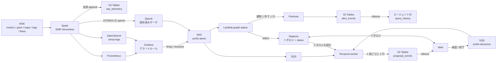
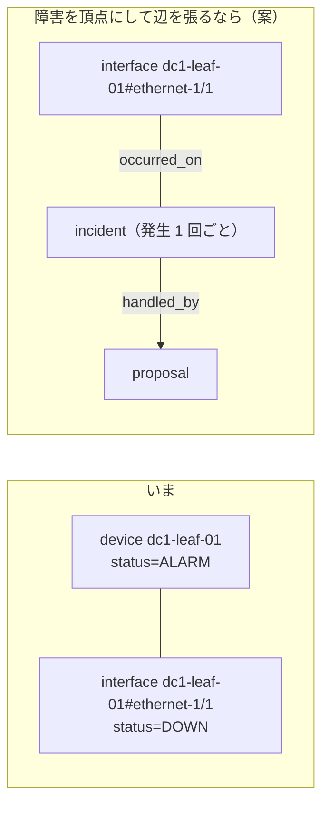

# 勉強会メモ

← [README](../README.md)

勉強会で話す順に並べてある。1〜6 はデータの置き場、7〜10 はコンテナイメージ、11〜14 は Neptune の基礎、15 は MSK とクライアントのつなぎ。

## データの置き場

この PoC で「何を・どこに・なぜ」置いているかのまとめ。2026-09-24 に DynamoDB をやめ、「いま」は Neptune、履歴と証跡は S3 Tables に寄せた。2026-10-02 に検知を Spark から Grafana と Splunk へ移し、異常の頂点と `anomaly_events` をやめた（5 に経緯）。2026-10-04 にアラートの通知の履歴を S3 Tables の `alert_events` に置くことにした。2026-10-05 に修復案を S3 Tables の `proposal_events` だけにまとめ、Neptune はトポロジと `status` だけにした（5 に経緯）。

### 1. 置き場は 2 つ（+ 見るための写し 2 つ）

| データ | 置き場 | 書く | 読む |
|---|---|---|---|
| 生データの履歴（metrics / gnmi / traps / logs / flows の全部） | S3 Tables（Iceberg）`raw_telemetry` | Spark の `iceberg` | まだ読む側が無い（`query_history` が読むのは下の `alert_events`） |
| 異常の「いま」 | 置かない。機器・回線・層の `status`（下の 2 行）と、Grafana / Splunk のアラートの状態で見る | — | — |
| 障害の履歴（アラートの通知 1 件が 1 行。発火と解消） | S3 Tables `alert_events` | Lambda `graph-status` → Firehose（60 秒ごとにまとめて追記） | エージェントの `query_history`（Athena） |
| 修復案（作成・承認・却下・時間切れ・適用・確認のたびに 1 行。どの行にも原因・コマンド・理由・事前チェック・決めた人・処置の結果などの全項目。「いま」は `proposal_id` ごとに `seq` が最大の行） | S3 Tables `proposal_events`（28 列。`proposal_id` は `<anomaly_id>#<first_seen>`） | worker だけ（PyIceberg） | Web の承認タブ、エージェントの `list_proposals`（どちらも Athena）、worker（PyIceberg） |
| Web の承認・却下（決定 1 件が 1 通。worker が受け取るまでの待ち行列で、置き場ではない） | SQS `<prefix>-decisions`（保持 1 日） | Web の承認タブ | worker |
| トポロジと、機器・回線の状態（物理層） | Neptune の頂点 `device` / `interface`、辺 `link` | 投入スクリプト、Lambda `graph-status`（アラートの `link_down` / `trap`） | エージェントの `neighbors` / `blast_radius` / `topology_graph`、Web の「トポロジ」タブ |
| 台帳の変更履歴（新しい順に 50 件） | Neptune の頂点 `change`（id は `change#<ObjectChange の id>`） | Nautobot の Job（`sync_changes()`） | エージェントの `recent_changes` |
| IP 層・EVPN/BGP 層と、その状態 | Neptune の頂点 `ip_interface` / `isis_adjacency` / `bgp_session` / `evpn_instance` / `ethernet_segment`（[Neptune の層](#neptune-の層)） | 投入スクリプト、Lambda `graph-status`（アラートの `bgp_down` / `isis_down`） | エージェントの `layers`、Web の「トポロジ」タブの層の表 |

ほかに、検索用のログ（OpenSearch `snmp-logs`）とグラフ用のメトリクス（Prometheus）がある。この 2 つは見るための写しで、正本ではない。`STORES` に `splunk` があれば全トピックを Splunk（HTTP Event Collector）にも送る。これも写しで、Splunk は analytics の ECS に立てる（index はタスクと一緒に消える。docs/pipeline.md）。

検知はこの写しの上で動く。Grafana のアラートルールは Prometheus（ポーリングの IF の状態、gNMI の BGP / IS-IS の状態）と OpenSearch（trap）を、Splunk の保存済みサーチは Splunk の index を見て、発火と解消を SNS のトピック `<prefix>-alerts` に出す（[pipeline.md](pipeline.md) の「アラート」）。

### 2. 1 回の障害で何が書かれるか

`sudo lab fail-main` でアクセス側 Leaf の fabric（`dc1-leaf-01 ethernet-1/1`）を落としたときの流れ（既定の `STORES=s3,grafana,splunk` / `SNMP_POLL=1`）。1〜3 は Grafana の道を書いた。既定では Splunk も同じ id の `link_down` を SNS に出す（保存済みサーチ `netops_poll` がポーリングから、`netops_trap` が linkDown の trap から。4 から先は同じで、異常としては 1 つにまとまる）。`SNMP_POLL=0` ではポーリングをしないので 1〜3 が起きず、Splunk が trap からだけ知らせる。`STORES` に `splunk` も無ければアラートは出ない。

1. **ポーリング（10 秒ごと）:** Telegraf が `ifOperStatus=down` を拾い、MSK の `metrics` に出す。
2. **Spark:** `iceberg` が行をそのまま `raw_telemetry` に追記し、`prometheus` が同じ値を Prometheus に書く。どちらも up か down かを判断しない。
3. **Grafana:** ルール `link_down` が 1 分ごとに `ifOperStatus` を見て、down の IF を `firing` として SNS のトピック `<prefix>-alerts` に出す。異常の id は `dc1-leaf-01#link_down#ethernet-1/1`。ここでは頂点も行も書かない。
4. **Lambda `graph-status`:** SNS から受け取り、Neptune の回線（辺 `link`）と IF の頂点の `status` を `DOWN` にする。同じ回線の IS-IS の隣接も Grafana と Splunk の `isis_down`（gNMI）で届き、頂点 `dc1-leaf-01#isis#ethernet-1/1.0` も `DOWN` になる。同じ通知を Firehose にも送り、60 秒ほどで `alert_events` に `firing` の行が入る（event_id は `<anomaly_id>#<source>#<status>#<starts_at の epoch 秒>`）。
5. **worker:** SQS から受け取り、異常ごとに Temporal のワークフロー `investigate-<anomaly_id>` を起こす。
6. **修復案:** worker が `proposal_events` に `created` の行を足す（`status` は `pending`。`proposal_id` は `<anomaly_id>#<first_seen>`。`first_seen` はアラートの `starts_at`）。Neptune には書かない。
   Web で承認すると、決定が SQS `<prefix>-decisions` に 1 通入る。worker がそれを受け取ってワークフローにシグナル `decide` を送り、ワークフローが `approved` の行を足す。`heal-main` を打つと `applied`、解消の通知が届くと `verified` の行が続く。
7. **回復:** Grafana が `resolved` を出す。Lambda が IF の `status` を `UP` に戻し、`alert_events` に `resolved` の行を足す。worker は走っているワークフローにシグナル `resolved` を送る。

障害が開いた・閉じたことは `alert_events` に通知の行として残る。Lambda は重複を落とさないので、Grafana の 4 時間ごとの送り直しや、Grafana と Splunk の両方から来た分もそのまま行になる。開いた・閉じたの組み合わせは読む側で作る。修復の流れは `proposal_events` の `proposal_id`（`<anomaly_id>#<first_seen>`）で 1 回の発生をまとめて追える。

### 3. なぜこの分け方か

| 置き場 | 向いていること | この PoC で使っている機能 |
|---|---|---|
| Neptune | つながりをたどる。頂点 1 つの「いま」を書き換える | 隣接と影響範囲（`blast_radius`）の探索。機器・回線・層の `status` の上書き |
| S3 Tables（Iceberg） | 大量の追記と、後からの集計。安い | Spark の append、worker の PyIceberg の append、Firehose の Iceberg 宛て、Athena の SELECT |

- **修復案は「いま」と証跡を分けない（2026-10-05 から）:**
  `proposal_events` に変わるたびに 1 行足し、上書きしない。「いつ誰が承認したか」は行として残り、「いま」は `proposal_id` ごとに `seq` が最大の行の `status` で分かる。2026-10-04 までは「いま」を Neptune の頂点、証跡を `proposal_events` に分けて 2 か所に書いていた。
- **書き手を 1 人にする:**
  `proposal_events` に書くのは worker だけ。Web は決定を SQS に送るだけで、テーブルには書かない。「`pending` のときだけ決められる」は、ワークフローが最初の決定だけを受け取ることで守る（以前は openCypher の条件付き更新だった）。
- **Web と Iceberg:**
  Web の承認タブは `proposal_events` を Athena（ワークグループ `<prefix>-history`）で読む。エージェントは `list_proposals` で `proposal_events`、`query_history` で `alert_events` を読む。`raw_telemetry` はまだ書くだけの状態。

### 4. 気を付けること

- **Neptune が止まっても検知は止まらない:** 見つけるのは Grafana と Splunk で、Neptune を読まない。止まるのは `status` の更新（Lambda）、トポロジのツール、新しいワークフローの起動（worker が保守中かどうかを Neptune で見るため）。修復案の一覧と承認・却下は Neptune を使わないので動く。そのあいだのアラートは SQS に残り、worker が 5 回受け取っても処理できなければ DLQ へ行く。
- **承認・却下を送れるのは Web の EC2 のロールだけ:** 決定のキュー `<prefix>-decisions` への `sqs:SendMessage` は、Web の EC2 のロールにだけ付けている（`IaC/terraform/aws-managed/workflow/proposals.tf` のポリシー `<prefix>-workflow-web`）。Runtime と tools の Lambda のロールには無い。コードでも `decide` をツールに出していない。HITL の線は IAM とコードの両方で引いている（2026-10-04 までは Neptune の IAM が頂点ごとに絞れず、コードだけだった）。
- **アラートのキューに決定を入れても効かない:** アラートのキュー `<prefix>-anomalies` には Grafana と Splunk のタスクロールも SNS 越しに届く。worker はこのキューに来た決定を読めないメッセージとして消す。決定は決定のキューからだけ受ける。
- **証跡は二重に入ることがある:** Spark の読み直しやアクティビティの再試行で同じ行がもう一度入る。`alert_events` も、Lambda が Neptune への書き込みで失敗するか、Neptune の途中で timeout するとやり直し（最大 2 回）で同じ通知を送り直す。集計するときは `event_id` で重複を落とす（`query_history` はそうしている）。
- **`alert_events` は欠けることがある:** Firehose に 3 回送っても届かなかった行は、Lambda を落とさずに `ALERT_EVENT_LOST` の ERROR でログに残すだけ（`status` の正しさを優先する。[pipeline.md](pipeline.md) の「アラートの履歴」）。`device_id` か `kind` の無い通知と、`starts_at` が範囲外で行を組めない通知も行にしない（`ALERT_DROPPED` の WARNING）。行は Neptune より先に送るので、Neptune が遅くても応答しなくても履歴は残る。`status` は遅れる、または失敗してやり直す（[pipeline.md](pipeline.md) の「アラートの履歴」）。
- **`alert_events` の `starts_at` は送り手で意味が違う:** Grafana は発火した時刻で、`resolved` の行も発火の時刻を持ったまま来る。Splunk は保存済みサーチの `latest(_time)` で、その状態を最後に見た時刻（`resolved` なら戻った時刻）。いつ届いたかは `received_at`（Lambda が受けた時刻）で見る。
- **worker が止まっているあいだの承認:** 押した決定は SQS `<prefix>-decisions` で待つ（保持 1 日）。worker が起きると受け取り、ワークフローが残っていれば `approved` / `rejected` の行を足す。ワークフローが消えていれば（Temporal の履歴はタスクと一緒に消える）、`pending` の修復案に `expired` の行を足して閉じ、処置は打たない。1 日を超えて止まると決定は消え、行は何も足されない。
- **効かなかった決定も行に残る:** 同じ修復案に内容の違う決定が後から届くと、`ignored` の行を足す（`status` は変えない）。同じ内容の重複（SQS の配り直し）は行にしない。承認待ちが時間切れや解消で終わったあとに届いた決定は、ログだけで行にしない。
- **承認を押してから反映まで数秒〜20 秒:** SQS → worker → S3 Tables のコミット → Athena の順に通るため。画面は「更新」を押すか、30 秒ごとの読み直しを待つ。
- **`ops/down.sh` は証跡も消す:** テーブルバケットごと消えるので、`proposal_events` も `alert_events` も残らない。残したいときは消す前に書き出す。
- **`STORES` に `s3` が無くてもテーブルバケットはできる:** 証跡の置き場なのでいつも作る（生データの `raw_telemetry` だけが `STORES` の `s3` に従う）。

### 5. 経緯: DynamoDB をやめた（2026-09-24）

それまでは異常の「いま」を DynamoDB `<prefix>-anomalies`、修復案を `<prefix>-proposals` に置いていた。次の穴があった。

- 「いつ異常が開いて、いつ閉じたか」がどこにも無かった。anomalies は最新の 1 行しか持たず、開き直すと前の発生が消えた。
- 修復案の承認・却下が DynamoDB の 1 行にしか無く、上書きで過去が追えなかった。
- 置き場が 3 つ（S3 Tables、DynamoDB、Neptune）あり、同じ異常が DynamoDB と Neptune の両方にあった。

そこで次のように寄せた。

1. **異常の「いま」:** Neptune の頂点 `anomaly`。`detect` が Neptune に書く。
2. **障害の履歴:** `detect` が S3 Tables の `anomaly_events` に追記する。
3. **修復案:** Neptune の頂点 `proposal`。条件付き書き込みはグラフの問い合わせ 1 本（当時は Gremlin の `fold().coalesce(unfold(), addV(...))` と `has('status','pending')`。2026-10-04 からは openCypher の `MERGE` と `WHERE n.status = 'pending'`）で置き換えた。
4. **修復案の証跡:** worker が S3 Tables の `proposal_events` に 1 段ごとに追記する。

**2026-10-02: 異常の頂点と `anomaly_events` をやめた。** 検知とアラートの相関を Grafana と Splunk に寄せ、Spark の `detect`（上の 1 と 2、EventBridge への発火）を消した。Neptune にはネットワークトポロジの情報だけを置く方針で、機器・回線・層の動的な `status` はトポロジに含める。修復案（上の 3 と 4）はこの方針から外れるが、置き場を決めるまでそのまま動かしていた（2026-10-05 に下のとおり決めた）。

**2026-10-04: 障害の履歴を `alert_events` に置いた。** すべてのアラートを SNS で受ける Lambda `graph-status` が、Neptune に書くのと同じ通知を Firehose に送り、Firehose が S3 Tables に追記する（Temporal には書かせない。MSK のトピックも足さない）。エージェントの `query_history` が Athena で読む。

**2026-10-05: 修復案を S3 Tables の `proposal_events` だけにまとめた。** Neptune の頂点 `proposal` をやめ、「いま」も証跡も同じテーブルの行で持つ（どの行にも全項目。「いま」は `seq` が最大の行）。書くのは worker だけにし、Web の承認・却下は決定専用の SQS `<prefix>-decisions` で worker に届ける。worker は頂点を 30 秒ごとに見るのをやめ、シグナル `decide` を待つ。Neptune はトポロジと `status` だけになった。設計は [修復案を S3 Tables にまとめる（003）](cycles/003-proposals-in-s3tables/design.md)。

| | 以前（DynamoDB あり） | 2026-09-24 から | 2026-10-02 から | 2026-10-04 から | 2026-10-05 から |
|---|---|---|---|---|---|
| 置き場の数 | 3 つ（+ 写し 2 つ） | 2 つ（+ 写し 2 つ） | 同じ | 同じ | 同じ |
| 異常の「いま」 | DynamoDB | Neptune の頂点 `anomaly` | 置かない（`status` とアラートの状態で見る） | 同じ | 同じ |
| 障害の履歴 | 無い | `anomaly_events` | 未定（Grafana / Splunk のアラートの履歴） | `alert_events`（アラートの通知 1 件が 1 行） | 同じ |
| 修復案の「いま」 | DynamoDB `<prefix>-proposals` | Neptune の頂点 `proposal` | 同じ | 同じ | `proposal_events` の `seq` が最大の行（Athena で読む） |
| 修復案の証跡 | 無い（1 行を上書き） | `proposal_events` | 同じ | 同じ | `proposal_events`（12 列から 28 列にし、どの行にも全項目） |
| 承認・却下の届け方 | Web が DynamoDB の行を書き換える | Web が頂点の `status` を書き換え、worker が 30 秒ごとに見る | 同じ | 同じ | Web が SQS `<prefix>-decisions` に送り、worker がシグナル `decide` で渡す |
| 費用 | DynamoDB は放置中ほぼ $0 | ほとんど変わらない（S3 Tables の小さな追記だけ） | 同じ | VPC エンドポイントが 2 本増える。Firehose と Athena は量に比例で、PoC では小さい | SQS のキューが 2 本増える（量に比例）。承認タブを開いているあいだ、30 秒ごとに Athena の問い合わせが 1 本走る |
| Neptune が止まったとき | トポロジだけ見えない | 検知の書き込みも異常一覧も止まる | `status` の更新と修復案が止まる（検知は止まらない） | 同じ（行は Neptune より先に送るので `alert_events` は残る。Neptune がエラーを返すか応答しないまま timeout すると Lambda のやり直しになり、行は二重に入る） | `status` の更新と新しいワークフローの起動が止まる。修復案の一覧と承認・却下は動く |

### 6. コードの入口

| 見たいもの | ファイル |
|---|---|
| 検知（アラートのルール、保存済みサーチ、SNS への publish） | [app/grafana/provisioning/alerting/](../app/grafana/provisioning/alerting/)（ルールは `netops-prometheus.yaml` と `netops-opensearch.yaml`、送り先と本文は `netops.yaml`）、[app/splunk/netops_alerts/](../app/splunk/netops_alerts/) |
| アラートのトピックと、本文の読み方 | [IaC/terraform/aws-managed/base/core/alerts.tf](../IaC/terraform/aws-managed/base/core/alerts.tf)、[app/temporal/rules.py](../app/temporal/rules.py) の `alerts_from_message` |
| 修復案と履歴のテーブル（`proposal_events` / `alert_events`） | [IaC/terraform/aws-managed/pipeline/analytics/tables.tf](../IaC/terraform/aws-managed/pipeline/analytics/tables.tf) |
| 障害の履歴の書き込みと読み出し（Firehose、Athena のワークグループ） | [IaC/terraform/aws-managed/pipeline/analytics/history.tf](../IaC/terraform/aws-managed/pipeline/analytics/history.tf)、[app/graph/status_handler.py](../app/graph/status_handler.py) の `send_history`、[app/agentcore/evidence.py](../app/agentcore/evidence.py) の `query_history` |
| 履歴の 1 行の形 | [app/temporal/rules.py](../app/temporal/rules.py) の `alert_event` |
| 修復案の置き場の説明、決定のキューに送れるロール（Terraform 側の説明と IAM） | [IaC/terraform/aws-managed/workflow/proposals.tf](../IaC/terraform/aws-managed/workflow/proposals.tf)、[IaC/terraform/aws-managed/workflow/iam.tf](../IaC/terraform/aws-managed/workflow/iam.tf) |
| アラートのキューと決定のキュー | [IaC/terraform/aws-managed/workflow/events.tf](../IaC/terraform/aws-managed/workflow/events.tf) |
| worker の読み書き（Neptune は openCypher で読むだけ、`proposal_events` は PyIceberg で読み書き、SQS の受け取り） | [app/temporal/awsio.py](../app/temporal/awsio.py) |
| 修復案の 1 行の形（28 列）と「いま」の決め方 | [app/temporal/rules.py](../app/temporal/rules.py) の `PROPOSAL_EVENT_COLUMNS` / `proposal_event` / `latest_proposals` |
| Web とエージェントの読み方（Athena）と、Web の決定の送り方（SQS） | [app/agentcore/proposals.py](../app/agentcore/proposals.py) の `list_proposals` / `get_proposal` / `decide` |
| Neptune の機器・回線・層の status | [app/graph/status_handler.py](../app/graph/status_handler.py) |

## コンテナイメージ

ECR に置くイメージが「どこで・何をして」いるかのまとめ。2026-09-25 時点のコードで確かめた内容に、2026-09-28 に足した `telegraf` / `grafana` / `splunk` を加えた。2026-10-08（cycle 012）に `syslog-ng` / `goflow2` を足した。

### 7. イメージと動く場所

| イメージ（`<prefix>-…`） | 元 | 動く場所 | 役目 |
|---|---|---|---|
| `agent` | [app/agentcore/](../app/agentcore/)（自前ビルド） | AgentCore Runtime | チャットの本体。Bedrock のモデルを呼び、Neptune のトポロジ、OpenSearch / Prometheus の証拠を集めて答え、承認待ちの修復案を作る |
| `lab-srlinux` | `ghcr.io/nokia/srlinux`（ミラー。約 1 GB） | lab の EC2（containerlab） | スイッチ（Nokia SR Linux、`ixr-d2l`）。`app/containerlab/splab.clab.yml.in` の 6 台（Leaf-SW 2 / Spine 2 / Leaf 2）がこれで立ち、`app/containerlab/srlinux/<機器>.cli` で IS-IS・iBGP EVPN・VXLAN・LAG・SNMP の trap・syslog が入る。SNMP エージェントと gNMI は機器に内蔵（containerlab が v2c の `public` と `57400/tcp` を入れる）。監視される「機器」そのもので、**trap の宛先（`system snmp trap-group`）を書いた機器が監視対象**（いまは 6 台全部） |
| `lab-multitool` | `ghcr.io/srl-labs/network-multitool`（ミラー） | lab の EC2（containerlab） | ping / traceroute / tcpdump 入りの VM 役（`wan-upstream-01` / `dc1-host-01`）。Leaf の組へ bond0（LACP）で 2 本つなぎ、疎通確認と障害の再現に使う |
| `temporal` | `temporalio/temporal`（ミラー） | ECS Fargate（WORKFLOW=1） | Temporal のサーバー。`server start-dev` で 1 コンテナで動く。Fargate はプライベート網から Docker Hub を引けないので ECR にミラーする |
| `worker` | [app/temporal/](../app/temporal/)（自前ビルド） | ECS Fargate（WORKFLOW=1） | Temporal のワーカー。SQS のアラートと Web の決定を拾い、Runtime に修復案を作らせ、S3 Tables の `proposal_events` に記録し、承認後に SSM で lab の機器へ流して検証する（Neptune はトポロジを読むだけ）。同じタスクの `temporal` に `localhost:7233` でつなぐ |
| `telegraf` | [app/telegraf/](../app/telegraf/)（公式の `telegraf:1.40.1` に設定のテンプレートと `tg` を足す） | ECS Fargate（stream。受ける側（内部 NLB の後ろ）と取りにいく側の 2 サービス。役割は環境変数 `TELEGRAF_ROLE`）。デバッグ用の EC2（`ops/lab-debug.sh`）でも同じ作り方のイメージ（スタックの ECR の `<prefix>-debug-telegraf`）を docker で動かす | 機器の gNMI の購読・SNMP のポーリングと trap を受けて MSK に書く（syslog は 2026-10-08 から `syslog-ng` が受ける）。SNMP のポーリングは `SNMP_POLL=0` で止める（stream の既定は `1`。デバッグ用の EC2 の既定は `0`）（デバッグ用の EC2 では `SINK=stdout` で標準出力に書く）。2026-09-28 まで lab とは別の EC2 で systemd の下に rpm で動いていた |
| `syslog-ng` | [app/syslog-ng/](../app/syslog-ng/)（公式の AxoSyslog `ghcr.io/axoflow/axosyslog:4.29.0` に設定のテンプレートと入口のスクリプトを足す。[docker/images/syslog-ng/Dockerfile](../docker/images/syslog-ng/Dockerfile)） | ECS Fargate（stream。内部 NLB の後ろ。2026-10-08、cycle 012 から） | 機器の syslog（UDP 5140）を受け、Telegraf と同じ形（measurement `device_log`）で MSK の `logs` に書く。MSK へは SASL/SCRAM（9096）でつなぐ |
| `goflow2` | `netsampler/goflow2:v2.2.7`（ミラー） | ECS Fargate（stream。内部 NLB の後ろ。2026-10-08、cycle 012 から） | NetFlow（UDP 2055）と sFlow（UDP 6343）を受け、GoFlow2 の JSON のまま MSK の `flows` に書く（共通の形には Spark が読み替える）。MSK へは SASL/SCRAM。lab の SR Linux は NetFlow を出さないので、試すときは `tools/netflow_send.py` |
| `grafana` | [app/grafana/](../app/grafana/)（公式の Grafana OSS にデータソースの plugin と provisioning を焼き込む） | ECS Fargate（analytics。`STORES` の `grafana`） | Prometheus（AMP）と OpenSearch Serverless を SigV4 で読んで見せる。アラートルール（Prometheus の `link_down` / `bgp_down` / `isis_down` と、OpenSearch の `trap`）を評価して SNS へ出す（`link_down` はポーリングの値を見るので、`SNMP_POLL=0` では発火しない） |
| `splunk` | [app/splunk/](../app/splunk/)（公式の `splunk/splunk:10.4.4` に検知のアプリ `netops_alerts` と入口のスクリプトを足す。amd64 だけ、約 2〜3 GB） | ECS Fargate x86（analytics。`STORES` に `splunk` があるとき） | Splunk Enterprise（試用ライセンス）。Spark が HEC に全トピックを送り、保存済みサーチが SNMP のポーリング・trap・gNMI から異常を見つけて SNS へ出す |
| `kafka-ui` | `ghcr.io/kafbat/kafka-ui`（ミラー） | ECS Fargate（stream） | Kafbat UI。MSK のトピック・メッセージ・consumer group を画面で見る（IAM 認証） |
| `nautobot` | [app/nautobot/](../app/nautobot/)（公式の `networktocode/nautobot` に Job と `netops` を足す） | ECS Fargate（pipeline/nautobot。`PIPELINE=1`） | 台帳（Nautobot）。変更を Telegraf の取りにいく先と Neptune に同期する |
| `redis` | `redis`（ミラー） | ECS Fargate（`nautobot` と同じタスク） | Nautobot のキャッシュと Celery のブローカー |

分けて見ると、監視される側が `lab-srlinux` / `lab-multitool`、集める側が `telegraf` / `syslog-ng` / `goflow2`、考える側が `agent`、実行する側が `temporal` / `worker`、見る側と見つける側が `grafana` / `splunk`。

### 8. arm64 に揃える（Splunk だけ x86）

- **AgentCore Runtime は linux/arm64 のイメージしか動かせない。** x86_64 でビルドしたイメージは起動しない。`docker/images/agentcore/Dockerfile` の冒頭にも書いてある。
- ほかも arm64 に揃えてある: ECS Fargate は `cpu_architecture = "ARM64"`（[IaC/terraform/aws-managed/workflow/ecs.tf](../IaC/terraform/aws-managed/workflow/ecs.tf)、stream の Telegraf・syslog-ng・GoFlow2 と Kafbat UI、analytics の Grafana、pipeline/nautobot の Nautobot）、EMR Serverless と Lambda も arm64、lab / Web の EC2 は `t4g`（Graviton）だけを受け付ける。
- 例外は `splunk`。公式イメージが amd64 しか無いので、そのタスクだけ `X86_64` にし、`docker buildx build --platform linux/amd64` で作る（公式イメージに COPY するだけなので、arm64 の PC でもエミュレーション無しで作れる）。
- だから `splunk` のほかは、PC 側の `docker buildx build` は必ず `--platform linux/arm64`、`docker pull` も `--platform linux/arm64`。Mac（Apple Silicon）はそのまま、WSL2 は `binfmt` を入れる（[setup.md](setup.md)）。
- ミラーの push で「only the available single-platform image was pushed」と出るのは、arm64 だけ push したという意味で問題ない。

### 9. タグ

- ECR のリポジトリは `IMMUTABLE`（[IaC/terraform/aws-managed/base/ecr/main.tf](../IaC/terraform/aws-managed/base/ecr/main.tf)）。同じタグへの上書きはできないので、コードを変えたらタグを進める。
- 自前ビルドの `agent` / `worker` は `IMAGE_TAG`（既定 `v1`）。ミラーは上流の版そのまま（`ops/lab-common.sh` の `SRLINUX_TAG` / `MULTITOOL_TAG`、`ops/up-common.sh` の `TEMPORAL_TAG` / `REDIS_TAG`、`ops/up.sh` の `KAFKA_UI_TAG`）。
- `telegraf` / `syslog-ng` / `grafana` / `splunk` / `nautobot` は `<版>-<ディレクトリの中身の sha256 の先頭 12 文字>`（`ops/lab-common.sh` の `dir_tag`）。中身を変えれば自動でタグが変わるので、`IMAGE_TAG` を上げなくてよい。
- `ops/up.sh` は ECR にそのタグが無いときだけビルドして push する（手順 2）。

### 10. コードの入口

| 見たいもの | ファイル |
|---|---|
| ビルドと push、タグの定数 | [ops/up.sh](../ops/up.sh) の手順 2、[ops/up-common.sh](../ops/up-common.sh) |
| リポジトリの定義 | [IaC/terraform/aws-managed/base/ecr/main.tf](../IaC/terraform/aws-managed/base/ecr/main.tf) |
| lab のどの機器がどのイメージか | [app/containerlab/splab.clab.yml.in](../app/containerlab/splab.clab.yml.in)（[app/containerlab/gen_lab.py](../app/containerlab/gen_lab.py) が作る） |
| Runtime がどのイメージを指すか | [IaC/terraform/aws-managed/agent/variables.tf](../IaC/terraform/aws-managed/agent/variables.tf) の `agent_image_tag` |
| Fargate のタスク定義（temporal と worker の 2 コンテナ） | [IaC/terraform/aws-managed/workflow/ecs.tf](../IaC/terraform/aws-managed/workflow/ecs.tf) |
| Telegraf / syslog-ng / GoFlow2 / Grafana / Splunk のタスク定義 | [IaC/terraform/aws-managed/pipeline/stream/telegraf.tf](../IaC/terraform/aws-managed/pipeline/stream/telegraf.tf)、[IaC/terraform/aws-managed/pipeline/stream/collectors.tf](../IaC/terraform/aws-managed/pipeline/stream/collectors.tf)、[IaC/terraform/aws-managed/pipeline/analytics/grafana.tf](../IaC/terraform/aws-managed/pipeline/analytics/grafana.tf)、[IaC/terraform/aws-managed/pipeline/analytics/splunk.tf](../IaC/terraform/aws-managed/pipeline/analytics/splunk.tf) |

## Neptune の層

設計の「物理層・IP 層・EVPN/BGP 層のそれぞれの接続情報と、各層を紐づける ID」を Neptune でどう持つか。2026-09-26 に lab を Spine-Leaf（EVPN-VXLAN）にしたときに入れた。元データは `app/containerlab/lab_topology.py` が `app/containerlab/srlinux/*.cli` から作る（`app/agentcore/data/layers.json` はその写し）。

| 層 | 頂点（label） | id | 下の層を指す property | 同じ層の辺 |
|---|---|---|---|---|
| 物理 | `device` / `interface` | `dc1-leaf-01` / `dc1-leaf-01#ethernet-1/1` | — | `link`（機器 ⇄ 機器。`a_if` / `b_if`、kind は fabric / lag / l2 / mgmt） |
| IP | `ip_interface` | `dc1-leaf-01#ethernet-1/1.0` | `interface_id` → `interface`（辺 `over`。ループバック `system0.0` は物理層に無いので空） | — |
| IP | `isis_adjacency` | `dc1-leaf-01#isis#ethernet-1/1.0` | `ip_interface_id` / `interface_id`（辺 `over`） | `peer`（両端の隣接） |
| EVPN・BGP | `bgp_session` | `dc1-leaf-01#bgp#10.255.0.1` | `ip_interface_id` → ループバック `system0.0`（辺 `over`） | `peer`（Leaf ⇄ Spine の RR） |
| EVPN・BGP | `evpn_instance` | `dc1-leaf-01#evi#100` | `ip_interface_id` → VTEP のループバック（辺 `over`）、`interfaces`（`lag1.0`。辺 `attach` → `ip_interface`） | `tunnel`（同じ EVI の VTEP 同士） |
| EVPN・BGP | `ethernet_segment` | `dc1-leaf-01#es#ES-2` | `interface_id` → `lag1`（辺 `over`） | `segment`（同じ ESI の 2 台） |

- 頂点はどれも `layer`（`ip` / `evpn`）と `device_id` を持ち、動的な `status`（`UP` / `DOWN`。無ければ UP）は Lambda `graph-status` が Grafana と Splunk のアラート（gNMI の `bgp_down` / `isis_down`）から書く。`STORES` に `grafana` も `splunk` も無いとこのアラートが出ないので変わらない。エージェントの `layers` ツールと Web の層の表は、id と `interface_id` / `ip_interface_id` で下の層へ追える。
- 未登録の扱いは物理層と同じ。トポロジに無い BGP のセッションが落ちたら `registered=false` の頂点を作って残し、`ops/sync-graph.sh --replace` で置き換わる。
- 実機に替えても形は変わらない。SR-MPLS にするときは `bgp_session` の `afi` と `evpn_instance` の `vtep`（VXLAN）を SR のラベルに読み替えるだけで、id と辺はそのまま。

## Neptune の基礎

Neptune そのものの仕組みと、この PoC での使い方の関係。2026-10-04 に Neptune Database から Neptune Analytics へ置き換えた（機器が増えたときにグラフ全体の分析を使えるようにしておく）。置き換えたあとの動作は 2026-10-05 に AWS で確かめた（Lambda `graph-status` が `status` を DOWN / UP に書き換え、チャットが「dc1-leaf-01 の接続先は」に正しく答えた。`NEPTUNE_AZ_NUM` は既定の 1）。 料金は料金ページの値で、Price List API では確かめていない。

### 11. Neptune とは

AWS が運用を持つグラフデータベース。データを頂点と辺で持ち、「A とつながっているものを、さらにその先まで」たどる問い合わせが得意。表の JOIN を何段も重ねずに済む。

| | Neptune Database（2026-10-04 まで） | Neptune Analytics（この PoC が使う） |
|---|---|---|
| 向き | 少しずつ読み書きする普段の処理 | グラフ全体の分析。頂点 1 つの読み書きもできる |
| 仕組み | Aurora と同じ系統のストレージに置く | メモリに載せて計算する（容量は m-NCU で決める） |
| 得意なこと | 頂点 1 つの更新、近くのつながりをたどる | 中心性、連結成分、経路探索、ベクトル検索 |
| 問い合わせ | Gremlin / openCypher / SPARQL | openCypher だけ |
| 口 | VPC の中のクラスターエンドポイント（8182） | AWS の API（`neptune-graph`）。VPC からはインターフェース型エンドポイント `neptune-graph-data` |

- **問い合わせは openCypher:** `MATCH (a)-[:link]-(b)` のように形を描く。boto3 の `neptune-graph` クライアントの `execute_query` に文字列とパラメータを渡す（[app/agentcore/graph.py](../app/agentcore/graph.py) の `query()`）。2026-10-04 までは Gremlin だった。
- **グラフアルゴリズム:** `CALL neptune.algo.degree(...)` のように openCypher から呼ぶ。この PoC は次数中心性・近接中心性・弱連結成分を `centrality` ツールで使う。媒介中心性は無い。OSS 版では別の道具に置き換える箇所（[oss-variant.md](oss-variant.md)）。
- **向いていない:** 表の集計（SQL が無い）、単純なキーと値、時系列、全文検索。
- **費用:** 無料枠は無く、動いているあいだずっと時間で課金される。最小の 16 m-NCU で約 $0.58/h（東京。Neptune Database の `db.t4g.medium` は約 $0.14/h と数えていた）。大きさは [variables.tf](../IaC/terraform/aws-managed/pipeline/graph/variables.tf) の `provisioned_memory`。

### 12. AZ 冗長か

グラフはメモリに載っており、レプリカ（`replica_count`）を足すと別の AZ に待機系を持てる（レプリカの分も同じ単価がかかる）。この PoC は [neptune.tf](../IaC/terraform/aws-managed/pipeline/graph/neptune.tf) で `replica_count = var.neptune_az_num - 1` で、既定の `NEPTUNE_AZ_NUM=1` では 0。**既定では障害が起きるとグラフが戻るまで止まる**（4 のとおり、止まると `status` の更新と新しいワークフローの起動も止まる）。その日に消す使い捨てなので費用を優先している。

### 13. グラフはいくつ作れるか

- **Neptune Analytics は「グラフ 1 つ = リソース 1 つ」** で、グラフごとに課金される。アカウントあたりの数の上限は Service Quotas で確かめる。
- **この PoC はグラフ 1 つをラベルで分けている:** `device` / `interface` と上の層の `ip_interface` / `bgp_session` など、`change` は同じグラフの中にある（修復案の `proposal` は 2026-10-05 にやめた）。ラベルはいくつ増やしてもよく、同じグラフにあるから辺でつなげる。
- **上限はメモリの大きさ（m-NCU）:** 頂点と辺が増えたら `provisioned_memory` を上げる（16 / 32 / 64 / 128 / 256）。2026-10-05 の動作確認は 16 m-NCU（既定）で通した。メモリの使用量は見ていない。

### 14. トポロジをグラフにする意味

**いまの形:** Neptune に置くのはトポロジ（物理層・IP 層・EVPN/BGP 層）と、その頂点の `status`（UP / DOWN / ALARM）。隣接と影響範囲（`neighbors` / `blast_radius`）、層をまたいだ追跡（`layers`）は辺をたどって答える。障害そのものは頂点にしていない。2026-10-02 までは別の頂点 `anomaly` にしていたが、次の 2 点でグラフの強みを使っていなかった（5）。

1. **頂点は発生 1 回ごとではなく「機器 + 種類 + IF」ごとに 1 つだった。** 同じ回線が 2 回落ちると同じ頂点を開き直し、`first_seen` を上書きしていた。
2. **機器の頂点と辺でつながっていなかった。** どの機器の障害かは id の文字列でしか分からなかった。

修復案の `proposal` も 2026-10-04 までは頂点だったが、同じく辺が無かった。2026-10-05 に S3 Tables の `proposal_events` だけにした（5）。

**障害を頂点にして辺でつなぐと楽に答えられる問い:**

- **根本原因の絞り込み:** 同じ時刻に Leaf 3 台で回線断が出たとき、共通の上流（同じ Spine、同じ回線）を探す。表なら段数分の JOIN、グラフなら「共通の隣」を探すだけ。
- **影響範囲とのひも付け:** 障害の頂点から下流へたどって、止まる拠点を出す（いまの `blast_radius` を障害から起こせる）。
- **再発のパターン:** 「この Spine につながる回線で過去 30 日に何回落ちたか、毎回同じ修復案で直ったか」。
- **エージェントへの材料集め:** 障害から、つながる機器・同時刻の別の障害・過去に効いた修復案をたどって渡す（GraphRAG と同じ考え方）。

**グラフにしても得をしない問い:** 月の件数、機器ごとのランキング、時系列（表と Athena が向く）。障害 1 件の長いログ（S3 に置き、頂点には場所だけ持たせる）。似た障害のベクトル検索は、Neptune Analytics にベクトル検索があるが使っていない（手順書の検索は Knowledge Bases と OpenSearch Serverless）。

**この PoC では:** 8 台のラボで単発の回線断が中心なので、効いているのは影響範囲だけ。複数機器の同時障害（Spine 障害で配下の Leaf がまとめて落ちる）を扱うか、エージェントに原因の推定までさせるなら、辺を張る価値が出る。障害の履歴の置き場を決めるときは、この案（Neptune に発生ごとの頂点）と、表（S3 Tables）や Splunk に置く案を比べる。Neptune にはトポロジだけを置く方針（5）とぶつかるので、辺を張るなら方針から見直すことになる。

## MSK とクライアントのつなぎ

Telegraf・Spark が「どのブローカーにつなぐか」をどう知るか。2026-09-25 に手動構築（手順 5）で確かめた内容を、2026-09-28 に Telegraf を ECS に移したのに合わせて直した。

### 15. ブローカーの渡し方と msk-bootstrap

**ブートストラップサーバーとは。** Kafka のクライアントは、クラスターにつなぐときに「最初に話しかけるブローカーのアドレス一覧」が要る。これがブートストラップサーバーで、`b-1.<クラスター>.kafka.ap-northeast-1.amazonaws.com:9098,b-2.<クラスター>...:9098` のような文字列。クライアントはここに一度つなぐと、クラスター全体の構成（どのブローカーがどのパーティションを持つか）を教えてもらい、以降はそれに従って直接つなぐ。だから全ブローカーを列挙する必要は無いが、MSK はふつう全部を返す。ポート 9098 は SASL/IAM 用（9092 が平文、9094 が TLS、9096 が SASL/SCRAM）。この PoC は IAM だけを有効にしているので 9098 しか使わない。

**Telegraf は環境変数でもらう。** この文字列はクラスターを作り終えるまで決まらない（クラスター名から推測できない乱数が入る）。2026-09-28 までは Telegraf の EC2 が [IaC/terraform/aws-managed/pipeline/lab](../IaC/terraform/aws-managed/pipeline/lab) で MSK より先に作られたので、起動時に SSM の `/<prefix>/msk-bootstrap` を読んでいた。いまの Telegraf は MSK と同じ [IaC/terraform/aws-managed/pipeline/stream](../IaC/terraform/aws-managed/pipeline/stream) の ECS のタスクなので、[telegraf.tf](../IaC/terraform/aws-managed/pipeline/stream/telegraf.tf) がタスク定義の環境変数 `KAFKA_BROKERS` に `aws_msk_cluster.stream.bootstrap_brokers_sasl_iam` をそのまま入れる。SSM は読まない。

**`msk-bootstrap` は残す。** [IaC/terraform/aws-managed/pipeline/stream/msk.tf](../IaC/terraform/aws-managed/pipeline/stream/msk.tf) は今もクラスターを作った直後に `/<prefix>/msk-bootstrap`（String）へ書く。手動構築と確かめるときに使う（手動構築では `aws kafka get-bootstrap-brokers` の `BootstrapBrokerStringSaslIam` を `aws ssm put-parameter` で入れる。手順 5-5）。Runtime と Web のロールに付く `<prefix>-stream-parameters-read` は `parameter/<prefix>/*` の読み取りだけで、Kafka の権限は無い（この 2 つは MSK に書かない）。

**Telegraf 側の流れ**（[app/telegraf/telegraf.sh](../app/telegraf/telegraf.sh) の `render`。コンテナの入口 `tg run` が最初に呼ぶ）。

1. タスクの環境変数 `SINK`（kafka / stdout、既定 kafka）・`SNMP_POLL`（0 / 1、既定 1）・`KAFKA_BROKERS`（`SINK=kafka` のときだけ）/ `SNMP_AGENTS`（`SNMP_POLL=1` のときだけ）/ `GNMI_TARGETS` / `AWS_REGION` の形を確かめる。取りにいく側（`TELEGRAF_ROLE=dialin`）は `SNMP_AGENTS` / `GNMI_TARGETS` と機器の認証情報（`GNMI_USERNAME` / `GNMI_PASSWORD` / `SNMP_COMMUNITY`）を、環境変数の値ではなく SSM パラメータ（`/<prefix>/telegraf-dialin/…`）から ECS の secrets で受ける（認証情報は SecureString で、`ops/up.sh` が lab の既定値で作る。設定ファイルには書かず、Telegraf が起きるときに環境変数から読む）。崩れていればそこで終わり、ECS がタスクを立て直す（ログに理由が出る）。
2. `telegraf.conf.in` の `__KAFKA_BROKERS__` などを埋めて `/tmp/telegraf.conf` を作る。`[[outputs.kafka]]` が metrics / gnmi / traps の分あり（2026-10-08 から logs は syslog-ng、flows は GoFlow2 が SASL/SCRAM で書く）、どれも同じブローカーに `sasl_mechanism = "AWS-MSK-IAM"` でつなぐ。出力は環境変数 `SINK`（既定 `kafka`）で選び、選ばなかった出力の区間（`# >>> sink <名前>` 〜 `# <<< sink <名前>`）を消す。デバッグ用の EC2 は `SINK=stdout` で `[[outputs.file]]`（標準出力、同じ JSON）だけになり、`KAFKA_BROKERS` も `/tmp/aws_config` も要らない。`SNMP_POLL=0` なら SNMP のポーリングの区間（`# >>> snmp_poll` 〜 `# <<< snmp_poll`。`[[inputs.snmp]]`）も消す。`TELEGRAF_ROLE` が `dialout`（受ける側）なら取りにいく入力の区間（`# >>> role dialin`）を、`dialin`（取りにいく側）なら受ける入力の区間（`# >>> role dialout`）を消す（既定 `all` は消さない）。出力はどの役割でも同じ。
3. 認証はタスクロール `<prefix>-telegraf-task`。Telegraf の MSK IAM 認証は profile の指定が要る（[telegraf.conf.in](../app/telegraf/telegraf.conf.in) の注記）ので、鍵の無い `[default]`（region だけ）を `/tmp/aws_config` に置き、SDK が ECS の入れる `AWS_CONTAINER_CREDENTIALS_RELATIVE_URI` のロールに落ちるようにしてある。

**IAM は 1 段。** タスクロールのポリシー `<prefix>-telegraf-task`（[telegraf.tf](../IaC/terraform/aws-managed/pipeline/stream/telegraf.tf)）は次の 2 文。前の `<prefix>-stream-produce` にあった `Bootstrap`（`ssm:GetParameter`）は要らなくなったので消した。

| Sid | 許可 | 使うとき |
|---|---|---|
| `Kafka` | `kafka-cluster:Connect` / `DescribeCluster` / `WriteData` / `WriteDataIdempotently` / `DescribeTopic` / `CreateTopic` を「クラスターの ARN」と「`topic/<クラスター>/*`」に | トピックに書く（`auto.create.topics.enable=true` なので初回の書き込みでトピックができる。そのために `CreateTopic` が要る） |
| `EcsExec` | `ssmmessages` の 4 つ | ECS Exec で入って `tg gnmi` / `tg test` を打つ |

実行ロール `<prefix>-telegraf-exec` は `AmazonECSTaskExecutionRolePolicy`（ECR とログ）と、取りにいく側の secrets を読む `ssm:GetParameters`（`/<prefix>/telegraf-dialin/*` だけ）。どちらのロールにも閉域の Deny（`<prefix>-network-perimeter`）を付ける。

**クライアントごとの渡し方。** どれも SSM を読まない。

| クライアント | ブローカーの知り方 | 理由 |
|---|---|---|
| Telegraf（ECS） | タスク定義の環境変数 `KAFKA_BROKERS`（同じ root の MSK の属性） | MSK と同じ root で作られ、タスクは起動のたびに環境変数をもらえるから |
| syslog-ng・GoFlow2（ECS） | syslog-ng はタスク定義の環境変数 `KAFKA_BROKERS`、GoFlow2 は引数 `-transport.kafka.brokers`（どちらも同じ root の MSK の SCRAM の口 `bootstrap_brokers_sasl_scram`。[collectors.tf](../IaC/terraform/aws-managed/pipeline/stream/collectors.tf)） | Telegraf と同じ |
| Spark（EMR Serverless） | [IaC/terraform/aws-managed/pipeline/analytics](../IaC/terraform/aws-managed/pipeline/analytics) が stream の state の `bootstrap_brokers` を読み、ジョブの引数 `--bootstrap` で渡す（[app/spark/snmp_sinks.py](../app/spark/snmp_sinks.py)） | ジョブは起動のたびに引数をもらえるので、パラメータストアを引く必要が無い |
| Kafbat UI（ECS） | タスク定義の環境変数 `KAFKA_CLUSTERS_0_BOOTSTRAPSERVERS`（同じ root の MSK の IAM 認証の口。[kafka_ui.tf](../IaC/terraform/aws-managed/pipeline/stream/kafka_ui.tf)） | Telegraf と同じ |

**確かめ方。** ロググループ `/ecs/<prefix>-telegraf` に「`/tmp/telegraf.conf を作った（role: … / sink: kafka / brokers: …）`」が出ていれば `render` は通っている。ECS Exec で取りにいく側のタスクに入って（[pipeline.md](pipeline.md) の「Telegraf に入る」）`tg gnmi` を打つと gNMI の購読を 20 秒だけ受けて標準出力に出す（MSK には送らない）ので、機器との疎通と MSK との疎通を切り分けられる。`SNMP_POLL=1`（既定）のタスクなら `tg test` でポーリングを 1 回まわして同じように見られる（`SNMP_POLL=0` では「止めてある」と出して終わる）。MSK 側は、Kafka の `WriteData` が拒まれればログに出る。

## 届け方の保証（どの区間で、失うか、重複するか）

**結論: 入口（機器 → Telegraf）は失うことがあり、そこから先はどの区間も「少なくとも 1 回」（at-least-once）。失わない代わりに、重複がありうる。重複は、上書きのできる格納先では起きず、できない格納先（Splunk、OpenSearch）では読む側で落とす。**

言葉の意味。

| 言葉 | 意味 |
|---|---|
| 多くて 1 回（at-most-once） | 送り直さない。失うことがある。重複はしない |
| 少なくとも 1 回（at-least-once） | 届いたと分かるまで送り直す。失わない。重複がありうる |
| ちょうど 1 回（exactly-once） | 失わず、重複もしない。送り直しても、受ける側が同じものを 1 つにまとめられるときだけ成り立つ |

### データの経路（機器 → 格納先）

| 区間 | 保証 | 失う場面 | 重複する場面 |
|---|---|---|---|
| 機器 → Telegraf・syslog-ng・GoFlow2（SNMP のポーリング、gNMI、trap、syslog、NetFlow / sFlow） | 多くて 1 回 | trap と syslog と NetFlow / sFlow は UDP で、届かなければそれきり。ポーリングは失敗した回が抜ける。Telegraf・syslog-ng・GoFlow2 が止まっているあいだの分 | 無い |
| Telegraf → Kafka（MSK） | 少なくとも 1 回 | Telegraf の手元のバッファがあふれた分。`required_acks = 1` なので、受け取ったリーダーが複製の前に落ちた分 | 返事が届かず送り直した分。失敗したまとまりを次の回に送り直した分 |
| Kafka → Spark | 少なくとも 1 回 | 無い（checkpoint の offset から読み直す）。Kafka の保存期間を過ぎた分は読めない | マイクロバッチのやり直しで、同じ offset をもう一度読む |
| Spark → S3 Tables（Iceberg） | ちょうど 1 回 | 無い | 無い（バッチの番号で、同じバッチは 1 回しか確定しない）。Telegraf が Kafka に 2 回入れた分は、2 行になる |
| Spark → Prometheus | 少なくとも 1 回で送り、結果はちょうど 1 回 | 4xx で断られたサンプルは捨てる（時刻が戻ったもの、古すぎるもの）。数は driver のログに出る | 無い（同じ系列と時刻は 1 つ） |
| Spark → OpenSearch | 少なくとも 1 回 | 4xx で断られたドキュメントは捨てる | やり直しの分が残る（TIMESERIES 型は ID を付けられない） |
| Spark → Splunk（HEC） | 少なくとも 1 回 | 4xx で断られたイベントは捨てる | やり直しの分が残る（HEC は来たものを全部入れる） |

- **Spark が送り直す範囲。**
  `HTTP_SEND=driver` ではマイクロバッチ全体。`executor` では失敗したパーティション（タスク）。5xx と接続の失敗は送り直し、4xx は送り直しても通らないので捨てる。
- **Telegraf と Kafka のあいだの重複検知（idempotent producer）は使っていない。**
  使っても、Telegraf がまとまりごと送り直す分は防げない。

### アラートの経路（格納先 → 修復）

| 区間 | 保証 | 失う場面 | 重複する場面 | 重複の扱い |
|---|---|---|---|---|
| Splunk の保存済みサーチ → SNS | 少なくとも 1 回に近い | publish を 3 回試して失敗した分（ERROR をログに出す） | 同じイベントが別の分に 2 回 index に入ると、次の回のサーチがもう一度出す | 下流でまとまる（下の行） |
| Grafana → SNS | 少なくとも 1 回 | 通知の失敗は Grafana が送り直す | 発火中は 4 時間ごとに送り直す | 下流でまとまる |
| SNS → Lambda graph-status | 少なくとも 1 回 | やり直し（2 回）を使い切った分 | Lambda が失敗してやり直した分 | Neptune の status は上書きなので、同じ値を 2 回書いても変わらない |
| Lambda → Firehose → S3 Tables の `alert_events`（アラートの履歴。001 で入る） | 少なくとも 1 回 | 3 回送って届かなかった行（ERROR に行の中身を書く） | やり直しの分、上流から同じ通知が 2 回来た分 | 読むときに `event_id`（異常、送り手、状態、starts_at）で 1 行にまとめる |
| SNS → SQS → worker → Temporal | 少なくとも 1 回 | 5 回受け取っても処理できなかった分は DLQ へ | 処理が 120 秒を超えると、もう一度受け取る | ワークフローの ID が同じなら、Temporal が二重の起動を弾く |
| Web → SQS `<prefix>-decisions` → worker → Temporal（承認・却下） | 少なくとも 1 回 | 5 回受け取っても処理できなかった分は DLQ `<prefix>-decisions-dlq` へ。worker が 1 日を超えて止まると、保持の切れた決定は消える | 処理が 120 秒を超えると、もう一度受け取る | ワークフローが決定の中身（決定、決めた人、時刻）で見分け、同じものは捨てる。内容の違う後の決定は `ignored` の行にする |
| worker → S3 Tables の `proposal_events` | 少なくとも 1 回 | — | アクティビティの再試行の分 | 読むときに `event_id`（修復案の id と出来事）でまとめる。「いま」は `seq` が最大の行なので、同じ行が 2 つあっても変わらない |

- **同じアラートが 2 回 SNS に出ても、障害の履歴は二重にならない。**
  starts_at は、サーチを回した時刻ではなく、元のイベントの時刻から取っている。同じイベントから出た通知は `event_id` が同じになり、読むときに 1 行になる。
- **starts_at の無い通知は、別の回の発生でも 1 行にまとまる。**
  starts_at が無いか読めない（無限大を含む）と `event_id` の末尾が `#0` になり、同じ異常・送り手・状態の別の発生も読むときに 1 行になる。いまの送り手は starts_at を付けるので起きない見込み（cycle 001 の design.md のリスク 12）。
- **Splunk の中の重複は、アラートの判定を変えない。**
  保存済みサーチは「最後の状態」や「状態が変わったか」で判定している。同じイベントが 2 つあっても結果は同じ。

Telegraf のバッファがあふれたときの動き、Kafka の `required_acks = 1` で失う場面、Grafana の送り直しの間隔は、記憶と設定の読み取りから書いた。AWS で障害を起こして確かめてはいない。Splunk の保存済みサーチの行は、cycle 002（Splunk と Grafana のアラートを比べる）が入ったあとの形。
