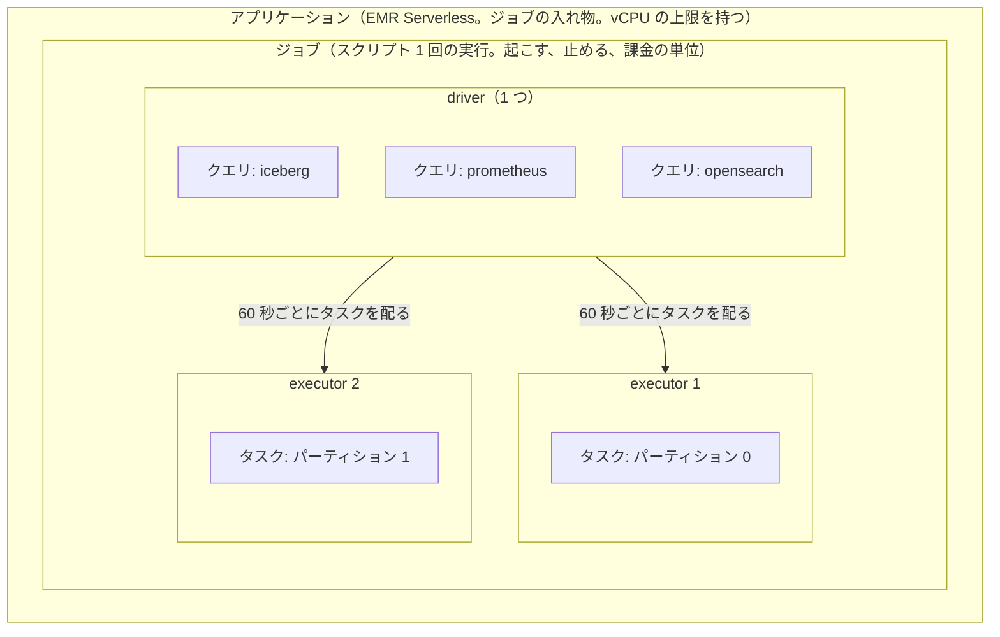

# 学習 FAQ（nwc-poc を進めながら質問したこと）

nwc-poc の作業中に質問したことと、その答えをまとめた。答えは会話の中身を要約したもの。コードのパスはこのリポジトリの中のもの。

- [1. 学習教材の選び方](#1-学習教材の選び方)
- [2. syslog の基本](#2-syslog-の基本)
- [3. lab の syslog を local7 にした](#3-lab-の-syslog-を-local7-にした)
- [4. デバッグ用の EC2（lab + Telegraf）](#4-デバッグ用の-ec2lab--telegraf)
- [5. 本番の Cisco から送るとき](#5-本番の-cisco-から送るとき)
- [6. SNMP のポーリングを既定で止めた](#6-snmp-のポーリングを既定で止めた)
- [7. Nautobot（機器の一覧とケーブルの正）](#7-nautobot機器の一覧とケーブルの正)
- [8. Neptune Database と Neptune Analytics](#8-neptune-database-と-neptune-analytics)
- [9. 障害の情報をどこに残すか](#9-障害の情報をどこに残すか)
- [10. データの流し先とテーブル](#10-データの流し先とテーブル)
- [11. Neptune に置くもの](#11-neptune-に置くもの)

---

## 1. 学習教材の選び方

### Q. 「ネットワーク技術＆設計入門 第2版」と「図解入門TCP/IP 第2版」、どっちから読めばいい？

**A. 図解入門TCP/IP が先。** 2 冊とも著者はみやたひろしさんで、役割が分かれている。

| | 図解入門TCP/IP | ネットワーク技術＆設計入門 |
|---|---|---|
| 問い | パケットがどう動くか | ネットワークをどう組むか |
| 中身 | Ethernet・ARP・IP・ICMP・TCP/UDP・TLS・HTTP・DNS を層ごとに | 物理設計・論理設計（VLAN・ルーティング）・冗長化・FW や LB・運用管理（SNMP・Syslog・NTP） |
| 前提 | ほぼ不要 | プロトコルの基本を知っていること |

- 設計本は「この要件ならこの技術」という選び方の話が中心。プロトコルの土台がないと「なぜその設計か」がつかみにくい。
- 次の 4 つを説明できるなら、設計本から読んでもよい。
  - 3 ウェイハンドシェイク、再送、ウィンドウ制御
  - ARP がいつ飛ぶか、L2 と L3 の転送の違い
  - サブネット計算、ルーティングテーブルの最長一致
  - NAT やステートフル FW のセッションの扱い
- 設計本の運用管理の章（SNMP・Syslog・NTP）は、今の構成（trap と syslog を Telegraf に集める）にそのまま当てはまる。
- 設計本はオンプレミスが前提で、VPC や PrivateLink の話はほとんど無い。

### Q. Udemy の 5 講座（PySpark、CCNA 総合、CCNA Part2、Packet Tracer、Cisco ルーターのセットアップ）はどう？

**A. 役に立つ順に「CCNA Part2 の一部」→「PySpark の DataFrame の章」→「CCNA 総合のつまみ食い」。Packet Tracer とルーターのセットアップはやらなくてよい。**

判断の元にした、プロジェクトで使っている技術:

- lab（SR Linux）: IS-IS（アンダーレイ）、BGP EVPN / VXLAN、LAG / LACP
- 集める情報: SNMP（trap を含む）、gNMI、syslog
- Spark（`spark/snmp_sinks.py`）: Kafka を Structured Streaming で読み、DataFrame で処理する。異常検知はルールベースで、機械学習は使っていない。

| 講座 | 判定 | 見る範囲と理由 |
|---|---|---|
| CCNA Part2 | やる（一部） | 「管理」（SNMP・syslog・NTP）、「自動化」（YANG・REST。gNMI の前提になる）、「SDN」 |
| PySpark | やる（一部） | 「Spark DataFrame」の章。Structured Streaming と Kafka 連携は無いので公式ドキュメントで補う。MLlib は後回し |
| CCNA 総合（41 時間） | 必要なところだけ | VLAN・STP・OSPF（IS-IS と同じリンクステート型）。TCP/IP の本と重なる |
| Packet Tracer ハンズオン | やらない | Cisco IOS 専用で、範囲は CCNA まで |
| Cisco ルーターのセットアップ | やらない | 同上 |

lab の中心にある IS-IS、BGP EVPN / VXLAN、gNMI / OpenConfig は、5 本とも扱っていない。

### Q. IS-IS、BGP EVPN / VXLAN、gNMI / OpenConfig を学べる教材は Udemy にない？

**A. あるが、全部英語。** gNMI だけを扱う Udemy の講座は見つからなかった。

- **第一候補**: Nokia DataCenter [IPFabric] EVPN/VXLAN with SR Linux（英語、5.5 時間）
  - SR Linux を containerlab で動かし、IS-IS / BGP のアンダーレイ、EVPN / VXLAN、L2 / L3 EVPN、IRB まで扱う。lab にいちばん近い。
  - gNMI は扱わない。評価の件数はまだ少ない。
- **EVPN をもっと深く**: Cisco Data Centers | VXLAN EVPN（定番、実習は NX-OS）、VXLAN BGP EVPN by Arash Deljoo（ベンダー中立）、Juniper IP Fabric EVPN-VXLAN。
- **IS-IS**: 専用講座はあるが、lab の IS-IS は単純なアンダーレイなので、Nokia の講座で足りるはず。
- **gNMI / OpenConfig**: Udemy の外で学ぶ。
  - 無料: learn.srlinux.dev、gNMIc のドキュメント、SR Experts のハッカソン教材
  - 有料: Packet Coders の Modern Network Telemetry（Telegraf の gNMI プラグインと gNMIc。nwc-poc の Telegraf とほぼ同じ形）

英語の講座でも自動翻訳字幕が付くことがある。買う前にプレビューで確かめる。

### Q. Packet Tracer って何をやるの？

**A. Cisco が無料で配っているネットワークシミュレーター。** Cisco Networking Academy に登録すると使える。

- 機器のアイコンを並べてケーブルでつなぐ。
- Cisco IOS 風のコマンドで設定する。
- `ping` や `tracert` を打つ。
- **シミュレーションモード**では、パケットが 1 つずつ進む様子と、各地点でヘッダーがどう書き換わったかを見られる。いちばんの特徴。

| | Packet Tracer | containerlab + SR Linux（lab） |
|---|---|---|
| 中身 | 動きをまねたシミュレーター | 本物のネットワーク OS がコンテナで動く |
| 扱える技術 | CCNA の範囲 | IS-IS、BGP EVPN、VXLAN、gNMI まで |
| 強み | パケットの動きが目で見える | 実機と同じ動き、Telegraf など外のツールとつながる |

講座は買わずにツールだけ入れて、TCP/IP の本で ARP やルーティングがピンとこないときに使うのがよい。

### Q. CCNP ENCOR の講座（ccnp-encor-master）はどう？

**A. 優先度は低め。** 日本語で約 5 時間と手軽だが、試験範囲を広く浅く見る構成。

- 「ネットワーク管理」（41 分）は Telegraf が集めているものなので、役に立つ。
- 「自動化」は 24 分と短い。CCNA Part2 の方が厚い（約 2 時間 + 約 1 時間）。
- VXLAN は Cisco SD-Access（LISP と組み合わせる方式）の部品として出てくる。lab の「BGP EVPN で VXLAN を制御する」方式とは違う。
- IS-IS、BGP EVPN、gNMI は紹介ページに出てこない。

### Q. Cisco ルーターのセットアップ講座は、スイッチやルーターの知識として役に立たない？

**A. 技術の知識にはほとんどならない。実機を触る作業の作法を学ぶ講座（55 分）。**

- **身につくもの**: コンソール接続、起動と初期設定、作業ログを取る習慣、running-config と startup-config の違い。
- **身につかないもの**: ルーティングやスイッチングの仕組み、設計の考え方。
- lab は SR Linux で、「候補の設定を作ってから commit する」方式。コンソールケーブルも使わない。
- 仕事で Cisco の実機を初めて触る予定があるなら、見る価値はある。

### Q.（画像の 2 講座）どっちだっけ？ / CCNP ENARSI の Packet Tracer 講座はどう？

**A. 最初に貼ったのは右の「【超絶入門】CCNA対策 Packet Tracer」。ENARSI の講座も後回しでよい。**

- ENARSI の講座は評価が高い（4.8）。扱うのは IPv6、OSPFv2 / v3、EIGRP、経路の再配布。
- lab の IS-IS と BGP EVPN は出てこない。EIGRP はもとは Cisco 独自（RFC 7868 で公開されたが、実装はほぼ Cisco だけ）。
- CCNP の資格を取る人や、仕事で Cisco のルーティングを扱う人には向いている。

### Q. やることと順番をまとめて

**A.** 図解入門TCP/IP は最初から並行して読む。講座はデータが流れる順（lab → 収集 → 処理）に進める。

| 順 | やること | 範囲 | 目安 | 効くところ |
|---|---|---|---|---|
| 1 | Nokia SR Linux EVPN/VXLAN（英語） | 全部 | 5.5 時間 | `lab/srlinux/` の IS-IS・BGP EVPN・VXLAN |
| 2 | learn.srlinux.dev と gNMIc（無料） | gNMI / テレメトリ | – | Telegraf の `inputs.gnmi` |
| 3 | CCNA Part2（日本語） | 管理・自動化・SDN の章 | 約 4.5 時間 | SNMP の trap、syslog、YANG |
| 4 | PySpark（日本語）と Spark の公式ドキュメント | DataFrame の章、Structured Streaming | 約 2 時間〜 | `spark/snmp_sinks.py` |
| 5 | ネットワーク技術＆設計入門（本） | 全体、特に運用管理の章 | – | 全体の設計の見直し |

- **必要になったら**
  - EVPN をもっと深く知りたいとき: Cisco か Arash Deljoo の EVPN 講座。
  - VLAN・STP・OSPF の基礎が足りないとき: CCNA 総合の該当章。
- **今はやらない**: CCNP ENCOR、CCNP ENARSI、CCNA の Packet Tracer 講座、Cisco ルーターのセットアップ、PySpark の MLlib の章。

### Q. 英語の動画は厳しいので CCNA Part2 から始めたい。セクション 5 は全部見る？

**A. 30 以外は全部見る。**

| 講義 | 判定 | 理由 |
|---|---|---|
| 26. SNMP | 済 | – |
| 27. システムログの管理 | 見る | 重要度（severity）とファシリティの考え方が、lab の syslog にそのまま出てくる |
| 28. NTP | 見る | 時計がずれると、SNMP・syslog・gNMI の時刻を並べて比べられない。lab では NTP を設定していない（コンテナは EC2 の時計を共有するのでずれない。実機では要る） |
| 29. CDP と LLDP | 見る | 実機のトポロジを取るときの元ネタになる（`lab/lab_topology.py` は lab の定義から作っている）。CDP は Cisco 独自なので軽く流す |
| 30. IOS の管理 | 飛ばす | Cisco の運用作業の話 |

このセクションの後は、「ネットワーク自動化とプログラマビリティ」（REST・JSON・YANG）、余裕があれば「SDN」。HSRP・QoS・無線 LAN・セキュリティ・IPv6 は今は飛ばす。

---

## 2. syslog の基本

### Q. システムログと syslog は別物？

**A. 同じものを指すことが多いが、厳密には別の言葉。**

| | システムログ | syslog |
|---|---|---|
| 何か | 機器が書き残す出来事のメッセージ（IF ダウン、BGP の隣接断、ログインなど） | ログを外のサーバーへ送る形式と送り方（RFC 3164 は昔の BSD の実装を書き留めたもの、RFC 5424 が標準。UDP での送り方は RFC 5426）。普通は UDP 514 |
| どこにあるか | 機器の中（コンソール、メモリ、ファイル） | ネットワークを流れて受け手のサーバーに届く |

- Cisco のログの主な出し先は、コンソール、メモリ（`show logging`）、SSH の端末（`terminal monitor`）、syslog サーバー（`logging host`）の 4 つ。最後の「外へ送る」部分が syslog。
- lab でも 2 つは分かれている。
  - SR Linux がコンテナの中に書くログ（`lab.sh logs` で読む）。
  - 同じ出来事を RFC 5424 で UDP 5140 に送る syslog（Telegraf の `inputs.syslog` が受け、MSK の `logs` トピックへ流す）。

### Q.（ファシリティの表の画像）

**A. 表は syslog のファシリティ（ログの出どころの分類）。重要度（severity）と組み合わせて使う。**

| | 意味 | 例 |
|---|---|---|
| ファシリティ | 出どころ（どの機能やプログラムか） | kern、authpriv、local7 |
| 重要度 | どれだけ重大か（0〜7、小さいほど重大） | 0 emergency、3 error、6 informational、7 debug |

- 表は Linux / Unix サーバーの一覧。lpr や news は昔の名残。
- ネットワーク機器で大事なのは **local0〜7**。機器には kern や mail のような決まった出どころが無いので、空き番号の local を使う。Cisco の既定は local7。
- lab の SR Linux の設定（`lab/srlinux/*.cli`）:

  ```
  set / system logging remote-server 203.0.113.1 subsystem bgp priority match-above informational
  ```

  - `subsystem`: SR Linux 独自の細かい出どころの分類。
  - `priority match-above informational`: informational（6）以上だけ送る。debug（7）は送らない。

### Q. ルーター側で設定することなのね

**A. 基本は送る側（ルーター）で設定する。受ける側でも絞れる。**

| どこで | 決めること | lab では |
|---|---|---|
| 送る側（ルーター） | 送り先とポート、ファシリティ、どの重要度以上を送るか | 203.0.113.1:5140/udp、subsystem ごとに informational 以上 |
| 受ける側（syslog サーバー） | 届いたものをどこに保存し、何を捨てるか | Telegraf は全部受け、ファシリティと重要度を付けたまま MSK へ |
| その先（分析側） | どの重要度を異常として扱うか | Spark・OpenSearch・Grafana で絞れる |

- ルーター側で絞ると、量は減るが、送らなかったログは後から見られない。
- 受ける側で絞ると、全部残るが量が増える。
- lab は中間で、debug だけルーター側で落とす。Cisco では `logging trap <重要度>` がルーター側の絞り込みにあたる。

### Q. subsystem って画像の 8 個のこと？

**A. 別物。数が 8 つで同じなのはたまたま。**

| | 画像の 8 つ（ファシリティ） | lab の 8 つ（subsystem） |
|---|---|---|
| 中身 | authpriv、cron、kern、lpr、mail、news、syslog、local0〜7 | bgp、chassis、evpn、isis、lag、linux、netinst、xdp |
| 誰が決めたか | syslog の標準（共通） | SR Linux 独自 |
| 細かさ | 粗い | 機能ごとに細かい（全部で数十種類。lab はそのうち 8 つ） |

SR Linux は送る前に subsystem で「BGP と IS-IS だけ」のように選べる。外へ送るときは標準のファシリティも付く。

### Q. lab から送る syslog の形式自体は Cisco と同じってこと？

**A. 外側の形（ヘッダー）は同じ標準だが、標準には新旧 2 つの版がある。本文はメーカーごとに違う。**

| | RFC 3164（旧、BSD 形式） | RFC 5424（新） |
|---|---|---|
| 例（形の説明用） | `<189>Oct  3 12:00:00 router1 ...`（1 桁の日は空白で 2 桁に埋める） | `<190>1 2026-10-03T12:00:00.123+09:00 leaf1 bgp - - - ...` |
| 時刻 | 年もタイムゾーンも無い | 年・秒の小数（最大マイクロ秒）・タイムゾーンまで |
| 使っているところ | Cisco IOS（BSD 形式に近いが RFC 3164 どおりではない。ホスト名が無く、番号や ms 付きの時刻が入る） | lab の SR Linux |

- どちらも先頭の `<数字>` が PRI。
- 本文はメーカーごとに違う。
  - Cisco: `%LINEPROTO-5-UPDOWN: ...`
  - SR Linux: 独自の文面
- 本文を読む処理（Spark の検知など）は、メーカーごとに読み方を用意する必要がある。lab が IF の状態を syslog ではなく gNMI や SNMP で見ているのは、そのほうが機械で扱いやすいから。
- まとめ: 送り方と PRI の考え方は共通。ヘッダーの版と本文は機器による。

### Q. PRI とは？

**A. Priority の略で、syslog の先頭の `<数字>`。ファシリティと重要度を 1 つの数値にしたもの。**

```
PRI = ファシリティの番号 × 8 + 重要度
```

| PRI | 計算 | 意味 |
|---|---|---|
| `<189>` | 23 × 8 + 5 | local7・notice（Cisco の `%LINEPROTO-5-UPDOWN`） |
| `<190>` | 23 × 8 + 6 | local7・informational |
| `<3>` | 0 × 8 + 3 | kern・error |

- 主なファシリティの番号: kern 0、user 1、mail 2、cron 9、authpriv 10、local0 16、local7 23。
- 読むときは 8 で割る。商がファシリティ、余りが重要度（189 ÷ 8 ＝ 23 余り 5）。
- 標準の PRI は両方を合わせた値。SR Linux の `priority match-above` の priority は重要度だけを指す。

### Q. 8 は 8 進数にしてるってこと？

**A. 半分正解。** PRI 自体は 10 進数で書く。「× 8 ＋ 重要度」は 8 進数で桁をずらすのと同じ操作なので、8 進数に直すと一番下の桁が重要度になる。

```
189（10進数）＝ 275（8進数）
  下の桁 5 → 重要度（notice）
  上の 27（8進数）＝ 23（10進数）→ ファシリティ（local7）
```

重要度が 0〜7 の 8 種類なので、ちょうど 3 ビットに収まる。プログラムでは「3 ビット右シフトで商、下 3 ビットで余り」。

### Q. ファシリティは Cisco と SR Linux で違うってこと？

**A. 一覧と番号は共通の標準。違うのは「どれを使って送るか」の既定値。**

| | Cisco IOS | SR Linux |
|---|---|---|
| 既定のファシリティ | local7 | local6（SR Linux 自身の機能のログ） |
| 変え方 | `logging facility <名前>` | `system logging subsystem-facility` |
| informational の PRI | `<190>` | `<182>` |

- SR Linux の中身は Linux なので、authpriv（ログイン認証）や kern も出てくる。
- 既定のままなら、Cisco と SR Linux を同じサーバーに送るとファシリティで機器の種類を見分けられる。全部の機器を同じ local に揃える運用もあり、lab は本番の Cisco に合わせて local7 に揃えたので（3 章）、lab では見分けられない。

### Q. Cisco には cron や mail ではなく local7 のログがあるってこと？

**A. そう。** Cisco IOS は Unix ではないので、機器のログは全部まとめて 1 つのファシリティ（既定 local7）で送る。「どの機能のログか」は本文に書かれる。

```
<189>... %LINEPROTO-5-UPDOWN: Line protocol on Interface GigabitEthernet0/1, changed state to down
          機能名  重要度  種類
```

**紛らわしい点**: Cisco は本文先頭の機能名（`LINEPROTO`、`OSPF` など）も「facility」と呼ぶ。

| | 標準のファシリティ | Cisco の本文の「facility」 |
|---|---|---|
| どこにあるか | 先頭の PRI の中 | 本文の `%` の直後 |
| 値 | local7 など | LINEPROTO、OSPF、BGP など（数百種類） |

| | 機器全体の分類（PRI の中） | 機能ごとの分類 |
|---|---|---|
| Cisco | local7 | 本文の `%LINEPROTO` など |
| SR Linux | local6（既定。lab は local7 に変えた） | subsystem（bgp、isis など） |

講義で Cisco の「ファシリティ」が出てきたら、PRI の中の話か本文の話かを確かめる。

### Q. SR Linux も local7 を送れないの？

**A. 送れる。** `set / system logging subsystem-facility local7`

- 変わるのは SR Linux の機能のログだけ。
- 送り先ごとには変えられない。remote-server の `facility` は付け替えではなく「このファシリティだけ送る」という絞り込み。
- 前に「`subsystem linux` は Linux 側のログ（authpriv など）」と答えたのは誤り。正しくは SR Linux のアプリ `linux_mgr` のログ。lab が送る 8 つの subsystem は全部 SR Linux 自身のログなので、全部 local7 になる。

---

## 3. lab の syslog を local7 にした

### Q. 本番は Cisco を想定しているので、local7 で syslog を送ってほしい

**A. lab の SR Linux 6 台を local7 で送る設定にした。**

- `lab/gen_lab.py` に `set / system logging subsystem-facility local7` を加えた（定数 `LOG_FACILITY`）。`lab/srlinux/*.cli` は生成し直した。
- `tests/test_stream.py` に「6 台とも local7」のチェックを加えた。
- Telegraf と Spark はファシリティの値を見ていないので、その先には影響しない。
- 実機ではまだ確かめていない。次に lab を立てたら、lab の EC2 で受信を見て、informational が `<190>1 ...` になっていることを確かめる。

  ```bash
  sudo tcpdump -A -n -i any udp port 5140
  ```

---

## 4. デバッグ用の EC2（lab + Telegraf）

### Q. lab と Telegraf を入れたデバッグ用の EC2 を用意したい。設定やソースは共通化して terraform 側とずれないように。運用を分かりやすくするため CloudFormation で

**A. CloudFormation のスタック `<接頭辞>-lab-debug`（`cloudformation/lab-debug.yaml`）を作った。** MSK・ECS・NLB を作らずに、機器の設定と Telegraf の設定を 1 台で確かめるためのもの。

**使い方**

| コマンド | すること |
|---|---|
| `ops/lab-debug.sh up` | イメージと `lab/` を置き、スタックを作る・変える |
| `ops/lab-debug.sh sync` | `lab/` を置き直して EC2 を再起動する |
| `ops/lab-debug.sh status` | スタックと EC2 の状態 |
| `ops/lab-debug.sh down` | スタックを消す（`ops/down.sh` では消えない。次の Q） |

- EC2 の中では次のコマンドが使える。
  - `sudo lab telegraf logs -f`: Telegraf の出力（MSK に載るのと同じ JSON）
  - `sudo lab telegraf test` / `sudo lab telegraf gnmi`
- 待機の費用は約 $0.23/h（EC2 $0.17/h とエンドポイント 4 本。次の Q で自分の VPC を持つ形にしてから）。

**共通化したところ**

- 版とイメージの作り方は `ops/lab-common.sh` 1 か所にした。`up.sh` と `lab-debug.sh` の両方が読む。
- EC2 の中の支度は `lab/setup.sh` 1 つ。terraform の user_data も CloudFormation の UserData も、env を書いてこれを呼ぶだけ。違うのは `TELEGRAF_IMAGE` が空か値があるか（と、次の Q からはイメージのリポジトリの名前）だけ。
- Telegraf は stream の ECS と同じイメージと同じ `telegraf.conf.in` を使い、出力だけ `SINK=stdout` にする。
- 機器は trap を 162 に送る。デバッグ用の EC2 では iptables の REDIRECT で Telegraf の 1162 へ回す。
- `tests/test_lab_debug.py` が次の一致を確かめる。
  - 版の既定値
  - IAM の権限
  - 2 つの user_data
  - Telegraf の入力（kafka と stdout で同じか）

### Q. Telegraf は何が変わった？

**A. ECS で動いている Telegraf の動きは変わらない。同じイメージをデバッグ用の EC2 でも動かせるようにしただけ。** この時点では収集の中身（inputs と processors）には手を入れていない（その後 `inputs.syslog` の `syslog_standard` を `SYSLOG_STANDARD` で選ぶようにした。最後の Q）。

- `telegraf.conf.in`
  - 出力を `# >>> sink kafka` と `# >>> sink stdout` の区間に分けた。
  - stdout の区間は `[[outputs.file]]` で、形式は json、時刻は秒。
- `telegraf.sh`
  - 環境変数 `SINK`（既定 `kafka`）で出力を選び、選ばなかった区間を消す。
  - `SINK=stdout` では `KAFKA_BROKERS` も MSK の IAM 用の `aws_config` も要らない。
  - `tg render`（設定を作るだけ）を足した。
- 影響: `telegraf/` の中身が変わったのでイメージのタグ（ディレクトリのハッシュ）が変わる。次の `ops/up.sh` でビルドし直し、ECS のタスクが入れ替わる。

### Q. デバッグ用の EC2 は ops/up.sh や ops/down.sh とは別にして。CloudFormation だけで運用したい

**A. スタックだけで閉じる形にした（2026-10-04）。** `ops/up.sh` / `ops/down.sh` はもうデバッグ用の EC2 を作らない・消さない・見ない。扱うのは `ops/lab-debug.sh` だけ。

**前の形で困ること**

- 土台（`terraform/base/core`）の VPC・サブネット・バケットと、`ops/up.sh` が足す ECR のエンドポイントを借りていた。
- なので先に `ops/up.sh` が要り、`ops/down.sh` で土台を消すときはスタックを先に消す必要があった。

**今の形**

| スタックが持つもの | 中身 |
|---|---|
| VPC | 既定 `10.20.0.0/24`、1 AZ・1 サブネット。IGW も NAT も無い閉域。どこともつながないので土台と CIDR が重なってよい |
| エンドポイント | ssm / ssmmessages（SSM で入る）、ecr.api / ecr.dkr（イメージを引く）の 4 本と、S3 の gateway（無料） |
| バケット | `<接頭辞>-lab-debug-<アカウント>`。`lab/` だけを置く |
| ECR | `<接頭辞>-debug-lab-srlinux` / `-debug-lab-multitool` / `-debug-telegraf`。スタックを消すとイメージごと消える |
| ロール | 前と同じ権限。`NETWORK_PERIMETER` のときは VPC の外からの呼び出しを拒む Deny を、この VPC に向けて持つ |

- `ops/lab-debug.sh up` の初回は、EC2 の無い器を先に作り、イメージと `lab/` を置いてから EC2 を作る（置く前に EC2 を起こしても引けないため）。
- `ops/lab-debug.sh down` はバケットを空にしてからスタックを消す。
- `deploy.env` の `LAB_DEBUG` は使わない。残っていれば `ops/up.sh` が注意を出すだけ。
- 代わりに増えたもの:
  - 待機の費用: 約 $0.20/h → 約 $0.23/h（エンドポイントを土台と共用しなくなった。2026-10-04 に EC2 の単価を t4g.xlarge の $0.17/h に直した値）
  - 初回の push: SR Linux（約 1 GB）を別のリポジトリにもう一度置く

---

## 5. 本番の Cisco から送るとき

### Q. ルーターの `logging host <IPアドレス | ホスト名>` の host は AWS の NLB になるってこと？

**A. はい。Telegraf を今の構成（ECS + 内部 NLB）のまま使うなら、NLB の IP を書く。**

- **今の lab は NLB を直接指していない。**
  - SR Linux の宛先は lab の EC2 の docker ネットワークのゲートウェイ `203.0.113.1:5140`。
  - それを lab の EC2 が iptables で NLB へ DNAT している（`lab forward`）。
- **本番の Cisco ならこう書く。**

  ```
  logging host <NLB のプライベート IP> transport udp port 5140
  logging facility local7
  logging trap informational
  ```

- **送り元とヘッダー**
  - `logging source-interface <管理 IF>` で送り元 IP を機器の管理 IP に固定する（Spark は送り元 IP で機器を引く）。
  - ホスト名を載せる `logging origin-id hostname`、番号を消す `no logging message-counter syslog`、時刻の形を決める `service timestamps log datetime msec` は、RFC3164 の解析がどう変わるかを実機で確かめてから決める。
  - `logging facility local7` と `logging trap informational` は IOS の既定と同じなので、書かなくても変わらない（明示のため書く）。
- **ポート**
  - Cisco の既定は 514。Telegraf は 5140 で待っているので（非 root は 1024 未満で待てない）、`port 5140` が要る。
  - trap は `snmp-server host <NLB の IP> version 2c <community>` と `snmp-server enable traps snmp linkdown linkup` で 162 に送れば、NLB が Telegraf の 1162 へ渡す（版を書かないと v1 で送る。Telegraf は 2c で受ける）。
  - Cisco の linkDown の varbind には ifName が無い（ifIndex・ifDescr など）。Spark は ifName → ifDescr → ifIndex の順で IF を引くので ifDescr で引くことになり、SR Linux の ifName とは名前の形が違う。
- **経路**
  - 内部 NLB なので、オンプレから届くには Direct Connect か Site-to-Site VPN が要る。
  - NLB の SG でオンプレの CIDR を通す必要もある（今は `terraform/base/core/security_groups.tf` の通信の表で lab の `203.0.113.0/24` だけ）。NACL はコードで作っていない（既定で全部通す）ので、絞っている環境だけ見直す。
- **IP の固定**: NLB を作り直すと IP が変わる。機器に IP を書くなら、`subnet_mapping` の `private_ipv4_address` で固定したほうが安全。今のコードは固定していない（`subnets` から `subnet_mapping` に変えると NLB は 1 回作り直しになる）。
- **形式**: Cisco IOS の既定は BSD 形式（RFC 3164 に近いが、そのままではない）。Telegraf は RFC3164 で受けるが、きれいに解析できるかは実機で確かめる（次の Q）。

### Q. syslog_standard を環境変数で選べるようにして。既定は RFC3164 に

**A. Telegraf の syslog の形式を `SYSLOG_STANDARD` で選べるようにした。既定は `RFC3164`。**

| どこ | 中身 |
|---|---|
| `telegraf/telegraf.sh` | `SYSLOG_STANDARD`（既定 `RFC3164`。空も既定。大文字の `RFC3164` / `RFC5424` 以外は止まる）で `telegraf.conf.in` の `syslog_standard` を埋める |
| `terraform/pipeline/stream` | 変数 `syslog_standard`（既定 `RFC3164`）を ECS タスクの環境変数 `SYSLOG_STANDARD` に渡す |
| `ops/up.sh` | `deploy.env` の `SYSLOG_STANDARD`（空なら `RFC3164`）を渡す（次の Q で足した） |
| `lab/lab.sh` | デバッグ用の EC2 の Telegraf に `LOG_STANDARD=RFC5424` を渡す |

- 本番の Cisco を受けるときは RFC3164 にする。`terraform/pipeline/stream` を直接打つなら、`syslog_standard` を渡さなければ既定の RFC3164 になる。`ops/up.sh` も書かなければ RFC3164（次の Q）。lab の SR Linux（RFC 5424 で送る）のログまで見るときだけ `RFC5424` にする。
- Cisco IOS の既定のヘッダー（シーケンス番号や `*` 付きの時刻、ホスト名の有無）が RFC3164 でどう解析されるかは、実機で確かめていない。

### Q. ops/up.sh で syslog の形式を切り替えられるようにして

**A. `deploy.env`（か環境変数）の `SYSLOG_STANDARD` で選ぶようにした。空なら本番の Cisco に合わせて `RFC3164`。**

| どこ | 中身 |
|---|---|
| `ops/up.sh` | `SYSLOG_STANDARD`（空なら `RFC3164`）を stream の `syslog_standard` に渡す。大文字の `RFC3164` / `RFC5424` 以外は何も作る前に止まる。lab の SR Linux の形式（`ops/lab-common.sh` の `LAB_SYSLOG_STANDARD` = `RFC5424`）と違えば「lab のログの項目が崩れる」と注意を出す |
| `ops/deploy-env.sh` / `deploy.env.example` | 読めるキーに `SYSLOG_STANDARD` を足した |

```bash
SYSLOG_STANDARD=RFC5424 PIPELINE=1 ops/up.sh   # lab の SR Linux のログまで見るとき
```

- 既定は stream の変数と同じ `RFC3164`（本番の Cisco に合わせる）。lab の SR Linux は RFC 5424 で送るので、既定のままだと lab のログはホスト名・本文などがきれいに取れない。lab のログまで見るときだけ `RFC5424` にする。
- 変えて打ち直すと、ECS の Telegraf のタスクが入れ替わる（環境変数が変わるので）。
- デバッグ用の EC2 の Telegraf は lab 専用なので、この値によらず `lab/lab.sh` の `LOG_STANDARD`（RFC5424）のまま。

## 6. SNMP のポーリングを既定で止めた

### Q. snmp ポーリングはデフォルトでは無効にして、snmp trap だけにしたい。環境変数で書き換えられるようにできる？

**A. Telegraf の SNMP のポーリング（`inputs.snmp`）を既定で止め、SNMP は trap（`inputs.snmp_trap`）だけ受けるようにした。`SNMP_POLL=1` で戻せる。** gNMI と syslog は変えていない。

| どこ | 中身 |
|---|---|
| `telegraf/telegraf.conf.in` | `[[inputs.snmp]]` を `# >>> snmp_poll` 〜 `# <<< snmp_poll` で囲んだ |
| `telegraf/telegraf.sh` | `SNMP_POLL`（既定 `0`。`0` / `1` 以外は止まる）が `0` ならその区間を消す。`SNMP_AGENTS` を見るのは `1` のときだけ。`tg test` は `0` なら「止めてある」と出して終わる |
| `terraform/pipeline/stream` | 変数 `snmp_poll`（bool、既定 `false`）をタスクの環境変数 `SNMP_POLL`（`1` / `0`）に渡す。ECS Exec の既定のコマンド（出力 `telegraf_exec_command`）を `tg test` から `tg gnmi` にした |
| `ops/up.sh` / `ops/deploy-env.sh` / `deploy.env.example` | `deploy.env` の `SNMP_POLL`（`1` / `0`、`true` / `false` も可）を stream の `snmp_poll` に渡す。読めるキーに足した |
| `lab/lab.sh` | デバッグ用の EC2 の Telegraf にも `SNMP_POLL`（既定 `0`）を渡す |

```bash
SNMP_POLL=1 PIPELINE=1 ops/up.sh     # ポーリングもするとき（deploy.env に SNMP_POLL=1 でもよい）
sudo SNMP_POLL=1 lab telegraf run    # デバッグ用の EC2 で、ポーリングありで起こし直す
```

- **止めると空になるもの:** `metrics` トピック（measurement `system` / `interface`）が出なくなるので、Grafana のダッシュボード「netops / SNMP metrics」、エージェントの `query_metrics`、S3 Tables のポーリングの行が空になる。
- **アラート:** Grafana のルール `link_down` はポーリングの `ifOperStatus` を見るので発火しない。IF の up / down は trap から Splunk（`STORES` の `splunk`）が `link_down` を出す。そのため `ops/up.sh` は Grafana を `SNMP_POLL=1` のときだけアラートの送り手に数え、既定のまま `WORKFLOW=1` にすると「`STORES` に `splunk` を入れるか `SNMP_POLL=1` にする」と出して止まる。`STORES` に `grafana` があってどちらの送り手も無いときは注意を出す。
- NLB のヘルスチェック（`outputs.health`）は、何も書いていないうちは 200 を返すので、ポーリングを止めても通る。Spark は無いトピックを作るので、`metrics` が無くても動く。
- 変えて打ち直すと、ECS の Telegraf のタスクが入れ替わる（環境変数が変わるので）。

---

## 7. Nautobot（機器の一覧とケーブルの正）

### Q. Neptune のグラフの追加は、Nautobot の Job がやっているという理解で合ってる？

**A. 物理層の更新だけが Job。** Neptune に書くものは 4 つあり、書き手が分かれている。

| 書くもの | 書き手 |
|---|---|
| 全層（物理 / IP / EVPN・BGP）の最初の投入 | `ops/up.sh` の手順 7-3b（`lab/lab_topology.py` の出力を `ops/seed_graph.py` が入れる） |
| 物理層（機器・IF・回線）の差分 | Nautobot の Job（`nb_sync.sync` → `agent/graph.py` の `sync_physical()`。openCypher） |
| `status`（アラートで変わる） | graph の Lambda（`graph/status_handler.py`） |
| 修復案 | ワークフローと Web |

- Job は `status` と IP 層より上には触らない。IP 層・EVPN/BGP 層は Nautobot からは入らない。
- Job は Neptune のほかに、Telegraf の取りにいく側（dialin）の機器の一覧（SSM のパラメータ）も書き換える。

### Q. Nautobot を機器の正本として常に起動させたい。環境変数でオン・オフを切り替えるのではなく、いつも起動するようにして

**A. `NAUTOBOT` の切り替えをやめ、`PIPELINE=1` ならいつも立つようにした。**

- 立たないのは、`PIPELINE=0` のときと、`SKIP_STREAM` と `SKIP_GRAPH` を両方書いたとき（Job の書き先が無い）。
- 前の `deploy.env` に `NAUTOBOT=...` が残っていても止まらない。`ops/up.sh` が「もう使わない」と注意を出す。
- Telegraf の dialin の一覧は、いつも Nautobot の Job が書く SSM のパラメータ（`/<prefix>/telegraf-dialin/nautobot/*`）から受ける。
- 費用は Nautobot の分（$0.14/h）が PIPELINE に入り、約 $1.63/h。
- デバッグ用の EC2（`ops/lab-debug.sh`）は Nautobot を使わない（lab の定義の一覧のまま）。

### Q. Nautobot にトポロジの情報を入れているのはシェルスクリプトだと思うけど、どこからの情報を引っ張ってきて入れている？

**A. リポジトリの中の lab の定義ファイルから。** 実機や AWS から取ってきてはいない。入れるのはシェルではなく、コンテナの中の Python。

1. 元の情報: `lab/splab.clab.yml.in`（containerlab の機器と配線）と `lab/srlinux/<機器>.cli`（SR Linux の設定）。
2. 変換: `ops/up.sh` がイメージを作るときに手元で `lab/lab_topology.py` を実行し、機器 8 台・回線 12 本を `lab_seed.json` にしてイメージに入れる。
3. 投入: コンテナが起動時に `nautobot/netops/bootstrap.py` を実行し、**機器が 1 台も無いときだけ** `lab_seed.json` から入れる。

- 入るもの: 拠点、役割、機器、インタフェース（LAG を含む）、アドレス、管理 IP、ASN、Service（`gnmi` / `snmp`）、ケーブル（主 / 副と帯域）。
- 2 回目からは seed を飛ばすので、Nautobot で変えた内容が正になる。`ops/down.sh` で DB ごと消えるので、作り直すとまた lab の定義から入る。
- 実機なら LLDP や gNMI で取るところを、PoC では定義ファイルで代用している。

### Q. 本番だったら、SDN などの機器を管理しているワーカーが、Nautobot に API で格納すればいいってこと？

**A. その通り。** REST API（GraphQL もある）で機器・インタフェース・ケーブルを書けば、あとは今の仕組みがそのまま動く（変更 → JobHook → Job → SSM と Neptune）。先に API で入れれば、機器が 0 台ではなくなるので lab の seed は入らない。

本番で決めること:

- **どちらが正か。** ふつう Nautobot は「あるべき姿」（設計・台帳）、SDN コントローラは「実際の姿」を持つ。コントローラから一方的に流し込むと、Nautobot は正本ではなくコントローラの写しになる。正本にするなら、Nautobot で変える → コントローラや機器へ反映、の向きにして、実機との差分は検出だけにする。
- **取り込み方。** 外のワーカーが API で書くほかに、Nautobot の側から取りにいく方法がある（下の質問）。
- **Job が読む項目に合わせる。** Job は Device の Service `gnmi` / `snmp` を監視対象の印にし、ケーブルの主 / 副と帯域、ASN などを決まった場所から読む（対応は `nautobot/netops/nb_map.py`）。同じ形で入れないと Telegraf や Neptune に映らない。
- 今の構成は閉域で、Nautobot は VPC の中からしか届かない。外のワーカーから書くなら経路と API トークン（発行と SSM での保管）が要る。PoC にはどちらも入っていない。

### Q. Nautobot から取りにいくというのは、Nautobot の Job が取りにいくということ？

**A. そう。** SSoT アプリや Device Onboarding アプリの中身は Job の集まり。

- Device Onboarding: Job が実機に SSH などで入り、機種・インタフェース・アドレスを読んで台帳に書く。
- SSoT: Job が外のシステム（SDN コントローラや別の台帳）の API を呼び、差分を出して台帳に書く。逆向き（Nautobot から外へ）もできる。

向きが違うだけで、どれも同じ Job の仕組み。

| | 向き |
|---|---|
| 今の PoC の Job | Nautobot の台帳 → 外（SSM と Neptune） |
| 取り込みの Job | 外（実機やコントローラ）→ Nautobot の台帳 |

取り込みの Job を足すなら、worker が実機やコントローラに届く経路が要る。今の PoC の worker は閉域の VPC の中にいて、lab の機器へ取りにいく設定は入っていない。

### Q. そもそも Nautobot は、データベースと Job が一緒になっているということ？

**A. そう。台帳（データベース）と、Job を動かす基盤が 1 つにまとまっている。**

| 部品 | 役割 | この PoC では |
|---|---|---|
| Web / API | 画面と REST API・GraphQL | ECS のタスクの web コンテナ |
| データベース | 機器・インタフェース・ケーブルなどの台帳 | RDS の PostgreSQL |
| Job | Nautobot の中で動く Python のプログラム。台帳を直接読み書きできる | `nautobot/jobs/netops_jobs.py` |
| Celery worker | Job を実際に動かすプロセス | 同じタスクの worker コンテナ |
| Redis | web から worker へ Job を渡すキュー | 同じタスクの Redis コンテナ |

- Job は Nautobot のプロセスの中で動くので、API を通さずに台帳を扱える。
- Job が動くきっかけは 4 つ: 画面のボタン、スケジュール、API、台帳の変更（JobHook）。この PoC は JobHook（`netops-sync`）と、起動時の 1 回。

### Q. Nautobot はもともと Web・データベース・Job・Celery・Redis がセットになったもの？ 今回新しく足したわけではない？

**A. この構成は Nautobot の標準で、今回足したものではない。** ただし全部が 1 つのイメージに入っているわけではなく、PostgreSQL と Redis は Nautobot が「必ず要る」と決めている外の部品で、使う側が用意する。

| 部品 | もともとか | この PoC での用意 |
|---|---|---|
| Web / API、Job の仕組み、Celery worker | Nautobot 本体（公式イメージに入っている。worker は同じイメージを別のコマンドで起こす） | 公式イメージ 3.2.6 をそのまま使う |
| PostgreSQL | Nautobot の必須の部品（本体には入っていない） | RDS |
| Redis | Nautobot の必須の部品（本体には入っていない） | 同じタスクの中の Redis コンテナ |

今回足したのは、Nautobot の上で動く中身だけ。

- Job のコード（`nautobot/jobs/netops_jobs.py`）と、台帳とトポロジの対応付け・同期（`nautobot/netops/nb_map.py` / `nb_sync.py`）
- 起動時の用意（`nautobot/netops/bootstrap.py`: 管理者、API のユーザー、custom field、最初の seed、Job の有効化と JobHook）
- 公式イメージに boto3 と上のファイルを足す `nautobot/Dockerfile`

### Q. 運用管理者ダッシュボードの Web から機器の変更ができたと思うけど、その変更先を Nautobot にして、変更を検知した Nautobot の Job が Neptune に書きにいく、という構成でいいのでは？

**A. その構成にした。** Web の「トポロジ」タブのリンクの追加・削除は Nautobot の REST API に書き、Nautobot の JobHook が呼ぶ Job が Neptune の物理層（と Telegraf の一覧）に反映する。Web が Neptune の物理層を直接書くことは無くなった。


- 前は、Nautobot があるあいだ Web の編集を止めていた（Web が Neptune に書いても、次の同期で Nautobot の中身に戻るため）。書き先を Nautobot にすれば、正が 1 か所のまま Web からも変えられる。
- Web の画面にあるのはリンク（ケーブル）の追加・削除だけ。機器の追加・削除は前から画面に無く、Nautobot の画面でする。
- 反映は数秒〜十数秒あと（Job が走ってから）。画面の「再読み込み」で確かめる。
- 種別（fabric / l2 / lag）は Web で選んだものではなく、両端の機器の Role と LAG から決まる。
- 「静的データを投入」は Nautobot があるあいだ使えない（Job が Nautobot の中身に戻すため）。
- Web が使う API のトークンは SSM の SecureString（`/<prefix>/nautobot/api-token`）。

詳しくは [nautobot.md](nautobot.md) の 5 章。

---

## 8. Neptune Database と Neptune Analytics

### Q. Neptune Database と Neptune Analytics の使い分けは？ いまの構成でも問題ない？

**A. いまの構成（Neptune Analytics にトポロジと status を置く）で問題ない。** この PoC の使い方は Analytics のほうに合っている。ただし AWS の上ではまだ動かしていない（2026-10-04 時点）。

使い分けは次のとおり。Database は「書き込みを落とさず持ち続ける置き場」、Analytics は「載せて調べる道具」。

| | Neptune Database | Neptune Analytics |
|---|---|---|
| 向いている用途 | 業務の正本。小さな読み書きが常に大量に来る | 分析。グラフ全体をメモリに載せて、経路や影響範囲を調べる |
| 問い合わせ | Gremlin、openCypher、SPARQL | openCypher だけ |
| 分析の機能 | 自分で書く | 経路、中心性、コミュニティなどのアルゴリズムとベクトル検索が組み込み |
| データの入れ方 | 書き込みを積む。一括ロードもある | S3 から一括で載せるのが速い。書き込みもできる |
| 構成 | クラスタとインスタンス。リードレプリカ、複数 AZ | グラフ 1 つにメモリ量を指定するだけ |

いまの構成に合う理由:

- **データが小さく、書き込みが少ない。** トポロジは機器とリンクが数十件で、書くのは status の更新だけ。Database の強み（大量の同時書き込み、レプリカ）を使う場面が無い。
- **正本を Neptune に置かない方針と合う。** 修復案や履歴の正は S3 Tables で、Neptune は壊れても作り直せる置き場。S3 から一括で載せるのが得意な Analytics は、あとで履歴をグラフで分析するときにもそのまま使える。
- **やりたい問いが分析寄り。** 「このリンクが落ちたら、どの機器に影響するか」は経路や到達可能性の問いで、組み込みのアルゴリズムが使える。

気を付ける点:

| 点 | 中身 |
|---|---|
| 書き込みの集中 | アラートが一度に大量に来て status の更新が重なる使い方は、本来 Database の領分。PoC の量なら問題にならない見込み |
| 料金 | Analytics はメモリ量 × 時間の課金で、最小構成でも動かしているあいだは掛かる。単価と、止めておけるかは確かめていない |
| 未確認 | 閉域のエンドポイントと IAM の Deny が通るかは、`ops/up.sh` を流すまで分からない |

Database に戻すのは、次のどれかに当てはまったとき:

- status 以外の業務データも Neptune を正本にして、常時書き込むようになった
- 複数 AZ での可用性やリードレプリカが要件になった
- Gremlin や SPARQL が要る

何をどこに置いているかは [data-stores.md](data-stores.md)。

---

## 9. 障害の情報をどこに残すか

2026-10-04 に聞いたこと。ここでの結論が「アラートの履歴を残す（Cycle 001）」の設計になった（[設計](cycles/001-alert-history-firehose/design.md)。実装は main に入る前）。

### Q. いまネットワークの障害情報はどこに書いてる？

**A. 障害の履歴（開いた・閉じた）を書いている場所は、聞いた時点では無かった。** 2026-10-02 に検知を Spark から Grafana と Splunk に移したとき、それまでの置き場（Neptune の頂点 `anomaly` と S3 Tables の `anomaly_events`）をやめ、新しい置き場を決めていなかった。

| 知りたいこと | どこで見るか | 補足 |
|---|---|---|
| いま何が落ちているか | Neptune の機器・IF・層の頂点の `status`。Web の「トポロジ」タブ | Lambda graph-status がアラートを受けて書き換える。前の状態は残らない |
| アラートが出た・消えた履歴 | Grafana と Splunk のアラートの履歴 | ECS のタスクを止めると消える |
| 1 回の障害で何をしたか | S3 Tables の `proposal_events`（作成・承認・適用・確認を 1 行ずつ） | 修復案を作らなかった障害は残らない |
| 機器から来た生データ | S3 Tables の生データのテーブル | 読む側（Athena）は聞いた時点では未配備 |

- `proposal_events` は修復案の流れの記録で、障害の記録ではない。
- `ops/down.sh` はテーブルバケットごと消すので、履歴も消える。

### Q. 障害情報は S3 に持っておくのは適切？

**A. 履歴の置き場としては適切。「いま開いている障害」の一覧には使わない。**

向いている理由:

- **追記するだけの記録だから。** 開いた・閉じたは、書いたら書き換えない。`proposal_events` と同じ使い方になる。
- **量が少ない。** 1 回の障害で数行。費用はほぼ掛からない。
- **生データと合わせて集計できる。** 同じ場所にあるので、「この機器で月に何回落ちたか」「障害の前後のメトリクス」を SQL で出せる。
- **方針に合う。** Neptune にはトポロジと `status` だけを置く。

向いていないところと対処:

| 弱いところ | 中身 | 対処 |
|---|---|---|
| 「いま開いている障害」を見る | 1 行を書き換えるのが苦手。開いた行と閉じた行を突き合わせないと分からない | Neptune の `status` と、Grafana / Splunk のアラートの状態で見る |
| 読む手段 | Athena が要る | 「アラートの履歴を残す（Cycle 001）」で Athena まで作る |
| Lambda から書きにくい | PyIceberg と pyarrow は Lambda の素の zip には重い。同時に何本も動くと、同じテーブルへの書き込みがぶつかる | Lambda は Firehose に送るだけにし、Firehose がまとめて書く |
| 環境を壊すと消える | `ops/down.sh` がテーブルバケットごと消す | PoC のあいだは消えてよいと決めた |

Lambda から書く経路は 2 案あった。

| 案 | 中身 | 判断 |
|---|---|---|
| Data Firehose → S3 Tables | Lambda は Firehose に 1 件ずつ送るだけ | **採った。** 生データの流れ（Spark）が止まっていても履歴が残る |
| MSK の新しいトピック → Spark → S3 Tables | Spark のいまの書き込みに乗る。新しいサービスは要らない | 採らない。Spark が止まっているあいだは書かれない |

### Q. worker（Temporal）からのほうが、複数のソースから障害情報を取得したあとに整形して S3 に書ける？ 同じ情報を agent に渡せば情報源が揃う？

**A. どちらもできる。ただし、ワークフローの中で書くと障害の一部しか残らないので、書く場所を 2 つに分ける。**

- **集めて書くのはできる。** worker はすでに Neptune を読み、PyIceberg で S3 Tables に追記している。ログ（OpenSearch）、メトリクス（Prometheus）、Nautobot の変更履歴を取る処理は `agent/evidence.py` にあり、worker から呼べる。足りないのは worker の IAM とエンドポイントの環境変数。
- **ワークフローは全部の障害を見ていない。** 起こすのは `link_down` だけ。保守中の機器の通知、重複、閉じたあとに届いた解消は捨てている。
- **情報源は、聞いた時点では揃っていない。** エージェントに渡しているのはアラートの 5 項目（機器、種類、対象、内容、発生時刻）だけで、証拠はエージェントが自分のツールで取り直している。何を見て判断したかは残らない。

揃えるには、ワークフローの `investigate` の前に証拠を集めるアクティビティ（`collect_evidence`）を置き、集めたものを S3 に書いて、同じものをプロンプトに入れる。気を付ける点:

| 点 | 中身 |
|---|---|
| ツールで取り直す余地 | 「まず渡した証拠で判断し、足りないときだけツールを使う」と指示し、使ったツールの呼び出しも記録する |
| 大きさ | Temporal でアクティビティのあいだに渡すデータには上限がある（既定で 1 件 2MB）。本体は S3 に置き、id と要約だけを受け渡す |
| ログの遅れ | OpenSearch に入るのが遅れることがある。集めた時刻を証拠と一緒に残す |

`collect_evidence` は別のサイクルでやる（まだ設計していない）。

### Q. Temporal が障害情報を S3 に記載するのは良くない？

**A. 悪くはない。Temporal に任せるのは「証拠を集めて整形する部分」までで、「開いた・閉じた」の記録は任せない。**

| 記録 | 書く担当 | 理由 |
|---|---|---|
| 開いた・閉じた（全部のアラート） | Lambda graph-status | SNS から全種類のアラートを受けていて、パイプライン（`PIPELINE=1`）と一緒にいつも作られる。Temporal の有無に左右されない |
| 整形した証拠と、エージェントの判断 | Temporal（アクティビティ） | 何か所かに取りにいき、失敗したら再試行する処理は Temporal が得意。集めて、同じものをエージェントに渡すまでを 1 か所でやれる |

「開いた・閉じた」を Temporal に任せない理由:

1. **記録が修復の仕組みに縛られる。** SQS と worker は `WORKFLOW=1` のときしか作られない。検知は Temporal が無くても動くのに、履歴だけが残ったり残らなかったりする。
2. **ワークフローが全部の障害を見ていない。** 上の Q のとおり。
3. **この PoC の Temporal は消える前提。** データはタスクの中の SQLite で、タスクが入れ替わると走っていたワークフローが消える。「開いた」は書けても「閉じた」を書く担当がいなくなる。

2 つの記録は、異常の id（`<device_id>#<kind>#<target>`）と発生時刻でつなぐ。

---

## 10. データの流し先とテーブル

### Q. ログ形式は OpenSearch、メトリクスは Prometheus に流してるよね？

**A. 合っている。** Spark が MSK のトピックを種類で振り分けている。

| 流し先 | 入るトピック | 中身 |
|---|---|---|
| OpenSearch（インデックス `snmp-logs`） | traps / logs | trap と syslog |
| Prometheus | metrics / gnmi / mdt | メトリクスの時系列 |
| S3 Tables の生データのテーブル | 5 つ全部 | 正本 |
| Splunk（`STORES` に `splunk` があるときだけ） | 5 つ全部 | 比較用 |

構成図は [architecture/pipeline.md](architecture/pipeline.md)。

### Q. Spark のジョブ、driver、executor、クエリ、タスクは、役割がどう違う？

**A. ジョブは「起こして止める単位」、driver は「段取りを決める 1 つのプロセス」、executor は「実際に手を動かすプロセス」、クエリは「格納先 1 つ分の、止まらずに回り続ける処理」、タスクは「パーティション 1 つ分の作業」。** 外側から順に入れ子になっている。



| 言葉 | 何か | 数を決めるもの | この PoC では |
|---|---|---|---|
| アプリケーション | EMR Serverless の入れ物。ジョブを動かす場所で、使える vCPU とメモリの上限を持つ | Terraform で 1 つ作る | 1 つ。上限は `max_cpu` / `max_memory` |
| ジョブ | スクリプト（`spark/snmp_sinks.py`）を 1 回起こしたもの。driver 1 つと executor いくつかの組。起こす、止める、課金の単位 | `ops/up.sh` が起こす数 | 1 つ（格納先で 3 つに分ける予定） |
| driver | ジョブに 1 つだけあるプロセス。スクリプトの本体がここで動く。Kafka のどこからどこまでを読むかを決め、タスクに割って executor に配り、checkpoint に進み具合を書く | 必ず 1 つ | 1 コア、2g |
| executor | driver から配られたタスクを実行するプロセス。Kafka から実際に読み、変換し、書く | `spark.executor.instances` | 2 つ、それぞれ 1 コア |
| クエリ（streaming query） | 「このトピックを読み、この格納先に書く」を止まらずに繰り返す処理。driver の中で動き、自分の Kafka の購読と checkpoint を持つ | スクリプトが `--sinks` の数だけ作る | 格納先ごとに 1 つ（3 つ。Splunk を入れると 4 つ） |
| マイクロバッチ | クエリが 1 回の周期で処理する分。「前回の続きから、いまの最新まで」 | トリガーの間隔 | 60 秒ごと |
| タスク | マイクロバッチを、パーティションごとに割った 1 つ分の作業。executor のコア 1 つが、タスク 1 つを実行する | Kafka のパーティションの数 | 1 回のバッチで、クエリごとに「トピックの数 × 2」 |

**1 回のバッチの流れ（クエリ 1 つ分）**

1. driver が Kafka に「いまの最新はどこか」を聞き、前回の続きからそこまでを、このバッチの範囲に決める。
2. driver が範囲をパーティションごとのタスクに割り、executor に配る。
3. executor がタスクを実行する（Kafka から読む、変換する）。
4. 書く。S3 Tables は executor がそのまま書く。HTTP の格納先は、行を driver に集めて driver が送る（`HTTP_SEND=executor` にすると executor が送る）。
5. driver が「ここまで済んだ」を checkpoint に書く。

**よく混ざるところ**

| 混ざる言葉 | 違い |
|---|---|
| ジョブとクエリ | ジョブはプロセスの組（起こす単位）。クエリはその中で回る処理。1 つのジョブに複数のクエリが同居でき、executor を分け合う。クエリが 1 つ止まると、この PoC のスクリプトはジョブごと終わる |
| driver と executor | driver は配る側で、データそのものは基本的に触らない（`collect()` で集めたときだけ触る）。executor は触る側 |
| executor とタスク | executor は働き手、タスクは仕事。executor 2 つ × 1 コアなら、同時に走るタスクは 2 つ。タスクが 10 あれば、2 つずつ順に片付く |
| EMR の「ジョブ」と Spark の画面の「job」 | この FAQ の「ジョブ」は EMR Serverless の job run（スクリプト 1 回の実行）。Spark の画面（Spark UI）に出る「job」は別物で、1 回のバッチの中の処理のまとまりを指す。Spark UI では job → stage → task と細かくなる |

**分散して読んでいるかの確かめ方**

Spark UI（EMR Serverless のコンソールから開ける）の Executors の画面で、executor 1 と 2 の両方に「完了したタスク」の数が増えていけば、分かれて読んでいる（AWS では未確認）。

### Q. Spark のジョブは 1 つで、Kafka の購読も 1 つ？

**A. ジョブは 1 つ。Kafka の購読は 1 つではなく、格納先ごとに 1 つずつ（最大 4 つ）。** `spark/snmp_sinks.py` の `build` が、格納先ごとに別のストリーミングクエリを起こしている。

| クエリ（格納先） | 購読するトピック | 有効になる条件 |
|---|---|---|
| iceberg（S3 Tables の生データ） | metrics / gnmi / mdt / traps / logs | `STORES` の `s3` |
| prometheus | metrics / gnmi / mdt | Prometheus の格納先が有効なとき |
| opensearch | traps / logs | OpenSearch の格納先が有効なとき |
| splunk | metrics / gnmi / mdt / traps / logs | `STORES` の `splunk` |

- **1 つのクエリは、複数のトピックをまとめて 1 回で購読する。** トピックごとに購読を分けてはいない（`subscribe` にカンマ区切りで渡す）。
- **クエリごとに checkpoint が別。** どこまで読んだかを格納先ごとに覚えているので、Splunk への書き込みが遅れても、Prometheus の読み進みは止まらない。同じトピックを複数のクエリが読むので、Kafka からは同じ行を格納先の数だけ読むことになる。
- **どのクエリも 60 秒ごと**（`TRIGGER`）にまとめて書く。
- **1 つのクエリが止まったら、ジョブごと終わらせる。** EMR Serverless が起こし直し、どのクエリも checkpoint の続きから読むので、データは落ちない。
- ジョブは Terraform のリソースではなく、`ops/up.sh` が `start-job-run` で起こす。

### Q. 60 秒周期になっているけど、量が溜まったら 60 秒より前に送る？

**A. 送らない。Spark のトリガーは時間だけで動く。60 秒ごとに「そのとき Kafka に溜まっている分を全部」1 回のバッチにする。量で早めに動く仕組みは無い。**

| 場面 | 動き |
|---|---|
| 量が少ない | 60 秒待ってから、溜まった分を処理する |
| 量が多い | やはり 60 秒待つ。バッチが大きくなる。ただし 1 回に読むのは `maxOffsetsPerTrigger` の件数まで（既定 10000）で、超えた分は次の回に回る |
| バッチの処理が 60 秒を超えた | 終わりしだい、待たずに次のバッチを始める。遅れは Kafka に溜まる（消えない） |
| データが 1 件も無い | そのバッチは何もしない |

- **溜まる場所は Kafka。** Spark が読みに行くまで、データは Kafka に残っている。Spark の側に「いっぱいになったら送るバッファ」は無い。
- **「量か時間の早いほう」で動くのは別の部品。**

| 部品 | 送るきっかけ | この PoC の値 |
|---|---|---|
| Telegraf → Kafka | 10 秒ごと。ただし 500 件溜まったら、その時点で送る | `flush_interval = "10s"`、`metric_batch_size = 500` |
| Spark → 格納先 | 60 秒ごとだけ | `TRIGGER = "60 seconds"`（`spark/snmp_sinks.py`） |
| Firehose → S3 Tables（アラートの履歴。アラートの履歴を残す（001）で足す） | 60 秒、またはバッファの大きさの早いほう | 60 秒 |

- **遅れを縮めたいなら、間隔を短くする。** `TRIGGER` を 10 秒にすれば、機器から格納先までの遅れが縮む。代わりに、S3 Tables に小さいファイルが増え、HTTP の呼び出しの回数も増える。アラートの速さに効くのはここ（Grafana と Splunk は、格納先に入ったデータを見て判定するため）。
- **1 回のバッチを大きくしすぎたくないなら、上限を付ける。** `maxOffsetsPerTrigger` で 1 回に読む件数を抑えられる。止まっていたジョブを起こし直した直後に、溜まった分を一気に読んでメモリが足りなくなるのを防げる。 この PoC は付けている（既定 10000。`deploy.env` の `MAX_OFFSETS_PER_TRIGGER`）。

### Q. `maxOffsetsPerTrigger` は、格納先がどのくらいの量を処理できるかで決まる？

**A. 半分はそのとおり。上の限りは「格納先と Spark が、1 回の間隔のうちに処理しきれる量」で決まる。ただし下の限りもあって、「1 回の間隔に入ってくる量」より小さくしてはいけない。その間に収める値。**

```
入ってくる量（件/秒 × 間隔）  ≦  maxOffsetsPerTrigger  ≦  1 回の間隔で処理しきれる量
```

| 限り | 決めるもの | 外すとどうなるか |
|---|---|---|
| 下 | 入ってくる量。機器の数 × 取る項目の数 × 間隔 | 読む量が入る量に負け、遅れが増え続ける。Kafka の保持期間を過ぎた分は消える |
| 上（格納先） | 格納先が受けられる速さ。AMP の取り込みの上限、OpenSearch の OCU、Splunk 1 台の HEC | 格納先が 429 や 503 を返す。送り直しでバッチが延びる |
| 上（Spark） | driver と executor のメモリと、処理の速さ。HTTP の格納先は全部の行を driver に集める（`collect()`）ので、driver のメモリ（2g）が先に効く | メモリ不足でジョブが落ちる。起こし直しても同じ量を読むので、また落ちる |

- **一番遅い所に合わせる。** 1 回のバッチは「読む → 変換する → 送る」が全部終わって完了なので、その中で一番遅い段が上の限りになる。HTTP の格納先では、たいてい送る段。
- **クエリごとに別の値にできる。** このスクリプトは、格納先ごとにクエリも Kafka の購読も別なので、S3 Tables には大きい値、Splunk には小さい値、と分けられる。ジョブを 3 つに分ける話とは別に効く。
- **数え方は「全部のパーティションの合計の件数」。** 10000 と書けば、パーティション 2 つに、溜まり具合に応じて配られる。
- **普段は効かない値にしておく。** ふだんの 1 回分より十分大きくしておけば、いつもは何も抑えない。効くのは、止まっていたジョブを起こし直した直後や、最初に `earliest` から読むときに、溜まった分を何回かに分けて読むところ。
- **この PoC では付けている（既定 10000。0 で上限なし）。** `deploy.env` の `MAX_OFFSETS_PER_TRIGGER` で変える。格納先ごとの値は `MAX_OFFSETS_PER_TRIGGER_ICEBERG` / `_SPLUNK` / `_OPENSEARCH` / `_PROMETHEUS`（空なら共通の値）。ふだんの 60 秒分より十分大きいので、いつもは何も抑えない。変えて `ops/up.sh` を流すと、値が変わった格納先のジョブだけ起こし直される（AWS では未確認）。

### Q. Kafka のパーティションが 4 つあるとしたら、Spark で分散して購読させたい場合は Spark のコンテナを 4 つにすればいい？

**A. ジョブを 4 つに増やすのではなく、1 つのジョブの executor（働き手のコンテナ）を増やす。** パーティション 4 つなら、executor のコアを合わせて 4 つ以上にすれば、4 つを同時に読む。

Spark の読み方は、Kafka のふつうのコンシューマーグループと違う。

| | Kafka のふつうのコンシューマー | Spark Structured Streaming |
|---|---|---|
| 分け方 | 同じグループのプロセスを増やすと、Kafka がパーティションを配り直す | driver が「このパーティションのここからここまで」を決め、executor のタスクに配る |
| 並列の単位 | プロセス 1 つがパーティションを受け持つ | パーティション 1 つがタスク 1 つ。タスクは executor のコアの数だけ同時に走る |
| 増やすもの | コンシューマーのプロセス | executor の数かコアの数 |

- **ジョブを 4 つ起こすのは間違い。** checkpoint を分けると 4 つとも全部のパーティションを読み、同じ行が 4 回書かれる。checkpoint を共有すると壊れる。
- **パーティションの数が並列の上限。** パーティション 4 つに executor を 8 コア付けても、同時に読むのは 4 つまで（`minPartitions` で 1 つをさらに割ることはできる）。

この PoC のいまの設定:

| 項目 | 値 | 場所 |
|---|---|---|
| トピックのパーティション | 2 | `terraform/pipeline/stream/msk.tf` の `num.partitions` |
| executor | 2 つ、それぞれ 1 コア、固定（自動で増やさない）。2026-10-04 に 1 → 2 にした。driver と合わせて、ジョブ 1 つにつき 3 vCPU。ジョブは格納先で 3 つまで動くので、合わせて最大 9 vCPU | `terraform/pipeline/analytics/outputs.tf` の `spark.executor.instances` ほか |

- つまり、いまはパーティション 2 つを executor 2 つで同時に読んでいる（AWS では未確認）。
- 増やすなら `spark.executor.instances` か `spark.executor.cores` を上げ、EMR Serverless の上限（`max_cpu` / `max_memory`）も合わせる。
- **読むのを並列にしても、書くほうは並列にならない格納先がある。** OpenSearch、Prometheus、Splunk への送信は、既定では行を driver に集めて（`collect`）から driver が 1 本で送る（`http_query`）。executor を増やして速くなるのは S3 Tables（Iceberg）への書き込みだけ。量が増えたら `deploy.env` に `HTTP_SEND=executor` を書くと、executor が自分で送る形（`foreachPartition`）に切り替わる。

### Q. executor を 2 つにしたら Kafka からの読み取りは 2 つに分かれる。送信はまた別に並列化が要るの？

**A. 要る。読み取りは 2 つに分かれるが、OpenSearch、Prometheus、Splunk への送信は、既定では driver が 1 本でやっているので、そこは executor を増やしても並列にならない。並列にするには `HTTP_SEND=executor` に切り替える。** 「どこで動くか」がコードの書き方で決まるため。

1 回のバッチ（60 秒ごと）は、次の 3 段で進む。

| 段 | やること | 動く場所 | executor 2 つで並列になるか |
|---|---|---|---|
| 1. 読む | Kafka のパーティションからレコードを取る | executor（パーティション 1 つにタスク 1 つ） | なる |
| 2. 変換する | JSON を解いて列にする、絞り込む | executor（読んだのと同じタスク） | なる |
| 3. 書く | 格納先へ送る | 格納先ごとに違う（下の表） | 格納先による |

| 格納先 | 書き方 | 動く場所 | 並列 |
|---|---|---|---|
| S3 Tables（Iceberg） | Spark の書き込み機能にそのまま渡す | executor がそれぞれファイルを書く | なる |
| OpenSearch、Prometheus、Splunk（既定の `HTTP_SEND=driver`） | `collect()` で全部の行を driver に集め、driver が HTTP で順に送る（`http_query`） | driver（1 つ、1 コア） | ならない |

- **`collect()` が境目。** executor が読んで変換した行を、driver の 1 か所に集める命令。集めたあとの処理は driver のふつうの Python で、1 本で動く。
- **だから HTTP の格納先では、2 つに分かれて読んだものが、送る手前で 1 本に合流する。** 読むのと変換は速くなるが、送るのは速くならない。
- **並列に送るには、送る処理を executor の側に移す。** `collect()` をやめ、`foreachPartition` でパーティションごとに executor が自分で HTTP を送る。そうすると executor の数だけ同時に送る。この切り替えは入っている（`HTTP_SEND=executor`。下の Q）。
- **既定を driver のままにしている理由。** PoC の量（機器 10 台ほど、60 秒ごと）なら driver 1 本で間に合っている。driver で送るほうが、失敗したときの再送とログが 1 か所で済んで単純。量が増えて 1 回のバッチが 60 秒で終わらなくなったら切り替える。

### Q. `foreachPartition` は、大量のデータを Spark のジョブ 1 つでは捌けなくなったときに使う？ 環境変数で切り替えられる？

**A. 使うのは「ジョブ 1 つで捌けなくなったとき」より手前で、「driver 1 本の送信が 60 秒のバッチに収まらなくなったとき」。ジョブの数は変えず、その中の送り方を変える。切り替えは `deploy.env` の `HTTP_SEND`（既定 `driver`、`executor` で `foreachPartition`）。2026-10-04 に実装した（AWS では未確認）。**

増やす順番は次のとおり。ジョブを分けるのは最後。

| 順 | 詰まる場所 | 打つ手 | ジョブの数 |
|---|---|---|---|
| 1 | Kafka から読むのと変換 | executor を増やす（いま 2）。パーティションも増やす | 1 のまま |
| 2 | HTTP の格納先への送信（driver 1 本） | `foreachPartition` で executor が送る | 1 のまま |
| 3 | 格納先の側の上限（AMP の取り込みの上限、OpenSearch の OCU、Splunk 1 台） | 上限の引き上げ、Splunk のクラスター | 1 のまま |
| 4 | 1 つのジョブに全部の格納先が同居していること（1 つ止まると全部が起こし直しになる） | 格納先ごとにジョブを分ける | 増やす |

この表は「量が増えたときに打つ順番」。この PoC は 4 を先にやり、格納先でジョブを 3 つに分けてある（下の Q）。

**切り替えるサインは、1 回のバッチにかかる時間。** トリガーは 60 秒なので、HTTP の格納先のバッチが 60 秒近くかかるようになったら、送信が追いついていない（Spark のログの `batchDuration`、Kafka の lag で見る）。

**切り替えの作り**

| 場所 | 中身 |
|---|---|
| `spark/snmp_sinks.py` | 引数 `--http-send driver / executor`。`http_query` の中で、`driver` なら `collect()`、`executor` なら `batch_df.foreachPartition(...)` |
| `terraform/pipeline/analytics` | 変数 `http_send`。`executor` のときだけ、Splunk のジョブと OpenSearch + Prometheus のジョブの引数に渡す（S3 Tables のジョブには渡さない） |
| `ops/up.sh` と `deploy.env.example` | 環境変数 `HTTP_SEND`。既定は `driver`。ほかの値なら、何も作る前に止まる |

引数が変わるとジョブの SpecHash が変わるので、`ops/up.sh` を流し直せば HTTP の格納先のジョブ 2 つが起こし直され、checkpoint の続きから読む。費用は変わらない（executor の数は同じ）。

**`executor` にしたときに変わること（切り替えを既定にしない理由）**

| 点 | driver で送る（既定） | executor で送る |
|---|---|---|
| 並列 | 1 本 | executor のコアの数だけ同時 |
| 認証 | driver が 1 回用意する（SigV4 の署名、Splunk の token） | 送る関数ごと executor へ運ぶ。AWS の上で運べるかは未確認 |
| 失敗したとき | driver が例外を出し、バッチ全体をやり直す | 1 つのパーティションの失敗でバッチ全体をやり直す。成功したパーティションの分はもう届いているので、重複が増える |
| 順番 | 1 回のバッチの中は、時刻の順に並べてから送る | パーティションの間では順不同。Prometheus だけは、送る前に系列（measurement と tags）で分け直し、同じ系列を 1 つのタスクが時刻の順に送る |
| ログ | driver のログ 1 か所 | 送った行数と捨てた数は driver のログ（CloudWatch Logs）。捨てた理由は executor の stderr（S3 の logs） |

- 重複はどちらでも起こりうる（やり直しのとき）。Prometheus は同じ系列の同じ時刻なら受け流すので害が無い。OpenSearch と Splunk は重複がそのまま入る（[data-stores.md](data-stores.md) の「届け方の保証」）。
- Telegraf は Kafka のキーを付けていないので、同じ系列が 2 つのパーティションに散らばる。そのまま executor から送ると、Prometheus が「古いサンプル」として拒む。だから Prometheus だけ系列で分け直している。
- 残っている弱点。バッチをまたいだ順番は保証しない。ラベル名を直したあとで同じ系列になるもの（記号の違いだけの名前）は、別のタスクに分かれうる。

### Q. 大量のデータでは、格納先ごとに Spark のジョブを分けたほうがいい？

**A. 本番の規模なら分けるのがふつう。ただし理由は「速くなるから」ではなく「互いに巻き込まないため」。速さだけなら、ジョブ 1 つのまま executor を増やせば足りる。**

このスクリプトは、ジョブが 1 つでも、格納先ごとにクエリが別で、Kafka の購読も checkpoint も別になっている。つまりジョブを分けても、読む量も処理の中身も変わらない。変わるのは、同じ driver と executor に同居しているかどうかだけ。

| 点 | ジョブ 1 つに同居 | 格納先ごとにジョブを分ける |
|---|---|---|
| 障害の巻き込み | クエリが 1 つ止まるとジョブごと終わり、全部の格納先が起こし直しになる。Splunk が落ちると S3 Tables への書き込みも一度止まる | 止まるのはその格納先のジョブだけ |
| 資源の取り合い | executor を全部のクエリで分け合う。遅い格納先が、ほかの格納先のタスクを待たせる | 格納先ごとに executor の数とメモリを決められる |
| 止めずに変える | 1 つの格納先の変更でも、全部を起こし直す | その格納先のジョブだけ起こし直す |
| 遅れの見え方 | どの格納先が遅れているかは、クエリごとのログを見て分ける | ジョブごとに lag と費用が見える |
| 費用 | driver は 1 つ | driver が格納先の数だけ要る（1 つ約 $0.07/h。4 つなら +$0.21/h） |
| 運用 | 起こす、止める、監視が 1 つ | 格納先の数だけ |
| 速さ | executor を増やせば伸びる | 同じ。分けただけでは速くならない |

- **分けるサイン。** 次のどれかが実際に困りごとになったとき。
  - ある格納先が止まるたびに、正本（S3 Tables）への書き込みまで止まる。
  - 遅い格納先のせいで、ほかの格納先のバッチが 60 秒に収まらない。
  - 格納先ごとに必要な executor の数が大きく違う（たとえば S3 Tables は 8、Splunk は 1）。
- **分け方の第一歩は 2 つ。** 「正本の S3 Tables」と「それ以外（OpenSearch、Prometheus、Splunk）」に分けるのが効果が大きい。正本が、ほかの格納先の不調に巻き込まれなくなる。
- **この PoC では 3 つに分けた（2026-10-04 に決めて実装した。AWS では未確認）。** 分け方は「S3 Tables」「Splunk」「OpenSearch + Prometheus」。ジョブの名前は `sinks-s3iceberg` / `sinks-splunk` / `sinks-grafana`。

| ジョブ | 格納先 | 分ける理由 | executor |
|---|---|---|---|
| 1 | S3 Tables（Iceberg） | 正本。ほかの不調に巻き込ませない。書き込みが並列になるのはここだけ | 2 |
| 2 | Splunk | 比較用で、自前の 1 台なので一番止まりやすい。止まっても、ほかを起こし直さない | 2 |
| 3 | OpenSearch + Prometheus | どちらもマネージドで、Grafana のアラートの元。まとめて driver を 1 つ節約する | 2 |

  - executor はどのジョブも 2。パーティション 2 つを分かれて読む動きを、どのジョブでも確かめるため（HTTP の格納先は送信が driver 1 本なので、速さのためだけなら 1 で足りる）。
  - 費用はジョブ 1 つにつき約 $0.21/h（3 vCPU）。3 つとも動くと 9 vCPU で約 $0.63/h。EMR Serverless の上限（`max_cpu` / `max_memory`）は 12 vCPU / 48 GB に上げた。
  - 格納先を外すと、そのジョブは起きない（`STORES` に `splunk` が無ければ Splunk のジョブは無い）。
  - 上限を変える apply は、アプリが止まっていないと通らない。`ops/up.sh` は上限が違うときだけ、先にジョブとアプリを止めてから apply し、ジョブを checkpoint の続きから起こし直す。
  - スクリプトは `--sinks` で格納先を選べ、checkpoint は格納先ごとに分かれているので、同じスクリプトを 3 つ起こしている。

### Q. S3 以外の格納先は、VictoriaMetrics みたいにクラスター化できないの？

**A. Prometheus と OpenSearch は、もう AWS の側でクラスターになっている（マネージドなので自分で組まない）。自分でクラスターを組む余地があるのは Splunk だけ。**

| 格納先 | この PoC の実体 | 横に広げる仕組み | 自分でやること |
|---|---|---|---|
| Prometheus | Amazon Managed Service for Prometheus（AMP）のワークスペース | 中身は分散型の Prometheus（Cortex）。取り込みと保存を AWS が複数 AZ で分散している | 無い。上限（取り込みの速さ、時系列の数）に当たったら引き上げを申請する |
| OpenSearch | OpenSearch Serverless のコレクション `logs` | 取り込みと検索の計算（OCU）を AWS が負荷に合わせて増減する | 無い。この PoC は費用を抑えるため予備のレプリカを切っている（`standby_replicas = "DISABLED"`）。本番は有効にする |
| Splunk | ECS の Splunk Enterprise 1 タスク（`desired_count = 1`） | Splunk の機能としてはある（インデクサークラスターとサーチヘッドクラスター） | 組むなら、インデクサー数台、クラスターマネージャー、HEC の前のロードバランサー、ライセンスが要る。PoC では 1 台のまま |

- **VictoriaMetrics のクラスター版が要るのは、素の Prometheus が 1 台でしか動かないから。** 素の Prometheus を横に広げるために VictoriaMetrics、Thanos、Mimir、Cortex がある。AMP はその Cortex を AWS が運用しているものなので、同じ役目をもう果たしている。
- **この PoC で先に詰まるのは、格納先ではなく送る側。** OpenSearch、Prometheus、Splunk への送信は、Spark の driver が 1 本で送っている（`spark/snmp_sinks.py` の `http_query`）。格納先を広げても、ここが変わらなければ速くならない。量が増えたら、送信を executor の側で並列にやる形に直すのが先。
- **Splunk を比較用の 1 台のままにしているのは意図どおり。** Splunk は Grafana との比較のために置いていて（`STORES` に `splunk` があるときだけ）、止まっても正本の S3 Tables には影響しない。

### Q. Grafana は OpenSearch と Prometheus をデータソースにしてる？

**A. その 2 つ。** 定義は `grafana/provisioning/datasources/`。

| データソース | 接続先 | 入っているもの | 使い道 |
|---|---|---|---|
| Prometheus (AMP)。既定 | Amazon Managed Service for Prometheus | metrics / gnmi / mdt | ダッシュボード `metrics.json` と、アラートルール `link_down` |
| OpenSearch (logs) | OpenSearch Serverless の logs コレクション | traps / logs | ダッシュボード `logs.json` |

- 聞いた時点（2026-10-04）では、アラートは Prometheus だけを見ている。OpenSearch のログで発火するルールは無く、trap や BGP / IS-IS の落ちは Splunk が検知する。これを両方で揃えるのが「Splunk と Grafana のアラートを比べる（Cycle 002）」。
- S3 Tables は Grafana のデータソースではない。
- どちらも認証はタスクロールの SigV4 で、VPC エンドポイント経由。

### Q. raw_telemetry（旧 snmp_metrics）って何？

**A. 機器から来た生データを、全部そのまま溜めておく S3 Tables（Iceberg）のテーブル。**

- **入るもの。** MSK の 5 つのトピック（metrics / gnmi / mdt / traps / logs）の全部。Spark が up か down かを判断せず、行をそのまま追記する。どのトピックから来た行かは `topic` 列で分かる。
- **役割。** メトリクスとログの履歴の正本。OpenSearch と Prometheus は検索やグラフのための写し。
- **作られる条件。** `STORES` に `s3` があるときだけ。
- **名前。** SNMP のメトリクスだけではないので、2026-10-04 に `snmp_metrics` から `raw_telemetry` に改名した。

### Q. S3 Tables には 1 つのテーブルしかない？ メトリクスもログも 1 つの同じテーブル？

**A. テーブルは 1 つではない。ただし生データに限れば、メトリクスもログも同じ 1 つのテーブルに入る。**

| 中身 | テーブル名 | 書く人 | 状態 |
|---|---|---|---|
| 機器から来た生データ（metrics / gnmi / mdt / traps / logs の全部） | `raw_telemetry`（旧 `snmp_metrics`） | Spark | `STORES` に `s3` があるときだけ作る |
| 修復案の証跡（作成・承認・却下・適用・確認） | `proposal_events` | Temporal の worker | いつも作る |
| アラートの通知の履歴（発火と解消） | `alert_events` | Lambda graph-status（Firehose 経由） | 「アラートの履歴を残す（Cycle 001）」で実装中 |

生データのテーブルの列は 8 つ（`terraform/pipeline/analytics/tables.tf`）。

- `ts`、`ingested_at`: 時刻
- `topic`: どのトピックから来たか。メトリクスとログはこの列で見分ける
- `measurement`、`agent_host`、`host`: Telegraf が付ける名前と送り元
- `tags_json`、`fields_json`: 中身。JSON の文字列のまま

メトリクスとログでは項目がまったく違うので、項目ごとの列は作らず、JSON の文字列 2 列に丸ごと入れている。読むときは `topic` で絞ってから JSON を取り出す。

何をどこに置いているかの全体は [data-stores.md](data-stores.md)。

---

### Q. Splunk はデータ量で課金されると聞いた。Splunk Cloud の話？

**A. Splunk Cloud だけの話ではない。自分で立てる Splunk Enterprise も同じ。ただし数えるのは「格納している量」ではなく、「1 日に取り込む量（GB/日）」。**

| 製品 | 取り込み量で払う形 | もう 1 つの形 | 保管の料金 |
|---|---|---|---|
| Splunk Enterprise（自分で立てる。この PoC の形） | ライセンスを 1 日の取り込み量（GB/日）で買う | 使う vCPU の数で買う | Splunk には払わない。ディスクは自分で用意する（ここでは ECS のストレージ） |
| Splunk Cloud | 1 日の取り込み量（GB/日）で契約する | 検索と取り込みの処理量（SVC）で契約する | 決まった保管期間と容量までは込み。延ばす分は別料金 |

- **数えるのは、index に入れる前の生のデータの大きさ。**
  1 日ぶんを合計して、契約の量と比べる。長く保管しても、Enterprise ではライセンスの量は増えない。
- **この PoC は試用ライセンス。**
  60 日、1 日 500 MB まで。料金は掛からないが、500 MB を超える日が続くと検索が止められる。
- **クラスターにして複製しても、取り込み量は増えない。**
  数えるのは最初に取り込んだ 1 回だけで、indexer の間の複製は数えない。増えるのはディスクと台数（AWS の費用）。
- **取り込み量を減らす手は、Splunk に送るトピックを絞ること。**
  いまは全部のトピックを Splunk に送っている。S3 に全部あるので、Splunk にはアラートに使うもの（ポーリング、trap、gNMI の BGP と IS-IS）だけ送る、という分け方ができる。

料金の形は記憶から書いた。契約の前に Splunk の料金のページで確かめる。

### Q. Splunk のライセンスは、Splunk のサイトでメールアドレスを登録しないと使えない？

**A. この PoC の形（公式のコンテナイメージ + 試用ライセンス）では、登録は要らない。登録が要るのは、Splunk のサイトからインストーラーを落とすときと、試用より上のライセンスをもらうとき。**

| やること | Splunk のアカウント（メールアドレスの登録） |
|---|---|
| 公式イメージ `splunk/splunk` を Docker Hub から引いて起こす（この PoC） | 要らない |
| 試用ライセンス（60 日、1 日 500 MB）で動かす | 要らない。ソフトに入っていて、最初の起動から自動で始まる |
| splunk.com からインストーラー（tgz、rpm など）を落とす | 要る |
| 開発者向けのライセンス（6 か月、1 日 10 GB など）をもらう | 要る。申し込みと審査がある |
| 買ったライセンスを入れる | 要る。契約したアカウントからライセンスのファイルを落とす |
| Splunkbase から add-on を落とす | 要る |
| Splunk Cloud の試用 | 要る |

- **この PoC でやっているのは、同意だけ。**
  タスク定義の環境変数 `SPLUNK_START_ARGS=--accept-license` と `SPLUNK_GENERAL_TERMS` で、起動のときにライセンスと Splunk General Terms に同意している。デプロイした人が同意したことになる。
- **60 日は、そのタスクが最初に起きた時から数える。**
  index も設定もタスクの中にあるので、タスクが入れ替わると新しい試用が始まる。
- **試用が切れると、無料のライセンスに落ちる。**
  無料のライセンスでは、アラート、認証、分散検索、クラスターが使えない。この PoC はアラートを使うので、動かなくなる。
- **クラスターを長く使うなら、登録が要る。**
  開発者向けか、買ったライセンスを license manager に入れて、全部の台で共有する形になる。そのときはライセンスのファイルを SSM などで渡す仕組みが要る。

開発者向けライセンスの期間と量は記憶から書いた。申し込む前に Splunk のサイトで確かめる。

### Q. Splunk の開発者向けライセンスと試用ライセンスは、何が違う？

**A. 使える機能は同じ（どちらも Enterprise の全部）。違うのは、期間、1 日の取り込み量、手に入れ方、複数の台で共有できるか、の 4 つ。**

| | 試用ライセンス | 開発者向けライセンス |
|---|---|---|
| 期間 | 60 日 | 6 か月。申し込み直せば延ばせる |
| 1 日の取り込み量 | 500 MB | 10 GB |
| 手に入れ方 | 何もしない。ソフトに入っていて、最初の起動で始まる | Splunk のアカウントを作り、開発者プログラムに申し込む。審査のあと、ライセンスのファイルがメールで届く |
| 入れ方 | 要らない | ファイルを Splunk に入れる（UI、CLI、公式イメージなら環境変数 `SPLUNK_LICENSE_URI`） |
| 複数の台での共有 | できない。台ごとに別々の試用を持つ | できる。license manager に入れて、ほかの台がそこを見る |
| 使ってよい用途 | 評価 | 開発と検証。本番には使えない |
| 切れたあと | 無料ライセンスに落ちる（アラート、クラスターが使えない） | 同じ |

- **1 台の PoC なら、試用で足りる。**
  登録が要らず、タスクが入れ替わるたびに 60 日が数え直される。
- **クラスターにするなら、開発者向けのほうが向く。**
  クラスターは全部の台が同じ license manager を見る形が正しい。試用は共有できないので、台ごとに別々の試用を持つ形になり、それで動くかは未確認（「Splunk をクラスターにする（004）」のリスク）。
- **開発者向けを使うと、仕組みが 1 つ増える。**
  ライセンスのファイルをタスクに渡す道（SSM か S3）と、6 か月ごとの入れ替えが要る。ファイルは秘密として扱う。

数字（6 か月、10 GB）と申し込みの流れは記憶から書いた。申し込む前に Splunk のサイトで確かめる。

### Q. Splunk から SNS へは、どうやってアラートを出している？

**A. 毎分走る保存済みサーチが結果を 1 行でも返すと、自作のアラートアクション `netops_sns`（Python のスクリプト）が SNS の Publish API を直接呼ぶ。認証は ECS のタスクロール。**

| 順 | 何が起きるか | どこに書いてあるか |
|---|---|---|
| 1 | Spark が HEC でイベントを Splunk に入れる | `spark/snmp_sinks.py` |
| 2 | 保存済みサーチが毎分走り、直前の 1 分に index に入ったイベントを読む。結果の 1 行がアラート 1 件 | `splunk/netops_alerts/default/savedsearches.conf` |
| 3 | 結果が 1 行以上あると、Splunk がスクリプトを `--execute` で起こす。結果の CSV の場所を標準入力で渡す | `savedsearches.conf` の `action.netops_sns = 1`、`alert_actions.conf` |
| 4 | スクリプトが CSV を読み、IP を機器名に直し（`DEVICE_MAP`）、Grafana と同じ形の JSON にする。1 通に最大 50 件 | `splunk/netops_alerts/bin/netops_sns.py` |
| 5 | タスクロールの一時的な認証情報を取り、SigV4 で署名して、SNS の Publish を HTTPS で呼ぶ。失敗したら 3 回まで試す | 同じファイル |
| 6 | SNS のトピック `<接頭辞>-alerts` に届く。ここから先は Grafana のアラートと同じ道 | `terraform/base/core` の `alerts.tf` |

保存済みサーチは 3 本ある。

| 名前 | 見るもの | 出すアラート |
|---|---|---|
| `netops_gnmi` | gNMI の on_change（BGP のセッション、IS-IS の IF） | `bgp_down`、`isis_down` の firing と resolved |
| `netops_trap` | SNMP の trap | linkDown は `link_down` の firing、linkUp は resolved。ほかの trap は `trap` の firing |
| `netops_trap_clear` | 「直った」の知らせが無い trap | 時間が経ったら resolved |

スクリプトを自作している理由は 3 つ。

- **Splunk に SNS へ出すアクションが最初から入っていない。**
  入っているのはメールと webhook など。
- **最初に書いたとき、Splunk の Python に boto3 は無いと思い込んでいた。**
  だから標準ライブラリだけで、署名（SigV4）も自分で計算している。実際は入っている（2026-10-04 にイメージの中を見て確かめた。下の「Splunk のイメージに Python を入れるのは」の Q）。Splunk が持っている boto3 を使う形に替える。
- **アクセスキーを置きたくない。**
  ECS がタスクに渡す一時的な認証情報を使う。タスクロールにできるのは、このトピックへの `sns:Publish` だけ。

知っておくとよいこと。

- **環境変数は、入口のスクリプトがファイルに写している。**
  splunkd の子プロセス（アラートアクション）は、コンテナの環境変数を引き継がない。`splunk/entrypoint.sh` がトピックの ARN などを `/opt/container_artifact/nwc-alerts.env` に書き、スクリプトがそれを読む。
- **SNS へは VPC エンドポイントを通る。**
  閉域なので、インターネットには出ない。
- **失敗は Splunk のログに残る。**
  `splunkd.log` の `sendmodalert` の行。Splunk は打ち直さないので、スクリプトの中の 3 回が全部。
- **「Splunk をクラスターにする（004）」では、この仕組みを search head にだけ置く。**
  indexer でも動くと、同じアラートが台の数だけ出る。

ここに書いたのは main のいまの状態。「Splunk と Grafana のアラートを比べる（002）」が保存済みサーチを変えている（読み直す幅など）ので、002 が main に入ったら書き直す。

### Q. Splunk のイメージに Python を入れるのは、避けたほうがいい？

**A. Python そのものは入れていないし、入れる必要も無い。Splunk が自分の Python を持っていて、boto3 もその中に入っている。この PoC は、Splunk が持っている boto3 をそのまま使う（2026-10-04 に決めた。実装はこれから）。避けたほうがいいのは「Splunk の Python にライブラリを pip で足すこと」。**

| やり方 | 中身 | 評価 |
|---|---|---|
| Splunk の Python で、Splunk が持っている boto3 を使う（これにする） | イメージに足すのは app のファイルだけ。署名を自分で書かない | この PoC の形。足すものが無い。ただし Splunk の版を上げると boto3 の版も変わる（無くなることもありうる） |
| Splunk の Python で、標準ライブラリだけを使う（main のいま） | イメージに足すのは app のファイルだけ。署名（SigV4）を自分で書く | 動く。ただし署名のコード 30 行ほどを自分で持つ |
| app の中にライブラリを同梱する（app の `lib/` に boto3 などを置く） | スクリプトの先頭で `lib/` をパスに足す | Splunk の利用者のあいだで勧められている形。Splunk の版に左右されない。ただし数十 MB 増え、版の管理が増える |
| Splunk の Python に pip で入れる | Splunk が持つ Python の中身を書き換える | 避ける。Splunk の版を上げると置き換えられる、Splunk 自身の動作を壊すことがある |
| OS に別の Python を入れて、それで動かす | イメージに Python を足す | 避ける。アラートアクションは Splunk の Python で起こされるので、別の Python を呼ぶ仕掛けが要る |

イメージ `splunk/splunk:10.4.3` の中を見て確かめたこと（2026-10-04。手元の docker で）。

| 項目 | 中身 |
|---|---|
| Python | 3.13.11 と 3.9.25 の 2 つが入っている。`python3` は 3.13 を指す |
| boto3 と botocore | どちらの Python にも 1.37.14（2025 年 3 月ごろの版）。置き場所は `/opt/splunk/lib/python3.X/site-packages` |
| SNS の定義 | botocore のデータに入っている（408 のサービスの 1 つ） |
| 実際に送れるか | 偽の認証情報の口と偽の SNS を手元に立て、Splunk の Python から `publish` した。3.13 でも 3.9 でも、署名とセッショントークンの付いた要求が届いた |
| Splunk 自身の使いみち | `/opt/splunk/bin/ColdStorageArchiver.py` と `noah_self_storage_aws.py` が boto3 を使っている。Splunk が自分のために入れているもの |
| どの Python で動くか | app の `alert_actions.conf` の `python.required` で選ぶ。「3.9」「3.13」「latest」が書ける。仕様は、latest ではなく版を書くよう勧めている |

- **メリット。**
  足すものが無い。Dockerfile は app を置くだけのまま。署名のコードが消え、認証情報の取り出しも boto3 に任せられる。
- **デメリット。**
  Splunk は、この boto3 を app に使わせるとは約束していない（公式の文書でそういう記述は見つけられなかった）。Splunk の版を上げると、boto3 の版が変わったり無くなったりしうる。利用者のあいだの勧めは「自分の app に同梱する」。
- **デメリットへの備え。**
  イメージのタグを固定している（`splunk/splunk:10.4.3`）ので、勝手には変わらない。タグを上げるときに気づけるよう、テストで「Splunk の Python で boto3 を import でき、SNS のクライアントを作れる」を確かめる。無くなっていたら、同梱する形に替える（エンジニアが一度作った実装がブランチ `feat/splunk-boto3` のコミット ffba169 にある）。
- **版が古いことの影響。**
  使うのは SNS の `Publish` だけで、何年も変わっていない API。1.37.14 で困らない。

確かめていないこと: AWS の上（ECS のタスクロール、VPC エンドポイント）で送れるか。Splunk の過去の版に boto3 が入っていたか。「利用者のあいだの勧め」は Splunk のコミュニティの投稿で、検索結果の要約から読んだ（ページそのものは開けなかった）。

### Q. SigV4 って何？

**A. AWS の API を呼ぶときの署名のやり方（Signature Version 4）。「このリクエストは、この認証情報を持つ人が、この中身で送った」ことを AWS が確かめるためのもの。**

AWS の API は、パスワードや秘密の鍵そのものを送らない。代わりに、リクエストの中身と秘密の鍵から計算した値（署名）をヘッダーに付けて送る。

| 順 | 送る側がやること |
|---|---|
| 1 | リクエストを決まった形の文字列に直す（メソッド、パス、ヘッダー、本文のハッシュ） |
| 2 | 日付、リージョン、サービス名（`sns` など）を足して、署名する文字列を作る |
| 3 | 秘密の鍵から、日付、リージョン、サービスの順に HMAC-SHA256 を重ねて、その日・その場所・そのサービス専用の鍵を作る |
| 4 | その鍵で 2 の文字列に署名し、`Authorization` ヘッダーに入れて送る |

AWS の側は、同じ計算をして値が合うかを見る。合えば通し、合わなければ 403 を返す。

| 分かること | なぜ |
|---|---|
| 誰が送ったか | 秘密の鍵を持つ人にしか、同じ署名を作れない |
| 途中で書き換えられていないか | 中身が 1 文字でも変わると、署名が合わなくなる |
| 古いリクエストの使い回しでないか | 時刻が入っていて、ずれが大きい（15 分ほど）と拒まれる |

- **ふだんは意識しない。**
  boto3 や AWS CLI が、呼ぶたびに自動で計算している。
- **この PoC で名前が出てくる理由。**
  Splunk のアラートアクション（`netops_sns.py`）は boto3 を使わずに SNS を呼んでいるので、この計算を自分で書いている。Splunk が持っている boto3 を使う形に替えると、このコードは要らなくなる。
- **ほかにも同じ署名を使っている場所。**
  Spark から OpenSearch Serverless と Amazon Managed Service for Prometheus へ書くとき（サービス名は `aoss` と `aps`）。
  こちらは最初から、署名の計算を botocore（boto3 の土台のライブラリ）に任せている（`spark/snmp_sinks.py` の `sigv4_headers`）。自分で計算しているのは Splunk のアラートアクションだけ。
- **Spark が boto3 のクライアント（`boto3.client(...)`）で送っていない理由。**
  送り先が OpenSearch の `_bulk` と Prometheus の remote write という、それぞれの製品の HTTP の口だから。boto3 にはこの 2 つを呼ぶメソッドが無い。だから「署名だけ botocore に作らせて、HTTP は自分で送る」形になる。
- **一時的な認証情報のときは、トークンも付ける。**
  ECS のタスクロールや Lambda のロールは、鍵と一緒にセッショントークンを渡す。これを `x-amz-security-token` ヘッダーに入れる。

### Q. AWS のベストプラクティスは、boto3 で書くこと？

**A. 正確には「公式の SDK を使うこと」。Python の公式の SDK が boto3 なので、Python なら boto3 で書くのが勧められる形。署名（SigV4）を自分で書くのは、SDK が使えないときだけ。**

| 場面 | 勧められる形 | この PoC |
|---|---|---|
| AWS の API を呼ぶ（SNS の Publish、SSM の GetParameter など） | SDK のクライアント（Python なら `boto3.client(...)`） | Lambda、worker、Spark の SSM はこの形。Splunk のアラートアクションだけが自前の署名で、boto3 に替える |
| AWS の認証で守られた、製品の HTTP の口を呼ぶ（OpenSearch の `_bulk`、Prometheus の remote write） | SDK の署名の部品だけを使い、HTTP は自分で送る | Spark はこの形（botocore の `SigV4Auth`） |
| SDK が使えない（言語に SDK が無い、ライブラリを入れられない） | 署名を自分で書く。AWS が手順を公開している | Splunk のアラートアクションの、いまの形 |

SDK を使うと、自分で書かなくて済むもの。

| もの | 自分で書くと |
|---|---|
| 署名 | 計算を 1 か所でも間違えると 403。AWS が仕様を足したときに追いかける必要がある |
| 認証情報の取り出しと更新 | タスクロール、Lambda のロール、プロファイルなど、場所ごとに取り方が違う。期限が切れる前の取り直しも要る |
| 再試行 | スロットリングや一時的な失敗を、間隔を空けて打ち直す |
| エンドポイントの決定 | リージョンやサービスごとの URL |

- **デメリットもある。**
  ライブラリが大きい（boto3 と botocore で数十 MB）。入れられない環境では、同梱する仕掛けが要る。Splunk で最初に自前の署名を選んだのは、boto3 が無いと思い込んでいたため（実際は Splunk が持っていた）。
- **boto3 という名前にこだわる話ではない。**
  Go なら AWS SDK for Go、Java なら AWS SDK for Java。どの言語でも「公式の SDK を使う」が同じ勧め。

「署名を自分で書くのは SDK が使えないときだけ」は、AWS の署名の文書にある勧めを記憶から書いた。

### Q. Splunk をクラスターにすると、GUI の入口が分かれる？

**A. 画面そのものは台ごとにある（どの役割も 8000 番で UI を持つ）。ただし、ふだん使う入口は search head の 1 つだけで、いまと同じ名前（`splunk.<名前空間>`）のまま。もう 1 つ見ることがあるのは、cluster manager の画面。**

| 台 | UI で何をするか | 使う場面 | 入口 |
|---|---|---|---|
| search head | 検索、ダッシュボード、保存済みサーチとアラートの確認 | ふだん全部 | `splunk.<名前空間>:8000`。いまのポートフォワードの手順のまま |
| cluster manager | クラスターの状態（indexer が何台 Up か、複製が揃っているか） | 複製を確かめるとき、indexer を止めたあと | `splunk-cm.<名前空間>:8000` |
| indexer | 使わない | ― | 開かない。検索は search head から 2 台にまとめて掛かる |

- **検索の入口は分かれない。**
  search head が 2 台の indexer に同じ検索を配り、結果をまとめて返す。どちらの indexer に入ったデータかを、使う側は気にしない。
- **indexer の画面で検索してはいけない理由。**
  その台が持つデータしか見えず、件数が合わなくなる。
- **cluster manager の画面は、無くても困らない。**
  同じ内容を CLI（`splunk show cluster-status`）で見られる。画面で見たいときのために、設計に cluster manager へのポートフォワードのコマンド（output）を足した。
- **管理者のパスワードは 4 台とも同じ。**
  同じ SSM の値を渡す。

役割ごとの画面の中身は記憶から書いた。「Splunk をクラスターにする（004）」の実装の最初（手元の 4 台）で確かめる。

### Q. Splunk に同じデータが二重に入るのは、防げる？

**A. 入れるときに完全に防ぐことはできない。HEC には「同じものは 1 回だけ」にする仕組みが無い。やれるのは、二重に入る場面を減らすことと、検索のときに重複を落とせるよう、イベントに一意の番号を持たせること。**

二重に入る場面は 1 つ。

| 場面 | 何が起きるか |
|---|---|
| Spark が送っている途中で失敗した | Spark は「全部送れた」と確かめてから checkpoint を進める。途中で失敗すると、そのマイクロバッチ（executor 送信ならそのパーティション）を頭から送り直す。失敗の前に送れていた分が 2 回入る |

これは「少なくとも 1 回」届ける作りで、取りこぼさない代わりに重複がありうる。ほかの格納先との違いはこうなる。

| 格納先 | 同じものをもう一度送ると | 理由 |
|---|---|---|
| S3 Tables（Iceberg） | 重複しない | Spark がバッチの番号を覚えていて、同じバッチは 1 回しか確定しない |
| Prometheus | 重複しない | 同じ系列、同じ時刻、同じ値は 1 つとして扱われる |
| OpenSearch | 重複する。この PoC の型（TIMESERIES）では防げない | ドキュメントの ID を付けられず、追記しかできない |
| Splunk | 重複する。防ぐ仕組みが無い | HEC はイベントに ID を持たず、来たものを全部入れる |

やれること。

| 手 | 中身 | 評価 |
|---|---|---|
| イベントに一意の番号を入れる | Kafka のトピック、パーティション、offset をつないだ値（例 `metrics-0-12345`）をイベントに持たせる。検索で `dedup` するか、件数を数えるときにこの番号の種類数を数える | 推奨。Splunk での決まったやり方。いまは入れていない |
| 送り直す範囲を小さくする | まとまりごとの再試行（3 回）はもうある。バッチ全体の送り直しは、それでも駄目だったときだけ | 済み |
| HEC の受け取り確認（indexer acknowledgment） | index に入ったことを確かめてから次へ進む | 取りこぼしを防ぐためのもの。重複は減らない。確かめられなかった分を送り直すので、むしろ増える |

- **アラートには影響しない。**
  保存済みサーチは「最後の状態」（`stats latest`）で判定している。同じイベントが 2 つあっても結果は同じ。
- **影響するのは、件数や合計を出す検索。**
  重複の分だけ多く出る。一意の番号を入れておけば、落とせる。
- **取り込み量（ライセンス）は、重複の分も数えられる。**
  入れたあとで落としても、減らない。
- **クラスターの複製は、重複ではない。**
  indexer 2 台が同じデータを持っても、検索が返すのは 1 つ。件数は 2 倍にならない。

HEC の受け取り確認の動きは、記憶から書いた。

### Q. OpenSearch と Prometheus でも、重複を防げる？ Grafana の側で落とすべき？

**A. Prometheus は何もしなくてよい。OpenSearch は入れるときには防げないので、読む側で対処する。ただし Grafana で一律に落とす仕組みは作らず、重複で数字が変わるパネルだけ、数え方を変える。**

| 格納先 | 入れるときに防げるか | 理由 |
|---|---|---|
| Prometheus | 防げている（何もしなくてよい） | 系列（名前とラベル）と時刻が同じサンプルは 1 つしか持てない。同じ値をもう一度送っても増えない |
| OpenSearch | 防げない | この PoC のコレクションは TIMESERIES 型で、ドキュメントの ID を付けられない（追記だけ）。ID で上書きする手が使えない |

OpenSearch で ID を付けたいなら、コレクションを SEARCH 型に替える手がある。ログの置き場としては TIMESERIES 型のほうが安く、合っているので、替えない。

Grafana の側でやること。

| パネルの種類 | 重複の影響 | やること |
|---|---|---|
| Prometheus のグラフ | 無い | 何もしない |
| OpenSearch のログの一覧 | 同じ行が 2 つ並ぶ | 何もしない（見れば分かる） |
| OpenSearch の件数や合計（Count、Sum） | 重複の分だけ多く出る | 一意の番号の種類数（Unique Count）で数える |
| OpenSearch の平均、最大、最後の値 | ほぼ無い（平均は少しずれる） | 何もしない |

- **一意の番号は、Splunk と同じものを使う。**
  Kafka のトピック、パーティション、offset をつないだ値を、ドキュメントの項目として入れておく。いまは入れていない。
- **Grafana で一律に落とさない理由。**
  Grafana は検索の結果を描くだけで、重複を落とす共通の設定は無い。パネルごとに問い合わせを書くことになる。必要なパネルは件数と合計だけ。
- **重複が起きるのは、送信の失敗でやり直したときだけ。**
  ふだんは起きない。起きたときに件数が少し多く出る、という大きさの問題。

Prometheus が同じサンプルを受け取ったときの動きは、記憶から書いた。AWS では確かめていない。

### Q. 重複を、防げるように作り替えられない？

**A. OpenSearch は防げるようにできる。Splunk はゼロにはできず、「ほぼ起きない + 検索で落とせる」までしか行けない。どちらも実装はこれから（まだ決めていない）。**

防げるかどうかは、格納先が「同じものをもう一度受け取ったら、上書きする」ことができるかで決まる。送る側（Spark）は、失敗したら同じものを送り直すしかないため。

| 格納先 | 防げるようにできるか | やり方 | 代わりに払うもの |
|---|---|---|---|
| OpenSearch | できる | コレクションを SEARCH 型に替え、ドキュメントの ID に Kafka のトピック、パーティション、offset をつないだ値を入れて送る。同じ ID は上書きになる | コレクションを作り直す（型はあとから替えられない。いまのログは消える）。古いログを安い置き場に移す TIMESERIES 型の利点が無くなる |
| Splunk | ゼロにはできない | 下の 2 つを組み合わせる | 下の表 |
| Prometheus、S3 Tables | もう防げている | 何もしない | 無い |

Splunk でやれること。

| 手 | 中身 | 残る重複 | 評価 |
|---|---|---|---|
| 一意の番号を入れて、検索で落とす | イベントに Kafka のトピック、パーティション、offset をつないだ値を入れる。件数を出す検索では、この番号の種類数を数える | index の中には残る（取り込み量にも数えられる）。検索の結果からは消せる | 推奨。変更が小さい |
| 送れたまとまりを覚えておく | まとまり（例 500 件）を送れたら、その番号を外（DynamoDB など）に書く。やり直しのときは、書いてあるまとまりを飛ばす | 「送れたが、覚える前に落ちた」1 まとまり分だけ | PoC には重い。部品が 1 つ増える |

- **Splunk でゼロにできない理由。**
  HEC は来たものを全部入れる。「送る」と「送ったと覚える」は別の操作なので、そのあいだで落ちると、送り直すしかない。これは Splunk に限らず、上書きのできない送り先すべてに当てはまる。
- **どちらにも要るのは、一意の番号。**
  Kafka のトピック、パーティション、offset は、やり直しても同じ値になる。OpenSearch では ID に、Splunk ではイベントの項目に使う。

Spark のクエリの側と、格納先（sink）の側の、どちらで防ぐか。

| 場所 | 防げる重複 | 防げない重複 |
|---|---|---|
| Spark のクエリ（`dropDuplicates` と watermark） | Kafka に同じメッセージが 2 回入っていた場合（入力の重複） | 送信のやり直しによる重複。クエリが「1 回」と決めたあと、送る段で 2 回になるので、クエリからは見えない |
| 格納先（sink） | 送信のやり直しによる重複。同じ ID を上書きできる格納先に限る | 上書きのできない格納先（Splunk の HEC）では防げない |

- **いま問題にしている重複は、送信のやり直しによるもの。**
  だから防ぐ場所は格納先の側になる。Spark のクエリを直しても減らない。
- **Spark のクエリで落とす手は、入力の重複のためのもの。**
  Telegraf が Kafka へ送り直したときに起きる。状態（見た ID の一覧）をメモリに持つので、そのぶん重くなる。いまは入れていない。

OpenSearch Serverless の型をあとから替えられないこと、SEARCH 型と TIMESERIES 型の置き場の違いは、記憶から書いた。

### Q. 一意の番号は、Telegraf で付けて全部の格納先に入れたほうがよい？

**A. 上流で付けるほど多くの重複を拾える、という向きは正しい。ただし Telegraf には番号を付ける標準の機能が無く、同じ効果は Spark で「中身から作る番号」でも得られる。Prometheus には入れてはいけない。**

番号の作り方は 3 つある。

| 作り方 | 付ける場所 | 拾える重複 | 弱いところ |
|---|---|---|---|
| Kafka のトピック、パーティション、offset | Spark | 送信のやり直し | Telegraf が Kafka へ送り直した分は、offset が別なので拾えない |
| 中身から作る（機器、測定名、タグ、時刻、値のハッシュ） | Spark（Telegraf でも同じ値になる） | 送信のやり直し + Telegraf の送り直し | 中身が完全に同じ別の出来事を、1 つと見なす。同じ秒に同じ文面の syslog が 2 行出た場合など |
| 通し番号（Telegraf の名前 + 起動時刻 + 連番） | Telegraf（Starlark の processor を書く） | 上と同じ。中身が同じ別の出来事も区別できる | Telegraf に手書きのコードが増える。Telegraf の設定は機器の種類ごとにあるので、全部に入れる |

格納先ごとの扱い。

| 格納先 | 番号を入れるか | 理由 |
|---|---|---|
| Splunk | 入れる | 検索で重複を落とすのに使う |
| OpenSearch | 入れる | いまは件数の数え直しに、SEARCH 型に替えたらドキュメントの ID に使う |
| S3 Tables | 入れてよい | 送信のやり直しはもう防げている。Telegraf の送り直しを、読むときに落とせるようになる |
| Prometheus | 入れない | ラベルに入れると、サンプル 1 つごとに別の系列ができて壊れる。もともと同じ系列と時刻は 1 つしか持てないので、要らない |

- **勧めは、Spark で中身から作る番号。**
  直す場所が `spark/snmp_sinks.py` の 1 か所で済み、Telegraf の送り直しも拾える。Kafka の offset も別の項目として入れておくと、元のメッセージを追える。
- **Telegraf で付けるのが要るのは、中身が同じ別の出来事を数え分けたいときだけ。**
  メトリクスでは起きない（同じ系列の同じ時刻は、同じもの）。ログで件数の正確さが要るなら、そのとき足す。

Telegraf に番号を付ける標準の機能が無いこと、Telegraf が Kafka へ送り直すことがあることは、記憶から書いた。

### Q. Telegraf と Kafka のあいだには、重複を見つけるための番号がある？

**A. Kafka の仕組みとしてはある（idempotent producer）。ただしこの PoC では使っていない。使っても、防げるのは「1 回の送信の中の再送」だけで、Telegraf がまとまりごと送り直す分は防げない。**

Kafka が持っている番号。

| 番号 | 誰が付けるか | 何に使うか |
|---|---|---|
| producer の ID | ブローカーが、送る側（Telegraf）の接続ごとに配る | どの送り手かを見分ける |
| 連番（sequence number） | 送る側が、パーティションごとに付ける | ブローカーが「この送り手の、この連番はもう受け取った」と分かれば、2 回目を捨てる |

この 2 つは Kafka の中だけで使われる。メッセージの中身には入らないので、Spark や格納先からは見えない。

いまの設定（`telegraf/telegraf.conf.in` の `outputs.kafka`）。

| 設定 | 値 | 意味 |
|---|---|---|
| `required_acks` | 1 | リーダーのブローカー 1 台が受け取ったら成功とする |
| `max_retry` | 3 | 失敗したら 3 回まで送り直す |
| `idempotent_writes` | 書いていない（無効） | 上の番号を使わない |

重複が起きる場面と、番号で防げるか。

| 場面 | 何が起きるか | idempotent producer で防げるか |
|---|---|---|
| ブローカーは受け取ったが、返事が Telegraf に届かなかった | Telegraf のライブラリが同じメッセージを送り直す（`max_retry`） | 防げる。連番が同じなので、ブローカーが捨てる |
| 再送を使い切って、送信が失敗に終わった | Telegraf はそのまとまりを手元に残し、次の回にもう一度送る。新しい連番が付く | 防げない。ブローカーから見ると別のメッセージ |
| Telegraf が再起動した | producer の ID が変わる | 防げない |

- **だから、中身から作る番号は、idempotent producer を有効にしても要る。**
  Kafka の番号は Kafka の入口までしか守らない。格納先まで通して重複を見つけるには、メッセージの中身に入っている番号が要る。
- **有効にするなら、3 つを合わせて変える。**
  `idempotent_writes = true`、`required_acks = -1`（全部の複製が受け取るまで待つ）、MSK の IAM の権限（冪等な書き込みの許可）。そのぶん送信が少し遅くなる。
- **時刻は秒まで（`json_timestamp_units = "1s"`）。**
  中身から番号を作る場合、同じ秒の中の 2 つの出来事は時刻で区別できない。メトリクスは 1 分おきなので困らない。変化のたびに届くもの（gNMI の on_change、trap、syslog）は、同じ秒に同じ中身が 2 回あると 1 つに見える。

idempotent producer の動き、Telegraf の `idempotent_writes` の設定名、MSK の権限は、記憶から書いた。

### Q. Splunk の重複は、ほかに落とす方法は無い？ 同じアラートが SNS に出て、障害の履歴が二重になるのは避けたい

**A. 障害の履歴は二重にならない。Splunk の中に重複が残っても、保存済みサーチの判定は変わらず、もし同じアラートが 2 回 SNS に出ても、履歴を読むときに 1 行にまとまる。Splunk の中の重複そのものを消す方法は、検索で落とす以外に無い。**

重複がどこで止まるか。

| 段 | 重複したイベントが来たら | 理由 |
|---|---|---|
| 保存済みサーチ（同じ 1 分の回に 2 つ入った） | アラートは 1 件 | 「最後の状態」（`stats latest … by device kind target`）や「状態が変わったか」で判定している。同じイベントが 2 つあっても、結果の行は 1 つ |
| 保存済みサーチ（2 つめが、あとの回に入った） | 同じアラートがもう一度 SNS に出ることがある | サーチは「この 1 分に index に入ったもの」を見る。あとから入った 2 つめは、あとの回が拾う |
| Neptune の status | 変わらない | 同じ値の上書き |
| アラートの履歴（`alert_events`） | 行は 2 つ入るが、読むと 1 行 | `event_id` = 異常、送り手、状態、starts_at。starts_at は元のイベントの時刻なので、同じイベントから出た通知は同じ `event_id` になる |
| 修復のワークフロー | 二重に起きない | ワークフローの ID が同じなら Temporal が弾く |

Splunk の中で重複を扱う方法。

| 方法 | 中身 | 評価 |
|---|---|---|
| 検索で落とす | 一意の番号を入れておき、`dedup` する。件数は番号の種類数で数える | 使う。番号は Spark が入れる |
| 定期サーチで、重複の無い index を作る（summary index） | 1 分ごとに、番号で重複を落とした結果を別の index に書く。ダッシュボードはそちらを見る | 件数の正確さが要るときだけ。元の index と二重に持つ |
| search head が自動で落とす | そういう機能は無い | — |
| index から消す | `delete` は検索から隠すだけで、容量も取り込み量も戻らない | 使わない |

- **保存済みサーチにも、番号での `dedup` を足せる。**
  ただし効くのは同じ回の中だけで、そこはもう `stats latest` で 1 行になっている。回をまたぐ重複は、下流の `event_id` が受け止める。
- **残る弱点は 1 つ。**
  同じ秒に同じ中身の別の出来事が 2 回あった場合は、区別できない（時刻が秒までのため）。

保存済みサーチの中身は cycle 002（Splunk と Grafana のアラートを比べる）の形、履歴は 001（アラートの履歴を残す）の形で、どちらもまだ main に入っていない。経路ごとの一覧は `docs/data-stores.md` の「届け方の保証」。

### Q. Spark のジョブが 3 つに分かれているので、同じイベントでも番号（event_id）が変わることはある？

**A. 変わらない。番号は Kafka のメッセージの中身（バイト列）だけから計算するので、どのジョブが読んでも、何回読んでも同じ値になる。**

| 番号の作り方 | ジョブが違うと | やり直すと | 使うか |
|---|---|---|---|
| メッセージの中身の SHA-256 | 同じ | 同じ | 使う（`event_id`） |
| Kafka のトピック、パーティション、offset | 同じ（Kafka の側の番地なので、読む人によらない） | 同じ | 使う（元のメッセージを追うための項目） |
| ランダムな値（UUID） | 変わる | 変わる | 使わない |
| Spark が振る連番、処理した時刻、バッチの番号 | 変わる（ジョブごとに別のバッチ） | 変わることがある | 使わない |

- **3 つのジョブは、同じ Kafka のメッセージを別々に読む。**
  読む相手が同じなので、中身から計算した値は同じになる。S3 Tables、Splunk、OpenSearch の同じイベントを、`event_id` で突き合わせられる。
- **計算は、JSON を解く前のバイト列から行う。**
  解いたあとで組み直した文字列から計算すると、項目の並びや数値の書き方で値が変わりうるため。
- **Telegraf が同じメッセージを Kafka に 2 回入れた場合。**
  `event_id` は同じで、offset が違う。`event_id` で重複を落とせる。

実装はこれから（エンジニアに依頼済み）。

## 11. Neptune に置くもの

### Q. Neptune には修復案は書かないよね？ status 更新だけよね？

**A. 聞いた時点（2026-10-04）の実装では、修復案も Neptune に書いている。これをやめて status だけにすると決めた。**

いまの実装で Neptune に入るもの:

| 入るもの | 書く人 | 読む人 |
|---|---|---|
| トポロジの `status` | Lambda graph-status | Web、エージェント |
| 修復案の「いま」（頂点 `proposal`。pending → approved …） | worker、Web の承認タブ | worker、Web の承認タブ、エージェント |

- 修復案の履歴は別で、S3 Tables の `proposal_events` に worker が 1 段ごとに追記している。同じ内容を 2 か所に書いている状態。
- 「修復案を S3 Tables にまとめる（Cycle 003）」で、修復案は `proposal_events` だけに置き、Neptune はトポロジと `status` だけにする（[設計](cycles/003-proposals-in-s3tables/design.md)。実装はまだ）。Web の承認は SQS で worker に届け、読むのは Athena。

### Q. Neptune Analytics で分析するときに障害情報や修復案も必要になるなら、プロパティとして入れたほうがいい？

**A. いまは入れない。正は S3 Tables に置き、グラフの分析で必要になったときに、S3 Tables から「写し」として Neptune に載せる。** そのときはプロパティでなく、機器や回線に辺でつないだ頂点にする。

- **プロパティに向くのは「いまの値が 1 つ」のものだけ。** 機器や回線の `status` がそれ。障害や修復案は 1 つの機器に何件も積み重なるので、プロパティには収まらない。
- **いまの修復案の頂点は、グラフとして使われていない。** 辺が 1 本も無く、id で引いて書き換えるだけ。S3 Tables に移しても分析で失うものは無い。
- **Neptune Analytics は、あとからデータを載せて分析する作り。** S3 のファイルを一括で読み込めるので、履歴が要る分析をやるときに、その期間の分だけ載せればよい。

| 分析 | 要るもの | いま足りているか |
|---|---|---|
| この障害で影響を受ける機器はどれか | トポロジ + いまの `status` | 足りている |
| link → IS-IS → BGP を 1 つの障害にまとめる | トポロジ + いまの `status` | 足りている |
| 隣の機器で過去に似た障害があったか | トポロジ + 障害の履歴 | 履歴を頂点として載せる必要がある |
| この処置は過去にこの構成で効いたか | トポロジ + 修復案の履歴 | 同上 |

件数や期間の集計だけなら Athena で足り、Neptune は要らない。

| | 正は S3 Tables、必要なときに写しを載せる | 最初から Neptune にも書く |
|---|---|---|
| メリット | 書く場所が 1 つ。食い違わない。Neptune が止まっても修復が止まらない | 分析をすぐ始められる |
| デメリット | 分析の前に読み込みの手順が 1 つ要る | 二重に書く。使うか分からない分析のために複雑さが残る |

Database と Analytics の使い分けは [8 章](#8-neptune-database-と-neptune-analytics)。

### Q. もう 2 AZ に置いてあるものは、1 AZ にできるか

**A. 結論**
MSK と AgentCore Runtime 以外は 1 AZ にできる。MSK は AWS の決まりで 2 AZ より少なくできない。

| リソース | 1 AZ にできるか | 理由 |
|---|---|---|
| MSK | できない | ブローカーを置くサブネットは 2 つ以上の AZ に要る（AWS の決まり）。ブローカーの数も AZ の数の倍数 |
| AgentCore Runtime | できない（未確認） | `terraform/agent/variables.tf` の説明に「Runtime needs two AZs」とある。AWS の文書では確かめていない |
| EMR Serverless | できる | サブネットを 1 つだけ渡せばよい。費用は変わらない |
| Lambda（KB の索引、グラフの状態、tools） | できる | サブネットを 1 つだけ渡せばよい。費用は変わらない |
| AOSS の VPC エンドポイント | できる見込み（未確認） | 1 サブネットで作れるかは確かめていない。作れれば 1.4 セント/h 減る |

1 AZ にしても費用が減るのは AOSS のエンドポイントだけ。EMR と Lambda は「既定は全部 1 AZ」に揃える意味だけがある。

### Q. ECS で動かす OSS（Kafka、OpenSearch、Prometheus、Neo4j）のデータは、EBS と EFS のどちらに置くのが向いているか

**A. 結論**

データベースとして向いているのは EBS。ただし Fargate のサービスでは EBS のボリュームがタスクと一緒に消えるので、「タスクが入れ替わっても残す」には EFS しか選べない。OSS 版（005）は Fargate と EFS で作る。

以下は記憶にもとづく内容で、2026-10-04 の時点で公式ドキュメントでは確かめていない（005 の設計で確かめる）。

| | EBS | EFS |
|---|---|---|
| 種類 | ブロックストレージ（1 つのタスクが専有する） | ファイル共有（NFS。複数のタスクと AZ から同時に使える） |
| データベースとの相性 | よい。Kafka、OpenSearch、Prometheus、Neo4j はどれもローカルのディスクを前提に作られている | よくない。NFS は遅延が大きく、Prometheus は NFS を公式にはサポートしないと書いている |
| Fargate のサービスで使うと | タスクごとに新しいボリュームが作られ、タスクが終わると消える | タスクが入れ替わっても残る |
| AZ | 1 つの AZ に固定 | リージョンの中のどの AZ からも使える |
| 料金（考え方） | 確保した容量に払う | 使った容量と、読み書きした量に払う |

**EBS で残したいとき**

Fargate をやめて、ECS の EC2（または EC2 そのもの）にボリュームを付けたままにする。EC2 の管理（AMI の更新、台数）が増える。

**OSS 版で EFS を選ぶ理由**

- Fargate のまま、タスクが入れ替わってもデータが残る。
- どれも 1 台で、書くのは 1 つのタスクだけ。NFS で問題になりやすい同時書き込みが起きない。
- 「NFS は勧めない」という注意は、マネージドと OSS を比べるときの材料として残す（自前で持つと、置き場の選び方まで自分の責任になる）。

### Q. EKS だと EFS を使えることはある？

**A. 結論**

使える。ただし「Prometheus と Neo4j は EFS に置けない」という制約は、EKS にしても変わらない。制約の原因は ECS ではなく、EFS が NFS であることだから。

2026-10-04 に AWS の公式ドキュメントで確かめた（出典は末尾）。

**EKS での置き場**

| 置き場 | EC2 のノード | Fargate の Pod |
|---|---|---|
| EFS | 使える。EFS CSI ドライバーを入れる | 使える。ドライバーを入れなくても自動でマウントされる。ただし先に作っておいたボリュームだけ（静的プロビジョニング）。動的には作れない |
| EBS | 使える。EBS CSI ドライバーを入れる（EKS Auto Mode なら入れなくてよい） | 使えない（「You can’t mount Amazon EBS volumes to Fargate Pods」） |

**ECS と比べて変わること**

| | ECS | EKS |
|---|---|---|
| EFS | Fargate でも EC2 でも使える | Fargate でも EC2 でも使える |
| EBS を Fargate で | 使えるが、サービスのタスクに付けたボリュームはタスクが終わると必ず消える。既存のボリュームは付けられない（スナップショットから新しく作ることはできる） | 使えない |
| EBS を EC2 で残す | EC2 にボリュームを付けたままにする | PersistentVolume として Pod に付く。Pod が入れ替わっても同じボリュームが付き直す（Kubernetes の StatefulSet の動き。AWS のページでは確かめていない） |
| 本体の料金 | なし | 1 クラスターあたり $0.10/h（標準サポートの版） |
| Fargate で Arm | 使える（このリポジトリは ARM64） | 使えない |

**このプロジェクトでは**

OSS 版（005）は ECS で作ると決めている。EKS にしても、Fargate のままでは EBS を使えないので、Prometheus と Neo4j のために EC2 のノードが要る点は同じ。それなら EKS に替えるより、その 2 つだけ ECS の EC2 に載せるほうが変更が小さい。

**出典**

- https://docs.aws.amazon.com/eks/latest/userguide/efs-csi.html
- https://docs.aws.amazon.com/eks/latest/userguide/ebs-csi.html
- https://docs.aws.amazon.com/eks/latest/userguide/fargate.html
- https://docs.aws.amazon.com/AmazonECS/latest/developerguide/ebs-volumes.html
- https://aws.amazon.com/eks/pricing/

### Q. Prometheus は、そもそもクラスターにできない？

**A. 結論**

できない。Prometheus 本体には、複数台でデータを分け合ったり複製したりする仕組みが無い。公式も「ローカルのストレージはクラスター化も複製もされない。1 台のデータベースとして扱うこと」と書いている。

2026-10-04 に公式ドキュメント（v3.15.0 の storage.md と FAQ）で確かめた。

**では、止まらないようにするには**

| やり方 | 中身 | データ |
|---|---|---|
| 同じ設定の Prometheus を 2 台以上動かす（公式の答え） | それぞれが同じ対象を別々に集める。互いを知らない | 台ごとに別々に持つ。片方が止まっていた間の分は、その台には無いまま |
| 外のストレージに書き出す（remote write） | Thanos、Cortex、Mimir など、クラスターを組める別の OSS に送る。重複はそちらで落とす | 外のストレージがまとめて持つ |

アラートが 2 台から二重に出る分は、Alertmanager が 1 つにまとめる（Alertmanager 自体はクラスターを組める）。

**このプロジェクトでは**

- マネージド版の Amazon Managed Service for Prometheus は、この「外のストレージ」を AWS が運用しているもの（中身は Cortex 系。これは記憶にもとづく内容で、今回は確かめていない）。
- OSS 版（005）の Prometheus は 1 台で作る。Spark が remote write で書き込む形なので、2 台にするなら Spark が両方に書くことになる。そこまではやらない。
- 「Splunk をクラスターにする（004）」のような台数の切り替えは、Prometheus には作れない。マネージドと OSS を比べるときの材料になる。

**出典**

- https://github.com/prometheus/prometheus/blob/v3.15.0/docs/storage.md
- https://prometheus.io/docs/introduction/faq/

### Q. Prometheus の代わりに VictoriaMetrics のクラスターにすると、何が変わる？

**A. 結論**

クラスターを組めて、EFS にも公式に置ける。Prometheus の remote write と問い合わせの API をそのまま受けるので、書く側（Spark）と読む側（Grafana、エージェント）は送り先の URL を替えるだけで済む見込み。OSS 版（005）はこれに替える（2026-10-04 のユーザーの決定）。

2026-10-04 に公式ドキュメントと Docker Hub で確かめた。AWS では動かしていない。

**構成**

| 部品 | 役割 | ポート |
|---|---|---|
| vminsert | 書き込みを受け、vmstorage に振り分ける | 8480 |
| vmstorage | データを持つ。互いを知らず、データも共有しない | 8400（vminsert から）、8401（vmselect から） |
| vmselect | 問い合わせを受け、全部の vmstorage から集める | 8481 |

**Prometheus との違い**

| | Prometheus | VictoriaMetrics（クラスター版） |
|---|---|---|
| クラスター | 組めない | 組める（部品ごとに台数を増やせる） |
| EFS | 非対応と明記 | 「Amazon EFS などの NFS に置ける」と明記 |
| 書き込みの URL | `/api/v1/write` | `http://<vminsert>:8480/insert/0/prometheus/api/v1/write` |
| 問い合わせの URL | `/api/v1/query` | `http://<vmselect>:8481/select/0/prometheus/api/v1/query` |
| 複製 | なし | `-replicationFactor=N`。vmstorage が 2N−1 台以上要る。公式は、複製より「複製つきの丈夫なディスクに任せる」ほうを勧めている |
| 台数を増やしたとき | － | 新しいデータだけが新しい台にも分かれる。古いデータは動かない |
| ライセンス | Apache 2.0 | Apache 2.0（vmstorage の自動発見などは有償版だけ） |

イメージは `victoriametrics/vminsert`、`vmselect`、`vmstorage` の `v1.153.0-cluster`（2026-09-28、arm64 あり）。

**未確認**

- 時刻の順が前後したサンプルを受けるか（Spark は並べ替えてから送っている）。
- URL の `0` はテナントの番号。認証は OSS 版には無く、付けるなら別の部品（vmauth）が要る。

**出典**

- https://docs.victoriametrics.com/victoriametrics/cluster-victoriametrics/
- https://docs.victoriametrics.com/victoriametrics/single-server-victoriametrics/

### Q. OpenSearch は、クラスターにできる？

**A. 結論**

できる。OpenSearch は最初からクラスターを前提に作られていて、1 台で動かすほうが特別な設定（`discovery.type=single-node`）になる。

2026-10-04 に公式ドキュメントで確かめた。

| 項目 | 中身 |
|---|---|
| ノードの役割 | cluster manager（全体の状態を管理）、data（データを持ち、検索する）、coordinating（要求を振り分けて結果をまとめる）。1 台が複数の役割を兼ねられる |
| 本番の勧め | 専用の cluster manager を 3 台、3 つの AZ に分ける（過半数を失わないため） |
| 仲間の見つけ方 | `discovery.seed_hosts` に候補を並べ、最初の起動だけ `cluster.initial_cluster_manager_nodes` を渡す |
| データの複製 | インデックスごとにレプリカの数を決める。shard allocation awareness で、本体とレプリカを別の AZ に置ける |

**4 つの OSS を並べると**

| OSS | クラスター | EFS |
|---|---|---|
| Kafka | 組める（KRaft） | 記述が見つからない |
| OpenSearch | 組める | 記述が見つからない |
| VictoriaMetrics | 組める | 置けると明記 |
| Prometheus | 組めない | 非対応と明記 |
| Neo4j（Community） | 組めない（クラスターは Enterprise だけ） | NFS は非対応と明記 |

**出典**

- https://docs.opensearch.org/latest/tuning-your-cluster/

### Q. Neo4j は、クラスターにする必要がある？

**A. 結論**

この PoC では要らない。1 台で作る。

**理由**

| 理由 | 中身 |
|---|---|
| 入っているのが、作り直せるデータだから | Neo4j に置くのは機器、インタフェース、ケーブルのトポロジと、障害の status。元は Nautobot にあり、同期し直せば戻る |
| 量が小さいから | lab の機器は数台。クラスターで読み取りを分散するほどの負荷が無い |
| クラスターは OSS 版に無いから | クラスターは Enterprise Edition だけ（有償のライセンス）。Community Edition（GPLv3）では組めない。「全部 OSS」の趣旨から外れる |

**1 台が止まると困ること**

- Web のトポロジのタブが出ない。
- 障害の status の更新（Lambda graph-status）が失敗する。
- エージェントが「隣の機器」などトポロジを引けない。

修復案の置き場は「修復案を S3 Tables にまとめる（003）」で S3 Tables に移るので、Neo4j が止まっても修復の流れは進む。ECS のサービスなので、タスクが落ちれば自動で立ち上がり直す。データが一時領域なら、そのあと Nautobot から同期し直す。

**クラスターが要るのは**

- 止まっている数分も許されないとき（本番）。
- 読み取りの量が 1 台で足りないとき。

そのときは Neo4j Enterprise を買うか、マネージド（Neptune）に戻すかの比較になる。これも「マネージドと OSS を比べる」材料になる。

Community Edition にクラスターが無いことは、2026-10-04 に Neo4j の operations manual で確かめた（https://neo4j.com/docs/operations-manual/current/introduction/）。

**決めたこと（2026-10-04）**

「全部 OSS の環境を作る（005）」では Neo4j Community Edition を 1 台で動かす。設計と docs には次の注意書きを入れる。

- クラスターは Enterprise Edition だけの機能で、Community Edition では組めない。
- だから OSS 版の中で、Neo4j だけは 1 台で動く（Kafka、OpenSearch、VictoriaMetrics はクラスター）。
- 止まっているあいだは、トポロジの表示と status の更新ができない。データは Nautobot から同期し直せる。

### Q. Kafka を KRaft のクラスターにするには、何台要る？

**A. 結論**

コントローラーを 3 台、ブローカーを 3 台。PoC では 1 台が両方の役を持つ形（combined）にして、合わせて 3 台で足りる。

**理由**

| 項目 | 公式ドキュメントの記述 | この PoC での扱い |
|---|---|---|
| コントローラーの台数 | 3 台か 5 台を選ぶ。過半数が生きている必要がある。3 台なら 1 台の故障に耐える | 3 台 |
| 役の持たせ方 | `process.roles` に `broker`、`controller`、または両方を書く。両方を持つ combined は小さい環境向けで、重要な環境には勧めない | combined で 3 台（台数と費用を抑える）。本番では分けると docs に書く |
| お互いの見つけ方 | `controller.quorum.bootstrap.servers` に全コントローラーを並べる。`controller.quorum.voters` は古い書き方 | ECS の Service Connect か Cloud Map の名前を並べる |
| メタデータの置き場 | メモリ 5GB、ディスク 5GB で普通は足りる | EFS に置く |

**背景**

- KRaft は、Kafka が自分でクラスターの管理情報（どのブローカーがいるか、トピックの置き場）を持つ仕組み。以前は ZooKeeper という別のソフトに任せていた。
- コントローラーがその管理情報を持つ。多数決で動くので奇数台にする。
- トピックの複製数を 3 にすれば、ブローカー 1 台が止まってもデータは読める。

**まだ確かめていないこと**

- Kafka のデータを EFS（NFS）に置いてよいかは、公式ドキュメントに記述が見つからない。
- combined の 3 台を ECS の Fargate で 1 台ずつ入れ替えたときに、過半数が保たれるかは AWS で未確認。

**出典**

- https://kafka.apache.org/41/operations/kraft/ （2026-10-04 に確認）

### Q. VictoriaLogs は、OpenSearch の代わりになる？

**A. 結論**

ログの置き場としては代わりになる。ただし検索の書き方が変わるので、読む側のコードとダッシュボードは書き直しになる。いまは OpenSearch のクラスターを第一の案にして、VictoriaLogs は候補として残す。

**VictoriaLogs とは**

VictoriaMetrics と同じ作り手のログ用データベース。ライセンスは Apache 2.0。

**比べる**

| 項目 | OpenSearch（クラスター） | VictoriaLogs（クラスター） |
|---|---|---|
| 役の分け方 | cluster manager、data、coordinating | vlinsert（受ける）、vlselect（検索する）、vlstorage（置く）。実行ファイルは 1 つで、フラグで役が決まる |
| 書き込み | `_bulk` | `/insert/elasticsearch/_bulk`（OpenSearch と同じ形で受ける）。ほかに JSON の行、Loki、OpenTelemetry など |
| 検索 | OpenSearch の query DSL | LogsQL（独自の言語）。query DSL は使えない |
| 複製 | レプリカのシャードを別のノードに置ける | vlinsert は複製しない。ノードに振り分けるだけ |
| 1 台止まったとき | レプリカがあれば検索も書き込みも続く | 書き込みは続く。検索は 502 を返す（欠けた結果を返さないため） |
| Grafana | 標準のデータソース | プラグイン `victoriametrics-logs-datasource` を入れる |
| 軽さ | メモリを多く使う。`vm.max_map_count` の設定が要る | 公式は「Elasticsearch よりメモリが最大 30 分の 1、ディスクが最大 15 分の 1」と書いている |
| ポート | 9200 | 9428 |

**このリポジトリで変わるところ**

| 場所 | OpenSearch のまま | VictoriaLogs にすると |
|---|---|---|
| Spark の書き込み | 認証と宛先を変えるだけ | 宛先のパスと、時刻とメッセージの列を教えるパラメーター（`_time_field`、`_msg_field`、`_stream_fields`）を足す |
| エージェントの証拠集め（`agent/evidence.py`） | ほぼそのまま | 検索を LogsQL に書き直す |
| Grafana のダッシュボードとアラート | ほぼそのまま | データソースとクエリを書き直す |

**メリットとデメリット（VictoriaLogs にした場合）**

| | 中身 |
|---|---|
| メリット | 軽い。Fargate で `vm.max_map_count` に困らない。VictoriaMetrics と作りが同じで覚えることが少ない |
| デメリット | 検索とダッシュボードを書き直す。AWS 版（OpenSearch Serverless）とコードを共有しにくくなる。複製が無い |

**まだ確かめていないこと**

- VictoriaLogs のデータを EFS に置いてよいか。公式は ext4 を勧めていて、NFS や EFS の記述は見つからない。
- Grafana のアラートが、このプラグインのデータソースで動くか。公式には vmalert を使う方法が書かれている。
- 公式の「30 分の 1」「15 分の 1」は作り手の数字で、この PoC では測っていない。

**出典**

- https://docs.victoriametrics.com/victorialogs/
- https://docs.victoriametrics.com/victorialogs/cluster/
- https://docs.victoriametrics.com/victorialogs/data-ingestion/
- https://docs.victoriametrics.com/victorialogs/integrations/grafana/

### Q. 中心性などのグラフのアルゴリズムは、NetworkX と Neo4j の GDS のどちらでやる？

**A. 結論**

GDS を第一の案にする。AWS 版と同じ「DB の中で `CALL`」の形で比べられるから。GDS が Neo4j Community Edition の上で動かなければ NetworkX にする。

**前提が変わった（2026-10-04 のユーザーの決定）**

- OSS にしたいのは、置き換える 5 つ（Kafka、Spark、OpenSearch、メトリクスの置き場、グラフ DB）だけ。
- それ以外の道具は、商用で使えるライセンスなら OSS でなくてよい。
- だから「GDS のプラグインに公開されていないソースがある」ことは、もう選ばない理由にならない。

GDS を商用で使ってよいかは、配布物のライセンスの本文をまだ読めていない（未確認）。公式に書いてあるのは「ライセンスのファイルが無ければ Community Edition として動く」まで。本番で使う前に確かめる。ソースから作る OpenGDS は GPLv3 なので商用で使える。

**背景**

AWS 版は、エージェントのツール `centrality`（`agent/graph.py` の `centrality()`）が Neptune Analytics の `neptune.algo.*` を 3 つ呼んでいる。

| 使っているもの | 意味 |
|---|---|
| `neptune.algo.degree` | 機器に付いている回線の数 |
| `neptune.algo.closenessCentrality` | ほかの全機器への近さ |
| `neptune.algo.wcc` | 回線でつながっている島の番号 |

**2 つとは**

| | NetworkX | GDS（Graph Data Science） |
|---|---|---|
| 何か | Python のグラフ計算ライブラリ | Neo4j のプラグイン。Cypher の `CALL gds.*` で呼ぶ |
| 計算する場所 | エージェントの Python の中。Neo4j から機器と回線を読み出して計算する | Neo4j の中。グラフをメモリに写して（projection）計算する |
| ライセンス | BSD（3 条項） | ソースの OpenGDS は GPLv3。Neo4j が配るプラグインは、公開されていないソースを含み、別の条件で配られている |
| 入れ方 | Python の依存に `networkx` を足す | Neo4j のコンテナに `NEO4J_PLUGINS='["graph-data-science"]'` を渡す |
| 制限 | 1 プロセスのメモリに載る大きさまで | Community Edition は CPU 4 コアまで、モデルは 3 つまで。ライセンスのファイルが無ければ Community Edition として動く |

**メリットとデメリット**

| | メリット | デメリット |
|---|---|---|
| NetworkX | 全部 OSS と言い切れる。Neo4j に足すものが無く、メモリも増えない。グラフ DB を替えても同じコードが動く。ローカルのテストで実物を回せる | グラフを全部読み出すので、機器が何万台にもなると遅い。AWS 版（DB の中で計算）と形が変わる |
| GDS | AWS 版と同じ「DB の中で `CALL`」の形で、比べやすい。大きいグラフでも速い。アルゴリズムが多い | プラグインに公開されていない部分がある。Neo4j のメモリを余分に使う。計算の前にグラフをメモリに写す手順が要る。版を Neo4j と揃え続ける必要がある（Neo4j 2026.09.0 には GDS 2026.09） |

**選び方**

- 機器が数台〜数千台で、使うのが次数、近接、連結成分くらいなら NetworkX。
- 何十万の頂点で、経路探索やコミュニティ検出まで使うなら GDS。

**まだ確かめていないこと**

- GDS に近接中心性と弱連結成分があること（`gds.closeness`、`gds.wcc`）は記憶によるもので、今回は公式ページを開いていない。
- GDS のプラグインが Neo4j Community Edition の上で動くことは、Docker の手順が Community の image を前提にしていることからの推定。実際には動かしていない。

**出典**（2026-10-04 に確認）

- https://neo4j.com/docs/graph-data-science/current/introduction/
- https://neo4j.com/docs/graph-data-science/current/installation/installation-docker/
- https://neo4j.com/docs/graph-data-science/current/installation/supported-neo4j-versions/
- https://github.com/neo4j/graph-data-science （README のライセンスの節）

### Q. VictoriaMetrics のクラスターで「分散」と「複製」は何が違う？

**A. 結論**

分散は、データを vmstorage に分けて置くだけ（どのデータも 1 台にしか無い）。複製は、同じデータを複数の vmstorage に置く。「全部 OSS の環境を作る（005）」では複製を使う（2026-10-04 に決めた）。

**設定**

| 場所 | フラグ | 意味 |
|---|---|---|
| vminsert | `-replicationFactor=2` | どのデータも、別々の vmstorage 2 台に書く |
| vmselect | `-dedup.minScrapeInterval=1ms` | 2 台から同じデータが返るので、重複を落とす |
| vmselect | `-replicationFactor=2` | 1 台が止まっていても、結果を「欠けている」扱いにしない |

**台数**

複製数を N にすると、vmstorage は 2N−1 台以上が要る。N=2 なら 3 台。1 台が止まっても、残りの 2 台に 2 つずつ書けるから。

| 役 | 台数 |
|---|---|
| vminsert | 1 |
| vmselect | 1 |
| vmstorage | 3 |

**メリットとデメリット**

| | 中身 |
|---|---|
| メリット | vmstorage が 1 台止まっても、全部のデータを読める。書き込みも続く |
| デメリット | CPU、メモリ、ディスク、通信が最大で複製数の倍（ここでは 2 倍）になる |

**知っておくこと**

- 公式は、複製よりも「壊れにくいディスクに置く」ことを勧めている。EFS はそれ自体が複数の AZ に複製されるので、複製と重なる。ここでは、クラスターの複製を学ぶために両方を使う。
- vminsert と vmselect は 1 台ずつなので、そこが止まれば書き込みや検索は止まる。状態を持たないので、ECS が立ち上げ直せば戻る。

**出典**

- https://docs.victoriametrics.com/victoriametrics/cluster-victoriametrics/ （Replication and data safety。2026-10-04 に確認）
