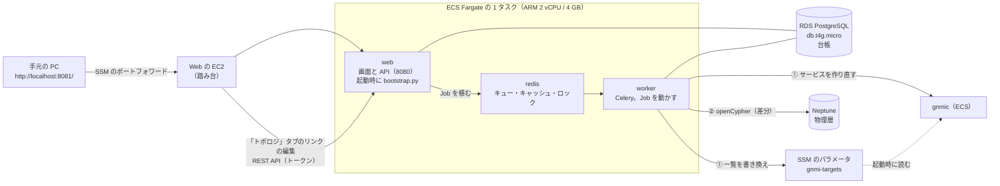
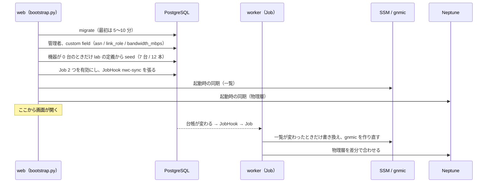
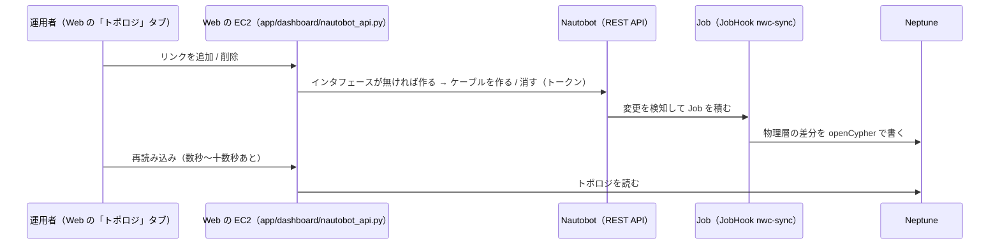
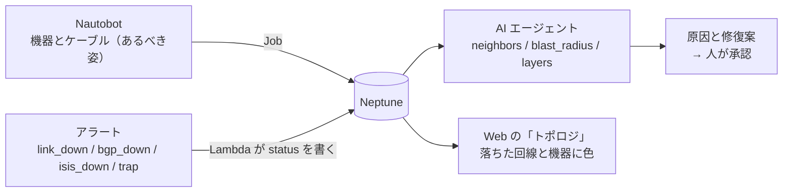

# Nautobot（構成・部品・使い方・Neptune と組み合わせた使いどころ）

Nautobot は、機器の一覧とケーブルの**正**（台帳）。`PIPELINE=1` なら立つ（`IaC/terraform/aws-managed/pipeline/nautobot`）。立たないのは `SKIP_STREAM` と `SKIP_GRAPH` を両方付けた回だけ（Job の書き先が無い。`ops/up.sh` の `NAUTOBOT`）。
Nautobot で機器・インタフェース・ケーブルを変えると、Nautobot の中の Job が gnmic の購読先と Neptune のトポロジを合わせる。
OSS 版（[oss-variant.md](oss-variant.md)）では、同じ Job が Neptune の代わりに Neo4j に書く（2026-10-08 に AWS で確かめた。[verification/20261008-oss-aws.md](verification/20261008-oss-aws.md)）。この文書の「Neptune」は、OSS 版では Neo4j と読み替える。

反映の決まりと注意の細かい一覧は [pipeline.md の「Nautobot」](pipeline.md#nautobot機器の一覧とケーブルの正)、質問と答えは [FAQ の 6 章](faq-fukuda-nwc-poc.md#6-nautobot機器の一覧とケーブルの正)。

- [1. 何のためにあるか](#1-何のためにあるか)
- [2. 構成（コンテナと AWS のリソース）](#2-構成コンテナと-aws-のリソース)
- [3. 部品ごとの役割](#3-部品ごとの役割)
- [4. 起動してから同期するまで](#4-起動してから同期するまで)
- [5. 使い方](#5-使い方)
- [6. Neptune と組み合わせた使いどころ](#6-neptune-と組み合わせた使いどころ)
- [7. 役割の分担（Nautobot と Neptune）](#7-役割の分担nautobot-と-neptune)
- [8. 押さえておくこと](#8-押さえておくこと)

---

## 1. 何のためにあるか

| | Nautobot | Neptune |
|---|---|---|
| 持つもの | あるべき姿（台帳）: 機器、インタフェース、IP、Service、ケーブル | いまの姿（グラフ）: 台帳の写し + アラートで変わる `status` + IP 層 / EVPN・BGP 層（修復案は 2026-10-05 から S3 Tables の `proposal_events`。Neptune には無い） |
| 変える人 | 人（Nautobot の画面、Web の「トポロジ」タブ）か、外のシステム（API） | Job、Lambda、`ops/up.sh` と `ops/sync-graph.sh`（人は直接変えない） |
| 読む人 | 運用者、Job | AI エージェント、Web の「トポロジ」タブ |
| 得意なこと | 入力の検査、変更の履歴、権限 | つながりをたどる（隣、影響の範囲、層をまたぐ紐づけ） |

人が編集する場所を Nautobot の 1 か所にし、機械が読む場所（gnmic の一覧と Neptune）へは Job が写す。

## 2. 構成（コンテナと AWS のリソース）



| リソース | 名前 | 中身 |
|---|---|---|
| ECS のクラスタ / サービス / タスク | `<prefix>-nautobot` | 1 タスクに 3 コンテナ（web・worker・redis）。同じタスクなので互いに `localhost` で届く |
| RDS | PostgreSQL `db.t4g.micro` | 台帳。`ops/down.sh` で消える。`NAUTOBOT_DB_AZ_NUM=2` なら Multi-AZ（別の AZ に待機系。既定 1） |
| SG | `<prefix>-nautobot` / `<prefix>-nautobot-db` | 画面へは Web の EC2 からだけ。DB へはタスクからだけ |
| 名前解決 | `nautobot.<prefix>-nautobot.internal:8080` | VPC の中の URL（SSM `/<prefix>/nautobot/url` にも書く） |
| ログ | `/ecs/<prefix>-nautobot` | ストリームは `web/`（migrate・bootstrap・画面）、`worker/`（Job）、`redis/` |
| シークレット | SSM の SecureString `/<prefix>/nautobot/{secret-key,admin-password,db-password,api-token}` | `ops/up.sh` が乱数で作る。タスクは ECS の secrets で受ける |
| イメージ | ECR `<prefix>-nautobot` | 公式イメージ `networktocode/nautobot:3.2.6-py3.12` に boto3 と下の「足したもの」を入れたもの |

LB は無い。閉域なので、画面は Web の EC2 を踏み台にしたポートフォワードで開く。費用は約 $0.13/h（`NAUTOBOT_DB_AZ_NUM=2` で RDS が Multi-AZ になると +$0.03/h）。

## 3. 部品ごとの役割

**Nautobot にもともとあるもの**

| 部品 | 役割 |
|---|---|
| web | 画面と REST API・GraphQL。Job を積む |
| Job の仕組み | Nautobot の中で動く Python。台帳を直接読み書きできる。きっかけは画面のボタン・スケジュール・API・台帳の変更（JobHook） |
| Celery worker | Job を実際に動かすプロセス（web と同じイメージを別のコマンドで起こす） |
| PostgreSQL | 台帳。Nautobot の必須の部品で、使う側が用意する（ここでは RDS） |
| Redis | web から worker へ Job を渡すキュー、キャッシュ、同期のロック。同じく使う側が用意する（ここではタスクの中のコンテナ。中身は消えてよい） |

**このリポジトリで足したもの**（`app/nautobot/`）

| ファイル | 役割 |
|---|---|
| `jobs/nwc_jobs.py` | Job 2 つ。`SyncTopology`「gnmic とグラフ DB に同期」（手で打つ）と `SyncOnChange`「変更のたびに gnmic とグラフ DB に同期」（JobHook `nwc-sync` が呼ぶ）。中身は同じ。名前はマネージド版（Neptune）と OSS 版（Neo4j）で同じで、説明に書き先の名前が出る（`nb_sync.GRAPH_NAME`）。JobHook と bootstrap は Job を名前でなくクラスの場所（`nwc_jobs.SyncOnChange`）で引くので、名前を変えても外れない |
| `nwc/nb_sync.py` | 同期の本体。台帳を読む → ① gnmic の一覧（SSM）と gnmic の作り直し → ② Neptune の物理層 |
| `nwc/nb_map.py` | 台帳とトポロジの対応付け（Nautobot に依らない純粋な関数。`tests/test_nautobot.py` が検査する） |
| `nwc/bootstrap.py` | web の起動時に 1 回走る用意（下の 4） |
| `docker/images/nautobot/Dockerfile`（007 で `app/nautobot/` から移した） | 公式イメージに上のファイルと `app/agentcore/graph.py`（Neptune へ openCypher で書く関数）・`app/agentcore/toolkit.py`、`lab_seed.json` を足す |

## 4. 起動してから同期するまで



- 最初の中身は、リポジトリの lab の定義（`app/containerlab/splab.clab.yml.in` と `app/containerlab/srlinux/*.cli`）を `app/containerlab/lab_topology.py` が JSON にしたもの。2 回目からは seed を飛ばし、Nautobot の中身が正になる。
- 同期は Redis のロックの中で「読む → 書く」をするので、Job が重なっても順に走る。片方（gnmic / Neptune）が失敗しても、もう片方はやる。

## 5. 使い方

### 開く

`ops/up.sh` の最後に出る 2 つのコマンドを使う（あとから出すなら下）。

```bash
terraform -chdir=IaC/terraform/aws-managed/pipeline/nautobot output -raw port_forward_command   # これを打つと http://localhost:8081/ で開く
```

```bash
terraform -chdir=IaC/terraform/aws-managed/pipeline/nautobot output -raw password_command       # admin のパスワードを出すコマンド
```

ユーザーは `admin`。パスワードは起動のたびに SSM の値へ戻る（画面で変えても残らない）。

### 台帳のどこを変えると、どこに映るか

| Nautobot で変えるもの | 映る先 |
|---|---|
| Device の Service `gnmi`（tcp） | gnmic が gNMI を購読する先 `<primary IPv4>:<ポート>` |
| Device の Service `snmp`（udp） | 購読先には入れない（機器が SNMP を喋る印。2026-10-09（cycle 013）に SNMP のポーリングをやめるまでは、Telegraf が SNMP を取りにいく先だった） |
| Device（名前、Location、Role、primary IPv4、custom field `asn`） | Neptune の `device`。Service がどちらかあれば「監視」 |
| Interface（名前、最初の IP、LAG の親） | Neptune の `interface` |
| Cable（両端が Interface。custom field `link_role` / `bandwidth_mbps`） | Neptune の回線。種類（fabric / l2 / lag）は両端の Role と LAG から決まる |
| Device の Status を `Maintenance` にする | Neptune の `device` の `maintenance`。保守中の機器の異常ではワークフローを起こさない（6 章の (5)） |
| どれかを作る・変える・消す（Nautobot の変更履歴 ObjectChange） | Neptune の頂点 `change`（新しい順に 50 件）。エージェントの `recent_changes` が読む（6 章の (6)） |

Role の名前は `spine` / `a-leaf` / `s-leaf` / `trex` を使う（回線の種類と Web の図の並びがこれを見る）。

### 同期を確かめる・手で打つ

- 画面の Jobs → Job Results に、変更 1 件ごとの結果（機器と回線の数、書き換えた一覧、Neptune に足した・変えた・消した数）が出る。
- 手で打つ: Jobs → 「gnmic とグラフ DB に同期」。JobHook が出ない変更（IP をインタフェースに付け替えただけ、など）のあとに使う。「gnmic を作り直す」にチェックすると、一覧が同じでも gnmic を作り直す。
- ログ: `aws logs tail /ecs/<prefix>-nautobot --follow`（`worker/` が Job）。
- Neptune の側は、Web の「トポロジ」タブで見る。

### 中に入る

```bash
terraform -chdir=IaC/terraform/aws-managed/pipeline/nautobot output -raw exec_command   # web コンテナのシェル（ECS Exec）。中で nautobot-server nbshell
```

### Web の「トポロジ」タブから回線を変える

運用管理者の Web（Gradio）の「トポロジ」タブ →「リンクを編集」でも回線を足す・消すことができる。書き先は Neptune ではなく Nautobot。



- トークンは SSM の SecureString `/<prefix>/nautobot/api-token`（`ops/up.sh` が作る）。Nautobot の側は起動時に `bootstrap.py` が同じ値でユーザー `nwc-web` のトークンを作る。
- 種別（fabric / l2 / lag）は画面で選んだものではなく、両端の機器の Role と LAG から Job が決める。役割（primary / secondary）と帯域はケーブルの custom field に入る。
- 片方のインタフェースにもうケーブルがあれば追加は断られる（先にそのリンクを消す）。削除はケーブルだけを消し、インタフェースは残る。
- 画面にあるのはリンクの追加・削除だけ。機器・Service・IP は Nautobot の画面で変える。
- 「静的データを投入」は Nautobot があるあいだ使えない（Job が物理層を Nautobot の中身に戻すため）。

## 6. Neptune と組み合わせた使いどころ

### (1) 機器を監視に入れる

1. Nautobot で Device を作り、管理用の Interface に IP を付けて primary IPv4 にし、Service `gnmi`（tcp 57400）を足す。
2. Job が SSM の `gnmi-targets` に `<IP>:57400` を足し、gnmic を作り直す（購読が数十秒切れる）→ その機器の telemetry が流れ始める。
3. 同じ Job が Neptune に `device` と `interface` を足す → Web の「トポロジ」に出て、エージェントの `list_devices` に入る。

台帳に 1 回書くだけで、「集める対象」と「トポロジの上の位置」が同時にそろう。監視から外すときは Service を消す（機器は Neptune に残り、「監視」だけ外れる）。

### (2) 配線を変える

Cable を足す・消す・つなぎ替えると、Neptune の回線が同じように変わる。エージェントの `neighbors`（隣の機器）と `blast_radius`（その機器が落ちたときに影響が届く範囲）は Neptune の回線をたどるので、答えが新しい配線に合う。

### (3) 障害のときに、影響の範囲と原因の候補を出す



- 回線の `status` が `DOWN` になると、Neptune の中で「その回線の両端は誰か」「主 / 副のどちらか（`link_role`）」「帯域はいくつか（`bandwidth_mbps`）」が台帳の値とつながっている。エージェントはここから「副の回線が残っているか」「どの機器まで影響するか」を答える。
- 物理の回線の上に IP 層（IS-IS の隣接）と EVPN・BGP 層（セッション）が紐づいているので、「この回線が落ちると、どの隣接とどのセッションが巻き込まれるか」を層をまたいでたどれる。物理層の土台が Nautobot の台帳。
- Job は `status` と上の層を消さずに差分だけ書くので、障害の最中に台帳を直しても、いまの状態は残る。

### (4) 台帳に無い機器から異常が来たのを見つける

トポロジに無い機器やインタフェースの異常は、Neptune に「未登録」の頂点として残る（Web の図では橙の点線の枠）。これは「台帳に載っていない機器が動いている」の知らせになる。Nautobot にその機器を足すと、Job が未登録の頂点を登録済みに置き換え、`UP` でない `status` は引き継ぐ。

### (5) 保守中の機器の異常では、調査を起こさない

Device の Status を `Maintenance` にすると、Job が Neptune の `device` に `maintenance` を付ける（`Maintenance` を機器の Status に選べるようにするのは起動時の `bootstrap.py`。対象の名前は `nb_map.py` の `MAINTENANCE_STATUSES`）。

- アラートの機器か、落ちた回線の相手の機器が保守中なら、ワークフローを起こさない（`app/temporal/rules.py` の `maintenance_hold`。starter のログに `skip … 保守中の機器`）。Neptune の `status` は今までどおり変わるので、Web の図には出る。
- エージェントの `list_devices` と `root_cause` は `maintenance` を返す。根本原因の機器が保守中なら「作業によるものの可能性」と添える。
- Status を `Active` に戻すと `maintenance` は外れる。戻したあとに来たアラート（Grafana は 4 時間ごとに送り直す）から、また調査が起きる。
- Neptune を読めないときは、保守中と見なさずに起こす（止める側に倒さない）。

### (6) 障害の直前に台帳の何が変わったかを引く

Nautobot は変更のたびに ObjectChange（だれが・いつ・何を・どう変えたか）を残す。Job は同期の最後に、新しい順に 50 件（`nb_map.py` の `CHANGES_KEEP`）を Neptune の頂点 `change` に写す（無いものだけ足し、50 件から外れたものは消す）。

- エージェントの `recent_changes`（`device_id` で絞れる）がこれを読む。調査のプロンプトにも「直前の構成変更は `recent_changes`」と入れてある。
- 1 件は `time` / `user` / `action` / `object_type` / `object` / `device_id` / `detail`（変わった項目。例 `status: Active → Maintenance`）。
- Runtime と tools Lambda から Nautobot へは届かせていない（経路も IAM も足さない）。Neptune に写すのはそのため。
- 写るのは Job が走ったときまでの分。JobHook が出ない変更（IP の付け替えだけ、など）は、次に Job が走ったときに入る。

### (7) 本番の機器の一覧を外から入れる（PoC には未実装）

- 外のシステム（SDN コントローラや構成管理のワーカー）が Nautobot の API で書く。JobHook は API からの変更でも出るので、gnmic の一覧とグラフ DB（Neptune。OSS 版は Neo4j）への反映は今のまま動く。
- Nautobot の側から取りにいく（SSoT アプリや Device Onboarding アプリ。中身は Job）。
- どちらでも、5 の表の形（Service `gnmi` / `snmp`、custom field）で入れること。今は閉域で、外から Nautobot へ届く経路と API トークンの用意は入っていない。

## 7. 役割の分担（Nautobot と Neptune）

Neptune に書くものは 4 つあり、書き手が分かれている。Nautobot から入るのは物理層（保守中の印を含む）と変更履歴。

| Neptune に書くもの | 書き手 | 元の情報 |
|---|---|---|
| 物理層（機器・IF・回線） | Nautobot の Job（`app/agentcore/graph.py` の `sync_physical()`。差分） | Nautobot の台帳 |
| 変更履歴（頂点 `change`。新しい順に 50 件） | Nautobot の Job（`app/agentcore/graph.py` の `sync_changes()`） | Nautobot の ObjectChange |
| IP 層 / EVPN・BGP 層 | `ops/up.sh` の手順 7-3b、`ops/sync-graph.sh` | lab の定義（SR Linux の設定）。Nautobot には無い |
| `status` | Lambda `<prefix>-graph-status` | アラート（SNS） |

修復案は Neptune に書かない（2026-10-05 から。S3 Tables の `proposal_events` に worker だけが書く。[data-stores.md](data-stores.md)）。

Web の「トポロジ」タブのリンクの追加・削除は、Neptune ではなく Nautobot に書く（SSM `/<prefix>/nautobot/url` があるあいだ。5 章）。Web が Neptune の物理層を直接書くことはない。

## 8. 押さえておくこと

- `ops/down.sh` で DB ごと消える。Nautobot で編集した内容は残らず、作り直すと lab の定義から入り直す。
- 機器が 1 台も無いときは Neptune を触らない（空で合わせると物理層が全部消えるため）。
- 機器の名前を変えると、Neptune では別の機器になる（名前が頂点の ID）。その機器の `status` と上の層へのつながりは消える。
- 一括で変えると、変更 1 件ごとに Job が走り、一覧が変わるたびに gnmic が作り直される。大きく変えるときは JobHook `nwc-sync` を止めてから変え、最後に手で Job を打つ。
- `ops/sync-graph.sh --replace` は lab の定義で上書きする。Nautobot で足したものは、Job を打つまで Neptune から消える。
- デバッグ用の EC2（`ops/lab-debug.sh`）は Nautobot を使わない。
- AWS で確かめたのは、起動・seed・Job と JobHook の登録・起動時の同期まで。Nautobot での変更 → JobHook → SSM / gnmic / Neptune と、Web からの Nautobot への書き込みは、まだ AWS では確かめていない（手元のテスト `tests/test_nautobot.py` と、手元の Docker で起こした Nautobot 3.2.6 への REST API だけ）。
