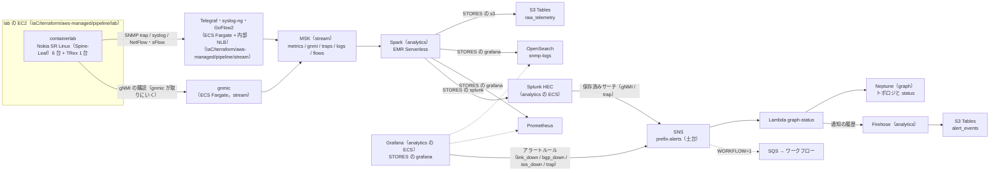
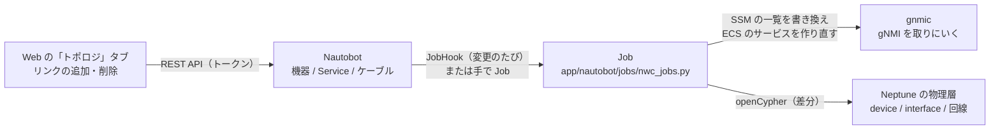

# パイプライン（PIPELINE）

← [README](../README.md)

`<prefix>` は `deploy.env` の `OWNER` から作る接頭辞 `<owner>-nwc-poc`。`deploy.env` に `PIPELINE=1` を書いて `ops/up.sh` を打つと、下の全部ができる。



### lab の構成

- lab は Web やエージェントとはつながっていない。使うのは gNMI・SNMP trap・ログの発生源としてだけ。
- lab は Spine-Leaf（EVPN-VXLAN）。WAN 側の s-leaf 2 台と DC 側の a-leaf 2 台が Spine 2 台とフルメッシュ（fabric。IS-IS）。
- 負荷をかける TRex 1 台（`dc1-trex-01`）が各 leaf の `ethernet-1/3` に 1 本ずつつながる。
  LAG も EVPN マルチホーミングも無い。TRex 本体は `sudo lab trex start` まで動かない。
- 機器の定義は `app/containerlab/gen_lab.py` が作る（[lab を変える](#lab-を変える)）。
- SR-MPLS は SR Linux のコンテナが `ixr6e` / `ixr10e` + ライセンスを要る。
  ライセンスが届くまで license 不要の `ixr-d2l` で EVPN-VXLAN にしている。

### Telegraf（trap）

- Telegraf は stream の ECS（Fargate ARM64、0.25 vCPU / 0.5 GB）のサービス `<prefix>-telegraf-dialout`（`IaC/terraform/aws-managed/pipeline/stream/telegraf.tf`）。
  内部 NLB の後ろで SNMP trap だけを受けてトピック `traps` に書く。
- 取りにいく側（`<prefix>-telegraf-dialin`）は無い。gNMI は下の gnmic が取り、SNMP のポーリングはしない（[collection.md](collection.md)）。
- イメージは `docker/images/telegraf/Dockerfile`（公式の `telegraf:1.40.1` に `telegraf.conf.in` と `tg` を入れたもの）。
  `ops/up.sh` が ECR の `<prefix>-telegraf:<版>-<ディレクトリのハッシュ 12 文字>` に作る。
- MSK のブローカーは環境変数 `KAFKA_BROKERS`。起動時に `tg run` が設定を埋める。

### gnmic（gNMI）

- gNMI は gnmic（v0.49.0）が機器へ取りにいく（`IaC/terraform/aws-managed/pipeline/stream/gnmic.tf`）。
- Telegraf と同じクラスターのサービス `<prefix>-gnmic`（Fargate ARM64、0.25 vCPU / 0.5 GB、1 タスク固定、NLB なし）。
- 2 つ動くと同じ機器を 2 回購読して Kafka に重複が出る。
  作り直すときは古いタスクを止めてから新しいタスクを立てる。
- イメージは `docker/images/gnmic/Dockerfile`（公式の `ghcr.io/openconfig/gnmic:0.49.0` に `app/gnmic/gnmic.yaml.in` と入口の `gn` を入れたもの）。
  `ops/up.sh` が ECR の `<prefix>-gnmic:<版>-<ディレクトリのハッシュ 12 文字>` に作る（版は `ops/up-common.sh` の `GNMIC_VERSION`）。
- 購読先は SSM の `/<prefix>/gnmic/nautobot/gnmi-targets`（String）にあり、タスクが ECS の secrets で環境変数 `GNMI_TARGETS` として受ける。
- 最初の値は `ops/up.sh` が lab の定義から作って stream の変数 `gnmi_targets` に渡したもの。
  そのあとは Nautobot の Job が書き換える（Terraform は値の変化を見ない。下の「Nautobot」）。
- Kafka へは syslog-ng・GoFlow2 と同じ SASL/SCRAM（9096/tcp）で書く。ユーザーは gnmic 専用の `gnmic`（Secrets Manager の `AmazonMSK_<prefix>-gnmic`。cycle 031）。
  起動時に `gn run` が設定を埋める。

#### gnmic の書き込みと ACL

- マネージドの MSK は IAM と SCRAM の併用。
- `gnmi` と `metrics` の ACL は、syslog-ng・GoFlow2 の分と一緒に Spark が起動時に入れる（下の `ensure_acls`）。
  ACL が入るまで gnmic は書けず、その間の値は捨てる（`allow.everyone.if.no.acl.found=false`。下の「収集器の ACL」）。
- 2026-10-09 の AWS（当時は既定の true）では、Spark を起こさずに `metrics` に書けた。2026-10-10 に false にしてからの AWS は未確認。
- 同じ日、`gnmi` はトピックができず、on-change の 3 つの購読（`interface_state` / `bgp_neighbor` / `isis_interface`）からは 1 件も書かれていなかった（gnmic のログに ERROR は 0）。
  原因は確かめていない（ACL のせいではない）。
  030 で出力に buffer を足した（下の「gnmic の購読」）が、これで直るかは AWS で未確認。
  この回は `gnmi` のトピックそのものが無かった（当時は自動作成が有効）ので、event が gnmic の出力に 1 件も届いていなかった見込みが高い。直らなければ上流（機器の初期同期、gnmic の受信）を疑う。
  いまは Spark が `gnmi` を作るので、トピックの有無では見分けられない（件数で見る）。
- 根拠は `docs/verification/20261009-aws-managed.md` の「A.」「B.」。
- OSS 版の Kafka は認証なしなので ACL は当たらない。

### syslog-ng と GoFlow2

- syslog と NetFlow / sFlow は、同じクラスターと NLB の後ろの別のサービスで受ける（`IaC/terraform/aws-managed/pipeline/stream/collectors.tf`）。
  どちらも 1 タスク、Fargate ARM64、0.25 vCPU / 0.5 GB。
- syslog-ng（`<prefix>-syslog-ng`）は `docker/images/syslog-ng/Dockerfile`（公式の `ghcr.io/axoflow/axosyslog:4.29.0` に `app/syslog-ng/` を入れたもの）。
  `ops/up.sh` が ECR の `<prefix>-syslog-ng:<版>-<ディレクトリのハッシュ 12 文字>` に作る。
- syslog-ng はトピック `logs` に Telegraf と同じ `device_log` の形で書く。
- GoFlow2（`<prefix>-goflow2`）は公式の `netsampler/goflow2:v2.2.7` を ECR の `<prefix>-goflow2:v2.2.7` にミラーしたもので、トピック `flows` に書く。
- どちらも MSK の IAM 認証を話せないので、SASL/SCRAM（9096/tcp、SCRAM-SHA-512）で書く。
- ユーザー名とパスワードは `ops/up.sh` がコレクターごとに Secrets Manager の `AmazonMSK_<prefix>-syslog-ng` / `AmazonMSK_<prefix>-goflow2` に作る
  （gnmic の分は `AmazonMSK_<prefix>-gnmic`。無いときだけ。値は出さない）。ユーザー名はコレクター名（cycle 031。下の「収集器の ACL」の表）。
  顧客管理の KMS キー `alias/<prefix>-msk-scram`（3 本で 1 本）で暗号化する（MSK の SCRAM はこの 2 つを要る）。
- タスクは起動時に ECS の secrets で自分の secret だけを受ける。
  `ops/down.sh` が secret を 3 本ともすぐ消し、鍵は 7 日後の削除を予約する（手順 5-3）。1 本でも消せなければ鍵は残す（消すと残った secret を復号できない）。

### SNMP

- SNMP のポーリング（Telegraf の `inputs.snmp`）はしない。
- IF の up / down は gnmic の gNMI（IF の `oper-state` / `admin-state`）で取り、Splunk は linkDown / linkUp の trap からも知る。
- `deploy.env` の `SNMP_POLL` はもう使わない（書いてあれば `ops/up.sh` が注意を出して続ける）。

### 機器から収集器への経路

- 機器は lab の EC2 の中の docker network（`203.0.113.0/24`）にいる。
- gnmic のタスクからの gNMI の購読（`57400/tcp`）は、VPC のルートで lab の EC2 を通る。
  タスクの IP は作り直すたびに変わるので、送り元はタスクのサブネットの CIDR（SSM `/<prefix>/telegraf-source-cidr`。名前は Telegraf のときのまま）で通す。
- trap（`162/udp`）と syslog（`5140/udp`）と NetFlow（`2055/udp`）・sFlow（`6343/udp`）は、機器が lab の EC2（`203.0.113.1`）へ送る。
  lab の EC2 が Telegraf の NLB の IP（SSM `/<prefix>/telegraf-address`）へ DNAT する。
- NLB は trap を Telegraf のタスクの `1162/udp` へ、syslog を syslog-ng の `5140/udp` へ、NetFlow / sFlow を GoFlow2 の `2055/udp` / `6343/udp` へ渡す（UDP なので送り元の IP はそのまま）。
- SR Linux は NetFlow を送れない。NetFlow は lab の EC2 から `python3 ops/netflow_send.py <NLB の IP>:2055` で 1 パケット送って確かめる。
  syslog も lab の EC2 から `logger -n <NLB の IP> -P 5140 -d --rfc3164 -t acl-probe "…"` で試せる（手順は [troubleshooting.md](troubleshooting.md) の「syslog の試験行が logs に入らない」の「正しい送り方」）。
- この 5 つは lab の EC2 で `sudo lab forward` が張る。
  `lab up` が毎回呼び、`ops/up.sh` も手順 7-2b で打つ（lab の変数 `forward_to_telegraf`）。

### gnmic の購読

- gnmic の購読は 5 つ（`app/gnmic/gnmic.yaml.in`）。購読ごとに別の SubscribeRequest なので、1 つが機器に断られてもほかは止まらない。
  - `interface_state`: IF の `oper-state` と `admin-state`（on_change、`gnmi`）
  - `interface_stats`: IF の `statistics`（カウンタ。60 秒ごと、`metrics`）
  - `bgp_neighbor`: BGP の `session-state`（on_change、`gnmi`）
  - `isis_interface`: IS-IS の IF の `oper-state`（on_change、`gnmi`。隣接そのもの（`interface/adjacency`）は落ちると down を経ずに消えるので取らない）
  - `system`: CPU（`cpu[index=all]/total`）とメモリ（60 秒ごと、`metrics`）。2026-10-09 の AWS では `system` の event 13 件のうち 7 件に `cpu_index` のタグがあった
- 状態はトピック `gnmi`、カウンタはトピック `metrics` に、gnmic の event の形（`name` / `timestamp` / `tags` / `values`）のまま書く。
  Spark が Telegraf と同じ形（measurement・タグ・項目）に読み替える（`app/spark/snmp_sinks.py` の `gnmic_message`。[collection.md](collection.md)）。
- target の名前は機器の管理 IP（event の `tags.source`）で、機器名（`sysName`）は Spark が device map で足す。
- on_change は購読の直後に今の状態を全部送り、そのあとは変わったときだけ送る。
  - gnmic の出力は既定（`buffer-size` 0 / `timeout` 5s）では、Kafka への送り手が詰まっているあいだ（ブローカーの応答待ち、再接続）に 5 秒を超えて待たされた応答を黙って捨てる。
    取りこぼしの手当てとして、出力の `gnmi` / `metrics` に `buffer-size: 10000` / `timeout: 60s` を付けて抱えて待つ（030）。
    producer は接続を待たずに出来るので、初回値が 1 件も無い件（上の「gnmic の書き込みと ACL」）にこれが効く見込みは薄い。その件は機器の初期同期と gnmic の受信を見る（[troubleshooting.md](troubleshooting.md)）。
- `values` の無い event（2026-10-09 の AWS で `metrics` の 400 件中 359 件。`deletes` だけの event も）は、出力の側の processor `drop-empty`（`event-drop`）で捨てて Kafka に書かない（030）。
  Spark の `read_rows` もこれらは読んで捨てていた。
- Grafana のルール `link_down` / `bgp_down` / `isis_down`（`STORES` に `grafana` があるとき）と Splunk の保存済みサーチ `nwc_gnmi`（`STORES` に `splunk` があるとき）は、ここから次を出す（下の「アラート」）。
  - `link_down`（物理 IF が対象）
  - `bgp_down`（相手の IP が対象）
  - `isis_down`（サブインタフェースが対象）

### Spark

#### トピックを作る

- Spark は起動時に、読むトピック（`metrics` / `gnmi` / `traps` / `logs` / `flows`）のうち無いものを作る（`snmp_sinks.py` の `ensure_topics`。EMR のロールに `kafka-cluster:CreateTopic`）。
- MSK は `auto.create.topics.enable=false`（`msk.tf` の `aws_msk_configuration`。2026-10-10 に true から変えた）。書き込みでトピックはできない。
  5 つのトピックを作るのは Spark のこの処理だけ（Kafbat UI の画面から作ることもできる）。
  Telegraf のタスクロールから `kafka-cluster:CreateTopic` を外した。
- SASL/SCRAM で書く syslog-ng・GoFlow2・gnmic には CREATE の ACL を付けない（`allow.everyone.if.no.acl.found=false` なので、ACL の無い操作は全部拒まれる）。
- true だった 2026-10-09 の AWS では、Spark を起こしていないのに `flows` / `logs` / `metrics` があった（各 2 パーティション。収集器の書き込みでできたと見ている。`docs/verification/20261009-aws-managed.md` の「A.」）。
  `gnmi` は無かった（上の「gnmic の書き込みと ACL」）。
- `SKIP_ANALYTICS=1`（Spark を起こさない）だとトピックも ACL もできないので、収集器は何も書けない（[deploy.md](deploy.md) の `SKIP_ANALYTICS`）。
- 無いトピックを購読するとジョブは offset 読みで落ちて、起こし直しの上限（1 時間 5 回）を使い切る（2026-09-27 に実測）。

#### 収集器の ACL

- Spark は続けて、SASL/SCRAM の収集器のユーザーごとに、自分のトピックの `WRITE` と `DESCRIBE` の ACL を入れる（`snmp_sinks.py` の `ensure_acls` と `SCRAM_USERS`。EMR のロールに `kafka-cluster:AlterCluster`）。
- ユーザーはコレクターごとに分けてある（cycle 031）。1 つの資格情報が漏れても、ACL が効いていれば、ほかのコレクターのトピックには書けない。

| コレクター | secret（Secrets Manager） | ユーザー | ACL を入れるトピック |
|---|---|---|---|
| syslog-ng | `AmazonMSK_<prefix>-syslog-ng` | `syslog-ng` | `logs` |
| GoFlow2 | `AmazonMSK_<prefix>-goflow2` | `goflow2` | `flows` |
| gnmic | `AmazonMSK_<prefix>-gnmic` | `gnmic` | `gnmi`、`metrics` |

- 名前の一覧は `ops/up.sh` / `ops/down.sh` の 3 行、`msk.tf` の `scram_collectors`、`SCRAM_USERS` で揃える（`tests/test_stream.py` と `tests/test_analytics.py` が見る）。
- MSK は `allow.everyone.if.no.acl.found=false`（`msk.tf` の `aws_msk_configuration`。2026-10-10）。ACL の無い資源には super user しか触れない。
  - SCRAM のユーザーは、ACL の無いトピック（`traps`。Telegraf が IAM で書く）と、ほかのコレクターのトピックと、無いトピックに書けない。ACL が入る前は自分のトピックにも書けない。
  - IAM の主体（Telegraf・Spark・Kafbat UI）は Kafka の ACL と関係なく IAM のポリシーで動く（AWS の文書 `iam-access-control.html`）。
  - ブローカーは MSK が super user にしているので、複製と内部トピック（`__consumer_offsets` / `__amazon_msk_*`）に ACL は要らない（`msk-acls.html`。2026-10-10 確認）。
  - 手元の Kafka（`apache/kafka:4.3.1`、StandardAuthorizer、同じ 2 つの設定）で 2026-10-10 に確かめた。ACL の前は自分のトピックも拒否、ACL のあとは自分のトピックだけ書け、
    `traps`・ほかのコレクターのトピック・無いトピックは `TopicAuthorizationException`。super user でも無いトピックはできない（auto create が無効）。MSK では未確認。
- 2026-10-09 の AWS（当時は既定の true、`SKIP_ANALYTICS=1`）では、ACL が無いまま syslog-ng・GoFlow2・gnmic が書けていた（`docs/verification/20261009-aws-managed.md` の「A.」）。これが穴で、false にして閉じた（031 の cold review の Should fix）。

トピックごとに書く者と読む者:

| トピック | 書く | ACL（SCRAM） | 読む（全部 IAM） |
|---|---|---|---|
| `logs` | syslog-ng（SCRAM `syslog-ng`） | `User:syslog-ng` の `WRITE` / `DESCRIBE` | Spark（consumer group `spark-kafka-source-*`）、Kafbat UI |
| `flows` | GoFlow2（SCRAM `goflow2`） | `User:goflow2` の `WRITE` / `DESCRIBE` | 同上 |
| `gnmi` | gnmic（SCRAM `gnmic`） | `User:gnmic` の `WRITE` / `DESCRIBE` | 同上 |
| `metrics` | gnmic（SCRAM `gnmic`） | `User:gnmic` の `WRITE` / `DESCRIBE` | 同上 |
| `traps` | Telegraf（IAM のタスクロール） | 無し（SCRAM のユーザーは誰も書けない） | 同上 |
| 内部トピック（`__consumer_offsets` 等） | ブローカー（super user） | 無し | ブローカー |

- 読む側（Spark、Kafbat UI）と Telegraf は IAM なので Kafka の ACL は入れない。Lambda で Kafka を読むものは無い。
- 書けないとき（`Topic authorization failed` など）も、どれも落ちない。
  - syslog-ng は syslog をメモリのキュー（既定 10000 件。syslog-ng が起こし直すと消える）で持って、書けるようになったら書く。
  - GoFlow2 はその間のフローを、gnmic はその間の値を捨てる。
  - syslog-ng と GoFlow2 は手元の Kafka で 340 秒の待ちを測った。gnmic は測っていない。
- 入れた ACL は driver の stderr に次のように出る。入れられなければジョブは起動で落ちる。
  `ACL: User:syslog-ng WRITE logs, User:syslog-ng DESCRIBE logs, User:goflow2 WRITE flows, User:goflow2 DESCRIBE flows, User:gnmic WRITE gnmi, User:gnmic DESCRIBE gnmi, User:gnmic WRITE metrics, User:gnmic DESCRIBE metrics`
- `KAFKA_AUTH=none`（OSS 版・手元の compose）は Kafka に authorizer が無いので入れない。

### 格納先と検知

- メトリクスとログの履歴の正本は S3 Tables（`raw_telemetry`）。Spark は格納先へ流すだけで、異常の検知はしない。
- 検知は Grafana と Splunk のアラートで、SNS のトピック `<prefix>-alerts` に出す（下の「アラート」）。
- 障害の履歴は、アラートの通知 1 件を 1 行として S3 Tables の `alert_events` に置く（下の「アラートの履歴」、[data-stores.md](data-stores.md)）。
- analytics は graph が無くても作れる（Neptune に書くのは SNS を購読する graph の Lambda だけ）。
  `SKIP_GRAPH=1` だと、トポロジは `app/agentcore/data/` の静的データになり、アラートが届いても `status` を書く先が無い。
- テーブルバケットは `STORES` に `s3` が無くても作る（証跡の置き場）。`ops/down.sh` はバケットごと消すので、証跡も消える。

### Splunk

- Splunk（`STORES` の `splunk`）は Spark（既定は driver。`HTTP_SEND=executor` なら executor）が全トピックを HTTP Event Collector（HEC）に POST する（ほかの格納先と同じ形）。
- analytics の ECS に Splunk Enterprise を既定では 1 タスク立てる。
  - イメージは `docker/images/splunk/Dockerfile`。公式の `splunk/splunk:10.4.4` に検知のアプリ `nwc_alerts` を足し、ECR の `<prefix>-splunk:10.4.4-<ディレクトリのハッシュ 12 文字>` に作る。
  - amd64 しか無いので Fargate x86、2 vCPU / 4 GB、エフェメラルストレージ 40 GiB。
- Spark は Cloud Map の `https://splunk.<prefix>.internal:8088` に送る（イメージの自己署名の証明書なので検証しない）。
- 起動時に Splunk のライセンスと Splunk General Terms に同意する（`SPLUNK_START_ARGS=--accept-license`、`SPLUNK_GENERAL_TERMS=--accept-sgt-current-at-splunk-com`）。
- 試用ライセンス（60 日、1 日 500 MB）。
- admin のパスワード `/<prefix>/splunk/admin-password` と HEC の token `/<prefix>/splunk/hec-token`（uuid）は、`ops/up.sh` が SSM の SecureString に作る（値は出さない）。
  `ops/down.sh` が消す。
- index はタスクのエフェメラルストレージにあり、タスクと一緒に消える（検証用）。
- `ops/up.sh` は手順 7-4b でタスクが HEALTHY になるのを待ってから（最大 20 分）Spark のジョブを起こす。画面は下の「Grafana と Splunk を開く」。
- AWS の外の Splunk（Splunk Cloud など）へ送る道は無い（VPC から AWS の外へ出る経路を作らない）。`SPLUNK_HEC_URL` が書いてあると `ops/up.sh` が止まる。
- HEC が 4xx を返したまとまり（最大 500 件）は捨ててログに出し、ジョブは止めない。5xx は再送する。

#### Splunk のクラスター

- `SPLUNK_AZ_NUM` を 2 か 3 にすると indexer のクラスターになる（Splunk をクラスターにする（004））。
  2026-10-05 に `SPLUNK_AZ_NUM=2` を AWS で確かめた（`3` は未確認）。
- タスクは次のとおり。
  - cluster manager 1（`splunk-cm.<prefix>.internal`）
  - indexer が AZ ごとに 1（`splunk-idx.<prefix>.internal`。全部のイベントを互いに複製する）
  - search head 1（`splunk.<prefix>.internal`。検索、UI、保存済みサーチ）
- Spark の送り先は `https://splunk-idx.<prefix>.internal:8088` に変わる。
- 合言葉 `/<prefix>/splunk/idxc-secret` も `ops/up.sh` が SSM の SecureString に作る。
- index は `main` だけ（`SPLUNK_INDEX` と一緒には書けない）。1 台とクラスターを切り替えると空から始まる。
- 手順 7-4b は全部のタスクの HEALTHY を待つ。
  そのあと search head が indexer を全部検索できること（ログの `nwc-peer-check state=ok reason=peers_up:<indexer の数>`）を最大 6 分待つ。
- indexer は止められると先に `splunk offline` を打つ（ログに `nwc-offline: start` と `nwc-offline: rc=0 <秒>s`）。
- くわしくは [architecture/resources/splunk.md](architecture/resources/splunk.md)。

## lab に入る

lab の EC2 に入るには管理者用のシェルセッション（`SSM-SessionManagerRunShell`）が要る。

```bash
LAB_INSTANCE_ID=$(terraform -chdir=IaC/terraform/aws-managed/pipeline/lab output -raw lab_instance_id); echo "$LAB_INSTANCE_ID"
aws ssm start-session --region ap-northeast-1 --target "$LAB_INSTANCE_ID"
```

入ったら、セッションの中で打つ。

| コマンド | 何をする |
|---|---|
| `sudo lab status` | 7 コンテナが running か |
| `sudo lab check` | BGP EVPN の隣接（Spine の RR）、IS-IS の隣接、TRex の回線（各 leaf の `ethernet-1/3` と `dc1-trex-01` の `eth1`〜`eth4` が up か）、SNMP |
| `sudo lab failover` | DC 側 Leaf の fabric（`dc1-a-leaf-01 ethernet-1/1`）を落とし、経路が `dc1-spine-02` だけに切り替わるのを見る（最大 60 秒） |
| `sudo lab heal-main` / `sudo lab fail-main` | その fabric を戻す / 落とすだけ |
| `sudo lab fail-bgp` / `sudo lab heal-bgp` | `dc1-a-leaf-01` の iBGP（EVPN）の隣接 1 本（`dc1-spine-01` = `10.255.0.1`）の neighbor を disable / enable にする（回線は落とさない。`bgp_down` を出す） |
| `sudo lab trap-test` | link 以外の trap（`.1.3.6.1.4.1.8072.2.3.0.1`）を `dc1-trex-01` から 1 通送る（`trap` を出す） |
| `sudo lab snmp dc1-a-leaf-01` | 1 台の ifName / ifAdminStatus / ifOperStatus（EC2 から snmpwalk。admin up の IF だけ） |
| `sudo lab logs` | 機器のログ（`/var/log/srlinux/file/messages`）の末尾。1 台だけなら `sudo lab logs dc1-a-leaf-01`、行数は `LINES=50` を前に付ける |
| `sudo lab cli dc1-a-leaf-01 "show network-instance default protocols bgp neighbor"` | 1 台に SR Linux の CLI を 1 つ打つ |
| `sudo lab graph` / `sudo lab graph-stop` | 機器とリンクの図（`containerlab graph`）を EC2 の `127.0.0.1:50080` で裏に起こし、手元で打つポートフォワードのコマンドを出す / 止める（下） |
| `sudo lab forward-status` | Telegraf（ECS）への転送（iptables の規則と、機器側の remote-server / trap-group）。張り直すのは `sudo lab forward` |
| `sudo lab trex start` / `stop` / `status` | TRex 本体（stateless のサーバ）を `dc1-trex-01` の中で起こす / 止める / 見る。負荷の撃ち方は `app/containerlab/trex/README.md` |
| `sudo lab clab inspect --all` | containerlab をそのまま呼ぶ |

- 機器とリンクの図: `sudo lab graph` は `containerlab graph` を systemd の一時ユニット `<prefix>-lab-graph` で起こす（SSM のセッションを閉じても残る）。
  止めるのは `sudo lab graph-stop` か `sudo lab down`。
  - 手元の PC で `terraform -chdir=IaC/terraform/aws-managed/pipeline/lab output -raw graph_port_forward_command` を打ち（`sudo lab graph` も同じコマンドを出す）、`http://localhost:50080/` を開く。
  - lab の EC2 への SSM のポートフォワードなので、SG は開けない。
  - 図のページが CDN から部品を読むかは [010 の build.md](cycles/010-kafbat-ui-on-web-ec2/build.md) に書く（閉域では CDN に届かない）。AWS では未確認。
- 機器の CLI: `sudo docker exec -it clab-splab-dc1-a-leaf-01 sr_cli`（1 行だけなら `sudo lab cli dc1-a-leaf-01 "show ..."`）。
  設定は `app/containerlab/srlinux/<機器>.cli`（`set /` の行だけ。containerlab が起動時に流し込む。手で直さず `app/containerlab/gen_lab.py` で作り直す）
- `sudo lab failover` を打つと、trap が 5 秒以内に Kafka に届く（2026-09-27 に EC2 で確認）。
  - そのあと既定（`STORES=s3,grafana,splunk`）では、Splunk が linkDown の trap と gNMI の IF の `oper-state` から `link_down` を、gNMI から `isis_down` を出す。
  - Grafana のルールも gNMI から物理 IF の同じ `link_down` と同じ `isis_down` を出す（同じ機器・種類・対象なので、異常としては 1 つにまとまる）。
  - `sudo lab heal-main` で `resolved` が出る。落としてから通知までは 1〜2 分（下の「アラート」の遅れ）。
  - gNMI の `link_down` の発火は AWS では未確認（2026-10-09 の AWS では、元になる `gnmi` トピックに 1 件も書かれていなかった。上の「gnmic の書き込みと ACL」）。
- 機器のログは SR Linux の `system logging remote-server`（RFC 5424、udp）で lab の EC2 へ出て、stream の syslog-ng が受ける。
  - syslog-ng は Telegraf と同じ形でトピック `logs` に出す（measurement は `device_log`。hostname は `sysName` タグに付け替える。`app/syslog-ng/syslog-ng.conf.in`）。
  - 送る subsystem は bgp / chassis / evpn / isis / lag / linux / netinst / xdp（informational 以上）。
  - ファシリティは本番の Cisco（IOS の既定）に合わせて `local7`（`system logging subsystem-facility`。SR Linux の既定は `local6`）。
- syslog の形式は syslog-ng のタスクの環境変数 `SYSLOG_STANDARD` で選ぶ（stream の変数 `syslog_standard`。`RFC5424` なら `syslog-ng.conf.in` の `flags(syslog-protocol)`）。
  - 既定は本番の Cisco IOS の BSD 形式 `RFC3164`。`ops/up.sh` は `deploy.env` の `SYSLOG_STANDARD`（空なら同じ `RFC3164`）を渡す。
  - lab の SR Linux は RFC 5424 で送る（`ops/lab-common.sh` の `LAB_SYSLOG_STANDARD`）ので、lab のログの項目まで見るなら `SYSLOG_STANDARD=RFC5424`。
  - デバッグ用の EC2 は syslog を受けない（syslog-ng は stream と手元の compose だけ）。
  - Cisco IOS の既定のヘッダー（シーケンス番号や `*` 付きの時刻）が RFC3164 でどう解析されるかは実機で確かめていない。
- gNMI は containerlab が全ノードで `57400/tcp`（TLS、containerlab の既定の admin）に開く（SNMP も v2c の community `public` で入るが、使うのは trap だけ）。
  - gnmic は gNMI の認証情報を SSM の SecureString（`/<prefix>/gnmic/gnmi-username`・`gnmi-password`）から受ける。`ops/up.sh` が lab の既定値で作り、あれば触らない。
  - 実機を足すなら SSM の値を書き換えて、gnmic のサービスを作り直す（`aws ecs update-service --force-new-deployment`）。
  - 監視対象は `app/containerlab/srlinux/<機器>.cli` の `system snmp trap-group`（trap の宛先）の有無で決まり、いまは SR Linux の 6 台全部。TRex は対象外。
- SR Linux は未使用の物理ポートも IF として出す（`admin-state` が disable）。IF の鍵は `ifName`（gNMI の `interface[name]` を Spark が付け替えたもの）。
- Grafana と Splunk の `link_down` は admin-state が disable の IF、サブインタフェース（`ethernet-1/1.0`）、ループバック、管理ポートを見ない。

### 動かないとき

```bash
systemctl is-active <prefix>-lab
sudo journalctl -u <prefix>-lab -n 50 --no-pager
sudo tail -n 50 /var/log/cloud-init-output.log
sudo systemctl restart <prefix>-lab
```

- ECR からイメージを取れない（`docker pull` がタイムアウトする）:
  - ecr.api / ecr.dkr のエンドポイントが `ops/up.sh` の手順 0 の一覧にあるか、レイヤーを取る S3 の gateway エンドポイントがプライベートのルートテーブルに載っているかを見る。
  - `explicit deny` なら VPC のエンドポイントを通っていない（[troubleshooting.md](troubleshooting.md) の「閉域」）。
- SR Linux が起きない（`containerlab deploy` が readiness で止まる）:
  - SR Linux 6 台で 10 GB ほど、TRex を足して 11〜13 GB の見込みなので `free -m` を見る。
  - 既定の `m6i.xlarge` は 16 GB。足りなければ `instance_type = "m6i.2xlarge"`（32 GB）にする。
  - 1 台の起動ログは `sudo docker logs clab-splab-dc1-a-leaf-01`。
- TRex が起きない（`sudo lab trex status` に `t-rex-64` が無い）:
  - 出力の末尾（`/var/log/trex.log`）を `LINES=50 sudo lab trex status` で見る。設定は `lab trex start` が書く `/etc/trex_cfg.yaml`。
  - 2026-10-09 の AWS（lab は m6i.xlarge）で、`lab trex start` で起き、`lab trex status` に `set driver name net_af_packet` と `Number of ports found: 4` が出た（`docs/verification/20261009-aws-managed.md` の「D.」）。
  - 負荷はまだ撃っていない（`app/containerlab/trex/README.md`）。
- 設定が入らない（deploy が `startup-config` で失敗する）: `app/containerlab/srlinux/<機器>.cli` の行を `sudo lab cli <機器>` で 1 行ずつ流して、どの行で落ちるかを見る。

### 止める・起動する

出力の `stop_command` / `start_command` を打つ。止めている間は EBS 24 GB の保管料だけ。

```bash
terraform -chdir=IaC/terraform/aws-managed/pipeline/lab output -raw stop_command; echo
```

## gnmic と Telegraf に入る

gnmic のタスクには ECS Exec で入る（PC に AWS CLI v2 と Session Manager plugin が要る）。`gnmic_exec_command` の `TASK_ID` を、gnmic のタスクの ARN の最後の部分に置き換えて打つ。

```bash
terraform -chdir=IaC/terraform/aws-managed/pipeline/stream output -raw gnmic_list_tasks_command; echo   # 打つと gnmic のタスクの ARN が出る（Telegraf は telegraf_dialout_list_tasks_command）
terraform -chdir=IaC/terraform/aws-managed/pipeline/stream output -raw gnmic_exec_command; echo         # TASK_ID を置き換えて打つ（既定は gn get）
```

| コマンド | 何をする |
|---|---|
| `gn get` | IF・BGP・IS-IS の状態（購読の `interface_state` / `bgp_neighbor` / `isis_interface` と同じパス）を gNMI の get で 1 回取り、Kafka に載るのと同じ event の形で画面に出す（Kafka には書かない）。`gn get <パス> ...` で別のパスを取る |
| `gn render` | 設定（`/tmp/gnmic.yaml`）を作るだけ。購読先と Kafka の向き先を見る（機器と Kafka の資格情報は `${…}` のまま） |

- `tg test`（SNMP のポーリングを 1 回）と `tg gnmi`（gNMI の購読を 20 秒）は、打つと「cycle 013 でやめた」と案内を出して終わる。
- gnmic のログは CloudWatch Logs の `/ecs/<prefix>-gnmic`（出力 `gnmic_log_group_name`）。
  - 起動時に `/tmp/gnmic.yaml を作った（gnmi: 6 台 … / brokers: … / topics: gnmi, metrics / kafka auth: SASL/SCRAM-SHA-512）` が出る（OSS 版は `kafka auth: none`）。
  - 機器に届かないときは target ごとに `subscription receive error` が出て、10 秒ごとに繋ぎ直す。
    タスクは落ちない（手元の docker で確かめた。ECS では未確認）。
- Telegraf のログは `/ecs/<prefix>-telegraf`（出力 `telegraf_log_group_name`。ストリームは `dialout/…`）。
  起動時に `/tmp/telegraf.conf を作った（sink: kafka / brokers: … / trap: 1162/udp / health: 8080/tcp）` が出る。
- syslog-ng と GoFlow2 のログは `/ecs/<prefix>-syslog-ng` と `/ecs/<prefix>-goflow2`（出力 `syslog_ng_log_group_name` / `goflow2_log_group_name`）。
- syslog-ng は起動時に `/tmp/syslog-ng.conf を作った（syslog: 0.0.0.0:5140/udp+tcp RFC3164 / brokers: … / topic: logs / kafka auth: SASL/SCRAM-SHA-512）` を出す（`RFC3164` は `SYSLOG_STANDARD` の値）。

```bash
aws logs tail --region ap-northeast-1 "$(terraform -chdir=IaC/terraform/aws-managed/pipeline/stream output -raw gnmic_log_group_name)" --since 10m --follow
aws logs tail --region ap-northeast-1 "$(terraform -chdir=IaC/terraform/aws-managed/pipeline/stream output -raw telegraf_log_group_name)" --since 10m --follow
```

- `sudo tg status` / `logs` / `restart` は無い（systemd が無い）。
- 作り直すのは `ops/up.sh` か、`aws ecs update-service --force-new-deployment`（サービスごと）。
  - `ops/up.sh` では、イメージが変わるとそのサービス、`SYSLOG_STANDARD` が変わると syslog-ng のタスクが作り直される。
  - gnmic の購読先の変化では作り直さない。それは Nautobot の Job が作り直す。
- 設定のテンプレートは `app/gnmic/gnmic.yaml.in` と `app/telegraf/telegraf.conf.in`。変えたときは下の「変えたとき」。
- `gn get` で機器に届かない、trap が来ない、ログが来ないときは、lab の EC2 で `sudo lab forward-status` を見る（規則が無ければ `sudo lab forward`）。

## デバッグ用の EC2（lab + Telegraf を 1 台）

MSK / ECS / NLB を作らずに、機器の設定（`app/containerlab/`）と Telegraf の設定（`app/telegraf/`）を確かめる EC2。

terraform ではなく CloudFormation のスタック `<prefix>-lab-debug`（[IaC/cloudformation/lab-debug.yaml](../IaC/cloudformation/lab-debug.yaml)）で、作るのも消すのも [ops/lab-debug.sh](../ops/lab-debug.sh) の 1 コマンド。

- **`ops/up.sh` / `ops/down.sh` とは別。**
  スタックが自分の VPC（閉域。既定 `10.20.0.0/24`）、エンドポイント 4 本（ssm / ssmmessages / ecr.api / ecr.dkr）と S3 の gateway、バケット、ECR のリポジトリ 3 つを持つ。
  そのため `ops/up.sh` で何も作っていなくても立ち、`ops/down.sh` では消えない。
- lab の EC2 と並べて立ててもよい（管理ネットワーク `203.0.113.0/24` は EC2 の中だけにある）。
- 待機は約 $0.30/h（m6i.xlarge 約 $0.25/h とエンドポイント 4 本 $0.056/h）。
- 要るのは AWS CLI・docker buildx・curl・python3 か uv と、`deploy.env` の `OWNER`（`NETWORK_PERIMETER` も見る）。

```bash
ops/lab-debug.sh up            # 初回は器（VPC・エンドポイント・バケット・ECR）を作り、イメージと lab/ を置いてから EC2 を作る。2 回目からは変わったところだけ
ops/lab-debug.sh status        # スタックと EC2 の状態。最後の行が SSM で入るコマンド
ops/lab-debug.sh sync          # app/containerlab/ を置き直して EC2 を再起動する（app/containerlab/ を変えたとき）
ops/lab-debug.sh down          # バケットを空にしてスタックを消す（ECR はイメージごと消える。ops/down.sh は呼ばない）
```

- 中身は lab の EC2 と同じ:
  - 版とイメージ（ECR のミラー）と S3 の `lab/` の置き方は `ops/lab-common.sh`、EC2 の中の支度は `app/containerlab/setup.sh`（起動のたびに S3 の `lab/` を置き直して流す）。
  - UserData は terraform の user_data と同じ形で、違うのはイメージのリポジトリの名前（`-debug-` が付く）と `TELEGRAF_IMAGE` があることだけ。
  - パラメータの既定値・ロールの権限・IMDS の設定が IaC/terraform/aws-managed/pipeline/lab とずれていないことは `tests/test_lab_debug.py` が見る。
- Telegraf は stream の ECS と同じイメージ（同じ `app/telegraf/telegraf.conf.in`）を docker の host ネットワークで動かし、出力だけを標準出力にする（`SINK=stdout`。MSK に載るのと同じ JSON）。
- 受けるのは trap だけ（Telegraf は gNMI の購読も SNMP のポーリングもしない。デバッグ用の EC2 に gnmic は無い）。
- 機器は trap を `162/udp` に送るので、`lab forward` が iptables の REDIRECT で Telegraf の `1162/udp` へ向ける。
  syslog は受けない（syslog-ng は stream と手元の compose だけ）。
- 入ったら `sudo lab status` / `sudo lab check` などは lab の EC2 と同じ。Telegraf は次のコマンド。

| コマンド | 何をする |
|---|---|
| `sudo lab telegraf logs -f` | Telegraf の出力（trap の JSON）を流す。行数は `LINES=200` を前に付ける |
| `sudo lab telegraf test` / `sudo lab telegraf gnmi` | 打つと案内を出して終わる。gNMI を見るのは stream の gnmic の `gn get` |
| `sudo lab telegraf status` / `run` / `stop` | コンテナの状態 / 起こし直す / 止める（docker を直接。起動時は systemd の `<prefix>-telegraf` が `run` を呼ぶ） |
| `sudo lab forward-status` | trap の REDIRECT（162 → 1162） |

- `app/telegraf/` を変えたら `ops/lab-debug.sh up`（タグが変わるのでイメージを作り直し、スタックの UserData が変わって EC2 が止まって起きる）。`app/containerlab/` だけなら `ops/lab-debug.sh sync`。
- スタックが `ROLLBACK_COMPLETE` などで止まったら `ops/lab-debug.sh down` してから `up`。原因は `aws cloudformation describe-stack-events --region ap-northeast-1 --stack-name <prefix>-lab-debug`。
- イメージは土台の ECR（`<prefix>-lab-*` / `<prefix>-telegraf`）と別のリポジトリ（`<prefix>-debug-lab-srlinux` / `-debug-lab-trex` / `-debug-telegraf`）に置く。
- lab の 2 つと Telegraf は、EC2 が x86_64 なので amd64。SR Linux（約 1 GB）は `ops/up.sh` で置いてあっても、初回の `up` でもう一度 push する。
- 境界の Deny（`NETWORK_PERIMETER`）は IAM 側だけ（ロールのインライン）。
  IaC/terraform/aws-managed/base/core の `perimeter.tf` と同じ Action と条件をこの VPC に向ける。
- バケット側は暗号化されていない経路を拒むだけ（中身は公開のソフトと lab の設定）。

## Kafka の画面（Kafbat UI）を開く

stream を作ると、Kafbat UI（`ghcr.io/kafbat/kafka-ui:v1.5.0` を ECR に写したもの）が Web の EC2 の Docker で動く（Kafbat UI を Web の EC2 に同居させる（010））。切り替えるキーは無い。

- 起こし方:
  - コンテナを起こすのは Web の EC2 の systemd のユニット `<prefix>-kafka-ui`（`IaC/terraform/aws-managed/base/core/templates/web_user_data.sh.tftpl`）。
  - 接続先は stream の `kafka_ui.tf` が書く SSM の String（`/<prefix>/kafka-ui/image`・`bootstrap-servers`・`security-protocol`）。
- 止まり方（75 / 69）:
  - パラメータが無い（ParameterNotFound。stream がまだ無い、`SKIP_STREAM=1`）ときは 1 回で止まる（終了コード 75。`RestartPreventExitStatus=75`）。起こし直さないので、コンテナは無い。
    75 は成功の扱い（`SuccessExitStatus=75`）なので、ユニットは `inactive (dead)` で止まり、`systemctl is-system-running` を `degraded` にしない（cycle 026 で足した形。2026-10-10 の AWS で、stream の前は `inactive (dead)` / `Result=success` / `running`、stream のあとの再起動では `active (running)` を実測。`docs/verification/20261010-aws-managed.md` の「C」）。
  - 026 より前は、2026-10-09 の AWS で、stream の前の起動ではユニットが `failed`（`status=75`）、`NRestarts=0` で止まり、`systemctl is-system-running` は `degraded` だった。
    stream を作ったあとの再起動では `active (running)` で、`running` に戻った（`docs/verification/20261009-aws-managed.md` の「C.」）。
  - それ以外で読めない（AccessDenied、SSM のエンドポイント不達、認証情報がまだ無い など）ときは 69 で終わって 30 秒ごとに起こし直す。
  - 止まったものは、Web のユニットの `Wants=` で Web の再起動（`ops/up.sh` の手順 8-3、OSS 版の手順 7-5）が起こす（Kafbat UI 自体が落ちても Web は巻き込まれない）。
  - stream を terraform だけで上げると、ログインのパスワード `/<prefix>/kafka-ui/admin-password` が無いので、`sudo systemctl start <prefix>-kafka-ui` しても 75 で止まる。
    このパスワードは Terraform ではなく `ops/up.sh` の手順 7 が作る（OSS 版も手順 7）。
  - stream を足すときは `ops/up.sh` を打ち直す（手順 8-3 の Web の再起動で起きる）。
- mask の仕方:
  - `Wants=` の裏返しに、手で止めても Web の start / restart のたびに起き直す。
  - 止めたままにするなら `sudo systemctl mask --runtime <prefix>-kafka-ui`。戻すのは `sudo systemctl unmask --runtime <prefix>-kafka-ui`。
  - `--runtime` が無いと外れない。
- 費用: 追加の費用は Web の EC2 を t4g.small から t4g.medium にした差（約 $0.02/h。土台に入っている）。
- 開き方: 画面は Web の EC2 の `127.0.0.1:8082` だけで待ち、SSM のポートフォワードで開く。コマンドは `ops/up.sh` の最後に出る。

```bash
terraform -chdir=IaC/terraform/aws-managed/pipeline/stream output -raw kafka_ui_port_forward_command; echo   # 打って http://localhost:8082/ （ユーザー admin）
terraform -chdir=IaC/terraform/aws-managed/pipeline/stream output -raw kafka_ui_password_command; echo       # admin のパスワード（SSM の SecureString）
```

| できること | 中身 |
|---|---|
| 見る | ブローカー、トピックとパーティション、メッセージの中身、コンシューマーグループと遅れ（lag） |
| 変える | トピックの追加・設定の変更・削除、メッセージの送信（見るだけにはしていない） |
| できない | コンシューマーグループの変更と削除、ブローカーの設定の変更（Web の EC2 のロールに付けていない）。時系列のグラフとアラートは Kafbat UI に無い |

- MSK へは IAM 認証（`SASL_SSL` / `AWS_MSK_IAM`、9098）でつなぐ。認証情報は Web の EC2 のインスタンスロール（IMDSv2。Docker の bridge を越えるので hop limit は 2）。権限は stream の `kafka_ui.tf` がロールにポリシー `<prefix>-kafka-ui` で足す。
- 手元のポートは 8082（Web が 8080、Nautobot が 8081）。
- ヘルスチェックの `/actuator/health` は、Kafka に届かなくても UP を返す。コンテナが動いていても、MSK につながっているとは限らない。
- ログは Web の EC2 の `journalctl -u <prefix>-kafka-ui`（CloudWatch には出さない）。admin のパスワードを含む env は `/run/<prefix>-kafka-ui.env`（root だけが読める。ユニットが止まると消える）。
- 2026-10-05 に AWS で確かめた（ECS のタスクだったとき）: MSK に IAM でつながる（タスクのログに `Metrics updated for cluster` が出た）。
- 2026-10-09 に AWS で確かめた（Web の EC2 に移した 010 の形）: コンテナがインスタンスロールで MSK につながる。
  Web の EC2 の中からセッションマネージャー経由で Kafbat UI の API を admin で叩き、トピックの一覧（`flows` / `logs` / `metrics`）とメッセージを読めた（`docs/verification/20261009-aws-managed.md` の「A.」「C.」）。
- **AWS では未確認。**
  ポートフォワードで画面に入れるか、画面からトピックを足せるか、トピックの追加などの書く操作でロールの権限が足りるか。手元の Docker では起動と画面までを確かめた。

## Grafana と Splunk を開く

どちらも analytics の ECS のタスクで、LB は無い。Web の EC2 を踏み台にした SSM のポートフォワード（`AWS-StartPortForwardingSessionToRemoteHost`）で開く。コマンドは `ops/up.sh` の最後にも出る。

```bash
terraform -chdir=IaC/terraform/aws-managed/pipeline/analytics output -raw grafana_port_forward_command; echo   # 打って http://localhost:3000/ （ユーザー admin）
terraform -chdir=IaC/terraform/aws-managed/pipeline/analytics output -raw grafana_password_command; echo       # admin のパスワード
terraform -chdir=IaC/terraform/aws-managed/pipeline/analytics output -raw splunk_port_forward_command; echo    # 打って http://localhost:8000/ （ユーザー admin）
terraform -chdir=IaC/terraform/aws-managed/pipeline/analytics output -raw splunk_password_command; echo
```

- Grafana（`STORES` の `grafana`。既定で入っている）は Grafana OSS 13.2.3 を Fargate ARM 0.5 vCPU / 1 GB で 1 タスク立てる（Cloud Map `grafana.<prefix>.internal:3000`）。
- `STORES` に `grafana` があればいつも作る（Grafana だけを切り替えるキーは無い）。
- データソースは Prometheus（AMP、SigV4）と OpenSearch Serverless（`snmp-logs`）で、タスクロールで読む。
- OpenSearch Serverless のデータソースは、設定画面の「Save & test」（ヘルスチェック）が中身の無い ERROR を返すことがある。
  それでもダッシュボードとクエリは読める（2026-09-28 に確認）。
- データソースの plugin はイメージに焼き込んである（AWS の外へ出る経路が無いので起動時に落とせない）。
- ダッシュボードは `app/grafana/provisioning/dashboards` の 3 つ。
  - `metrics.json`: Prometheus。
  - `logs.json`: OpenSearch。トピックごとの件数（flows も数える）と、traps / logs の生の行。
  - `flows.json`: OpenSearch の flows（cycle 033）。GoFlow2 の bytes の合計を、時間・送信元・宛先・プロトコル・sampler ごとに出す。
    - bytes はサンプルした flow の合計。sFlow / IPFIX のサンプリング率は掛けていない（GoFlow2 も Spark も掛けず、率は格納しない）。
    - lab の機器は flow を出さないので、ふだんは空。`ops/netflow_send.py` で 1 本送ると出る。
    - 手元の compose（OpenSearch 3.9.0、Grafana 13.2.3）で 6 panel が開き、値が入ることを確かめた。**AWS では未確認。**
  - 正はこの provisioning だけで、UI で変えたものはタスクと一緒に消える。
    残すなら provisioning に書いて `ops/up.sh`（ディレクトリのハッシュが変わるのでイメージから作り直す）。
- admin のパスワードは `ops/up.sh` が SSM の SecureString `/<prefix>/grafana/admin-password` に乱数で作り、`ops/down.sh` が消す（タグ `ManagedBy=ops/up.sh`）。
- Amazon Managed Grafana は使えない。サインインに IAM Identity Center か SAML の IdP が要り、このアカウントには Organizations も Identity Center も無い。
- Splunk（ECS）は `STORES` に `splunk` があるとき（既定で入っている）だけ。検索は `index=main`（HEC の token の既定の index）。
- クラスター（`SPLUNK_AZ_NUM` が 2 か 3）のときも入口は同じで、search head につながる。
  cluster manager の画面（クラスターの状態）は `terraform -chdir=IaC/terraform/aws-managed/pipeline/analytics output -raw splunk_cm_port_forward_command`（`http://localhost:8001/`）。
- Web は EC2 のまま（踏み台を兼ねる。ECS にするとタスクの IP が変わり、踏み台にしにくい）。

## アラート

異常を見つけるのは Grafana と Splunk。どちらも発火（`firing`）と解消（`resolved`）を、同じ形の JSON で SNS のトピック `<prefix>-alerts`（`IaC/terraform/aws-managed/base/core/alerts.tf`）に publish する。

トピックは graph の Lambda（Neptune の `status` と、下の「アラートの履歴」）と、`WORKFLOW=1` なら workflow の SQS（[workflow.md](workflow.md)）へ配る。

| 送り手 | 見るもの | 出す `kind` | 定義 | 落ちてから通知まで |
|---|---|---|---|---|
| Grafana（`STORES` の `grafana`。既定で入っている） | Prometheus: gNMI の on_change（IF の `oper-state` / `admin-state`、BGP のセッション、IS-IS の IF）。OpenSearch: link 以外の trap | `link_down`、`bgp_down`、`isis_down`、`trap`（link 以外の trap） | `app/grafana/provisioning/alerting/nwc-prometheus.yaml`（`link_down` / `bgp_down` / `isis_down`）、`nwc-opensearch.yaml`（`trap`）、`nwc.yaml`（送り先と本文） | Spark のマイクロバッチ 60 秒 + ルールの評価（1 分ごと） |
| Splunk（`STORES` の `splunk`。既定で入っている） | trap、gNMI の on_change（IF の `oper-state` / `admin-state`、BGP のセッション、IS-IS の IF） | `link_down`（gNMI と、linkDown / linkUp の trap）、`trap`（ほかの trap）、`bgp_down`、`isis_down` | `app/splunk/nwc_alerts/default/savedsearches.conf` | Spark のマイクロバッチ 60 秒 + 保存済みサーチ（毎分。索引に入ってから最大 70 秒ほど） |

- **既定（`STORES=s3,grafana,splunk`）では、Grafana と Splunk の両方が同じ 4 種類を出す。**
  `detail` の末尾の `(grafana: gnmi)` / `(splunk: trap)` などで、どの送り手がどの入力から出したかが分かる。
- **違いは linkDown / linkUp の trap。**
  trap から `link_down` を出すのは Splunk だけ。Grafana は作らない（IF 名の入った varbind の名前が IF ごとに変わり、OpenSearch の集計では取り出せない）。
- **`link_down` は gNMI の IF の `oper-state` で見る。**
  `SNMP_POLL` は使わない。
- **`ops/up.sh` の送り手の数え方。**
  - Grafana は作ればいつも送り手で、`sns` のエンドポイントを足す。
  - `WORKFLOW=1` の検査が見るのは `link_down` の送り手（ワークフローを起こすのは `link_down` だけ）で、Grafana も Splunk もあればいつも数える。
  - どちらも無いと `ops/up.sh` は何も作らずに止まる。
- 本文は `{"source": "grafana" | "splunk", "alerts": [{"status", "device_id", "kind", "target", "detail", "starts_at"}]}`。
- 異常の id は `<device_id>#<kind>#<target>` で、送り手が違っても同じ機器・種類・対象なら同じ id になる（Grafana と Splunk が同じ `link_down` を知らせても 1 つ）。
- 形を変えるときは、Grafana のテンプレート、Splunk のアラートアクション、`app/temporal/rules.py` の `alerts_from_message`（ワーカーと Lambda が同じものを使う）を一緒に変える。
- 送り手は「いまの状態」を出すだけなので、同じ知らせが重なって届くことがある。受け手は何度受けてもよい作り（ワークフローの id は異常ごとに 1 つ、`status` は上書き）。
- publish はタスクロール（`sns:Publish` だけ）で、VPC の `sns` のエンドポイントを通る。アクセスキーは置かない。
- トピックは VPC の外からの publish を拒む。
- トピックは土台にあるので、送り手も受け手も無いときも作る（時間課金は無い）。

### アラートの履歴

届いた通知は 1 件ずつ S3 Tables の `alert_events` に残る（analytics がある回だけ）。

- 書くのは graph の Lambda `<prefix>-graph-status`。Neptune に書く前に、同じ呼び出しの全部の通知を Firehose `<prefix>-alert-events` へ `PutRecordBatch` で送る（500 件ずつ）。
- Firehose が 60 秒（か 1 MiB）ごとにまとめて Iceberg に追記する。Neptune で無視した通知（機器名の無いものなど）も行にする。
- `ops/up.sh` は analytics がある回（今回作るか、`SKIP_ANALYTICS=1` でも state に残っている）にだけ graph の変数 `alert_history = true` を渡す。
  そのとき graph に `kinesis-firehose`、workflow に `athena` のエンドポイントを足す。
- そのときだけ Lambda の環境変数 `ALERT_STREAM` と `firehose:PutRecordBatch`（そのストリームだけ）が付く。
- graph は analytics より先に apply するが、ストリームの名前が固定なので待たない。
- Neptune と Firehose は片方がエラーを返しても両方を試す。
  - Lambda が最後に例外を投げる（非同期のやり直しが 2 回）のは Neptune への書き込みが失敗したときだけ。Neptune の途中で timeout（60 秒）したときも同じく非同期のやり直しになる。
  - やり直しで同じ通知が二重に入るので、読むときは `event_id`（`<anomaly_id>#<source>#<status>#<starts_at の epoch 秒>`）で落とす。
  - やり直しは書けていた通知も流し直すので、そのあいだに届いた通知の `status` を古い値に戻すことがある（前からある危険。cycle 001 の design.md のリスク 10）。
- 行は Neptune より先に送る。Neptune が遅くても応答しなくても履歴は残る。`status` は遅れる、または失敗してやり直す。
  - Firehose に使うのは長くて 15.6 秒（下の送り直しを含めて 3 回 ×（接続 2 秒 + 読み 3 秒）+ 待ち 0.6 秒）。60 秒のうち 44 秒は Neptune に残る。
  - 接続の待ちはエンドポイントの IP ごとにかかる。
  - エンドポイントが 2 つの AZ にあるとき（core の `endpoints_az_num = 2`。`deploy.env` の `ENDPOINTS_AZ_NUM=2`）は、Firehose が長くて 21.6 秒、Neptune 1 回が長くて 33 秒で、足しても 60 秒に収まる。
  - この Lambda の Neptune のクライアントは、接続 3 秒・読み 10 秒・試すのは 2 回まで（使い回した接続が向こうで切れていたときを 1 回は救う。1 回の呼び出しは長くて 27 秒）。
  - エージェントや `ops/up.sh` が使う `app/agentcore/graph.py` の既定（接続 10 秒・読み 60 秒・3 回まで）は変えず、`app/graph/status_handler.py` の `NEPTUNE_CONFIG` で差し替える。
- Firehose の失敗では落とさない（`status` の正しさを履歴より優先する）。
  - 届かなかった行だけを、0.2 秒・0.4 秒おいて合わせて 3 回まで送り直す。
  - それでも残った行は 1 行ずつ JSON のまま `ALERT_EVENT_LOST` の ERROR でロググループ `/aws/lambda/<prefix>-graph-status` に書く。
  - 探すのは CloudWatch Logs Insights の `filter @message like /ALERT_EVENT_LOST/`。
- 形の合わない通知（`device_id` か `kind` が無い・`status` が firing / resolved でない）は行にしない。捨てた件数を `ALERT_DROPPED` の WARNING で同じロググループに出す。
- 行を組めない通知（`starts_at` が epoch ミリ秒で 9999 年を超えるなど）も、その 1 件だけ行にせず、1 件ずつ `ALERT_DROPPED` の WARNING に出す。Neptune には書き、ほかの通知の行も送る。
- Lambda は重複を落とさない。Grafana の 4 時間ごとの送り直しも、Grafana と Splunk の両方から来た分も行になる。
- `starts_at` は送り手で意味が違う。
  - Grafana は発火した時刻で、`resolved` の行も発火の時刻のまま。
  - Splunk は保存済みサーチの `latest(_time)` で、その状態を最後に見た時刻（`resolved` なら戻った時刻）。
  - `received_at` は Lambda が受けた時刻。
- 書けなかった行は logs のバケット `<prefix>-logs-<アカウント>` の `firehose-errors/alert_events/` に落ちる（7 日で消える。[s3-buckets.md](architecture/resources/s3-buckets.md)）。Firehose のログはロググループ `/aws/kinesisfirehose/<prefix>-alert-events`。
- 読むのはエージェントの `query_history`（Athena のワークグループ `<prefix>-history`。`event_id` で重複を落とし、新しい順に最大 50 件）。
- 手で見るとき（`<bucket>` はテーブルバケットの名前。カタログ名は analytics の output `athena_catalog`）:

```bash
terraform -chdir=IaC/terraform/aws-managed/pipeline/analytics output -raw athena_catalog; echo
```

```sql
SELECT status, source, device_id, kind, target, starts_at, received_at FROM "s3tablescatalog/<bucket>"."nwc"."alert_events" ORDER BY received_at DESC LIMIT 20
```

- Athena のコンソールではワークグループ `<prefix>-history` を選ぶ（クエリの結果は Athena の管理ストレージに置き、1 回のスキャンは 1 GiB で止める）。
- 2026-10-05 に AWS で確かめた: Firehose から `alert_events` に `firing` と `resolved` の行が入り、Athena（ワークグループ `<prefix>-history`）で読めた（IAM だけの書き込み、時刻の書式、閉域の Deny のどれにも当たらなかった）。

### Grafana のアラート

- ルールは 4 本（フォルダ `nwc-alerts`）。どれも 1 分ごとに評価し、すぐ発火する（`for: 0s`）。

| ルール | 見るもの | 出すもの |
|---|---|---|
| `link_down` | Prometheus の `snmp_interface_oper_up` と `snmp_interface_admin_up`（gNMI の `oper_state` / `admin_state` を Spark が 1 / 0 にしたもの） | `oper_up` が 0（`up` でない）の IF で `firing`、1 に戻れば `resolved`。対象は IF 名。ループバック、管理ポート、サブインタフェース、`admin_up` が 0 のポート（admin-state が disable。oper は down だが異常ではない）は外す |
| `bgp_down` | Prometheus の `snmp_bgp_neighbor_session_up`（gNMI の `session_state` を Spark が 1 / 0 にしたもの） | 0（`established` でない）で `firing`、1 に戻れば `resolved`。対象は相手の IP |
| `isis_down` | Prometheus の `snmp_isis_interface_oper_up`（gNMI の `oper_state` を Spark が 1 / 0 にしたもの） | 0（`up` でない）で `firing`、1 に戻れば `resolved`。対象はサブインタフェース |
| `trap` | OpenSearch の `snmp_trap`（過去 10 分を機器と OID ごとに数える） | 1 通以上で `firing`。10 分来なければ `resolved`（OID ごと）。対象は trap の OID。linkDown / linkUp と coldStart / warmStart などは数えない |

- gNMI と trap のレコードは機器名を持たないので、Spark が device map で `sysName` を足す。
  device map は `ops/up.sh` が `app/containerlab/lab_topology.py --device-map` で作り、ジョブの引数 `--device-map` で渡す。
- 対応表に無い送り元の trap は、IP がそのまま機器名になる。
- `link_down` / `bgp_down` / `isis_down` は直近 24 時間の最後の値を見る（on_change は変わったときにしか値が来ない）。
  24 時間を超えて同じ状態のままだと系列が消えて解消が出る（制約。gnmic がつなぎ直すと購読の始めに今の状態が送り直されるので、普段は切れない）。
- Prometheus のルールは、データが無い・クエリが失敗したときは直前の状態のまま（`KeepLast`。分からないときに発火も解消もしない）。
  機器ごと止まって系列が途切れると、Grafana は古い系列として解消を送る（機器の停止はここでは検知しない）。
- `trap` は、数えるものが無いとき（NoData）を OK にする（`KeepLast` だと発火したまま解消しない）。
- 4 本とも、クエリが失敗したときも直前の状態のまま（`execErrState: KeepLast`）なので、評価がエラーでも画面のルールは Normal に見える。
- `ops/up.sh`（OSS 版は `ops/oss/up.sh`）は最後の手順 9-2 で、Web の EC2 から Grafana のルールの API を読んで確かめる。
  - 打ってから全部のルールがもう 1 回評価されるのを待って判定する。エラーのあったルールは、その次の評価でもエラーなら NG。
  - ルールの間隔は 1 分、待つのは最大 5 分。NG でも未確認でも止めず、黄色の警告を最後にもう一度出す。
  - マネージド版は、今回は analytics を作らない回（`PIPELINE=0` など）でも前の回の Grafana が残っていれば打つ。
- あとで確かめ直すときは次を打つ。
  終了コードは 0 OK / 1 NG / 2 未確認 / 3 確かめる前に止まった（[troubleshooting.md](troubleshooting.md) の「`ops/check-grafana.sh` の終了コード」）。

  ```bash
  ops/check-grafana.sh         # マネージド版
  ops/check-grafana.sh --oss   # OSS 版
  ```

  - 打ったあとの評価だけを見る（打ったときに見える評価と、直した直後に 1 回分残る前のエラーでは判定しない）。NoData（クエリが何も返さない）はエラーではないので OK になる。
  - データソースや格納先を直したあと、Grafana のタスクが入れ替わったあと、アラートが来ないと思ったときに打つ。
  - 入れ替わりの途中は前のタスクを見ることがあるので、終わってから打つ（up.sh の 9-2 は `aws ecs wait services-stable` で待ってから見る）。
  - ログの案内は NG のときだけ出す。理由はログ `/ecs/<prefix>-grafana` の `Failed to evaluate rule`（[architecture/resources/grafana.md](architecture/resources/grafana.md) の「知見」）。
- 通知は機器・種類・対象ごとに 1 通（`group_by` は alertname / sysName / target）。発火はすぐ、解消は 30 秒以内（`group_interval`）。
- 直らないあいだは 4 時間ごと（`repeat_interval`）に同じ `starts_at` で送り直す。
- 画面は Alerting → Alert rules。provisioning したルール・連絡先・ポリシーは画面から変えられない。
- 変えるなら `app/grafana/provisioning/alerting/` の `nwc-prometheus.yaml` / `nwc-opensearch.yaml`（ルール）か `nwc.yaml`（送り先、ポリシー、本文のテンプレート）を変えて `ops/up.sh`（イメージから作り直す）。
- `nwc.yaml` のテンプレートの `$` はそのまま書く。`$$` とエスケープすると Grafana が起動しない（`Invalid format of the submitted template`。13.2.2 で実測）。`${ALERTS_TOPIC_ARN}` と `${AWS_REGION}` だけは、起動時に Grafana が環境変数で埋める。
- `app/grafana/start.sh` は、`ALERTS_TOPIC_ARN` があるときだけアラートの定義を並べる。`nwc-prometheus.yaml` は `PROMETHEUS_URL` も、`nwc-opensearch.yaml` は `OPENSEARCH_URL` もあるとき。`nwc.yaml` はどちらかを並べたとき。
- 4 本になったあとの形（Splunk と Grafana のアラートを比べる（002））は、2026-10-05 に AWS で `link_down` と `isis_down` の発火を確かめた（`sudo lab fail-main`）。
- 2026-10-08 に AWS で `bgp_down`（Grafana と Splunk）と Splunk の `trap` の発火を確かめた（`sudo lab fail-bgp` / `trap-test`。011 の前の lab、013 の前の形。`docs/verification/20261008-managed-aws.md`）。
- Grafana の `trap` はルールの評価がエラーで出なかった。「AWS 検証で見つけた不具合 3 件を直す（008）」でルールを絞り、手元の Grafana で通したが、AWS では未確認。
- `link_down` が gNMI から出る形（cycle 013）は AWS では未確認。

### Splunk のアラート

- アプリ `nwc_alerts` をイメージに焼き込んである（`app/splunk/nwc_alerts/`）。保存済みサーチ 3 本と、結果を SNS へ publish するアラートアクション `nwc_sns`（`bin/nwc_sns.py`）。

| 保存済みサーチ | 見るもの | 出すもの |
|---|---|---|
| `nwc_gnmi` | `telegraf:interface` の `oper_state` / `admin_state`、`telegraf:bgp_neighbor` の `session_state`、`telegraf:isis_interface` の `oper_state`（どれも gnmic の gNMI を Spark が読み替えたもの） | 前の値（過去 24 時間の最後の値）と比べて変わったときだけ出す。`up` / `established` / `up` でなくなれば `link_down` / `bgp_down` / `isis_down` の `firing`、戻れば `resolved`（下） |
| `nwc_trap` | `telegraf:snmp_trap` | linkDown は `link_down` の `firing`、linkUp は `resolved`（ループバック、管理ポート、サブインタフェースは外す）。ほかの trap は `trap` の `firing`（coldStart / warmStart などは出さない） |
| `nwc_trap_clear` | 同上（過去 70 分） | その機器から link 以外の trap が 10 分来なければ、その機器の `trap` を `resolved` にする（機器ごと。1 つの trap につき 1 回） |

- `nwc_gnmi`:
  - 前の値が無いときは、異常なら `firing` だけ出す（起動の直後に `resolved` をまとめて送らない）。
  - `link_down` はループバック、管理ポート、サブインタフェース、admin-state が disable の IF を外す（Grafana の `link_down` と同じ）。
- 3 本とも毎分動き、「索引に入った時刻」で直前の 1 分を 1 回だけ読む（`_index_earliest` / `_index_latest`）。
  イベントの時刻で切ると、Spark のマイクロバッチで遅れて届いた分を取りこぼす。
- `nwc_gnmi` は比べる相手としてその前の 24 時間も、`nwc_trap_clear` は過去 70 分を読む。スケジューラが遅れても飛ばさない（`realtime_schedule = 0`）。
- 項目は `fields` で `_raw` だけにしてから `spath` で取る。`props.conf` の `KV_MODE = json` と重ねると全部の項目が同じ値 2 つの多値になり、1 行も出なくなる（10.4.3 で実測）。
- gNMI と trap のイベントは機器名でなく IP を持つ。
  アラートアクションがタスクの環境変数 `DEVICE_MAP`（`ops/up.sh` が `app/containerlab/lab_topology.py --device-map` で作る）で機器名に直す。
- 直せなかった IP はそのまま `device_id` になり、Neptune では「未登録」の頂点になる。
- アラートアクションは、Splunk の Python が持っている boto3 で publish する（10.4.4 は python3.13 に boto3 1.37.14。app に同梱しない）。
- Splunk の版を変えたら `tests/check_splunk_image.py` で、その版に boto3 があり publish できることを確かめる。
- 認証情報は ECS のタスクロール。1 通に 50 件まで、失敗は 3 回まで試す。
- splunkd はコンテナの環境変数を子プロセスに引き継がない。
  そのため `app/splunk/entrypoint.sh` が要る値（リージョン、トピックの ARN、`DEVICE_MAP`、認証情報の取り出し口の URI）を `/opt/container_artifact/nwc-alerts.env` に写す（鍵そのものは書かない）。
- Splunkbase の Splunk Add-on for AWS は使っていない。配布物を公開リポジトリに置けず、VPC から Splunkbase へも出られないため。
- 確かめる（Splunk の画面の検索）:
  - サーチが動いたか: `index=_internal sourcetype=scheduler savedsearch_name=nwc_*`
  - publish の結果: `index=_internal sourcetype=splunkd sendmodalert nwc_sns`（成功は `published=` の分子と分母が同じ。失敗は `ERROR`）
- 2026-10-02 の作り替えは、模擬テストと手元のコンテナ（Splunk 10.4.3、Grafana 13.2.2）で確かめた。
- 2026-10-05 に AWS で確かめた: `sudo lab fail-main` で Grafana と Splunk の両方が `link_down` と `isis_down` を出し、`sns` のエンドポイント越しの publish と、SNS からの配信（Lambda と SQS）が通った。
- 2026-10-08 に AWS で、`bgp_down` と `trap` の発火と、trap の送り元の IP が `DEVICE_MAP` で機器名に直ることを確かめた（011 の前の lab。trap は `dc1-host-01` から。`docs/verification/20261008-managed-aws.md`）。
- AWS では未確認: いまの lab（011）の送り元、SR Linux の linkDown の trap に IF 名が載るか。
- 2026-10-05 の AWS で見つけた 2 つは直した。AWS では未確認。
  - trap の検索がサブインターフェース（`ethernet-1/1.0`）の `link_down` も出す。手元のテストで確かめた。
  - `nwc_gnmi` が起動の直後に `resolved` をまとめて送る。手元のコンテナ（Splunk 10.4.3）で確かめた。

## Spark を確かめる

ジョブの一覧とテーブルの一覧は出力のコマンドで見る。テーブルの中身は Athena で見る（カタログは `s3tablescatalog`）。

```bash
terraform -chdir=IaC/terraform/aws-managed/pipeline/analytics output -raw list_job_runs_command; echo
terraform -chdir=IaC/terraform/aws-managed/pipeline/analytics output -raw list_tables_command; echo
```

Spark UI を開く（EMR Studio は要らない）。動いているジョブの Live UI で、driver が出している画面をそのまま見る。終わったジョブの画面（Spark History Server）は、EMR の managed storage を有効にしてあるので 30 日のあいだコンソールの View application UIs から開ける（AWS では未確認。FAQ「CloudWatch だけに worker を含む全部のログとイベントログを出すと、EMR の画面（Spark UI）から見えなくなる？」）:

```bash
APP_ID=$(terraform -chdir=IaC/terraform/aws-managed/pipeline/analytics output -raw application_id); echo "$APP_ID"
JOB_RUN_ID=$(aws emr-serverless list-job-runs --region ap-northeast-1 --application-id "$APP_ID" --states RUNNING --query 'jobRuns[0].id' --output text); echo "$JOB_RUN_ID"
aws emr-serverless get-dashboard-for-job-run --region ap-northeast-1 --application-id "$APP_ID" --job-run-id "$JOB_RUN_ID" --query url --output text
```

- **URL は一時的な認証を含み、約 1 時間で切れる。チャットやチケットに貼らない。**
- 見るタブは「Structured Streaming」（バッチごとの入力行数と処理時間）と「Executors」。
- `$JOB_RUN_ID` が `None` なら動いているジョブが無い。
- 上のコマンドは、動いているジョブのうち最初の 1 つを取る。ジョブを選ぶなら `--query` を `"jobRuns[?name=='sinks-splunk']|[0].id"` のように名前で絞る。

CLI だけで見るとき:

```bash
aws emr-serverless get-job-run --region ap-northeast-1 --application-id "$APP_ID" --job-run-id "$JOB_RUN_ID" --query 'jobRun.[state,stateDetails,totalExecutionDurationSeconds]' --output table
LOG_GROUP=$(terraform -chdir=IaC/terraform/aws-managed/pipeline/analytics output -raw log_group_name); aws logs tail "$LOG_GROUP" --region ap-northeast-1 --since 10m --follow
```

- `FAILED` なら、ロググループ `/aws/emr-serverless/<prefix>` のドライバーの stderr を見る。
- ジョブは格納先で 3 つに分かれる。
  - `sinks-s3iceberg`（S3 Tables。`STORES` の `s3`）
  - `sinks-splunk`（`STORES` の `splunk`）
  - `sinks-grafana`（OpenSearch と Prometheus。`STORES` の `grafana`）
- `STORES` からまとまりを外すと、そのジョブは起きない。driver 1 + executor 2 の 3 vCPU ずつで、アプリの上限は 12 vCPU / 48 GB。
- 同じ名前のジョブは同時に 1 本だけにする（同じチェックポイントを 2 本で書くと壊れる）。
- `ops/up.sh` の手順 7-5 は、ジョブごとにスクリプトと引数のハッシュをタグ `SpecHash` に付けて起こす。
  動いているジョブのタグが今のハッシュと同じなら何もせず、違えばそのジョブだけ止めて起こし直す。
- HTTP の格納先（OpenSearch / Prometheus / Splunk）へ送る所は `HTTP_SEND` で選ぶ。
  - 既定の `driver` は 1 回分を driver に集めて送る。`executor` は集めずに、パーティションごとに executor が送る（`foreachPartition`）。
  - Prometheus は送る前に系列で分け直し、同じ系列を 1 つのタスクが時刻の順に送る。
  - 4xx で捨てた数は driver のログ、理由は executor の stderr（S3 の logs）。
  - AWS では未確認。
- 1 つのクエリが 1 回のトリガー（60 秒）に読む件数には上限がある（`MAX_OFFSETS_PER_TRIGGER`。既定 10000、0 で上限なし。格納先ごとの値も書ける）。効くのは、止めていたジョブを起こし直した直後。
- アプリの上限（`max_cpu` / `max_memory`）を変える apply は、アプリが止まっていないと通らない。`ops/up.sh` の手順 7-4 は、上限が違うときだけ、先にジョブを全部止めてアプリを止め、apply のあと 7-5 が起こし直す。
- 格納先ごとのクエリ（iceberg / opensearch / prometheus / splunk）のどれかが止まると、そのクエリのいるジョブを終わらせ（exit 1）、STREAMING モードに起こし直させる。
  - ほかのジョブは動き続ける。チェックポイントの続きから読むので、取りこぼしは無い。
  - S3 Tables は二重にもならない。HTTP の格納先は、やり直しで同じ行がもう一度届きうる（[data-stores.md](data-stores.md) の「届け方の保証」）。
  - 起こし直しは既定で 1 時間に 5 回まで（超えると `FAILED`）。
- チェックポイントは MSK クラスタごとのパス（`s3://<assets のバケット>/spark/checkpoint/<クラスタの uuid>/`）。MSK を作り直すと、前のクラスタのオフセットを読まずに新しいパスから始まる。
- analytics を消すと S3 Tables の履歴も消える（`alert_events` も）。

## Neptune のトポロジ

Neptune に入れる機器・インタフェース・回線（物理層）と、その上の IP 層・EVPN/BGP 層は、lab の定義（`app/containerlab/splab.clab.yml.in` と `app/containerlab/srlinux/<機器>.cli`）から `app/containerlab/lab_topology.py` が作る。

インタフェースはリンクの両端だけでなく管理の `mgmt0` や LAG（いまの lab には無い）も全部入れる（ループバック `system0` は物理層に数えない）。IF 名は機器の名前（`ethernet-1/1`。containerlab の `e1-1` から直す）。

`ops/up.sh` は Spark のジョブを起こす前に、Neptune が空のときだけ入れる。

層は 3 つで、上の層の頂点は下の層の頂点の id を property に持つ（層をまたいで追える ID。[data-stores.md](data-stores.md#neptune-の層)）。

| 層 | 頂点（label） | id | 下の層を指す property |
|---|---|---|---|
| 物理 | `device` / `interface` | `<機器>` / `<機器>#<IF>` | — |
| IP | `ip_interface`（アドレス付きサブインタフェース） / `isis_adjacency` | `<機器>#<IF>.0` / `<機器>#isis#<IF>.0` | `interface_id` / `ip_interface_id` |
| EVPN・BGP | `bgp_session` / `evpn_instance` / `ethernet_segment` | `<機器>#bgp#<相手の IP>` / `<機器>#evi#<EVI>` / `<機器>#es#<名前>` | `ip_interface_id`（ループバック `system0.0`） / `interface_id`（LAG の IF。いまの lab には ES が無い） |

同じ定義から、gnmic の購読先（`--gnmi-targets` → stream の変数 `gnmi_targets`）と、gNMI と trap の送り元を機器名に直す device map も作る。

- device map（`--device-map`）は、hostname・管理 IP・全インタフェースのアドレス → 機器名。Splunk のアラートアクションはタスクの環境変数 `DEVICE_MAP` で、Spark のジョブは引数 `--device-map` で受ける。
- 機器の一覧はこの 1 か所だけにある。ただし gnmic の購読先はここからは最初の値だけで、そのあとの正は Nautobot（下の「Nautobot」）。

```bash
ops/sync-graph.sh              # 空のときに入れる
ops/sync-graph.sh --replace    # 全部消して入れ直す（lab の定義を変えたとき）
ops/sync-graph.sh --dry-run    # 作った JSON を出すだけ
```

- Web の「トポロジ」タブの「静的データを投入」は `app/agentcore/data/` を入れる。同じタブでリンクの追加と削除もできる。
- 状態は Lambda `<prefix>-graph-status` が書く（SNS のトピック `<prefix>-alerts` を購読する。`firing` で落とし、`resolved` で戻す）。
  - `link_down` なら回線の辺に `DOWN` / `UP`。
  - `bgp_down` / `isis_down`（gNMI）なら上の層の頂点 `bgp_session` / `isis_adjacency` に `DOWN` / `UP`。
  - `trap`（link 以外の trap）なら機器に `ALARM` / `UP`（`UP` に戻すのは機器が `ALARM` のときだけ。IF の分からない linkDown の `DOWN` は残す）。
- link 以外の trap には「直った」の知らせが無いので、時間で `resolved` にする。
  - Splunk は保存済みサーチ `nwc_trap_clear` が 1 分おきに見て、その機器の最後の trap から 10 分で機器ごと閉じる。
  - Grafana のルール `trap` は、同じ OID の trap が 10 分来なければ OID ごとに閉じる。
- coldStart / warmStart は異常にしない。調査ワークフローを起こすのは `link_down` だけ。
- 入れ直すと状態は全部 `UP` に戻る（上の層も入れ直す。`ops/sync-graph.sh --replace`）。
- 物理層の正は Nautobot（下の「Nautobot」）。Web の「トポロジ」タブのリンクの追加・削除は Nautobot に書かれる（静的データの投入は止まる）。
- `--replace` は lab の定義で上書きするので、Nautobot で足したものは Job を打つまで Neptune から消える。
- トポロジに無い機器やインタフェースの異常は捨てず、「未登録」の頂点（`registered=false`、機器は `role=unknown`）として残す。
  - Web の図では橙の点線の枠、表の「監視」は「未登録」になる。Lambda のログには WARNING で `UNREGISTERED` が出る。
  - lab に足した機器なら `ops/sync-graph.sh --replace` で登録すると置き換わり、`UP` でない状態は引き継ぐ。

## Nautobot（機器の一覧とケーブルの正）

構成（コンテナと部品）、使い方、Neptune と組み合わせた使いどころは [nautobot.md](nautobot.md) にまとめた。ここは反映の決まりと注意。

`PIPELINE=1` なら Nautobot 3.2.6 がいつも立つ（`IaC/terraform/aws-managed/pipeline/nautobot`）。切り替える変数は無く、`SKIP_STREAM` と `SKIP_GRAPH` の両方があるときだけ作らない。

機器・インタフェース・ケーブルを Nautobot で変えると、Nautobot の Job が次の 2 つに反映する。



| Nautobot | 反映先 |
|---|---|
| Device に Service `gnmi`（tcp）がある | gnmic の購読先 `<primary IPv4>:<ポート>`（SSM `/<prefix>/gnmic/nautobot/gnmi-targets`） |
| Device に Service `snmp`（udp）がある | 取りにはいかない（機器が SNMP を喋る印で、下の「監視」を決めるだけ） |
| Device（名前、Location、Role、primary IPv4、custom field `asn`）と Interface（名前、最初の IP、LAG の親） | Neptune の `device` / `interface`。Service がどちらかあれば「監視」 |
| Cable（両端が Interface。custom field `link_role` / `bandwidth_mbps`） | Neptune の回線。種類（fabric / l2 / lag）は両端の Role と LAG から決める |

- 構成は ECS Fargate（ARM 2 vCPU / 4 GB）の 1 タスクに web（uWSGI）・Celery worker（Job を回す）・Redis の 3 コンテナと、RDS の PostgreSQL（`db.t4g.micro`）。
- SG は `<prefix>-nautobot` / `<prefix>-nautobot-db`。LB は無く、Web の EC2 を踏み台にしたポートフォワードで開く。
- シークレット（Django の SECRET_KEY、admin のパスワード、DB のパスワード、Web が使う API のトークン）は `ops/up.sh` が SSM の SecureString `/<prefix>/nautobot/{secret-key,admin-password,db-password,api-token}` に乱数で作る。
- タスクは ECS の secrets で受け、RDS には Terraform の write-only の引数で渡す（state に載らない）。
- 最初の起動で、DB が空なら lab の定義（イメージに入れた `lab_seed.json`）から機器・インタフェース・IP・Service・ケーブルを入れる（`app/nautobot/nwc/bootstrap.py`）。
  - Job 2 つ（「gnmic とグラフ DB に同期」「変更のたびに gnmic とグラフ DB に同期」）と JobHook `nwc-sync` を有効にして 1 回同期する。
  - 2 回目からは足りないものだけ作る。lab の定義からの seed は機器が 1 台も無いときだけで、機器があれば lab を変えても入れ直さない。
- gnmic の一覧は、変わったときだけ書き換えて gnmic のサービスを作り直す（購読が数十秒切れる）。Service `gnmi` を持つ機器が 1 台も無くなる変更は書かない（gnmic が起動できなくなるので、警告だけ）。
- Neptune へは `app/agentcore/graph.py` の `sync_physical()` が openCypher で差分を書く。`status`（アラートが書く）と IP 層・EVPN/BGP 層は触らない。IP 層から上は Nautobot に無いので、lab の定義からだけ入る（`ops/sync-graph.sh`）。
- Web の「トポロジ」タブのリンクの追加・削除は、Nautobot があるあいだ Nautobot の REST API に書く（`app/dashboard/nautobot_api.py`。無いインタフェースは作り、ケーブルを作る・消す）。
  - Neptune には JobHook の Job が数秒〜十数秒あとに反映するので、画面は「再読み込み」で確かめる。
  - API のユーザーは `nwc-web`（起動時に `bootstrap.py` が SSM の `api-token` と同じ値のトークンで作る。JobHook が出るように superuser）。
  - 種別（fabric / l2 / lag）は画面で選んだものではなく両端の Role と LAG から決まる。
  - 機器の追加・削除は Nautobot の画面でする。「静的データを投入」は Nautobot があるあいだ使えない。
- JobHook は Device / Interface / Cable / IPAddress / Service / Location / Role の作成・変更・削除で出る。IP をインタフェースに付け替えただけのように JobHook が出ない変更のあとは、画面の Jobs → 「gnmic とグラフ DB に同期」を手で打つ。
- JobHook は、変更した人に Job を実行する権限が無いと出ない（管理者は出る）。権限を絞ったユーザーを作るなら、Job `nwc_jobs.SyncOnChange` の実行も許す。
- 機器が 1 台も無いときは Neptune を触らない（空で合わせると物理層が全部消えるため。seed が失敗したときも起動時の同期を飛ばす）。全部消したいときは `ops/sync-graph.sh --replace` で入れ直す。
- 機器の名前を変えると、Neptune では「前の名前の機器を消して新しい名前の機器を足す」になる。
  その機器の `status` と IP 層より上へのつながりは消える（名前が頂点の ID のため）。
- 上の層は `ops/sync-graph.sh --replace` で入れ直す。
- 機器の status は `Maintenance` だけ見る。
  Neptune の機器に `maintenance = true` を付け、ワークフローはその機器の異常では起こさない（`bootstrap.py` が `Maintenance` を機器にも選べるようにする）。
- ほかの status（Planned / Decommissioning など）は見ず、Nautobot にある機器は全部映る。
- Module に付いた Interface のケーブルは回線にしない。
- 一括で変えると変更 1 件ごとに Job が 1 本ずつ順に走り、途中の状態で一覧が変わるたびに gnmic が作り直される。
- 大きく変えるときは JobHook `nwc-sync` を止めてから変え、最後に手で Job を打つ（JobHook は次の起動で有効に戻る）。
- admin のパスワードは起動のたびに SSM の値へ戻る（画面で変えても残らない）。
- stream を作り直して一覧の持ち主を変えたとき（`gnmi_targets_from_nautobot` を手で変えた apply）は、nautobot のルートも apply し直す。そのままだと Job が `ParameterNotFound` で失敗する（`ops/up.sh` は両方をそろえる）。
- `ops/down.sh` で DB ごと消える。Nautobot で編集した内容は残らない。
- デバッグ用の EC2 は Nautobot を使わない（lab の定義の一覧のまま）。

```bash
terraform -chdir=IaC/terraform/aws-managed/pipeline/nautobot output -raw port_forward_command; echo   # 打って http://localhost:8081/ （ユーザー admin）
terraform -chdir=IaC/terraform/aws-managed/pipeline/nautobot output -raw password_command; echo       # admin のパスワード
terraform -chdir=IaC/terraform/aws-managed/pipeline/nautobot output -raw exec_command; echo           # web のコンテナに入る（nautobot-server nbshell など）
aws logs tail /ecs/<prefix>-nautobot --follow                                            # web/ が起動と bootstrap、worker/ が Job
```

## lab を変える

`app/containerlab/splab.clab.yml.in` と `app/containerlab/srlinux/*.cli` は `app/containerlab/gen_lab.py` の出力で、手で直さない（`tests/test_sync.py` が出力と同じことを確かめる）。

台数を変えるときは回し直して、`app/agentcore/data/` の静的データも作り直す。

```bash
uv run python app/containerlab/gen_lab.py --leaves 2 --spines 2      # 既定と同じ。--leaves 4 なら a-leaf 4 台
uv run python app/containerlab/lab_topology.py app/containerlab --layers > app/agentcore/data/layers.json
```

- 大きくするときは a-leaf を増やす（`--leaves` は 2 の倍数。s-leaf は 2 台のまま）。
- TRex は 1 台のままで、leaf 1 台に 1 ポートずつ増える（TRex はポートを 2 本ずつ組にするので、偶数本に保つ）。
- Spine は `--spines`。実機に置き換えるときは Leaf 2 台を想定している。
- SR-MPLS に替えるとき（ライセンスが届いたら）:
  - `gen_lab.py` の `type: ixr-d2l` を `ixr6e` にする。
  - VXLAN の `vxlan-interface` / `tunnel-interface` を SR（IS-IS の segment-routing）と `mpls` の network-instance に置き換える。
  - トポロジと Neptune の層は変わらない。

## 変えたとき

| 変えたもの | やること |
|---|---|
| `app/containerlab/` の設定（`app/containerlab/gen_lab.py` を回したあと） | `ops/up.sh` を打つ（手順 5 で S3 に置き直す）→ lab に入って `sudo systemctl restart <prefix>-lab`。デバッグ用の EC2 は `ops/lab-debug.sh sync` |
| `app/telegraf/`（`telegraf.conf.in` / `telegraf.sh` / `Dockerfile`） | `ops/up.sh` を打つ（ディレクトリのハッシュが変わるので手順 2 がイメージを作り直し、手順 7 の stream の apply がタスクを入れ替える）。lab の EC2 はそのまま。デバッグ用の EC2 は `ops/lab-debug.sh up` |
| `app/gnmic/`（`gnmic.yaml.in` / `gnmic.sh`）と `docker/images/gnmic/` | `ops/up.sh` を打つ（同じく手順 2 がイメージを作り直し、手順 7 の stream の apply が gnmic のタスクを入れ替える）。デバッグ用の EC2 には gnmic が無い |
| `app/grafana/`（provisioning。ダッシュボードとアラート） | `ops/up.sh` を打つ（同じく手順 2 がイメージを作り直し、手順 7-4 の analytics の apply がタスクを入れ替える） |
| `app/splunk/`（保存済みサーチ、アラートアクション） | `ops/up.sh` を打つ（同じ。Splunk の index はタスクと一緒に消えるので、入れ替えの前のイベントは検索できなくなる。クラスター（`SPLUNK_AZ_NUM` が 2 か 3）は indexer を 1 台ずつ入れ替えるが、複製が終わる前に次の台が入れ替わると、その分は消える） |
| `app/spark/snmp_sinks.py` | `ops/up.sh` を打つ（手順 7-5 がハッシュの違いを見て、動いているジョブ（3 つまで）を止めて起こし直す）。止めるだけなら `ops/stop-spark.sh`（下） |
| lab の機器や回線 | 上のあと `ops/sync-graph.sh --replace`。監視する機器を足したら Nautobot にも足す。device map は `ops/up.sh` で作り直す（どちらも表の下） |

- lab の機器や回線:
  - Nautobot に足すのは機器と Service `gnmi`（と SNMP を喋る印の `snmp`）。JobHook の Job が gnmic の一覧を書き換えて gnmic を作り直す。
  - Nautobot の seed は機器が 1 台も無いときだけなので、lab を変えても入らない。
  - stream の変数 `gnmi_targets` は最初の値だけで、変えても gnmic の一覧は変わらない。
  - device map は Splunk のタスクの環境変数なので、変われば手順 7-4 の apply が Splunk のタスクを入れ替える。

ジョブを止めるだけなら（3 つとも止めて、止まるまで待つ。起こし直すのは `ops/up.sh`。[deploy.md](deploy.md) の「Spark のジョブだけ止めて起こし直す」）:

```bash
ops/stop-spark.sh
```

## 経緯

- 2026-09-26: Splunk へ送るのを、MSK Connect の Splunk Connect for Kafka から Spark が HEC に POST する形（ほかの格納先と同じ形）に替えた。
- 2026-09-27: SNMP のポーリングの `link_down` では、SR Linux の `ifOperStatus` が実際の oper-state より 15〜20 秒遅れた（実測）。
- 2026-09-28: Telegraf を IaC/terraform/aws-managed/pipeline/lab の Telegraf 用の EC2 から stream の ECS に移した。
- 2026-09-28: AWS の外の Splunk（Splunk Cloud など）へ NAT Gateway で送る道をやめた（VPC から AWS の外へ出る経路を作らない）。
- 2026-10-02: Spark の異常検知をやめた。Neptune の頂点 `anomaly`、S3 Tables の `anomaly_events`、Web の「異常一覧」、エージェントの `list_anomalies` は無くなった。
- 2026-10-05: Kafbat UI を見るだけにはしないと、ユーザーが決めた。
- 2026-10-08（012）: syslog と NetFlow / sFlow を stream の syslog-ng・GoFlow2 で受け始めた。Telegraf（`inputs.syslog`）とデバッグ用の EC2 は syslog を受けなくなった。
- 2026-10-08（012）: 本番の Cisco の MDT の受け口（`inputs.cisco_telemetry_mdt`、57000/tcp、トピック `mdt`）を外した（[collection.md](collection.md) の「方針」）。
- 2026-10-08（010）: ユーザーの決定で、Kafbat UI を ECS のタスクから Web の EC2 の Docker に移した。
- 2026-10-09（013）: gNMI の購読と SNMP のポーリングをしていた取りにいく側（`<prefix>-telegraf-dialin`）を外し、gNMI は gnmic が取るようにした。
- 2026-10-09（013）: SNMP のポーリング（Telegraf の `inputs.snmp`。10 秒ごとに ifTable）をやめた。
- 2026-10-09（013）: `link_down` を、SNMP のポーリングの `ifOperStatus`（Grafana の `link_down` と Splunk の保存済みサーチ）から gNMI の IF の `oper-state` に替えた。
- 2026-10-09（013）: EVPN の ethernet-segment と MAC テーブルの購読、`lab_*` の購読と共通の形（`device_cpu` など）をやめた。
