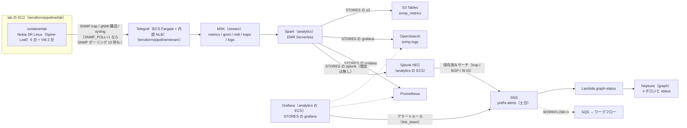
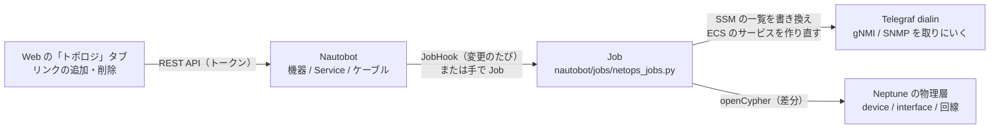

# パイプライン（PIPELINE）

← [README](../README.md)

`<prefix>` は `deploy.env` の `OWNER` から作る接頭辞 `<owner>-nwc-poc`。`deploy.env` に `PIPELINE=1` を書いて `ops/up.sh` を打つと、下の全部ができる。



- lab は Web やエージェントとはつながっていない。使うのは SNMP とログの発生源としてだけ。
- Telegraf は stream の ECS（Fargate ARM64、0.25 vCPU / 0.5 GB）で、同じイメージを 2 つのサービスで動かす（`terraform/pipeline/stream/telegraf.tf`。2026-09-28 に terraform/pipeline/lab の Telegraf 用の EC2 から移し、2026-10-04 に 2 つに分けた）。受ける側（`<prefix>-telegraf-dialout`、`TELEGRAF_ROLE=dialout`）は内部 NLB の後ろで trap・syslog・MDT を受け、取りにいく側（`<prefix>-telegraf-dialin`、`TELEGRAF_ROLE=dialin`、1 タスク固定、NLB なし）は gNMI の購読と SNMP のポーリングをする（[collection.md](collection.md) の「Telegraf を受ける側と取りにいく側に分けた」）。イメージは `telegraf/Dockerfile`（公式の `telegraf:1.40.0` に `telegraf.conf.in` と `tg` を入れたもの）で、`ops/up.sh` が ECR の `<prefix>-telegraf:<版>-<ディレクトリのハッシュ 12 文字>` に作る。ポーリング先と gNMI の購読先は `ops/up.sh` が lab の定義から作って stream の変数 `snmp_agents` / `gnmi_targets` に渡し、取りにいく側のタスクの環境変数 `SNMP_AGENTS` / `GNMI_TARGETS` になる。MSK のブローカーは環境変数 `KAFKA_BROKERS`。起動時に `tg run` が設定を埋める。
- **SNMP のポーリングは既定で止めてあり、SNMP は trap だけ受ける**（2026-10-04 から）。`deploy.env` の `SNMP_POLL=1` で `ops/up.sh` が stream の変数 `snmp_poll = true` を渡し、タスクの環境変数 `SNMP_POLL=1` で `tg run` が `telegraf.conf.in` の `>>> snmp_poll` の区間（`inputs.snmp`。10 秒ごとに ifTable）を残す。`0`（既定）はその区間ごと消すので、`SNMP_AGENTS` は渡っても使わない。止めているあいだは `metrics` トピックにポーリングの行（measurement `system` / `interface`）が載らず（lab の gNMI を変えた共通の形は載る）、S3 Tables の `snmp_metrics` のポーリングの行、Grafana のダッシュボード「netops / SNMP metrics」、Grafana のアラートルール `link_down`、エージェントの `query_metrics`（`interface_ifOperStatus` など）は空のまま。IF の up / down は trap（`STORES` に `splunk` を入れたときの Splunk）で知る。gNMI と syslog はこの値によらず受ける。
- ポーリングが二重にならないよう、作り直すときは古いタスクを止めてから新しいタスクを立てる。
- lab は Spine-Leaf（EVPN-VXLAN）。上流側の Leaf-SW 2 台と アクセス側の Leaf 2 台が Spine 2 台とフルメッシュ（fabric。IS-IS）、上流 VM は Leaf-SW の組へ、アクセス側 VM は Leaf の組へ LAG（EVPN マルチホーミング）で 2 本ずつ。機器の定義は `lab/gen_lab.py` が作る（[lab を変える](#lab-を変える)）。SR-MPLS は SR Linux のコンテナが `ixr6e` / `ixr10e` + ライセンスを要るので、ライセンスが届くまで license 不要の `ixr-d2l` で EVPN-VXLAN にしている。
- 機器は lab の EC2 の中の docker network（`203.0.113.0/24`）にいる。Telegraf の取りにいく側のタスクからの SNMP のポーリング（`161/udp`。`SNMP_POLL=1` のときだけ）と gNMI の購読（`57400/tcp`）は VPC のルートで lab の EC2 を通り（タスクの IP は作り直すたびに変わるので、送り元はタスクのサブネットの CIDR（SSM `/<prefix>/telegraf-source-cidr`）で通す）、trap（`162/udp`）と syslog（`5140/udp`）は機器が lab の EC2（`203.0.113.1`）へ送り、lab の EC2 が Telegraf の NLB の IP（SSM `/<prefix>/telegraf-address`）へ DNAT する。NLB は trap をタスクの `1162/udp` へ、syslog を `5140/udp` へ渡す（UDP なので送り元の IP はそのまま）。この 4 つは lab の EC2 で `sudo lab forward` が張る（`lab up` が毎回呼び、`ops/up.sh` も手順 7-2b で打つ。lab の変数 `forward_to_telegraf`）。
- gNMI（Telegraf の `inputs.gnmi`）は BGP の `session-state` と IS-IS の IF の `oper-state`（隣接そのもの（`interface/adjacency`）は落ちると down を経ずに消え、Telegraf は gNMI の delete を載せないので取らない）を on_change で、EVPN の ethernet-segment の `oper-state` と MAC テーブルを 1 分おきに取り、トピック `gnmi` に出す。2 つめの `inputs.gnmi`（購読名 `lab_*`、1 分おき）は CPU・メモリ・IF のカウンタと速度・MAC テーブルの数と上限・サブ IF の種類と IF の状態を取り、`telegraf/lab_gnmi.star` と `lab_circuits.star` が共通の形（`device_cpu` / `device_memory` / `if_stats` / `sessions` / `circuits`。[collection.md](collection.md) の「共通の形（仮）」）に変えてトピック `metrics` に出す（1 つめと分けるのは、SR Linux が知らないパスが 1 つでもあると購読ごと断るため）。本番の Cisco の MDT は `inputs.cisco_telemetry_mdt`（57000/tcp）で受けてトピック `mdt` に出す（`MDT_SOURCE_CIDRS` が空のあいだは何も届かない）。Splunk の保存済みサーチ `netops_gnmi` はここから `bgp_down`（相手の IP が対象）と `isis_down`（サブインタフェースが対象）を出す（`STORES` に `splunk` があるとき。下の「アラート」）。
- Spark は起動時に、読むトピック（`metrics` / `gnmi` / `mdt` / `traps` / `logs`）のうち無いものを作る（`snmp_sinks.py` の `ensure_topics`。EMR のロールに `kafka-cluster:CreateTopic`）。MSK の `auto.create.topics.enable=true` は書き込みのときにしか効かず、Telegraf が最初の trap / syslog を出すまで `traps` / `logs` が無い。無いトピックを購読するとジョブは offset 読みで落ちて、起こし直しの上限（1 時間 5 回）を使い切る（2026-09-27 に実測）。
- メトリクスとログの履歴の正本は S3 Tables（`snmp_metrics`）。Spark は格納先へ流すだけで、異常の検知はしない（2026-10-02 にやめた）。検知は Grafana と Splunk のアラートで、SNS のトピック `<prefix>-alerts` に出す（下の「アラート」）。Neptune の頂点 `anomaly`、S3 Tables の `anomaly_events`、Web の「異常一覧」、エージェントの `list_anomalies` は無くなり、障害の履歴の置き場は決めていない（[data-stores.md](data-stores.md)）。
- analytics は graph が無くても作れる（Neptune に書くのは SNS を購読する graph の Lambda だけ）。`SKIP_GRAPH=1` だと、トポロジは `agent/data/` の静的データになり、アラートが届いても `status` を書く先が無い。
- テーブルバケットは `STORES` に `s3` が無くても作る（証跡の置き場）。`ops/down.sh` はバケットごと消すので、証跡も消える。
- Splunk（`STORES` の `splunk`）は Spark（既定は driver。`HTTP_SEND=executor` なら executor）が全トピックを HTTP Event Collector（HEC）に POST する（2026-09-26 に MSK Connect の Splunk Connect for Kafka をやめて、ほかの格納先と同じ形にした）。
  - analytics の ECS に Splunk Enterprise（`splunk/Dockerfile`。公式の `splunk/splunk:10.4.3` に検知のアプリ `netops_alerts` を足し、ECR の `<prefix>-splunk:10.4.3-<ディレクトリのハッシュ 12 文字>` に作る。amd64 しか無いので Fargate x86、2 vCPU / 4 GB、エフェメラルストレージ 40 GiB）を 1 タスク立て、Spark は Cloud Map の `https://splunk.<prefix>.internal:8088` に送る（イメージの自己署名の証明書なので検証しない）。起動時に Splunk のライセンスと Splunk General Terms に同意する（`SPLUNK_START_ARGS=--accept-license`、`SPLUNK_GENERAL_TERMS=--accept-sgt-current-at-splunk-com`）。試用ライセンス（60 日、1 日 500 MB）。admin のパスワード `/<prefix>/splunk/admin-password` と HEC の token `/<prefix>/splunk/hec-token`（uuid）は `ops/up.sh` が SSM の SecureString に作る（値は出さない。`ops/down.sh` が消す）。index はタスクのエフェメラルストレージにあり、タスクと一緒に消える（検証用）。`ops/up.sh` は手順 7-4b でタスクが HEALTHY になるのを待ってから（最大 20 分）Spark のジョブを起こす。画面は下の「Grafana と Splunk を開く」。
  - AWS の外の Splunk（Splunk Cloud など）へ NAT Gateway で送る道は 2026-09-28 にやめた（VPC から AWS の外へ出る経路を作らない。`SPLUNK_HEC_URL` が書いてあると `ops/up.sh` が止まる）。
  - HEC が 4xx を返したまとまり（最大 500 件）は捨ててログに出し、ジョブは止めない。5xx は再送する。

## lab に入る

lab の EC2 に入るには管理者用のシェルセッション（`SSM-SessionManagerRunShell`）が要る。

```bash
LAB_INSTANCE_ID=$(terraform -chdir=terraform/pipeline/lab output -raw lab_instance_id); echo "$LAB_INSTANCE_ID"
aws ssm start-session --region ap-northeast-1 --target "$LAB_INSTANCE_ID"
```

入ったら、セッションの中で打つ。

| コマンド | 何をする |
|---|---|
| `sudo lab status` | 8 コンテナが running か |
| `sudo lab check` | BGP EVPN の隣接（Spine の RR）、IS-IS の隣接、EVPN の ethernet-segment、VM の LAG（bond0）、VM 同士の ping、SNMP |
| `sudo lab failover` | アクセス側 Leaf の fabric（`dc1-leaf-01 ethernet-1/1`）を落とし、経路が `dc1-spine-02` だけに切り替わるのを見る（最大 60 秒） |
| `sudo lab heal-main` / `sudo lab fail-main` | その fabric を戻す / 落とすだけ |
| `sudo lab snmp dc1-leaf-01` | 1 台の ifName / ifAdminStatus / ifOperStatus（EC2 から snmpwalk。admin up の IF だけ） |
| `sudo lab logs` | 機器のログ（`/var/log/srlinux/file/messages`）の末尾。1 台だけなら `sudo lab logs dc1-leaf-01`、行数は `LINES=50` を前に付ける |
| `sudo lab cli dc1-leaf-01 "show network-instance default protocols bgp neighbor"` | 1 台に SR Linux の CLI を 1 つ打つ |
| `sudo lab forward-status` | Telegraf（ECS）への転送（iptables の規則と、機器側の remote-server / trap-group）。張り直すのは `sudo lab forward` |
| `sudo lab clab inspect --all` | containerlab をそのまま呼ぶ |

- 機器の CLI: `sudo docker exec -it clab-splab-dc1-leaf-01 sr_cli`（1 行だけなら `sudo lab cli dc1-leaf-01 "show ..."`）。設定は `lab/srlinux/<機器>.cli`（`set /` の行だけ。containerlab が起動時に流し込む。手で直さず `lab/gen_lab.py` で作り直す）
- `sudo lab failover` を打つと、trap が 5 秒以内に Kafka に届く（2026-09-27 に EC2 で確認）。そのあと `STORES` に `splunk` があれば Splunk が linkDown の trap から `link_down` を、gNMI から `isis_down` を出し、`SNMP_POLL=1` なら Grafana のルールもポーリングから物理 IF の同じ `link_down` を出す（既定の `STORES=s3,grafana` / `SNMP_POLL=0` ではどちらも出ない）。`sudo lab heal-main` で `resolved` が出る。落としてから通知までは 1〜2 分（下の「アラート」の遅れ）。
  - SR Linux の SNMP の `ifOperStatus` は実際の oper-state より 15〜20 秒遅れる（2026-09-27 実測）。Spark の検知は trap とポーリングを 1 つの状態にまとめていたので、古いポーリングが trap を打ち消さないよう 30 秒の猶予（`POLL_LAG`）を持っていた。いまは送り手ごとに自分の見た状態だけを出し、Grafana は自分が発火させたアラートにしか解消を送らないので、この猶予は要らない。
- 機器のログは SR Linux の `system logging remote-server`（RFC 5424、udp）で lab の EC2 へ出て、Telegraf の `inputs.syslog` が受け、トピック `logs` に出す（measurement は `device_log`。hostname は `sysName` タグに付け替える）。送る subsystem は bgp / chassis / evpn / isis / lag / linux / netinst / xdp（informational 以上）。ファシリティは本番の Cisco（IOS の既定）に合わせて `local7`（`system logging subsystem-facility`。SR Linux の既定は `local6`）。
- syslog の形式は Telegraf の `SYSLOG_STANDARD`（stream の変数 `syslog_standard`、`inputs.syslog` の `syslog_standard`）で選ぶ。既定は本番の Cisco IOS の BSD 形式 `RFC3164`。`ops/up.sh` は `deploy.env` の `SYSLOG_STANDARD`（空なら同じ `RFC3164`）を渡す。lab の SR Linux は RFC 5424 で送る（`ops/lab-common.sh` の `LAB_SYSLOG_STANDARD`）ので、lab のログの項目まで見るなら `SYSLOG_STANDARD=RFC5424`。デバッグ用の EC2 は `lab/lab.sh` の `LOG_STANDARD` を渡す。Cisco IOS の既定のヘッダー（シーケンス番号や `*` 付きの時刻）が RFC3164 でどう解析されるかは実機で確かめていない。
- SNMP は containerlab が全ノードに v2c の community `public` を入れ、gNMI も全ノードで `57400/tcp`（TLS、containerlab の既定の admin）に開く。Telegraf の取りにいく側は、この認証情報を SSM の SecureString（`/<prefix>/telegraf-dialin/gnmi-username`・`gnmi-password`・`snmp-community`。`ops/up.sh` が lab の既定値で作り、あれば触らない）から受ける。実機を足すなら SSM の値を書き換えて、サービスを作り直す（`aws ecs update-service --force-new-deployment`）。監視対象は `lab/srlinux/<機器>.cli` の `system snmp trap-group`（trap の宛先）の有無で決まり、いまは SR Linux の 6 台全部。VM 2 台は対象外。
- SR Linux の ifTable は未使用の物理ポートも全部出す（`ifAdminStatus` が down）。IF の鍵は `ifName`（`ifDescr` は「名前 + description」）。Grafana のルールは admin down の行、サブインタフェース（`ethernet-1/1.0`）、ループバック、管理ポートを見ない。

### 動かないとき

```bash
systemctl is-active <prefix>-lab
sudo journalctl -u <prefix>-lab -n 50 --no-pager
sudo tail -n 50 /var/log/cloud-init-output.log
sudo systemctl restart <prefix>-lab
```

- ECR からイメージを取れない（`docker pull` がタイムアウトする）: ecr.api / ecr.dkr のエンドポイントが `ops/up.sh` の手順 0 の一覧にあるか、レイヤーを取る S3 の gateway エンドポイントがプライベートのルートテーブルに載っているかを見る。`explicit deny` なら VPC のエンドポイントを通っていない（[troubleshooting.md](troubleshooting.md) の「閉域」）。
- SR Linux が起きない（`containerlab deploy` が readiness で止まる）: 6 台で 10 GB ほど使うので `free -m` を見る。`t4g.large` では足りない（既定は `t4g.xlarge`）。1 台の起動ログは `sudo docker logs clab-splab-dc1-leaf-01`。
- VM の `bond0` が無い（`sudo lab check` の LAG が「bond0 が無い」）: EC2 のカーネルに bonding モジュールが要る。`lsmod | grep bonding`、無ければ `sudo modprobe bonding`（`lab/setup.sh` が起動時に入れる）。
- 設定が入らない（deploy が `startup-config` で失敗する）: `lab/srlinux/<機器>.cli` の行を `sudo lab cli <機器>` で 1 行ずつ流して、どの行で落ちるかを見る。

### 止める・起動する

出力の `stop_command` / `start_command` を打つ。止めている間は EBS 24 GB の保管料だけ。

```bash
terraform -chdir=terraform/pipeline/lab output -raw stop_command; echo
```

## Telegraf に入る

ECS Exec で入る（PC に AWS CLI v2 と Session Manager plugin が要る）。`tg test` / `tg gnmi` は取りにいく側（`<prefix>-telegraf-dialin`）のタスクで打つ（受ける側で打つと「telegraf-dialin で打つ」と出て終わる）。`telegraf_exec_command` の `TASK_ID` を、取りにいく側のタスクの ARN の最後の部分に置き換えて打つ。

```bash
terraform -chdir=terraform/pipeline/stream output -raw telegraf_dialin_list_tasks_command; echo   # 打つと取りにいく側のタスクの ARN が出る（受ける側は telegraf_dialout_list_tasks_command）
terraform -chdir=terraform/pipeline/stream output -raw telegraf_exec_command; echo         # TASK_ID を置き換えて打つ（既定は tg gnmi）
```

| コマンド | 何をする |
|---|---|
| `tg test` | SNMP のポーリングを 1 回だけまわして画面に出す（MSK には送らない）。`SNMP_POLL=1` のタスクだけ。既定（`0`）では「SNMP のポーリングは止めてある」と出して終わる |
| `tg gnmi` | gNMI の購読を 20 秒だけ受けて画面に出す（MSK には送らない。BGP / IS-IS の行が出れば届いている） |

- ログは CloudWatch Logs の `/ecs/<prefix>-telegraf`（出力 `telegraf_log_group_name`。2 つのサービスで共有し、ストリームは受ける側が `dialout/…`、取りにいく側が `dialin/…`）。起動時に、受ける側は `/tmp/telegraf.conf を作った（role: dialout / sink: kafka / brokers: … / trap: 1162/udp / syslog: 5140/udp RFC3164 / mdt: 57000/tcp）`、取りにいく側は `（role: dialin / sink: kafka / brokers: … / snmp poll: off / gnmi: …）` が出る（`snmp poll` は `SNMP_POLL=1` ならポーリング先、`syslog` の最後は `SYSLOG_STANDARD` の値）。

```bash
aws logs tail --region ap-northeast-1 "$(terraform -chdir=terraform/pipeline/stream output -raw telegraf_log_group_name)" --since 10m --follow
```

- 以前の `sudo tg status` / `logs` / `restart` は無い（systemd が無い）。作り直すのは `ops/up.sh`（イメージが変わると両方、ポーリング先・購読先か `SNMP_POLL` が変わると取りにいく側、`SYSLOG_STANDARD` が変わると受ける側のタスクが作り直される）か、`aws ecs update-service --force-new-deployment`（サービスごと）。
- 設定のテンプレートは `telegraf/telegraf.conf.in`。変えたときは下の「変えたとき」。
- `tg gnmi` / `tg test` で機器に届かない、trap が来ない、ログが来ないときは、lab の EC2 で `sudo lab forward-status` を見る（規則が無ければ `sudo lab forward`）。

## デバッグ用の EC2（lab + Telegraf を 1 台）

MSK / ECS / NLB を作らずに、機器の設定（`lab/`）と Telegraf の設定（`telegraf/`）を確かめる EC2。terraform ではなく CloudFormation のスタック `<prefix>-lab-debug`（[cloudformation/lab-debug.yaml](../cloudformation/lab-debug.yaml)）で、作るのも消すのも [ops/lab-debug.sh](../ops/lab-debug.sh) の 1 コマンド。**`ops/up.sh` / `ops/down.sh` とは別**（2026-10-04 から）: スタックが自分の VPC（閉域。既定 `10.20.0.0/24`）、エンドポイント 4 本（ssm / ssmmessages / ecr.api / ecr.dkr）と S3 の gateway、バケット、ECR のリポジトリ 3 つを持つので、`ops/up.sh` で何も作っていなくても立ち、`ops/down.sh` では消えない。lab の EC2 と並べて立ててもよい（管理ネットワーク `203.0.113.0/24` は EC2 の中だけにある）。待機は約 $0.23/h（t4g.xlarge 約 $0.17/h とエンドポイント 4 本 $0.056/h）。要るのは AWS CLI・docker buildx・curl・python3 か uv と、`deploy.env` の `OWNER`（`NETWORK_PERIMETER` も見る）。

```bash
ops/lab-debug.sh up            # 初回は器（VPC・エンドポイント・バケット・ECR）を作り、イメージと lab/ を置いてから EC2 を作る。2 回目からは変わったところだけ
ops/lab-debug.sh status        # スタックと EC2 の状態。最後の行が SSM で入るコマンド
ops/lab-debug.sh sync          # lab/ を置き直して EC2 を再起動する（lab/ を変えたとき）
ops/lab-debug.sh down          # バケットを空にしてスタックを消す（ECR はイメージごと消える。ops/down.sh は呼ばない）
```

- 中身は lab の EC2 と同じ: 版とイメージ（ECR のミラー）と S3 の `lab/` の置き方は `ops/lab-common.sh`、EC2 の中の支度は `lab/setup.sh`（起動のたびに S3 の `lab/` を置き直して流す）。UserData は terraform の user_data と同じ形で、違うのはイメージのリポジトリの名前（`-debug-` が付く）と `TELEGRAF_IMAGE` があることだけ。パラメータの既定値・ロールの権限・IMDS の設定が terraform/pipeline/lab とずれていないことは `tests/test_lab_debug.py` が見る。
- Telegraf は stream の ECS と同じイメージ（同じ `telegraf/telegraf.conf.in`）を docker の host ネットワークで動かし、出力だけを標準出力（`SINK=stdout`。MSK に載るのと同じ JSON）にする。ポーリング先と gNMI の相手は stream と同じく `lab/lab_topology.py` から作る。SNMP のポーリングは stream と同じく既定で止めてある（`SNMP_POLL=0`）。見るときは `sudo SNMP_POLL=1 lab telegraf run` で起こし直す（起動時の systemd は既定の `0` で起こすので、EC2 を再起動すると止まった状態に戻る）。機器は trap を `162/udp` に送るので、`lab forward` が iptables の REDIRECT で Telegraf の `1162/udp` へ向ける（syslog は `5140/udp` でそのまま受ける）。
- 入ったら `sudo lab status` / `sudo lab check` などは lab の EC2 と同じ。Telegraf は次のコマンド。

| コマンド | 何をする |
|---|---|
| `sudo lab telegraf logs -f` | Telegraf の出力（メトリクス・trap・syslog・gNMI の JSON）を流す。行数は `LINES=200` を前に付ける |
| `sudo lab telegraf test` / `sudo lab telegraf gnmi` | ECS の `tg test` / `tg gnmi` と同じ（`test` は `SNMP_POLL=1` で起こしたときだけ） |
| `sudo lab telegraf status` / `run` / `stop` | コンテナの状態 / 起こし直す / 止める（docker を直接。起動時は systemd の `<prefix>-telegraf` が `run` を呼ぶ） |
| `sudo lab forward-status` | trap の REDIRECT（162 → 1162） |

- `telegraf/` を変えたら `ops/lab-debug.sh up`（タグが変わるのでイメージを作り直し、スタックの UserData が変わって EC2 が止まって起きる）。`lab/` だけなら `ops/lab-debug.sh sync`。
- スタックが `ROLLBACK_COMPLETE` などで止まったら `ops/lab-debug.sh down` してから `up`。原因は `aws cloudformation describe-stack-events --region ap-northeast-1 --stack-name <prefix>-lab-debug`。
- イメージは土台の ECR（`<prefix>-lab-*` / `<prefix>-telegraf`）と別のリポジトリ（`<prefix>-debug-lab-srlinux` / `-debug-lab-multitool` / `-debug-telegraf`）に置く。SR Linux（約 1 GB）は `ops/up.sh` で置いてあっても、初回の `up` でもう一度 push する。
- 境界の Deny（`NETWORK_PERIMETER`）は IAM 側だけ（ロールのインライン。terraform/base/core の `perimeter.tf` と同じ Action と条件をこの VPC に向ける）。バケット側は暗号化されていない経路を拒むだけ（中身は公開のソフトと lab の設定）。

## Grafana と Splunk を開く

どちらも analytics の ECS のタスクで、LB は無い。Web の EC2 を踏み台にした SSM のポートフォワード（`AWS-StartPortForwardingSessionToRemoteHost`）で開く。コマンドは `ops/up.sh` の最後にも出る。

```bash
terraform -chdir=terraform/pipeline/analytics output -raw grafana_port_forward_command; echo   # 打って http://localhost:3000/ （ユーザー admin）
terraform -chdir=terraform/pipeline/analytics output -raw grafana_password_command; echo       # admin のパスワード
terraform -chdir=terraform/pipeline/analytics output -raw splunk_port_forward_command; echo    # 打って http://localhost:8000/ （ユーザー admin）
terraform -chdir=terraform/pipeline/analytics output -raw splunk_password_command; echo
```

- Grafana（`STORES` の `grafana`。既定で入っている）は Grafana OSS 13.2.2 を Fargate ARM 0.5 vCPU / 1 GB で 1 タスク立てる（Cloud Map `grafana.<prefix>.internal:3000`）。`STORES` に `grafana` があればいつも作る（Grafana だけを切り替えるキーは無い）。データソースは Prometheus（AMP、SigV4）と OpenSearch Serverless（`snmp-logs`）で、タスクロールで読む。OpenSearch Serverless のデータソースは、設定画面の「Save & test」（ヘルスチェック）が中身の無い ERROR を返すことがあるが、ダッシュボードとクエリは読める（2026-09-28 に確認）。
- データソースの plugin はイメージに焼き込んである（AWS の外へ出る経路が無いので起動時に落とせない）。ダッシュボードは `grafana/provisioning` だけで、UI で変えたものはタスクと一緒に消える。残すなら provisioning に書いて `ops/up.sh`（ディレクトリのハッシュが変わるのでイメージから作り直す）。
- admin のパスワードは `ops/up.sh` が SSM の SecureString `/<prefix>/grafana/admin-password` に乱数で作り、`ops/down.sh` が消す（タグ `ManagedBy=ops/up.sh`）。
- Amazon Managed Grafana は使えない。サインインに IAM Identity Center か SAML の IdP が要り、このアカウントには Organizations も Identity Center も無い。
- Splunk（ECS）は `STORES` に `splunk` があるときだけ。検索は `index=main`（HEC の token の既定の index）。
- Web は EC2 のまま（踏み台を兼ねる。ECS にするとタスクの IP が変わり、踏み台にしにくい）。

## アラート

異常を見つけるのは Grafana と Splunk。どちらも発火（`firing`）と解消（`resolved`）を、同じ形の JSON で SNS のトピック `<prefix>-alerts`（`terraform/base/core/alerts.tf`）に publish する。トピックは graph の Lambda（Neptune の `status`）と、`WORKFLOW=1` なら workflow の SQS（[workflow.md](workflow.md)）へ配る。

| 送り手 | 見るもの | 出す `kind` | 定義 | 落ちてから通知まで |
|---|---|---|---|---|
| Grafana（`STORES` の `grafana`（既定で入っている）に、`SNMP_POLL=1`（既定は 0）） | SNMP のポーリングの `ifOperStatus`（Prometheus） | `link_down` | `grafana/provisioning/alerting/netops.yaml` | ポーリング 10 秒 + SNMP の遅れ 15〜20 秒 + Spark のマイクロバッチ 60 秒 + ルールの評価 30 秒 |
| Splunk（`STORES` の `splunk`。既定では入っていない） | trap と、gNMI の on_change（BGP のセッション、IS-IS の IF） | `link_down`（linkDown / linkUp の trap）、`trap`（ほかの trap）、`bgp_down`、`isis_down` | `splunk/netops_alerts/default/savedsearches.conf` | Spark のマイクロバッチ 60 秒 + 保存済みサーチ（毎分。索引に入ってから最大 70 秒ほど） |

- **既定（`STORES=s3,grafana` / `SNMP_POLL=0`）ではどちらも発火しない。**Grafana のルールはそのまま作るが、ポーリングを止めていると `ifOperStatus` が無い（データが無いときは `KeepLast` なので発火も解消もしない）。IF の `link_down` は `STORES` の `splunk`（trap）か `SNMP_POLL=1`（ポーリング）で出る。BGP / IS-IS の層の `status` と機器の `ALARM` は Splunk が出すので、`STORES` に `splunk` を入れないと変わらない。`ops/up.sh` は、Grafana を `SNMP_POLL=1` のときだけ送り手に数え（`WORKFLOW=1` の検査と `sns` のエンドポイント）、`STORES` に `grafana` があってどちらの送り手も無いときは注意を出す。
- 本文は `{"source": "grafana" | "splunk", "alerts": [{"status", "device_id", "kind", "target", "detail", "starts_at"}]}`。異常の id は `<device_id>#<kind>#<target>` で、送り手が違っても同じ機器・種類・対象なら同じ id になる（Grafana と Splunk が同じ `link_down` を知らせても 1 つ）。形を変えるときは、Grafana のテンプレート、Splunk のアラートアクション、`workflow/rules.py` の `alerts_from_message`（ワーカーと Lambda が同じものを使う）を一緒に変える。
- 送り手は「いまの状態」を出すだけなので、同じ知らせが重なって届くことがある。受け手は何度受けてもよい作り（ワークフローの id は異常ごとに 1 つ、`status` は上書き）。
- publish はタスクロール（`sns:Publish` だけ）で、VPC の `sns` のエンドポイントを通る。アクセスキーは置かない。トピックは VPC の外からの publish を拒む。
- トピックは土台にあるので、送り手も受け手も無いときも作る（時間課金は無い）。

### Grafana のアラート

- ルール `link_down`（フォルダ `nwc-alerts`）。`ifOperStatus` が 2（down）の IF を 30 秒ごとに見て、すぐ発火する（`for: 0s`）。admin-state が disable のポート（oper は down だが異常ではない）は外す。
- データが無い・クエリが失敗したときは直前の状態のまま（`KeepLast`。分からないときに発火も解消もしない）。機器ごと止まって系列が途切れると、Grafana は古い系列として解消を送る（機器の停止はここでは検知しない）。
- 通知は IF ごとに 1 通。発火はすぐ、解消は 30 秒以内（`group_interval`）。直らないあいだは 4 時間ごと（`repeat_interval`）に同じ `starts_at` で送り直す。
- 画面は Alerting → Alert rules。provisioning したルール・連絡先・ポリシーは画面から変えられない。変えるなら `grafana/provisioning/alerting/netops.yaml` を変えて `ops/up.sh`（イメージから作り直す）。
- このファイルのテンプレートの `$` はそのまま書く。`$$` とエスケープすると Grafana が起動しない（`Invalid format of the submitted template`。13.2.2 で実測）。`${ALERTS_TOPIC_ARN}` と `${AWS_REGION}` だけは、起動時に Grafana が環境変数で埋める。
- `grafana/start.sh` は `PROMETHEUS_URL` と `ALERTS_TOPIC_ARN` の両方があるときだけアラートの定義を並べる。

### Splunk のアラート

- アプリ `netops_alerts` をイメージに焼き込んである（`splunk/netops_alerts/`）。保存済みサーチ 3 本と、結果を SNS へ publish するアラートアクション `netops_sns`（`bin/netops_sns.py`）。

| 保存済みサーチ | 見るもの | 出すもの |
|---|---|---|
| `netops_gnmi` | `telegraf:bgp_neighbor` の `session_state`、`telegraf:isis_interface` の `oper_state` | `established` / `up` でなければ `bgp_down` / `isis_down` の `firing`、戻れば `resolved` |
| `netops_trap` | `telegraf:snmp_trap` | linkDown は `link_down` の `firing`、linkUp は `resolved`。ほかの trap は `trap` の `firing`（coldStart / warmStart などは出さない） |
| `netops_trap_clear` | 同上（過去 70 分） | その機器から link 以外の trap が 10 分来なければ、その機器の `trap` を `resolved` にする（機器ごと。1 つの trap につき 1 回） |

- 3 本とも毎分動き、「索引に入った時刻」で直前の 1 分を 1 回だけ読む（`_index_earliest` / `_index_latest`。イベントの時刻で切ると、Spark のマイクロバッチで遅れて届いた分を取りこぼす）。スケジューラが遅れても飛ばさない（`realtime_schedule = 0`）。
- 項目は `fields` で `_raw` だけにしてから `spath` で取る。`props.conf` の `KV_MODE = json` と重ねると全部の項目が同じ値 2 つの多値になり、1 行も出なくなる（10.4.3 で実測）。
- gNMI と trap のイベントは機器名でなく IP を持つので、アラートアクションがタスクの環境変数 `DEVICE_MAP`（`ops/up.sh` が `lab/lab_topology.py --device-map` で作る）で機器名に直す。直せなかった IP はそのまま `device_id` になり、Neptune では「未登録」の頂点になる。
- アラートアクションは標準ライブラリだけで SigV4 に署名する（書いた当時は Splunk の Python に boto3 が無いと思い込んでいた。実際は入っているので、Splunk が持っている boto3 を使う形に替える。実装はこれから）。認証情報は ECS のタスクロール。1 通に 50 件まで、失敗は 3 回まで試す。
- splunkd はコンテナの環境変数を子プロセスに引き継がないので、`splunk/entrypoint.sh` が要る値（リージョン、トピックの ARN、`DEVICE_MAP`、認証情報の取り出し口の URI）を `/opt/container_artifact/nwc-alerts.env` に写す（鍵そのものは書かない）。
- Splunkbase の Splunk Add-on for AWS は使っていない。配布物を公開リポジトリに置けず、VPC から Splunkbase へも出られないため。
- 確かめる（Splunk の画面の検索）:
  - サーチが動いたか: `index=_internal sourcetype=scheduler savedsearch_name=netops_*`
  - publish の結果: `index=_internal sourcetype=splunkd sendmodalert netops_sns`（成功は `published=` の分子と分母が同じ。失敗は `ERROR`）
- 2026-10-02 の作り替えは、模擬テストと手元のコンテナ（Splunk 10.4.3、Grafana 13.2.2）で確かめた。AWS の上での通し（SNS からの配信、`sns` のエンドポイント越しの publish、trap の送り元の IP が `DEVICE_MAP` に当たるか、SR Linux の linkDown の trap に IF 名が載るか）はまだ確かめていない。

## Spark を確かめる

ジョブの一覧とテーブルの一覧は出力のコマンドで見る。テーブルの中身は Athena で見る（カタログは `s3tablescatalog`）。

```bash
terraform -chdir=terraform/pipeline/analytics output -raw list_job_runs_command; echo
terraform -chdir=terraform/pipeline/analytics output -raw list_tables_command; echo
```

Spark UI を開く（EMR Studio は要らない）:

```bash
APP_ID=$(terraform -chdir=terraform/pipeline/analytics output -raw application_id); echo "$APP_ID"
JOB_RUN_ID=$(aws emr-serverless list-job-runs --region ap-northeast-1 --application-id "$APP_ID" --states RUNNING --query 'jobRuns[0].id' --output text); echo "$JOB_RUN_ID"
aws emr-serverless get-dashboard-for-job-run --region ap-northeast-1 --application-id "$APP_ID" --job-run-id "$JOB_RUN_ID" --query url --output text
```

- **URL は一時的な認証を含み、約 1 時間で切れる。チャットやチケットに貼らない。**
- 見るタブは「Structured Streaming」（バッチごとの入力行数と処理時間）と「Executors」。
- `$JOB_RUN_ID` が `None` なら動いているジョブが無い。
- 上のコマンドは、動いているジョブのうち最初の 1 つを取る。ジョブを選ぶなら `--query` を `"jobRuns[?name=='sinks-splunk']|[0].id"` のように名前で絞る。

CLI だけで見るとき:

```bash
aws emr-serverless get-job-run --region ap-northeast-1 --application-id "$APP_ID" --job-run-id "$JOB_RUN_ID" --query 'jobRun.[state,stateDetails,totalExecutionDurationSeconds]' --output table
LOG_GROUP=$(terraform -chdir=terraform/pipeline/analytics output -raw log_group_name); aws logs tail "$LOG_GROUP" --region ap-northeast-1 --since 10m --follow
```

- `FAILED` なら、ロググループ `/aws/emr-serverless/<prefix>` のドライバーの stderr を見る。
- ジョブは格納先で 3 つに分かれる（2026-10-04 から）。`sinks-s3iceberg`（S3 Tables。`STORES` の `s3`）、`sinks-splunk`（`STORES` の `splunk`）、`sinks-grafana`（OpenSearch と Prometheus。`STORES` の `grafana`）。`STORES` からまとまりを外すと、そのジョブは起きない。driver 1 + executor 2 の 3 vCPU ずつで、アプリの上限は 12 vCPU / 48 GB。
- 同じ名前のジョブは同時に 1 本だけにする（同じチェックポイントを 2 本で書くと壊れる）。`ops/up.sh` の手順 7-5 は、ジョブごとにスクリプトと引数のハッシュをタグ `SpecHash` に付けて起こし、動いているジョブのタグが今のハッシュと同じなら何もせず、違えばそのジョブだけ止めて起こし直す。
- HTTP の格納先（OpenSearch / Prometheus / Splunk）へ送る所は `HTTP_SEND` で選ぶ。既定の `driver` は 1 回分を driver に集めて送る。`executor` は集めずに、パーティションごとに executor が送る（`foreachPartition`）。Prometheus は送る前に系列で分け直し、同じ系列を 1 つのタスクが時刻の順に送る。4xx で捨てた数は driver のログ、理由は executor の stderr（S3 の logs）。AWS では未確認。
- 1 つのクエリが 1 回のトリガー（60 秒）に読む件数には上限がある（`MAX_OFFSETS_PER_TRIGGER`。既定 10000、0 で上限なし。格納先ごとの値も書ける）。効くのは、止めていたジョブを起こし直した直後。
- アプリの上限（`max_cpu` / `max_memory`）を変える apply は、アプリが止まっていないと通らない。`ops/up.sh` の手順 7-4 は、上限が違うときだけ、先にジョブを全部止めてアプリを止め、apply のあと 7-5 が起こし直す。
- 格納先ごとのクエリ（iceberg / opensearch / prometheus / splunk）のどれかが止まると、そのクエリのいるジョブを終わらせ（exit 1）、STREAMING モードに起こし直させる。ほかのジョブは動き続ける。チェックポイントの続きから読むので、取りこぼしは無い。S3 Tables は二重にもならない。HTTP の格納先は、やり直しで同じ行がもう一度届きうる（[data-stores.md](data-stores.md) の「届け方の保証」）。起こし直しは既定で 1 時間に 5 回まで（超えると `FAILED`）。
- チェックポイントは MSK クラスタごとのパス（`s3://<バケット>/analytics/checkpoint/<クラスタの uuid>/`）。MSK を作り直すと、前のクラスタのオフセットを読まずに新しいパスから始まる。
- analytics を消すと S3 Tables の履歴も消える。

## Neptune のトポロジ

Neptune に入れる機器・インタフェース・回線（物理層）と、その上の IP 層・EVPN/BGP 層は、lab の定義（`lab/splab.clab.yml.in` と `lab/srlinux/<機器>.cli`）から `lab/lab_topology.py` が作る。インタフェースはリンクの両端だけでなく管理の `mgmt0` や `lag1` も全部入れる（ループバック `system0` は物理層に数えない）。IF 名は機器の名前（`ethernet-1/1`。containerlab の `e1-1` から直す）。`ops/up.sh` は Spark のジョブを起こす前に、Neptune が空のときだけ入れる。

層は 3 つで、上の層の頂点は下の層の頂点の id を property に持つ（層をまたいで追える ID。[data-stores.md](data-stores.md#neptune-の層)）。

| 層 | 頂点（label） | id | 下の層を指す property |
|---|---|---|---|
| 物理 | `device` / `interface` | `<機器>` / `<機器>#<IF>` | — |
| IP | `ip_interface`（アドレス付きサブインタフェース） / `isis_adjacency` | `<機器>#<IF>.0` / `<機器>#isis#<IF>.0` | `interface_id` / `ip_interface_id` |
| EVPN・BGP | `bgp_session` / `evpn_instance` / `ethernet_segment` | `<機器>#bgp#<相手の IP>` / `<機器>#evi#<EVI>` / `<機器>#es#<名前>` | `ip_interface_id`（ループバック `system0.0`） / `interface_id`（`lag1`） |

同じ定義から、Telegraf のポーリング先（`--snmp-agents` → stream の変数 `snmp_agents`。使うのは `SNMP_POLL=1` のときだけ）、gNMI の購読先（`--gnmi-targets` → stream の変数 `gnmi_targets`）と、Splunk のアラートアクションが gNMI と trap の送り元を機器名に直す device map（`--device-map`。hostname・管理 IP・全インタフェースのアドレス → 機器名。Splunk のタスクの環境変数 `DEVICE_MAP`）も作る。機器の一覧はこの 1 か所だけにある。

```bash
ops/sync-graph.sh              # 空のときに入れる
ops/sync-graph.sh --replace    # 全部消して入れ直す（lab の定義を変えたとき）
ops/sync-graph.sh --dry-run    # 作った JSON を出すだけ
```

- Web の「トポロジ」タブの「静的データを投入」は `agent/data/` を入れる。同じタブでリンクの追加と削除もできる。
- 状態は Lambda `<prefix>-graph-status` が書く（SNS のトピック `<prefix>-alerts` を購読する。`firing` で落とし、`resolved` で戻す）。`link_down` なら回線の辺に `DOWN` / `UP`、`bgp_down` / `isis_down`（gNMI）なら上の層の頂点 `bgp_session` / `isis_adjacency` に `DOWN` / `UP`、ほかの trap なら機器に `ALARM` / `UP`（`UP` に戻すのは機器が `ALARM` のときだけ。IF の分からない linkDown の `DOWN` は残す）。
- link 以外の trap には「直った」の知らせが無いので、その機器の最後の trap から 10 分で `resolved` にする（Splunk の保存済みサーチ `netops_trap_clear` が 1 分おきに見る）。coldStart / warmStart は異常にしない。調査ワークフローを起こすのは `link_down` だけ。
- 入れ直すと状態は全部 `UP` に戻る（上の層も入れ直す。`ops/sync-graph.sh --replace`）。
- 物理層の正は Nautobot（下の「Nautobot」）。Web の「トポロジ」タブのリンクの追加・削除は Nautobot に書かれ（静的データの投入は止まる）、`--replace` は lab の定義で上書きするので、Nautobot で足したものは Job を打つまで Neptune から消える。
- トポロジに無い機器やインタフェースの異常は捨てず、「未登録」の頂点（`registered=false`、機器は `role=unknown`）として残す。Web の図では橙の点線の枠、表の「監視」は「未登録」になる。Lambda のログには WARNING で `UNREGISTERED` が出る。lab に足した機器なら `ops/sync-graph.sh --replace` で登録すると置き換わり、`UP` でない状態は引き継ぐ。

## Nautobot（機器の一覧とケーブルの正）

構成（コンテナと部品）、使い方、Neptune と組み合わせた使いどころは [nautobot.md](nautobot.md) にまとめた。ここは反映の決まりと注意。

`PIPELINE=1` なら Nautobot 3.2.6 がいつも立つ（`terraform/pipeline/nautobot`。切り替える変数は無い。`SKIP_STREAM` と `SKIP_GRAPH` の両方があるときだけ作らない）。機器・インタフェース・ケーブルを Nautobot で変えると、Nautobot の Job が次の 2 つに反映する。



| Nautobot | 反映先 |
|---|---|
| Device に Service `gnmi`（tcp）がある | Telegraf の gNMI の購読先 `<primary IPv4>:<ポート>`（SSM `/<prefix>/telegraf-dialin/nautobot/gnmi-targets`） |
| Device に Service `snmp`（udp）がある | Telegraf の SNMP のポーリング先 `udp://<primary IPv4>:<ポート>`（同 `snmp-agents`。使うのは `SNMP_POLL=1` のとき） |
| Device（名前、Location、Role、primary IPv4、custom field `asn`）と Interface（名前、最初の IP、LAG の親） | Neptune の `device` / `interface`。Service がどちらかあれば「監視」 |
| Cable（両端が Interface。custom field `link_role` / `bandwidth_mbps`） | Neptune の回線。種類（fabric / l2 / lag）は両端の Role と LAG から決める |

- 構成は ECS Fargate（ARM 2 vCPU / 4 GB）の 1 タスクに web（uWSGI）・Celery worker（Job を回す）・Redis の 3 コンテナと、RDS の PostgreSQL（`db.t4g.micro`）。SG は `<prefix>-nautobot` / `<prefix>-nautobot-db`。LB は無く、Web の EC2 を踏み台にしたポートフォワードで開く。
- シークレット（Django の SECRET_KEY、admin のパスワード、DB のパスワード、Web が使う API のトークン）は `ops/up.sh` が SSM の SecureString `/<prefix>/nautobot/{secret-key,admin-password,db-password,api-token}` に乱数で作る。タスクは ECS の secrets で受け、RDS には Terraform の write-only の引数で渡す（state に載らない）。
- 最初の起動で、DB が空なら lab の定義（イメージに入れた `lab_seed.json`）から機器・インタフェース・IP・Service・ケーブルを入れ、Job 2 つ（「Telegraf と Neptune に同期」「変更のたびに…」）と JobHook `netops-sync` を有効にして 1 回同期する（`nautobot/netops/bootstrap.py`。2 回目からは足りないものだけ）。
- Telegraf の一覧は、変わったときだけ書き換えて取りにいく側のサービスを作り直す（購読が数十秒切れる）。Service を持つ機器が 1 台も無くなる変更は書かない（Telegraf が起動できなくなるので、警告だけ）。
- Neptune へは `agent/graph.py` の `sync_physical()` が openCypher で差分を書く。`status`（アラートが書く）と IP 層・EVPN/BGP 層は触らない。IP 層から上は Nautobot に無いので、lab の定義からだけ入る（`ops/sync-graph.sh`）。
- Web の「トポロジ」タブのリンクの追加・削除は、Nautobot があるあいだ Nautobot の REST API に書く（`web/nautobot_api.py`。無いインタフェースは作り、ケーブルを作る・消す）。Neptune には JobHook の Job が数秒〜十数秒あとに反映するので、画面は「再読み込み」で確かめる。API のユーザーは `netops-web`（起動時に `bootstrap.py` が SSM の `api-token` と同じ値のトークンで作る。JobHook が出るように superuser）。種別（fabric / l2 / lag）は画面で選んだものではなく両端の Role と LAG から決まる。機器の追加・削除は Nautobot の画面でする。「静的データを投入」は Nautobot があるあいだ使えない。
- JobHook は Device / Interface / Cable / IPAddress / Service / Location / Role の作成・変更・削除で出る。IP をインタフェースに付け替えただけのように JobHook が出ない変更のあとは、画面の Jobs → 「Telegraf と Neptune に同期」を手で打つ。
- JobHook は、変更した人に Job を実行する権限が無いと出ない（管理者は出る）。権限を絞ったユーザーを作るなら、Job `netops_jobs.SyncOnChange` の実行も許す。
- 機器が 1 台も無いときは Neptune を触らない（空で合わせると物理層が全部消えるため。seed が失敗したときも起動時の同期を飛ばす）。全部消したいときは `ops/sync-graph.sh --replace` で入れ直す。
- 機器の名前を変えると、Neptune では「前の名前の機器を消して新しい名前の機器を足す」になり、その機器の `status` と IP 層より上へのつながりは消える（名前が頂点の ID のため）。上の層は `ops/sync-graph.sh --replace` で入れ直す。
- 機器の status（Planned / Decommissioning など）は見ない。Nautobot にある機器は全部映る。Module に付いた Interface のケーブルは回線にしない。
- 一括で変えると変更 1 件ごとに Job が 1 本ずつ順に走り、途中の状態で一覧が変わるたびに Telegraf の取りにいく側が作り直される。大きく変えるときは JobHook `netops-sync` を止めてから変え、最後に手で Job を打つ（JobHook は次の起動で有効に戻る）。
- admin のパスワードは起動のたびに SSM の値へ戻る（画面で変えても残らない）。
- stream を作り直して一覧の持ち主を変えたとき（`dialin_targets_from_nautobot` を手で変えた apply）は、nautobot のルートも apply し直す。そのままだと Job が `ParameterNotFound` で失敗する（`ops/up.sh` は両方をそろえる）。
- `ops/down.sh` で DB ごと消える。Nautobot で編集した内容は残らない。
- デバッグ用の EC2 は Nautobot を使わない（lab の定義の一覧のまま）。

```bash
terraform -chdir=terraform/pipeline/nautobot output -raw port_forward_command; echo   # 打って http://localhost:8081/ （ユーザー admin）
terraform -chdir=terraform/pipeline/nautobot output -raw password_command; echo       # admin のパスワード
terraform -chdir=terraform/pipeline/nautobot output -raw exec_command; echo           # web のコンテナに入る（nautobot-server nbshell など）
aws logs tail /ecs/<prefix>-nautobot --follow                                            # web/ が起動と bootstrap、worker/ が Job
```

## lab を変える

`lab/splab.clab.yml.in` と `lab/srlinux/*.cli` は `lab/gen_lab.py` の出力で、手で直さない（`tests/test_sync.py` が出力と同じことを確かめる）。台数を変えるときは回し直して、`agent/data/` の静的データも作り直す。

```bash
uv run python lab/gen_lab.py --leaves 2 --spines 2      # 既定と同じ。--leaves 4 なら Leaf 4 台
uv run python lab/lab_topology.py lab --layers > agent/data/layers.json
```

- 大きくするときは Leaf を増やす（2 台 1 組。EVPN マルチホーミングの組ごとに VM が 1 台付く）。Spine は `--spines`。実機に置き換えるときは Leaf 2 台を想定している。
- SR-MPLS に替えるとき（ライセンスが届いたら）: `gen_lab.py` の `type: ixr-d2l` を `ixr6e` にし、VXLAN の `vxlan-interface` / `tunnel-interface` を SR（IS-IS の segment-routing）と `mpls` の network-instance に置き換える。トポロジと Neptune の層は変わらない。

## 変えたとき

| 変えたもの | やること |
|---|---|
| `lab/` の設定（`lab/gen_lab.py` を回したあと） | `ops/up.sh` を打つ（手順 5 で S3 に置き直す）→ lab に入って `sudo systemctl restart <prefix>-lab`。デバッグ用の EC2 は `ops/lab-debug.sh sync` |
| `telegraf/`（`telegraf.conf.in` / `telegraf.sh` / `Dockerfile`） | `ops/up.sh` を打つ（ディレクトリのハッシュが変わるので手順 2 がイメージを作り直し、手順 7 の stream の apply がタスクを入れ替える）。lab の EC2 はそのまま。デバッグ用の EC2 は `ops/lab-debug.sh up` |
| `grafana/`（provisioning。ダッシュボードとアラート） | `ops/up.sh` を打つ（同じく手順 2 がイメージを作り直し、手順 7-4 の analytics の apply がタスクを入れ替える） |
| `splunk/`（保存済みサーチ、アラートアクション） | `ops/up.sh` を打つ（同じ。Splunk の index はタスクと一緒に消えるので、入れ替えの前のイベントは検索できなくなる） |
| `spark/snmp_sinks.py` | `ops/up.sh` を打つ（手順 7-5 がハッシュの違いを見て、動いているジョブ（3 つまで）を止めて起こし直す）。手で止めるコマンドは下 |
| lab の機器や回線 | 上のあと `ops/sync-graph.sh --replace`。監視する機器を足したら `ops/up.sh`（stream の変数 `snmp_agents` / `gnmi_targets` が変わるので Telegraf の取りにいく側のタスクが作り直される。device map は Splunk のタスクの環境変数なので、変われば手順 7-4 の apply が Splunk のタスクを入れ替える） |

ジョブを止めるコマンド（`$APP_ID` と `$JOB_RUN_ID` は上の「Spark を確かめる」で入れる）:

```bash
aws emr-serverless cancel-job-run --region ap-northeast-1 --application-id "$APP_ID" --job-run-id "$JOB_RUN_ID"
```
