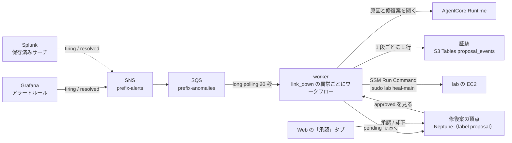
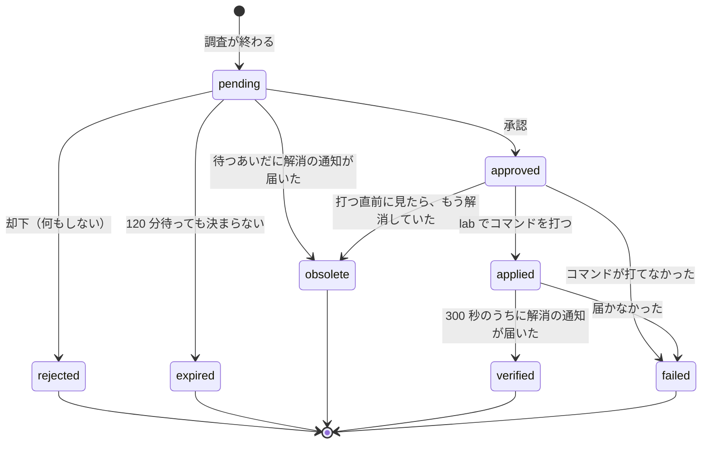

# 調査と修復（WORKFLOW）

← [README](../README.md)

`<prefix>` は `deploy.env` の `OWNER` から作る接頭辞 `<owner>-nwc-poc`。`deploy.env` に `AGENT=1`、`PIPELINE=1`、`WORKFLOW=1` を書いて `ops/up.sh` を打つと、下の全部ができる。アラートの送り手が要る: Splunk（`SINK_SPLUNK=1`。trap と gNMI から検知する）か、Grafana のアラート（`GRAFANA=1` と `SINK_PROMETHEUS=1`（どちらも既定）に `SNMP_POLL=1`。SNMP のポーリングから検知する）。SNMP のポーリングは既定で止めてある（`SNMP_POLL=0`）ので、既定のままでは送り手が無く `ops/up.sh` が止まる。

## 流れ



- temporal（`start-dev`、データは SQLite）と worker は、ECS Fargate の 1 タスクに入っている。Temporal の履歴はタスクと一緒に消える。
- Web と worker は修復案の頂点の `status` だけでやり取りする。承認・却下は `pending` のときだけ書ける（`has('status','pending')` と書き込みが 1 本の Gremlin）。
- 作成・承認・却下・時間切れ・適用・確認は、worker が S3 Tables の `proposal_events` に 1 行ずつ足す（`event_id` = `<proposal_id>#<event>`。再試行で二重に入ることがあるので、集計では `event_id` で落とす）。承認・却下の行は worker が頂点の変化を拾ったときに書くので、worker が止まっていると遅れて入る。
- 修復案には事前チェックが付く（`precheck`。「承認」タブの詳細に出る）。worker がその処置をいまの Neptune のトポロジに重ね、孤立する機器と冗長が切れる機器（残りの回線が 1 本）を出す。処置がグラフをどう変えるかは `workflow/rules.py` の `ACTION_CHANGES`。いまの処置は回線を上げる `heal-main` と見るだけの `check` なので、警告（注意・危険）は出ない。落とす処置を足したときに効く。同じ計算をチャットから `what_if` で引ける。
- 承認・却下はチャットのツールに出していない。Neptune の IAM は頂点ごとに絞れないので、この線はコードで引いている。
- アラートは Grafana と Splunk が同じ形の JSON で SNS のトピック `<prefix>-alerts` に出す（`{"source", "alerts": [{"status", "device_id", "kind", "target", "detail", "starts_at"}]}`。読むのは `workflow/rules.py` の `alerts_from_message`）。異常の id は `<device_id>#<kind>#<target>`。
- ワークフローは異常ごとに 1 つ（id は `investigate-<anomaly_id>`。発生の時刻を入れない）。Grafana と Splunk が同じ障害を知らせても、同じ id なので Temporal が二重起動を弾く。修復案は発生ごと（`<anomaly_id>#<first_seen>`。`first_seen` はアラートの `starts_at`）で、直ってからもう一度起きた次の発生は、前の修復案を上書きせず別の頂点になる。
- 起こすのは `firing` の `link_down` だけ（`workflow/rules.py` の `START_KINDS`。trap と BGP / IS-IS は Neptune の `status` を変えるだけ）。`resolved` は、走っているワークフローにシグナル `resolved` で伝える（走っていなければ何もしない）。異常の「いま」を置く場所は持たず、発生はワークフローそのもの、解消はシグナルで持つ。
- アラートの機器か、落ちた回線の相手の機器が Nautobot で保守中（Status が `Maintenance`。Neptune の `device` の `maintenance`）なら起こさない（`workflow/rules.py` の `maintenance_hold`。starter のログに `skip … 保守中の機器`）。Neptune を読めないときは起こす。
- SQS のメッセージは、起こした・起こす理由が無い・保守中・同じ異常のワークフローが既に走っている・解消を伝える相手がいない、のどれかなら消す。Temporal や Neptune に届かないときは消さずに残し、配り直させる（5 回で DLQ `<prefix>-anomalies-dlq`）。
- 同じルートで AgentCore Gateway（MCP）と tools Lambda も作る。Runtime はツールを Gateway 経由で呼ぶ（届かなければコンテナの中のツールで答える）。

## 修復案の状態



- 承認待ちは 30 秒おきに頂点を見る（`DECISION_POLL`）。120 分（`APPROVAL_TIMEOUT_MINUTES`）で `expired`。
- 確認（verify）は Neptune を見に行かず、解消の通知（`resolved` のアラート）を 300 秒（`VERIFY_TIMEOUT`）まで待つ。通知は「機器 → Telegraf → MSK → Spark → Prometheus / Splunk → ルールの評価 → SNS → SQS」を通るので、直ってから届くまで 1〜2 分かかる。
- `rejected` / `expired` / `failed` で終わるときは、解消の通知が来るまで（長くて 1440 分。`HOLD_MINUTES`）ワークフローを閉じない。閉じると、まだ直っていない同じ異常の次の通知がもう一度調査を起こすため。
- 環境変数の既定は `workflow/worker.py`、タスクに渡す値は `terraform/workflow/ecs.tf`。

## 通知の重なりと取りこぼし

送り手は「いまの状態」を出すだけで、順序も 1 回だけの配達も約束しない。受け手は同じ知らせを何度受けてもよい作りにしてある。

| 場面 | どうなる |
|---|---|
| Grafana と Splunk が同じ `link_down` を知らせる | 異常の id が同じなので、ワークフローは 1 つ。後から来たほうは捨てる |
| 直らないまま時間がたつ | Grafana は 4 時間ごと（`repeat_interval`）に同じ `starts_at` で送り直す。ワークフローが走っていれば捨て、閉じていても同じ発生の修復案があれば起こさない。Splunk は状態が変わったときだけ出し、送り直さない |
| 調査や承認待ちのあいだに直って、また落ちた（フラップ） | `resolved` はその run 全体に 1 つのフラグなので、直った時点で `obsolete` になる。落ち直しの `firing` は、ワークフローが閉じた後に届けば新しい発生として調べ、走っているあいだ（調査の途中など）に届けば捨てる。捨てたときは、Grafana の次の送り直し（4 時間後）か Splunk の次の変化まで調査は起きない |
| 解消の通知が、ワークフローの始まる前や閉じた後に届く | 伝える相手がいないので捨てる（Neptune の `status` は Lambda が別に `UP` へ戻す） |
| Temporal のタスクが入れ替わる | 走っていたワークフローは消える（SQLite がタスクの中）。修復案の頂点は `pending` のまま残り、時間切れにもならない。Grafana の次の送り直しでは、同じ発生の修復案があるので起きない。直すなら「承認」タブで却下する |

## 試す

1. lab に入り（[pipeline.md](pipeline.md) の「lab に入る」）、`sudo lab fail-main` でアクセス側 Leaf の fabric（`dc1-leaf-01 ethernet-1/1`）を落とす。
2. 1〜2 分で `link_down` のアラートが出て（`SNMP_POLL=1` なら Grafana の Alerting → Alert rules で Firing、`SINK_SPLUNK=1` なら Splunk の linkDown の trap から。Web の「トポロジ」タブではその回線が `DOWN` になる）、数十秒で「承認」タブに修復案（原因・打つコマンド・理由）が `pending` で並ぶ。
3. 下の詳細（原因・コマンド・事前チェック・理由）を読み、名前を入れて「詳細を読んだ」にチェックを入れてから「承認して直す」を押すと `approved` → `applied` → `verified` / `failed` と進む（`verified` は、直ったあとの解消の通知が届いてから。1〜2 分）。名前は「決めた人」の列に `<名前> (web)` で残る（Web には認証が無いので、名乗ってもらう）。

## Temporal UI を開く

UI（8233）はプライベートサブネットのタスクにあるので、Web の EC2 を踏み台にしてポートフォワーディングする。`ops/up.sh` の手順 8-5 が同じコマンドを表示する。
8233 は土台の通信の表の `web` → `workflow` の 1 行で開いている（[architecture/core.md](architecture/core.md) の「SG」）。gRPC の 7233 はタスクの外に出さない（Temporal は `--ip 127.0.0.1` で待ち、UI だけを `--ui-ip 0.0.0.0` で出す。ワーカーは同じタスクの `localhost:7233`）。

```bash
INSTANCE_ID=$(terraform -chdir=terraform/base/core output -raw web_instance_id); echo "$INSTANCE_ID"
WF_CLUSTER=$(terraform -chdir=terraform/workflow output -raw cluster_name); echo "$WF_CLUSTER"
WF_SERVICE=$(terraform -chdir=terraform/workflow output -raw service_name); echo "$WF_SERVICE"
WF_TASK=$(aws ecs list-tasks --region ap-northeast-1 --cluster "$WF_CLUSTER" --service-name "$WF_SERVICE" --query 'taskArns[0]' --output text); echo "$WF_TASK"
WF_TASK_IP=$(aws ecs describe-tasks --region ap-northeast-1 --cluster "$WF_CLUSTER" --tasks "$WF_TASK" --query 'tasks[0].attachments[0].details[?name==`privateIPv4Address`].value | [0]' --output text); echo "$WF_TASK_IP"
aws ssm start-session --region ap-northeast-1 --target "$INSTANCE_ID" --document-name AWS-StartPortForwardingSessionToRemoteHost --parameters "{\"host\":[\"$WF_TASK_IP\"],\"portNumber\":[\"8233\"],\"localPortNumber\":[\"8233\"]}"
```

このあと http://localhost:8233/ を開く。UI に認証は無い（VPC の外からは届かない）。

## うまくいかないとき

ワーカーのログ:

```bash
terraform -chdir=terraform/workflow output -raw worker_logs_command; echo
```

| 症状 | 原因と直し方 |
|---|---|
| apply の直後に worker が落ちる | Temporal が上がるまで 1〜3 分かかる。数回落ちてから上がる |
| 承認しても approved のまま進まない（UI で `TimeoutError`） | ワーカーのイメージが古い。`deploy.env` の `IMAGE_TAG` を上げて `ops/up.sh` |
| Runtime のログに `gateway tools/list failed, using local tools` | Gateway に届いていない。答えはコンテナの中のツールで返る |
| 修復案が出ない | アラートが SQS まで届いていない。送り手 → SNS → SQS の順に見る（[troubleshooting.md](troubleshooting.md) の「パイプラインと WORKFLOW」） |
| `link_down` なのに修復案が出ない（starter のログに `保守中の機器`） | 仕様。その機器か回線の相手が Nautobot で `Maintenance`。Status を `Active` に戻すと、次のアラートから起きる |
| trap や BGP / IS-IS の異常に修復案が出ない | 仕様。ワークフローを起こすのは `link_down` だけ（`workflow/rules.py` の `START_KINDS`） |
| 承認したのに `obsolete` になった | 承認までに解消の通知が届いた。古い処置は打たない。もう一度落ちれば、次の通知で別の修復案が出る |
| 直したのに `failed`（`300 秒待っても解消の通知が届かない`） | 解消の通知が遅れたか届いていない。Grafana のルールが Normal に戻ったか、SQS の DLQ に溜まっていないかを見る。回線が実際に上がっていれば、もう打たなくてよい |
| 却下したあと、同じ異常の修復案が二度と出ない | 仕様。直るまで（長くて 1440 分）同じ異常の調査を起こさない。直ってからもう一度落ちれば出る |
| ポートフォワーディングはつながるが Temporal UI が開かない | タスクが RUNNING か（`aws ecs describe-services`）と、ポートフォワーディングの先の IP がそのタスクか。タスクの ENI に `<prefix>-workflow`、Web の EC2 に `<prefix>-web` の SG が付いているか（8233 は土台の通信の表の `web` → `workflow`） |
